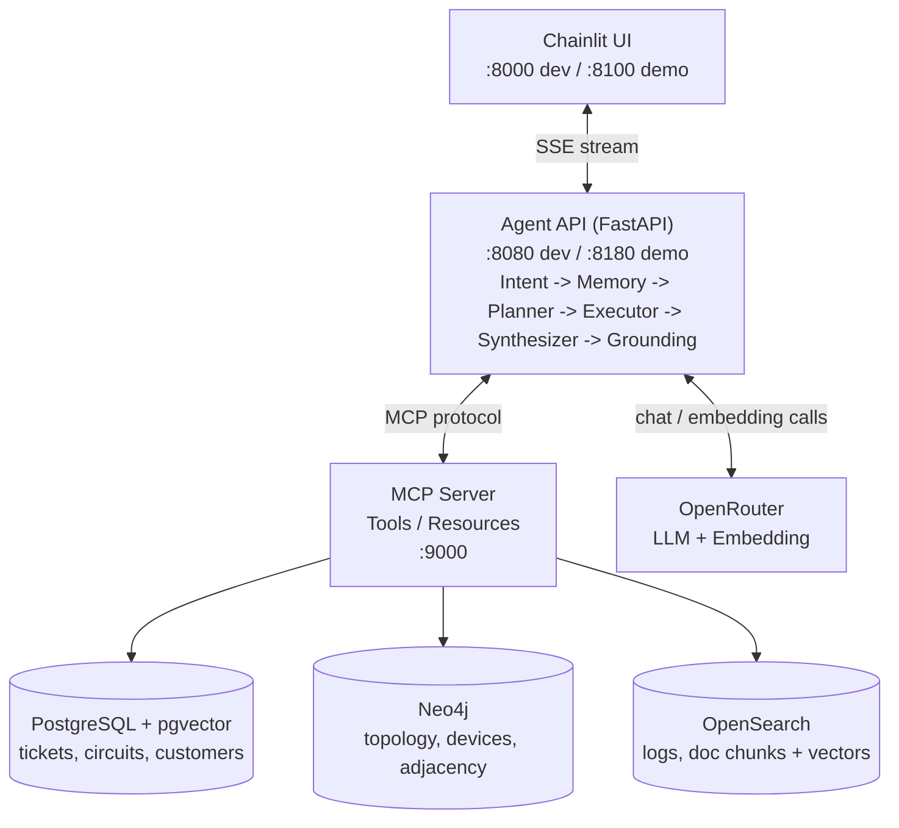

# Full Demo — ลองระบบให้จบภายใน 10 นาที ก่อนเริ่มเรียนจริง

หน้านี้ไม่ใช่บทเรียน — เป็น**ทางลัดให้เห็นของจริงก่อน** ว่าตลอด 3 วันจะสร้างอะไรขึ้นมา
รันตามนี้ครั้งเดียวจบ แล้วค่อยย้อนกลับไปเริ่ม [01-prerequisites.md](01-prerequisites.md) ตามลำดับปกติ

---

## 1. ภาพรวมสถาปัตยกรรม

ระบบที่จะได้ลองคือ **AI Agent ที่คุยกับเครือข่าย IP-MPLS ผ่านภาษาธรรมชาติ** โดยมี MCP Server เป็นตัวกลางเข้าถึง 3 ฐานข้อมูล:



**Agent API** ประมวลผลคำถามผ่าน 6 ขั้นตอนเรียงกัน: Intent Gate → Memory → Planner → Executor (+ Loop Guard) → Synthesizer → Grounding
รายละเอียดแต่ละขั้นตอน + เหตุผลเชิงสถาปัตยกรรม อยู่ที่ [03-architecture.md](03-architecture.md)

---

## 2. ตั้งค่า `.env`

```bash
cp .env.example .env
```

เปิด `.env` แล้วแก้อย่างน้อย 1 บรรทัด — ใส่ API key ของ OpenRouter (สมัครฟรีที่ https://openrouter.ai/keys):

```dotenv
LLM_API_KEY=sk-or-v1-xxxxxxxxxxxxxxxxxxxxxxxxxxxxxxxxxxxxxxxxxxxxxxxxxxxxxxxxxxxxxx
```

ค่าอื่น ๆ ปล่อยเป็นค่า default ได้เลย (`LLM_MODEL=qwen/qwen3-30b-a3b`, `EMBEDDING_MODEL=baai/bge-m3`, `EMBEDDING_DIM=1024`) — ค่าเหล่านี้ผ่านการทดสอบ end-to-end มาแล้วว่าทำงานร่วมกันได้ครบทั้ง 3 ฐานข้อมูล

> **อย่าเปลี่ยน `EMBEDDING_DIM` ตามใจ** ถ้าเปลี่ยน `EMBEDDING_MODEL` เป็นตัวอื่น ต้องเช็คว่า dimension ของมันไม่เกิน 2000 (ข้อจำกัดของ pgvector HNSW index) ไม่งั้น PostgreSQL จะ init ไม่ผ่านทั้งระบบ

---

## 3. รันทั้งระบบ — คำสั่งเดียว

```bash
docker compose -f docker/docker-compose.yml --env-file .env up -d postgres pgadmin neo4j opensearch opensearch-dashboards mailhog && docker compose -f docker/docker-compose.yml --env-file .env build seeder && docker compose -f docker/docker-compose.yml --env-file .env up seeder && docker compose -f docker/docker-compose.yml --env-file .env --profile demo up -d mcp-demo
```

`&&` การันตีว่าถ้าขั้นไหน fail (เช่น seed ไม่ผ่าน) จะหยุดทันที ไม่ไปขั้นถัดไปแบบพัง ๆ

รอจนเห็นบรรทัดสุดท้ายจบ (การ build + seed ครั้งแรกใช้เวลาราว 3-5 นาที ขึ้นกับเครื่องและความเร็วเน็ต)

---

## 4. เข้าใช้งาน

| อะไร | ลิงก์ | หมายเหตุ |
|---|---|---|
| **Chatbot UI (เดโม)** | **http://localhost:8100** | ← เริ่มที่นี่ |
| Agent API docs | http://localhost:8180/docs | ดู endpoint `/chat` แบบ interactive |
| pgAdmin | http://localhost:5050 | login ด้วยค่าใน `.env` (`PGADMIN_EMAIL`/`PGADMIN_PASSWORD`) |
| Neo4j Browser | http://localhost:7474 | login ด้วย `NEO4J_USER`/`NEO4J_PASSWORD` ใน `.env` |
| OpenSearch Dashboards | http://localhost:5601 | ดู index `network-logs`/`network-docs` |
| MailHog (fake SMTP) | http://localhost:8025 | ดูอีเมลที่ agent "ส่ง" ระหว่างทดสอบ |

---

## 5. ตัวอย่างคำถามที่ลองได้ (5 แบบ)

พิมพ์ในช่องแชทที่ **http://localhost:8100**

### 1) คำถามแหล่งเดียว — เร็ว ใช้ token น้อย
```
ticket ที่ยังไม่ปิดตอนนี้มีอะไรบ้าง เรียงตามความรุนแรง
```
สังเกต: เรียก tool ตัวเดียว (`search_tickets`) ไม่ต้องคิดวางแผนซับซ้อน

### 2) คำถามข้าม 3 ระบบ — ไฮไลต์ของเดโม
```
ทำไมช่วงสองสัปดาห์นี้ถึงมีลูกค้าแจ้งเน็ตหลุดซ้ำๆ หลายราย
```
สังเกต: agent หา ticket ก่อน (Postgres) → เอาอุปกรณ์ไปหาจุดร่วมใน topology (Neo4j) → เช็ค log ของอุปกรณ์นั้น (OpenSearch) — คำถามไม่ได้บอกพื้นที่/อุปกรณ์เลยสักคำ

### 3) ค้นหาแบบความหมาย (semantic search)
```
มีเอกสารหรือ runbook ที่พูดถึงการแก้ปัญหา SFP หรือ transceiver ไหม
```
สังเกต: ใช้ `search_docs_semantic` ค้นด้วยเวกเตอร์ใน OpenSearch ไม่ใช่ keyword ตรงตัว

### 4) คำถามนอกขอบเขต — ทดสอบ Intent Gate
```
ช่วยเขียนอีเมลลาพักร้อนให้หน่อย
```
สังเกต: **0 tool call** ปฏิเสธตั้งแต่ต้นทาง ไม่แตะฐานข้อมูลเลยแม้แต่แถวเดียว

### 5) ทดสอบความจำ + การเปลี่ยนหัวข้อ
```
อุปกรณ์ฝั่งนนทบุรีมีอะไรบ้าง
```
ตามด้วย
```
เปลี่ยนเรื่อง ขอดูฝั่งกรุงเทพ
```
แล้วถามย้อนกลับ
```
เมื่อกี้เรื่องนนทบุรีสรุปว่าอะไร
```
สังเกต: context ขนาดเล็กลงหลังเปลี่ยนหัวข้อ แต่ agent ยังตอบเรื่องเดิมได้จากสรุปที่เก็บไว้ (ดู [memory.py](../../apps/agent-api/agent/memory.py))

---

## 6. ล้างทั้งหมดเพื่อเริ่มใหม่

```bash
docker compose -f docker/docker-compose.yml --env-file .env --profile demo down && docker compose -f docker/docker-compose.yml --env-file .env down -v
```

คำสั่งนี้ปิด container ทั้งหมด **และลบ volume ข้อมูลทิ้งทั้งหมด** (postgres, neo4j, opensearch, pgadmin) — กลับสู่สภาพเปล่าเหมือนยังไม่เคยรันมาก่อน ต้องเริ่มใหม่ตั้งแต่ขั้นตอนที่ 3 ถ้าจะลองอีกครั้ง

---

## ถัดไป

เริ่มหลักสูตรจริงที่ [01-prerequisites.md](01-prerequisites.md)
