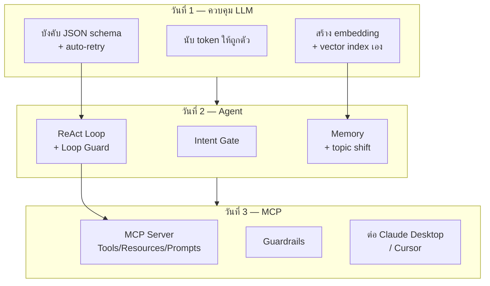
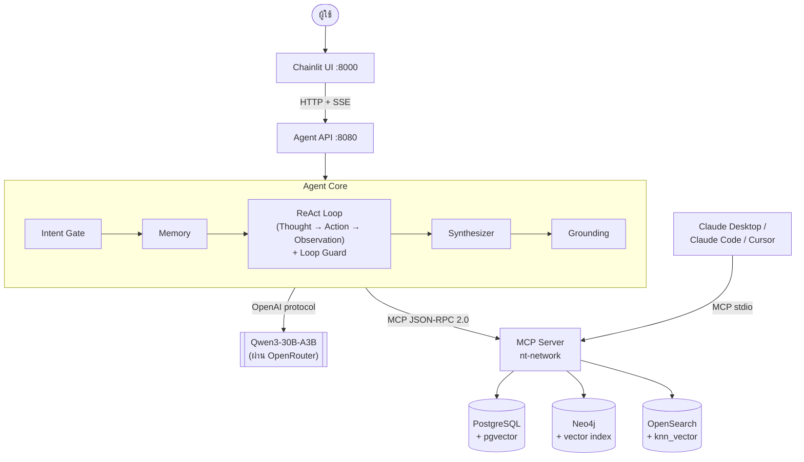
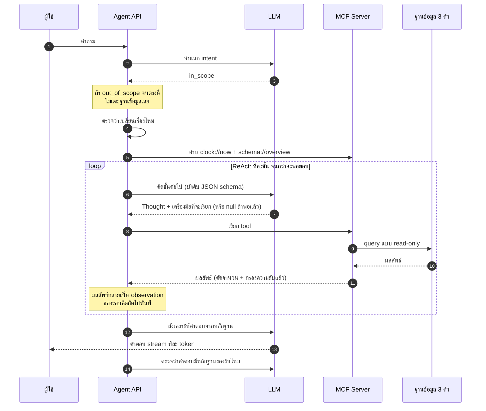

# ภาพรวมสถาปัตยกรรม

หน้านี้คือจุดเริ่มต้นของเอกสารชุดนี้ ควรอ่านทำความเข้าใจภาพรวมของสิ่งที่จะสร้างขึ้นตลอด 3 วัน ก่อนไปพิจารณาตัวอย่างข้อมูลจริงและเตรียมเครื่องในลำดับถัดไป
หน้านี้ยังไม่ต้องรันคำสั่งใด ๆ เพียงพิจารณาภาพรวมให้เข้าใจ

---

## 1. สิ่งที่จะสร้างตลอด 3 วัน

**องค์ประกอบของแต่ละวันถูกนำไปใช้ต่อในวันถัดไปทั้งหมด** ไม่มีส่วนใดที่จัดทำแล้วไม่ได้ใช้งานต่อ — ตารางเวลาเต็มทั้ง 3 วันสามารถดูได้ที่ [README.md](../../README.md)

---

## 2. สถาปัตยกรรมปลายทาง

นี่คือสถาปัตยกรรมที่ทุกโมดูลข้างต้นประกอบรวมกันเป็น เมื่อสิ้นสุดวันที่ 3:

### จุดที่ควรสังเกต

- **Agent ไม่เคยคุยกับฐานข้อมูลโดยตรง** ทุกอย่างผ่าน MCP → server ตัวเดียวใช้ได้ทั้งกับ Agent API และกับ Claude Desktop
- **มี vector search ทั้ง 3 ฐาน** ซึ่งเป็นบทเรียนเปรียบเทียบของวันที่ 3
- **Grounding อยู่หลัง Synthesizer** ตรวจคำตอบก่อนถือว่าจบ

---

## 3. การไหลของหนึ่งคำถาม

ตัวอย่างแสดงให้เห็นว่าคำถามหนึ่งข้อเดินทางผ่านทุกองค์ประกอบในแผนภาพข้างต้นอย่างไร:

---

## 4. Model Stack

โมเดลทั้งหมดที่ปรากฏในแผนภาพข้างต้น (`LLM`) มาจากชุดนี้ ซึ่งกำหนดไว้ล่วงหน้าแล้วใน `.env.example` ผู้เรียนไม่จำเป็นต้องเลือกเอง:

| บทบาท | โมเดล | เมื่อไหร่ใช้ |
|---|---|---|
| Main brain | `qwen/qwen3-30b-a3b` | ตอนส่งงานและเดโม |
| Iteration | `qwen/qwen3-30b-a3b` | ระหว่างวนแก้โค้ดใน lab (เร็วกว่ามาก) |
| Embedding | `baai/bge-m3` (1024 มิติ) | Lab 1 และ RAG |
| Rerank | `mxbai-rerank` | Lab วันที่ 3 |

การสลับไปใช้โมเดลที่เร็วขึ้นระหว่างทำ lab: ตั้งค่า `LLM_MODEL=$LLM_MODEL_FAST` ใน `.env` แล้วรีสตาร์ต `make api`

---

## 5. ข้อมูลที่ใช้ตลอด 3 วัน

ฐานข้อมูลทั้ง 3 ตัวในแผนภาพข้างต้นถูก seed ด้วยข้อมูลจำลองในขนาดนี้ (ตัวอย่างข้อมูลจริงดูเพิ่มเติมได้ที่ [02-initial-data.md](02-initial-data.md)):

| | จำนวน | Production จริง |
|---|---|---|
| อุปกรณ์ | 10 | 2,600+ |
| พื้นที่ | 2 (BKK, NBI) | ทั่วประเทศ |
| Log | 2,000 บรรทัด / 30 วัน | 29 GB/วัน |
| Ticket | 120 ใบ / 90 วัน | ประวัติจริง |

ความแตกต่างเมื่อขยายขนาดสู่ระบบจริงอยู่ใน [day3/13-scale-notes.md](../day3/13-scale-notes.md)
และการเปรียบเทียบกับระบบ production อยู่ใน [reference/production-mapping.md](../reference/production-mapping.md)

---

## ถัดไป

พิจารณาตัวอย่างข้อมูลจริงในฐานข้อมูลทั้ง 3 ที่ [02-initial-data.md](02-initial-data.md)
