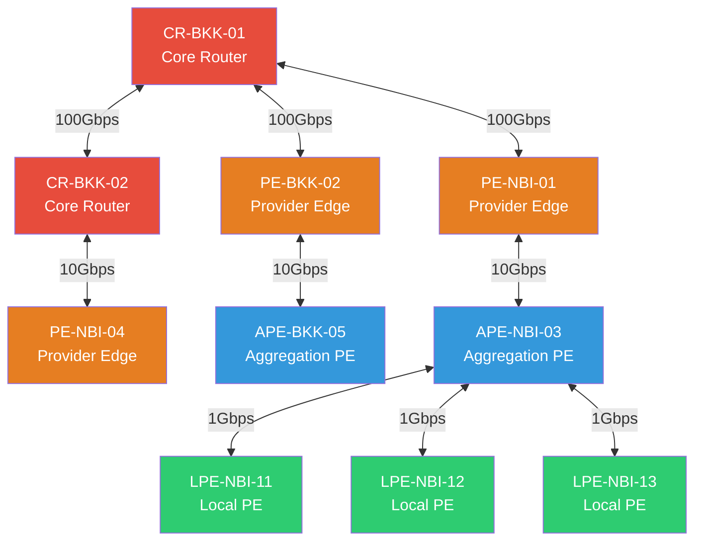

# ตัวอย่างข้อมูลตั้งต้น — หน้าตาจริงหลัง seed

ต่อจาก [01-architecture.md](01-architecture.md) — นี่คือหน้าตาจริงของข้อมูลที่ไหลอยู่ใน 3 ฐานข้อมูลที่เพิ่งเห็นในแผนภาพ (ดึงมาจากระบบที่ seed แล้วจริง) เพื่อให้เห็นภาพก่อนลงมือทำ lab
ไม่ต้องท่องจำตัวเลข — แค่เข้าใจ**รูปร่าง**ของข้อมูลแต่ละฐาน

---

## 1. PostgreSQL — ตาราง `tickets` (มี `embedding` แล้ว 20 แถวตัวอย่าง)

ตารางนี้คือสภาพ**หลัง**ทำ Lab 1 เสร็จ (ปกติ demo data ship มาพร้อม `embedding` ให้เลย ดู [02-lab1-add-vector-column.md](../day1/02-lab1-add-vector-column.md))

| ticket_id | device_id | category | severity | status | title | embedding (dim) |
|---|---|---|---|---|---|---|
| TK-25-00103 | LPE-NBI-11 | inquiry | medium | closed | ขอทราบ bandwidth ปัจจุบันของวง... | 1024 |
| TK-25-00072 | LPE-NBI-12 | inquiry | medium | closed | สอบถามค่าบริการเพิ่มความเร็ว | 1024 |
| TK-25-00010 | APE-BKK-05 | link_down | medium | closed | circuit ไม่ทำงาน ping ไม่ผ่าน | 1024 |
| TK-25-00074 | LPE-NBI-13 | slow | medium | closed | ความเร็วไม่เต็มตามแพ็กเกจ | 1024 |
| TK-25-00005 | LPE-NBI-12 | intermittent | high | open | เน็ตหลุดซ้ำ เคสเดิมที่เคยแจ้งไ... | 1024 |
| TK-25-00018 | APE-BKK-05 | link_down | high | open | วงจรล่ม ใช้งานไม่ได้ทั้งสาขา | 1024 |
| TK-25-00011 | LPE-NBI-12 | slow | high | open | โหลดไฟล์ช้ากว่าปกติมาก | 1024 |
| TK-25-00080 | LPE-NBI-13 | slow | low | closed | โหลดไฟล์ช้ากว่าปกติมาก | 1024 |
| TK-25-00007 | APE-BKK-05 | maintenance | low | closed | แผนงานอัปเกรด firmware APE-BKK | 1024 |
| TK-25-00008 | LPE-NBI-13 | link_down | high | in_progress | วงจรล่ม ใช้งานไม่ได้ทั้งสาขา | 1024 |
| TK-25-00027 | APE-BKK-05 | inquiry | low | closed | ขอทราบ bandwidth ปัจจุบันของวง... | 1024 |
| TK-25-00004 | LPE-NBI-11 | intermittent | medium | closed | หลุดบ่อยช่วงบ่าย | 1024 |
| TK-25-00063 | APE-BKK-05 | maintenance | medium | closed | แจ้งดับไฟฟ้าเพื่อปรับปรุงระบบ | 1024 |
| TK-25-00006 | PE-NBI-04 | config | medium | open | ISIS adjacency ไม่ขึ้นหลังเปลี... | 1024 |
| TK-25-00040 | LPE-NBI-13 | link_down | medium | closed | circuit ไม่ทำงาน ping ไม่ผ่าน | 1024 |
| TK-25-00003 | LPE-NBI-13 | intermittent | high | open | circuit drop ซ้ำๆ กระทบระบบ PO... | 1024 |
| TK-25-00110 | APE-BKK-05 | link_down | medium | open | ลิงก์ down ตั้งแต่เช้า | 1024 |
| TK-25-00100 | LPE-NBI-13 | maintenance | low | closed | งานเปลี่ยนสายไฟเบอร์ช่วงถนนหลั... | 1024 |
| TK-25-00083 | APE-NBI-03 | slow | high | closed | ความเร็วไม่เต็มตามแพ็กเกจ | 1024 |
| TK-25-00019 | LPE-NBI-12 | slow | low | closed | latency สูงผิดปกติช่วงเย็น | 1024 |

ดึงมาด้วย:
```sql
SELECT ticket_id, device_id, category, severity, status, left(title, 30),
       vector_dims(embedding) AS emb_dim
FROM tickets ORDER BY opened_at DESC LIMIT 20;
```

`embedding` จริง ๆ คือ array ตัวเลขทศนิยม 1024 ตัว (ตัด 5 ตัวแรกมาให้ดู):
```
[-0.07439188, 0.0061674505, -0.0688842, -0.011761184, -0.009265519, ...]
```

---

## 2. Neo4j — Topology ทั้งหมด (10 อุปกรณ์)



สี = role: แดง `CR` (core), ส้ม `PE` (provider edge), น้ำเงิน `APE` (aggregation), เขียว `LPE` (local/access)
สังเกต: `LPE-NBI-11/12/13` ทั้ง 3 ตัว uplink ไปที่ `APE-NBI-03` **ตัวเดียวกัน** — นี่คือจุดร่วมที่ scenario S1 (interface flapping) ใช้สอนเรื่อง cross-service diagnosis ดู [04-full-demo.md](04-full-demo.md) ข้อ 2

ดึงมาด้วย:
```cypher
MATCH (a:Device)-[r:CONNECTED_TO]->(b:Device)
RETURN a.device_id, b.device_id, r.bandwidth_mbps ORDER BY a.device_id;
```

---

## 3. OpenSearch — ตัวอย่าง log (`network-logs-*`)

log ปกติ (BASELINE — เหตุการณ์ทั่วไป ไม่มีอะไรผิดปกติ):
```json
{
  "@timestamp": "2026-09-26T15:11:24.390932+07:00",
  "device_id": "PE-NBI-04",
  "site_code": "NBI",
  "device_role": "PE",
  "severity": "info",
  "facility": "NTP",
  "event_type": "NTP-SYNC",
  "message": "NTP clock synchronised to 10.0.0.10",
  "scenario": "BASELINE"
}
```

log จาก scenario **S1** (interface flapping ที่ `APE-NBI-03` — เคสหลักของ demo):
```json
{
  "@timestamp": "2026-09-26T02:12:09.500020+07:00",
  "device_id": "APE-NBI-03",
  "site_code": "NBI",
  "device_role": "APE",
  "severity": "notice",
  "facility": "ISIS",
  "event_type": "ISIS-ADJCHANGE",
  "interface": "Te0/1/2",
  "message": "Adjacency to PE-NBI-01 (Level-2) Up, interface Te0/1/2",
  "scenario": "S1"
}
```

field `scenario` บอกว่า log บรรทัดนี้มาจากไฟล์ scenario ไหน (`BASELINE`, `S1`, `S2`, `S3`, `S4`) — มีไว้ให้ debug เท่านั้น ไม่ควรใช้ field นี้ตอนเขียน query จริง (agent จริงไม่รู้จัก field นี้)

> ⚠️ **หมายเหตุสำคัญ: วันที่ในตัวอย่างข้างบนจะ "เลื่อน" ทุกครั้งที่รันคำสั่งนี้ใหม่**
> ```bash
> make reseed
> ```
> หรือ
> ```bash
> docker compose -f docker/docker-compose.yml --env-file .env run --rm seeder python seed.py --purge
> ```
> เพราะทุก timestamp ในระบบคำนวณจาก `anchor_now()` ณ ตอนที่ seed (ดูเหตุผลที่ [data/scenarios.md](../../data/scenarios.md) หัวข้อ 7 และโค้ดที่ [docker/seeder/common.py](../../docker/seeder/common.py)) — ไม่มี timestamp ไหนถูก hardcode ไว้ตายตัว เพื่อให้คำถามแบบ "24 ชั่วโมงที่ผ่านมา" ใช้งานได้เสมอไม่ว่าจะ seed วันไหน
>
> ถ้าต้องการวันที่ตายตัว (เช่นไว้ทำ automated test) ตั้งค่า `DEMO_NOW` ใน `.env` เป็นค่า ISO8601 ก่อน seed:
> ```dotenv
> DEMO_NOW=2026-09-01T09:00:00+07:00
> ```

---

## ถัดไป

เตรียมเครื่องให้พร้อมที่ [03-prerequisites.md](03-prerequisites.md)
