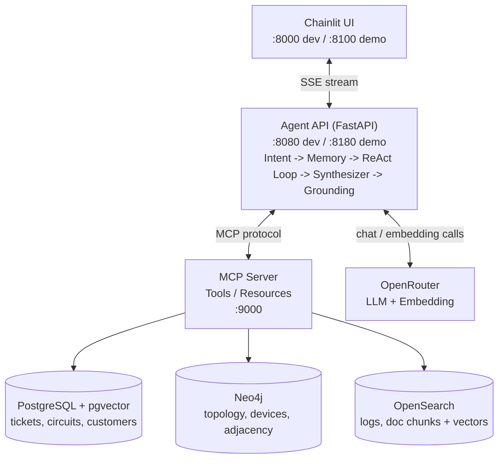

# Full Demo — ทดลองใช้งานระบบให้ครบภายใน 10 นาที ก่อนเริ่มเรียนจริง

หน้านี้ไม่ใช่บทเรียน แต่เป็น**ทางลัดให้เห็นภาพของจริงล่วงหน้า** ว่าตลอด 3 วันจะสร้างสิ่งใดขึ้นมา
ดำเนินการตามขั้นตอนนี้ให้ครบหนึ่งรอบ แล้วจึงย้อนกลับไปเริ่มต้นที่ [03-prerequisites.md](03-prerequisites.md) ตามลำดับปกติ

---

## 1. ภาพรวมสถาปัตยกรรม

ระบบที่จะได้ทดลองใช้คือ **AI Agent ที่สื่อสารกับเครือข่าย IP-MPLS ผ่านภาษาธรรมชาติ** โดยมี MCP Server ทำหน้าที่เป็นตัวกลางเข้าถึงฐานข้อมูลทั้ง 3 ตัว:



**Agent API** ประมวลผลคำถามผ่าน 5 ขั้นตอนเรียงกัน: Intent Gate → Memory → ReAct Loop (+ Loop Guard) → Synthesizer → Grounding
รายละเอียดของแต่ละขั้นตอนและเหตุผลเชิงสถาปัตยกรรมอยู่ที่ [01-architecture.md](01-architecture.md)

---

## 2. ตั้งค่า `.env`

```bash
cp .env.example .env
```

เปิดไฟล์ `.env` แล้วแก้ไขอย่างน้อย 1 บรรทัด โดยใส่ API key ของ OpenRouter (สมัครใช้งานฟรีได้ที่ https://openrouter.ai/keys) ใน**ส่วน LLM**:

```dotenv
# ---------- LLM (OpenAI-compatible endpoint) ----------
LLM_BASE_URL=https://openrouter.ai/api/v1
LLM_API_KEY=sk-or-v1-xxxxxxxxxxxxxxxxxxxxxxxxxxxxxxxxxxxxxxxxxxxxxxxxxxxxxxxxxxxxxx
LLM_MODEL=qwen/qwen3-30b-a3b
```
จำเป็นต้องแก้ไขเพียงบรรทัด `LLM_API_KEY` เท่านั้น ส่วนที่เหลือปล่อยเป็นค่า default ได้

ใน**ส่วน Embedding** สามารถปล่อยเป็นค่า default ได้ทั้งหมด ไม่จำเป็นต้องแก้ไข (ใช้ API key เดียวกันกับ LLM เนื่องจากเรียกผ่าน OpenRouter เช่นเดียวกัน):

```dotenv
# ---------- Embedding ----------
EMBEDDING_BASE_URL=https://openrouter.ai/api/v1
EMBEDDING_MODEL=baai/bge-m3
EMBEDDING_DIM=1024
```

ค่าชุดนี้ (LLM + Embedding) ผ่านการทดสอบ end-to-end มาแล้วว่าทำงานร่วมกันได้ครบทั้ง 3 ฐานข้อมูล

> **ไม่ควรเปลี่ยนค่า `EMBEDDING_DIM` โดยพลการ** หากเปลี่ยน `EMBEDDING_MODEL` เป็นตัวอื่น ต้องตรวจสอบว่า dimension ของโมเดลนั้นไม่เกิน 2000 (ข้อจำกัดของ pgvector HNSW index) มิเช่นนั้น PostgreSQL จะ init ไม่ผ่านทั้งระบบ

---

## 3. รันทั้งระบบ — คำสั่งเดียว

```bash
docker compose -f docker/docker-compose.yml --env-file .env up -d postgres pgadmin neo4j opensearch opensearch-dashboards mailhog && docker compose -f docker/docker-compose.yml --env-file .env build seeder && docker compose -f docker/docker-compose.yml --env-file .env up seeder && docker compose -f docker/docker-compose.yml --env-file .env --profile demo up -d mcp-demo
```

`&&` รับประกันว่าหากขั้นตอนใดล้มเหลว (เช่น seed ไม่ผ่าน) กระบวนการจะหยุดทันที ไม่ดำเนินต่อไปยังขั้นตอนถัดไปในสภาพที่ยังไม่สมบูรณ์

รอจนกระบวนการแสดงบรรทัดสุดท้ายเสร็จสมบูรณ์ (การ build และ seed ครั้งแรกใช้เวลาประมาณ 3-5 นาที ขึ้นอยู่กับเครื่องและความเร็วอินเทอร์เน็ต)

---

## 4. เข้าใช้งาน

เปิดใช้งาน Chatbot UI ได้ที่:

**http://localhost:8100**

---

## 5. ตัวอย่างคำถามที่ลองได้ (5 แบบ)

พิมพ์คำถามในช่องแชทที่ **http://localhost:8100**

### 1) คำถามแหล่งเดียว — เร็ว ใช้ token น้อย
```
ticket ที่ยังไม่ปิดตอนนี้มีอะไรบ้าง เรียงตามความรุนแรง
```
ข้อสังเกต: เรียก tool เพียงตัวเดียว (`search_tickets`) โดยไม่ต้องวางแผนที่ซับซ้อน

### 2) คำถามข้าม 3 ระบบ — ไฮไลต์ของเดโม
```
ทำไมช่วงสองสัปดาห์นี้ถึงมีลูกค้าแจ้งเน็ตหลุดซ้ำๆ หลายราย
```
ข้อสังเกต: agent ค้นหา ticket ก่อน (Postgres) → นำอุปกรณ์ที่พบไปหาจุดร่วมใน topology (Neo4j) → ตรวจสอบ log ของอุปกรณ์นั้น (OpenSearch) — ทั้งที่คำถามไม่ได้ระบุพื้นที่หรืออุปกรณ์ใด ๆ เลย

### 3) ค้นหาแบบความหมาย (semantic search)
```
มีเอกสารหรือ runbook ที่พูดถึงการแก้ปัญหา SFP หรือ transceiver ไหม
```
ข้อสังเกต: ใช้ `search_docs_semantic` ค้นหาด้วยเวกเตอร์ใน OpenSearch มิใช่การค้นด้วย keyword ตรงตัว

### 4) คำถามนอกขอบเขต — ทดสอบ Intent Gate
```
ช่วยเขียนอีเมลลาพักร้อนให้หน่อย
```
ข้อสังเกต: **0 tool call** ระบบปฏิเสธตั้งแต่ต้นทาง ไม่แตะฐานข้อมูลแม้แต่แถวเดียว

### 5) ทดสอบความจำ + การเปลี่ยนหัวข้อ
จำเป็นต้องมี "ข้อสรุป" ที่มีความหมายให้จดจำไว้ก่อน มิใช่เพียงรายชื่ออุปกรณ์ — ใช้บทสนทนา 3 ขั้นตอนนี้ (ตรงกับ turn 9 ของ [day2/08-challenge4-topic-shift-survival.md](../day2/08-challenge4-topic-shift-survival.md)):

```
ทำไมช่วงสองสัปดาห์นี้ถึงมีลูกค้าแจ้งเน็ตหลุดซ้ำๆ หลายรายที่ฝั่งนนทบุรี
```
รอให้ระบบตอบจบ (ควรได้ข้อสรุปว่า `APE-NBI-03` มี interface flapping) จากนั้นเปลี่ยนหัวข้อ
```
เปลี่ยนเรื่อง ขอดูฝั่งกรุงเทพ
```
```
อุปกรณ์ฝั่งกรุงเทพมีอะไรบ้าง
```
จากนั้นถามย้อนกลับ
```
เมื่อกี้เรื่องนนทบุรีสรุปว่าอะไร
```
ข้อสังเกต:
- หลังคำสั่ง "เปลี่ยนเรื่อง" ค่า `context_tokens` จะลดลงอย่างชัดเจน (ดูได้จาก event `topic_changed`) เนื่องจากบทสนทนาเรื่องนนทบุรีถูกสรุปเหลือเพียงบรรทัดเดียวแทนที่จะเก็บไว้ทั้งหมด
- คำถามสุดท้าย คำตอบควรมีคำว่า **`APE-NBI-03`** ปรากฏอยู่ (มาจากข้อสรุปที่เก็บไว้ มิใช่ข้อมูลใหม่)
- เกณฑ์ของ Challenge 4 คือ **เรียก tool ไม่เกิน 1 ครั้ง** สำหรับคำถามนี้ (ไม่จำเป็นต้องเป็น 0 ครั้ง — หาก agent เรียก tool เพื่อยืนยันซ้ำ 1 ครั้งก่อนตอบ ก็ยังถือว่าผ่านเกณฑ์)
- หากเรียก tool มากกว่า 1 ครั้ง หรือคำตอบไม่มี `APE-NBI-03` ปรากฏอยู่เลย นั่นคือประเด็นที่ [day2/08-challenge4-topic-shift-survival.md](../day2/08-challenge4-topic-shift-survival.md) ให้ผู้เรียนไปแก้ไขเอง (ดู hint ในโจทย์เรื่องการปรับ prompt ของ `_summarise_topic` ใน [memory.py](../../apps/agent-api/agent/memory.py))

---

## 6. ดู topology เป็นกราฟ (bonus)

หากต้องการเห็นว่าฐานข้อมูลที่ agent ใช้งานมีลักษณะเป็นอย่างไรจริง ๆ ให้เปิด Neo4j Browser ที่:

**http://localhost:7474** (login: `neo4j` / `neo4j_dev_password`)

แล้วรัน:
```cypher
MATCH p=(n)-[r]-(m) RETURN p
```

จะปรากฏกราฟทั้งหมด (105 nodes: Circuit, Customer, Device, Interface, Site เชื่อมกันด้วย 163 relationships) แบ่งเป็น cluster ตามพื้นที่ BKK/NBI อย่างชัดเจน — นี่คือข้อมูลจริงที่ tool อย่าง `get_upstream_devices` และ `get_device_neighbors` ค้นหาอยู่เบื้องหลังทุกครั้งที่ agent ตอบคำถามข้ามระบบ

---

## 7. ล้างทั้งหมดเพื่อเริ่มใหม่

```bash
docker compose -f docker/docker-compose.yml --env-file .env --profile demo down && docker compose -f docker/docker-compose.yml --env-file .env down -v
```

คำสั่งนี้ปิด container ทั้งหมด **และลบ volume ข้อมูลทิ้งทั้งหมด** (postgres, neo4j, opensearch, pgadmin) ทำให้ระบบกลับสู่สภาพเริ่มต้นเสมือนยังไม่เคยรันมาก่อน หากต้องการทดลองอีกครั้งต้องเริ่มใหม่ตั้งแต่ขั้นตอนที่ 3

---

## ถัดไป

เริ่มเข้าสู่หลักสูตรจริงที่ [03-prerequisites.md](03-prerequisites.md)
