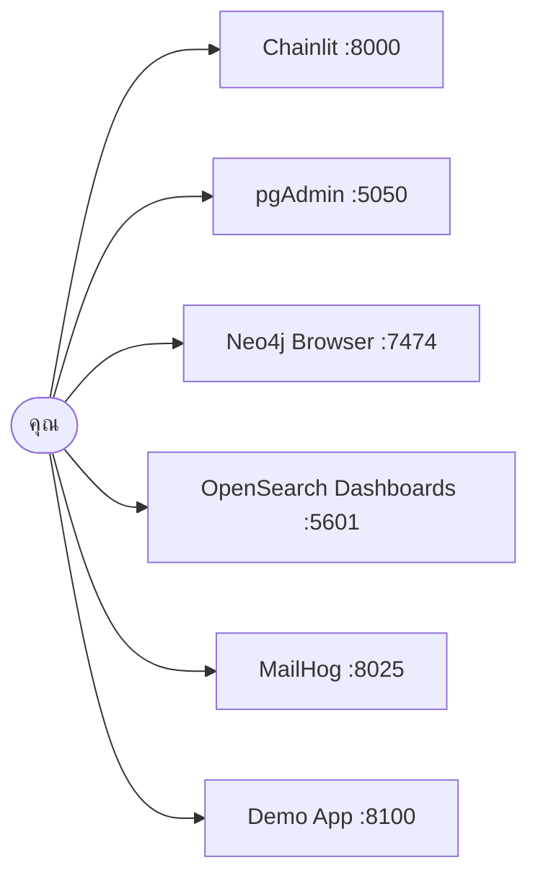

# 00 · ติดตั้งและตรวจสอบระบบ

> ใช้เวลาประมาณ 15 นาที (ถ้า pull image ไว้แล้ว)

---

## 1. เปิดระบบ

> ✅ **ข้ามหัวข้อนี้ได้** หากเพิ่งทำ [04-full-demo.md](04-full-demo.md) ครบแล้วและ **ยังไม่ได้ล้างระบบ** (หัวข้อ 7 ของหน้านั้น) — ระบบเปิดอยู่และ seed ข้อมูลแล้ว ให้ไปเริ่มที่ [หัวข้อ 2](#2-ตรวจสอบ) ได้ทันที
>
> ⚠️ **ห้ามรัน `cp .env.example .env` ซ้ำ** เพราะจะทับไฟล์ `.env` ที่ใส่ API key ไว้แล้ว
>
> ตรวจว่าระบบยังเปิดอยู่หรือไม่ ด้วยคำสั่งด้านล่าง ควรเห็น `mpls-postgres`, `mpls-neo4j` และ `mpls-opensearch` มีสถานะ `healthy`
>
> ```bash
> docker ps --filter name=mpls- --format '{{.Names}}: {{.Status}}'
> ```
>
> หากยังไม่ได้ทำ 04 หรือล้างระบบไปแล้ว ให้ดำเนินการตามขั้นตอนด้านล่างตามปกติ

```bash
cp .env.example .env
```

แก้ไขค่า LLM ใน `.env` ให้ตรงกับที่ทีมงานแจ้งไว้:

```
LLM_BASE_URL=https://openrouter.ai/api/v1
LLM_API_KEY=sk-or-v1-***Your Key***
LLM_MODEL=qwen/qwen3-30b-a3b
```
แก้ไขที่ไฟล์ `.env` เพียงไฟล์เดียวก็เพียงพอ เนื่องจากโค้ดทั้งหมดในโปรเจกต์ (`apps/agent-api/agent/llm.py`, `scripts/*.py`, `solutions/day2/workshop2_agent.py`) อ่านค่าจาก `.env` ผ่าน `load_dotenv()` โดยตรง จึงไม่มีจุดใดที่ต้องแก้ไข key ซ้ำอีก

```bash
docker compose -f docker/docker-compose.yml --env-file .env up -d postgres pgadmin neo4j opensearch opensearch-dashboards mailhog
```
```bash
docker compose -f docker/docker-compose.yml --env-file .env up seeder
```
> ⚠️ **ไม่จำเป็นต้องรันคำสั่งด้านล่างนี้** หากเพิ่งเริ่มดำเนินการตามขั้นตอนนี้เป็นครั้งแรก — คำสั่งนี้ใช้เฉพาะกรณี**ต้องการล้างข้อมูลทิ้งแล้วเริ่มต้นใหม่** เช่น พบ error ที่ผิดปกติและแก้ไขไม่ได้, การ seed ข้อมูลค้างอยู่ครึ่งทาง, หรือมีการเปลี่ยนค่าใน `.env` ที่กระทบ schema (เช่น `EMBEDDING_DIM`) จนต้องสร้างฐานข้อมูลใหม่ทั้งหมด — การรันคำสั่งนี้จะ**ลบข้อมูลทั้งหมดทิ้งอย่างถาวร**

หากจำเป็น ***ให้รันคำสั่งด้านล่างเพื่อปิดการทำงานและลบข้อมูลที่ค้างอยู่ในระบบ***
```bash
docker compose -f docker/docker-compose.yml --env-file .env down -v
```
คำสั่งนี้จะเปิดบริการทั้งหมด รอจนพร้อมใช้งาน แล้ว seed ข้อมูลให้โดยอัตโนมัติ (ใช้เวลาประมาณ 3-5 นาทีในการรันครั้งแรก)

---

## 2. ตรวจสอบ

```bash
docker compose -f docker/docker-compose.yml --env-file .env run --rm seeder python verify.py 
```

ผลลัพธ์ต้องแสดง `ALL CHECKS PASSED` ตัวอย่างผลลัพธ์:

```
PostgreSQL - tickets, configs, circuits
  [PASS] devices                    expected 10, found 10
  [PASS] S2 PE-BKK-02 has zero tickets  expected 0, found 0
  ...
Neo4j - topology
  [PASS] S1 three LPEs uplink to APE-NBI-03   expected 3, found 3
  ...
```

> `[WARN]` ที่เกี่ยวกับ embedding ไม่ถือเป็นปัญหา หมายความว่า endpoint ยังเชื่อมต่อไม่ได้เท่านั้น
> ระบบส่วนอื่นยังใช้งานได้ตามปกติ สามารถเติมข้อมูลภายหลังได้ด้วย `make embed-tickets`

---

## 3. หน้าจอที่เปิดได้



| บริการ | URL | ล็อกอิน |
|---|---|---|
| pgAdmin | http://localhost:5050 | รหัสผ่านเมื่อเปิด server: `mpls_dev_password` (รายละเอียดอยู่ในหัวข้อ 4.1) |
| Neo4j Browser | http://localhost:7474 | `neo4j` / `neo4j_dev_password` |
| OpenSearch Dashboards | http://localhost:5601 | ไม่ต้องล็อกอิน |
| MailHog | http://localhost:8025 | ไม่ต้องล็อกอิน |

---

## 4. พิจารณาข้อมูลด้วยตาก่อนเริ่มเรียน

### 4.1 PostgreSQL (pgAdmin)

**http://localhost:5050**

pgAdmin จะถามรหัสผ่านของ PostgreSQL เมื่อเปิด server แต่ละตัวที่ลงทะเบียนไว้ล่วงหน้า 2 ตัว (บัญชีและรหัสผ่านต่างกัน):

| Server | Username | Password |
|---|---|---|
| `MPLS Workshop DB` (สำหรับดูข้อมูลและทำ Lab) | `mpls` | `mpls_dev_password` |
| `MPLS Workshop DB (read-only as MCP sees it)` (บัญชีเดียวกับที่ MCP Server ใช้) | `mcp_reader` | `mcp_reader_password` |

ตัวอย่างในหัวข้อนี้แนะนำให้ใช้ server ตัวแรก

จากนั้นลองรันคำสั่งเพื่อให้เห็นภาพรวมของข้อมูลแต่ละส่วน (มีทั้งหมด 9 ตาราง ดูโครงสร้างเต็มได้ที่ `docker/postgres/init/02_schema.sql.template`):

พิจารณาตัวอย่าง ticket ดิบก่อน (รวม `embedding` ที่ seed ไว้ให้แล้ว):
```sql
SELECT * FROM public.tickets LIMIT 10;
```

อุปกรณ์ในเครือข่าย:
```sql
SELECT device_id, site_code, role, model FROM devices ORDER BY site_code, role;
```

ticket แบ่งตามหมวดหมู่ (ภาพรวมของเรื่องที่ลูกค้าแจ้งเข้ามา):
```sql
SELECT category, count(*) FROM tickets GROUP BY category ORDER BY count(*) DESC;
```

ลูกค้าแบ่งตามกลุ่มธุรกิจ:
```sql
SELECT segment, count(*) FROM customers GROUP BY segment;
```

ความสัมพันธ์ระหว่างวงจร (circuit) กับลูกค้าและอุปกรณ์:
```sql
SELECT c.circuit_id, cu.name, c.service_type, c.bandwidth_mbps, c.device_id
FROM circuits c JOIN customers cu ON cu.customer_id = c.customer_id
LIMIT 10;
```

มุมมองสรุปที่ MCP tools ใช้งานจริง (join ticket, device และ customer ไว้ให้แล้ว):
```sql
SELECT * FROM v_ticket_overview ORDER BY opened_at DESC LIMIT 10;
```

### 4.2 Neo4j (Neo4j Browser)

**http://localhost:7474**

Password (กรอกตอนเชื่อมต่อ โดย username คือ `neo4j`):

```
neo4j_dev_password
```

จากนั้นพิจารณาโครงสร้างที่เป็นหัวใจของโจทย์:
```cypher
MATCH p = (l:Device {role:'LPE'})-[:UPLINK_TO]->(a:Device) RETURN p
```

### 4.3 OpenSearch (OpenSearch Dashboards)

**http://localhost:5601**

ไม่จำเป็นต้องกรอก password (security plugin ปิดไว้สำหรับ workshop)

ต้อง query ผ่านหน้า **Dev Tools** โดยเฉพาะ (มิใช่หน้าแรก) สามารถเข้าถึงโดยตรงได้ที่:

**http://localhost:5601/app/dev_tools#/console**

(หรือกดที่ไอคอนเมนู ☰ มุมซ้ายบน แล้วเลื่อนลงหา "Dev Tools" ใต้หมวด Management) จากนั้นรัน:

```
GET network-logs-*/_search
{"size":5,"sort":[{"@timestamp":"desc"}]}
```

---

## 5. รันแอปพลิเคชันของตนเอง

เปิด terminal 2 หน้าต่าง:

```bash
uv run uvicorn main:app --app-dir apps/agent-api --reload --port 8080
```

```bash
uv run chainlit run apps/chainlit-ui/app.py --port 8000 -w
```

เปิด http://localhost:8000 แล้วทดลองถาม *"ticket ที่ยังไม่ปิดมีอะไรบ้าง"*

---

## 6. ปัญหาที่พบบ่อย

| อาการ | สาเหตุและวิธีแก้ |
|---|---|
| OpenSearch restart วนไม่จบ | RAM ที่ให้ Docker น้อยเกินไป → เพิ่มเป็น 8 GB |
| `make verify` FAIL ทุกข้อ | seed ยังไม่เสร็จสมบูรณ์ → รัน `make seed` แล้วรอจนเสร็จ |
| Neo4j `ServiceUnavailable` | Neo4j ใช้เวลาบูตนานกว่าบริการอื่น → รอประมาณ 30 วินาทีแล้วลองใหม่ |
| ต่อ LLM ไม่ได้ | ตรวจสอบ VPN และตรวจสอบว่า `LLM_BASE_URL` ลงท้ายด้วย `/v1` |
| Port ชนกัน | มีบริการอื่นใช้ port นั้นอยู่ → แก้ไขที่ `docker/docker-compose.yml` |
| ข้อมูลดูเก่า | `make reseed` เพื่อสร้าง timestamp ใหม่ |
| (Windows) `password authentication failed for user "mcp_reader"` พร้อมกับ Neo4j `0 node` / OpenSearch ไม่มี index | ไฟล์สคริปต์ถูกแปลงเป็น CRLF ทำให้ init ของ PostgreSQL ล้มเหลว → รัน `uv run python scripts/fix_line_endings.py --reset-db` แล้วทำหัวข้อ 1 ใหม่ (รายละเอียดใน [troubleshooting.md](../reference/troubleshooting.md)) |

รายละเอียดเพิ่มเติมที่ [reference/troubleshooting.md](../reference/troubleshooting.md)

---

## 7. คำสั่งที่จะใช้บ่อยตลอด 3 วัน

| คำสั่ง | ทำอะไร |
|---|---|
| `docker compose -f docker/docker-compose.yml --env-file .env run --rm seeder python verify.py` | ตรวจว่าข้อมูลครบ |
| `docker compose -f docker/docker-compose.yml --env-file .env run --rm seeder python seed.py --purge` | สร้างข้อมูลใหม่ให้ timestamp สดใหม่ |
| `uv run uvicorn main:app --app-dir apps/agent-api --reload --port 8080` / `uv run chainlit run apps/chainlit-ui/app.py --port 8000 -w` | รันแอปของตัวเอง |
| `uv run pytest -v` | ตรวจงานตัวเอง |
| `docker compose -f docker/docker-compose.yml --env-file .env down` | ปิดระบบ (ข้อมูลยังอยู่) |
| `docker compose -f docker/docker-compose.yml --env-file .env down -v` | ล้างทุกอย่างเริ่มใหม่ |
| `docker compose -f docker/docker-compose.yml --env-file .env up -d postgres pgadmin neo4j opensearch opensearch-dashboards mailhog + docker compose -f docker/docker-compose.yml --env-file .env up seeder` | เปิดระบบทั้งหมด + seed อัตโนมัติ |
| `docker compose -f docker/docker-compose.yml --env-file .env run --rm loader python load_logs.py` | โหลด log จาก `data/logs/incoming/` เข้า OpenSearch |
| `docker compose -f docker/docker-compose.yml --env-file .env --profile demo up -d --build mcp-demo` | เปิดแอปสำเร็จรูป (โหมดจริง) |
| `$env:DEMO_MODE="replay"; docker compose -f docker/docker-compose.yml --env-file .env --profile demo up -d --build mcp-demo` | เปิดแอปสำเร็จรูป (โหมด replay ไม่ต้องมี LLM) |

## 8. ตารางเปรียบเทียบคำสั่ง Make กับ Windows PowerShell (สามารถรัน `cat Makefile` เพื่อดูคำสั่งทั้งหมดได้ และหากต้องการติดตั้ง Make ให้รัน `make install`)

---

| Make | Windows PowerShell |
|---|---|
| `make verify` | docker compose -f docker/docker-compose.yml --env-file .env run --rm seeder python verify.py |
| `make reseed` | docker compose -f docker/docker-compose.yml --env-file .env run --rm seeder python seed.py --purge |
| `make api` / `make ui` | uv run uvicorn main:app --app-dir apps/agent-api --reload --port 8080 / uv run chainlit run apps/chainlit-ui/app.py --port 8000 -w |
| `make test` | uv run pytest -v |
| `make down` | docker compose -f docker/docker-compose.yml --env-file .env down |
| `make reset` | docker compose -f docker/docker-compose.yml --env-file .env down -v |
| `make up` | docker compose -f docker/docker-compose.yml --env-file .env up -d postgres pgadmin neo4j opensearch opensearch-dashboards mailhog + docker compose -f docker/docker-compose.yml --env-file .env up seeder |
| `make load-logs` | docker compose -f docker/docker-compose.yml --env-file .env run --rm loader python load_logs.py |
| `make demo` | docker compose -f docker/docker-compose.yml --env-file .env --profile demo up -d --build mcp-demo |
| `make demo-offline` | $env:DEMO_MODE="replay"; docker compose -f docker/docker-compose.yml --env-file .env --profile demo up -d --build mcp-demo |
| `make lab1-reset` | `Get-Content scripts/lab/lab1_reset_vector.sql \| docker exec -i mpls-postgres psql -U mpls -d mplsdb` ตามด้วย `Get-Content scripts/lab/lab1_reset_vector.cypher \| docker exec -i mpls-neo4j cypher-shell -u neo4j -p neo4j_dev_password` |
| `make lab1-solution` | `(Get-Content scripts/lab/lab1_solution_vector.sql) -replace '__EMBEDDING_DIM__','1024' \| docker exec -i mpls-postgres psql -U mpls -d mplsdb` |
| `make embed-tickets` | `uv run python scripts/embed_tickets.py` |
| `make embed-devices` | `uv run python scripts/embed_devices.py` |
| `make vector-compare` | `uv run python scripts/compare_vector_stores.py` |

**หมายเหตุสำคัญ**: `<` ใช้ redirect stdin ไม่ได้ใน PowerShell (ต่างจาก `make`/bash) ต้องใช้ `Get-Content <ไฟล์> | <คำสั่ง>` แทนเสมอเวลาป้อนไฟล์ `.sql`/`.cypher` เข้า `docker exec -i`
