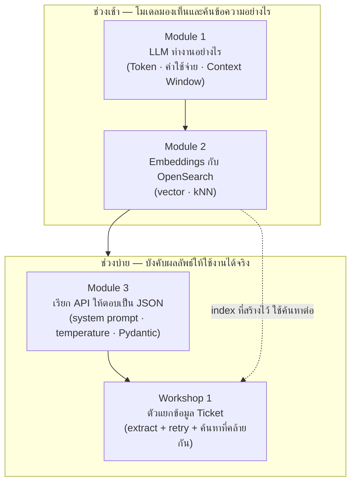

# Day 1 · ภาพรวมกิจกรรมทั้งวัน — จาก Token ถึง Structured Extraction

ก่อนเริ่มกิจกรรม ควรพิจารณาภาพรวมนี้หนึ่งครั้ง — ช่วงเช้าปูพื้นฐานว่าโมเดลมองเห็นข้อความอย่างไรและค้นหาข้อมูลตามความหมายได้อย่างไร ช่วงบ่ายนำความเข้าใจนั้นมาบังคับให้ผลลัพธ์จาก LLM ใช้งานได้จริงในระบบที่ต้อง parse ได้เสมอ โดยแต่ละกิจกรรมต่อยอดจากกิจกรรมก่อนหน้าโดยตรง

---

## ภาพรวมกิจกรรมทั้งวัน

---

## จุดที่ต้องลงมือเขียนโค้ดจริง

| กิจกรรม | ไฟล์ที่ต้องสร้าง | ลักษณะงาน |
|---|---|---|
| [Module 1 · LLM ทำงานอย่างไร](01-module1-llm-basics.md) | — (ใช้ `agent/tokenizer.py` ที่มีอยู่แล้ว) | Lab เบา: เปรียบเทียบตัวเลข ไม่ต้องเขียนตัวนับเอง |
| [Module 2 · Embeddings กับ OpenSearch](02-module2-embeddings-opensearch.md) | `ticket_opensearch_lab.py` | สร้าง index ใหม่ + embed ticket จริง + ค้นหาด้วย kNN — ยังไม่มี pipeline นี้อยู่ในระบบมาก่อน ต้องเขียนขึ้นเอง |
| [Module 3 · เรียก API ให้ตอบเป็น JSON](03-module3-json-api.md) | — | บรรยาย + สาธิต ไม่มี Lab |
| [Workshop 1 · ตัวแยกข้อมูล Ticket](04-workshop1-ticket-extractor.md) | `workshop1_extractor.py` | งานหลักของวันนี้ — ออกแบบ schema เอง เขียน retry loop เอง แล้วต่อกับ index ของ Module 2 เพื่อค้นหา ticket ที่คล้ายกัน |

---

## เหตุผลของการจัดลำดับกิจกรรม

- **Module 1 ต้องมาก่อน Module 2** — ต้องเข้าใจก่อนว่า tokenizer นับข้อความภาษาไทยผิดพลาดได้อย่างไร ก่อนจะเชื่อตัวเลข token ที่ใช้คำนวณต้นทุนการ embed ใน Module 2
- **Module 2 ต้องมาก่อน Workshop 1** — Workshop 1 ต้องใช้ index ของ ticket ที่สร้างไว้ใน Module 2 มาค้นหา ticket ที่คล้ายกันในขั้นตอนสุดท้าย ทำก่อนหน้านั้นไม่ได้เพราะยังไม่มี index ให้ค้นหา
- **Module 3 ต้องมาก่อน Workshop 1** — ต้องเข้าใจกลไกการบังคับ JSON Schema และหลักการ auto-retry ก่อน จึงจะออกแบบ `TicketExtraction` และเขียน retry loop เองใน Workshop 1 ได้ถูกหลักการ
- **Workshop 1 คือรากฐานที่ใช้ซ้ำในวันถัดไป** — ผลงานจาก Workshop 1 (การบังคับ schema + retry) เป็นรูปแบบเดียวกับที่ `ReactDecision` ใน ReAct loop ของวันที่ 2 ใช้ทุกรอบ

---

## ต่อไป

→ [Module 1: LLM ทำงานอย่างไร](01-module1-llm-basics.md)
