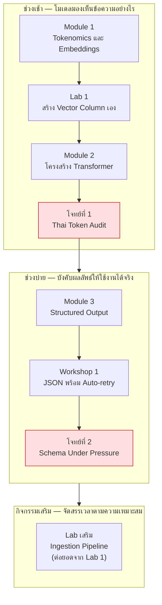

# Day 1 · ภาพรวมกิจกรรมทั้งวัน — จาก Tokenization ถึง Structured Extraction

ก่อนเริ่มกิจกรรม ควรพิจารณาภาพรวมนี้หนึ่งครั้ง — ช่วงเช้าเป็นการปูพื้นฐานว่าโมเดลมองเห็นข้อความอย่างไรและต้นทุนที่แท้จริงอยู่ตรงไหน ช่วงบ่ายเป็นการนำความเข้าใจนั้นมาบังคับให้ผลลัพธ์จาก LLM ใช้งานได้จริงในระบบที่ต้อง parse ได้เสมอ โดยแต่ละกิจกรรมต่อยอดจากกิจกรรมก่อนหน้าโดยตรง

---

## ภาพรวมกิจกรรมทั้งวัน

---

## จุดที่ต้องลงมือเขียน/แก้ไขโค้ดจริง

กิจกรรมของวันนี้ผสมระหว่างบรรยายเชิงแนวคิดและการลงมือเขียนสคริปต์ตั้งแต่ต้น (ต่างจากวันที่ 3 ที่แก้ไขไฟล์ที่มีอยู่แล้ว วันนี้ส่วนใหญ่คือการสร้างไฟล์ใหม่)

| กิจกรรม | ไฟล์ที่ต้องสร้าง/แก้ไข | ลักษณะงาน |
|---|---|---|
| [Lab 1 · สร้าง Vector Column](02-lab1-add-vector-column.md) | `my_embed.py`, `cosine.py` (สร้างใหม่ที่ root) | เขียน pipeline embed + backfill + ค้นหา ครบวงจรด้วยตนเอง |
| [โจทย์ที่ 1 · Thai Token Audit](04-challenge1-thai-token-audit.md) | สคริปต์วิเคราะห์ต้นทุน token | ใช้ `agent/tokenizer.py` ที่มีอยู่แล้ว วิเคราะห์และสรุปตัวเลข ไม่ต้องเขียนตัวนับเอง |
| [Workshop 1 · JSON + Auto-retry](06-workshop1-json-autoretry.md) | `workshop1_extractor.py` | เขียน `StructuredExtractor` และ retry loop เองทั้งหมด (ห้ามลอกจาก `agent/llm.py`) |
| [โจทย์ที่ 2 · Schema Under Pressure](07-challenge2-schema-under-pressure.md) | ต่อยอดจากไฟล์ของ Workshop 1 | เพิ่มการป้องกัน 4 แบบให้ทนต่อข้อมูลไม่สะอาดและ prompt injection |
| [Lab เสริม · Ingestion Pipeline](08-lab-ingestion-markdown.md) | `scripts/ingest_docs.py` | เขียนสคริปต์ ingest เอกสารเข้า OpenSearch (มีเฉลยให้เปรียบเทียบในเอกสาร) |

[Module 1](01-module1-tokenomics-embeddings.md), [Module 2](03-module2-transformer.md) และ [Module 3](05-module3-structured-output.md) เป็นบรรยายเชิงแนวคิด ไม่ต้องเขียนไฟล์ใหม่ — มีเพียงคำสั่งสาธิตสั้นๆ ให้รันเพื่อสังเกตพฤติกรรมจริงของระบบ

---

## เหตุผลของการจัดลำดับกิจกรรม

- **Module 1 ต้องมาก่อน Lab 1** — ต้องเข้าใจก่อนว่า embedding แปลงข้อความเป็นเวกเตอร์อย่างไรและทำไมต้องใช้ cosine similarity จึงจะลงมือสร้าง pipeline เองใน Lab 1 ได้อย่างเข้าใจ ไม่ใช่แค่ทำตามขั้นตอน
- **โจทย์ที่ 1 ต้องอยู่หลัง Module 1 และ Module 2** — ใช้ทั้งความเข้าใจเรื่องต้นทุน token ของภาษาไทย (Module 1) และผลกระทบของ context ที่ยาวขึ้นต่อการคำนวณ (Module 2) มาประกอบกันเป็นการประมาณการต้นทุนขึ้น production ผลลัพธ์จากโจทย์นี้ยังเชื่อมไปถึงการตัดสินใจเรื่อง chunking ในวันที่ 3
- **Module 3 ต้องมาก่อน Workshop 1** — ต้องเข้าใจกลไกการบังคับ JSON Schema และหลักการ auto-retry ก่อน จึงจะเขียน `StructuredExtractor` เองใน Workshop 1 ได้ถูกหลักการ ไม่ใช่แค่เขียนโค้ดที่ใช้งานได้ผิวเผิน
- **โจทย์ที่ 2 ต้องอยู่หลัง Workshop 1 เสมอ** — เป็นการทดสอบความทนทานของโมดูลที่เพิ่งสร้าง ไม่สามารถทำก่อนหน้านั้นได้เพราะยังไม่มีโค้ดให้ทดสอบ
- **Workshop 1 คือรากฐานที่ใช้ซ้ำในวันถัดไป** — ผลงานจาก Workshop 1 ถูกใช้ต่อในการบังคับ `ReactDecision` ของ ReAct loop ในวันที่ 2 และ structured output ของ MCP tool ในวันที่ 3 จึงควรเขียนให้ใช้ซ้ำได้ตั้งแต่ต้น

---

## ต่อไป

→ [Module 1: Tokenomics & Vector Embeddings](01-module1-tokenomics-embeddings.md)
