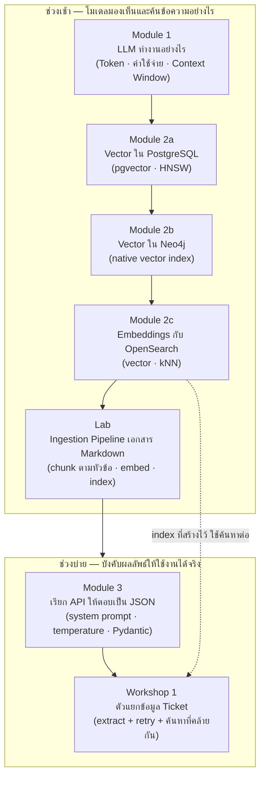

# Day 1 · ภาพรวมกิจกรรมทั้งวัน — จาก Token ถึง Structured Extraction

ก่อนเริ่มกิจกรรม ควรพิจารณาภาพรวมนี้หนึ่งครั้ง — ช่วงเช้าปูพื้นฐานว่าโมเดลมองเห็นข้อความอย่างไรและค้นหาข้อมูลตามความหมายได้อย่างไรในฐานข้อมูลสามชนิด ช่วงบ่ายนำความเข้าใจนั้นมาบังคับให้ผลลัพธ์จาก LLM ใช้งานได้จริงในระบบที่ต้อง parse ได้เสมอ โดยแต่ละกิจกรรมต่อยอดจากกิจกรรมก่อนหน้าโดยตรง

---

## ตารางเวลา

| เวลา | กิจกรรม |
|---|---|
| 09:00 – 10:15 | Module 1 · LLM ทำงานอย่างไร |
| 10:15 – 10:30 | พัก |
| 10:30 – 11:05 | Module 2a · Vector ใน PostgreSQL |
| 11:05 – 11:30 | Module 2b · Vector ใน Neo4j |
| 11:30 – 12:30 | Module 2c · Embeddings กับ OpenSearch |
| 12:30 – 13:00 | Lab · Ingestion Pipeline สำหรับเอกสาร Markdown |
| 13:00 – 14:00 | พักเที่ยง |
| 14:00 – 15:00 | Module 3 · เรียก API ให้ตอบเป็น JSON |
| 15:00 – 15:15 | พัก |
| 15:15 – 16:30 | Workshop 1 · ตัวแยกข้อมูล Ticket |

---

## ภาพรวมกิจกรรมทั้งวัน

---

## จุดที่ต้องลงมือเขียนโค้ดจริง

| กิจกรรม | ไฟล์ที่ต้องสร้าง | ลักษณะงาน |
|---|---|---|
| [Module 1 · LLM ทำงานอย่างไร](01-module1-llm-basics.md) | — (ใช้ `agent/tokenizer.py` ที่มีอยู่แล้ว) | Lab เบา: เปรียบเทียบตัวเลข ไม่ต้องเขียนตัวนับเอง |
| [Module 2a · Vector ใน PostgreSQL](02-module2a-pg-vec.md) | `my_embed.py`, `cosine.py` | แก้ schema จริงผ่าน SQL, เขียน backfill + ทดสอบค้นหาเองทั้งคู่ |
| [Module 2b · Vector ใน Neo4j](03-module2b-neo4j-vec.md) | — (แก้ schema จริงผ่าน Cypher + script backfill อ้างอิง) | สร้าง vector index บน Neo4j เองด้วยมือ ส่วน backfill ใช้สคริปต์ที่มีอยู่แล้ว |
| [Module 2c · Embeddings กับ OpenSearch](04-module2c-opensearch-vec.md) | `ticket_opensearch_lab.py` | สร้าง index ใหม่ + embed ticket จริง + ค้นหาด้วย kNN — ยังไม่มี pipeline นี้อยู่ในระบบมาก่อน ต้องเขียนขึ้นเอง |
| [Lab · Ingestion Pipeline เอกสาร Markdown](05-lab-ingestion-markdown.md) | เอกสาร Markdown ของตัวเอง 1 ไฟล์ | รัน pipeline ที่มีอยู่แล้ว (`scripts/ingest_docs.py`) แล้วพิสูจน์ด้วยการค้นหาจริงว่าเอกสารของตัวเองถูก chunk และ index ถูกต้อง |
| [Module 3 · เรียก API ให้ตอบเป็น JSON](06-module3-json-api.md) | — | บรรยาย + สาธิต ไม่มี Lab |
| [Workshop 1 · ตัวแยกข้อมูล Ticket](07-workshop1-ticket-extractor.md) | `workshop1_extractor.py` | งานหลักของวันนี้ — ออกแบบ schema เอง เขียน retry loop เอง แล้วต่อกับ index ของ Module 2c เพื่อค้นหา ticket ที่คล้ายกัน |

---

## เหตุผลของการจัดลำดับกิจกรรม

- **Module 1 ต้องมาก่อนทุกอย่างที่เกี่ยวกับ vector** — ต้องเข้าใจก่อนว่า tokenizer นับข้อความภาษาไทยผิดพลาดได้อย่างไร ก่อนจะเชื่อตัวเลข token ที่ใช้คำนวณต้นทุนการ embed ทั้งใน Module 2a/2b/2c
- **แยก Module 2a (PostgreSQL) กับ Module 2b (Neo4j) เป็นคนละไฟล์ แต่ทำต่อกันทันที** — ให้แต่ละฐานข้อมูลมีพื้นที่ของตัวเองแบบเจาะลึกโดยไม่ปนกัน (schema คนละแบบ: คอลัมน์ vs property ของ node) และตั้งใจให้ **PostgreSQL มาก่อน Neo4j** เพราะเป็นฐานข้อมูลเชิงสัมพันธ์ที่ผู้เรียนคุ้นเคยอยู่แล้ว เห็นภาพ pipeline ครบทุกขั้นตอนด้วยมือตัวเองที่นี่ก่อน แล้วค่อยไปเห็นว่าหลักการเดียวกันย้ายไปใช้กับฐานข้อมูลกราฟได้เช่นกัน
- **Module 2a/2b (PostgreSQL/Neo4j) มาก่อน Module 2c (OpenSearch) โดยตั้งใจ** — ให้เห็นว่าฐานข้อมูลเชิงสัมพันธ์ (PostgreSQL) และฐานข้อมูลกราฟ (Neo4j) ก็เก็บ vector และค้นหาแบบ kNN ได้เองโดยไม่ต้องพึ่งเอนจินค้นหาเฉพาะทาง ก่อนที่ Module 2c จะแสดงว่า OpenSearch ทำเรื่องเดียวกันได้ดีกว่าเมื่อข้อมูลมีปริมาณมากและต้องผสมกับ keyword search — ทั้งสามอยู่ในตระกูล "Module 2" เดียวกันเพราะสอนแนวคิดเดียวกัน (vector search) แค่คนละฐานข้อมูล ไม่ใช่เนื้อหาคนละเรื่อง
- **Lab Ingestion อยู่หลัง Module 2c ทันที** — เพราะใช้ embedding endpoint และแนวคิด chunk เดียวกับที่เพิ่งฝึกใน Module 2c มาต่อยอดกับข้อมูลรูปแบบใหม่ (เอกสารยาว แทนที่จะเป็น ticket แถวเดียว) ขณะที่ยังจำรายละเอียดได้แม่น
- **Module 2c ต้องมาก่อน Workshop 1** — Workshop 1 ต้องใช้ index ของ ticket ที่สร้างไว้ใน Module 2c มาค้นหา ticket ที่คล้ายกันในขั้นตอนสุดท้าย ทำก่อนหน้านั้นไม่ได้เพราะยังไม่มี index ให้ค้นหา
- **Module 3 ต้องมาก่อน Workshop 1** — ต้องเข้าใจกลไกการบังคับ JSON Schema และหลักการ auto-retry ก่อน จึงจะออกแบบ `TicketExtraction` และเขียน retry loop เองใน Workshop 1 ได้ถูกหลักการ
- **Workshop 1 คือรากฐานที่ใช้ซ้ำในวันถัดไป** — ผลงานจาก Workshop 1 (การบังคับ schema + retry) เป็นรูปแบบเดียวกับที่ `ReactDecision` ใน ReAct loop ของวันที่ 2 ใช้ทุกรอบ

---

## ต่อไป

→ [Module 1: LLM ทำงานอย่างไร](01-module1-llm-basics.md)
