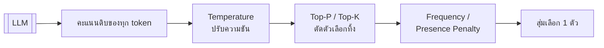
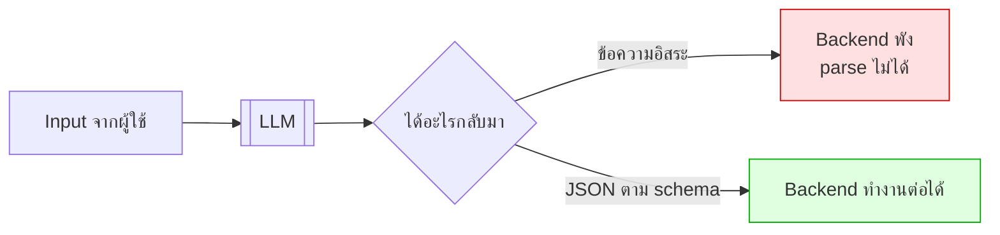
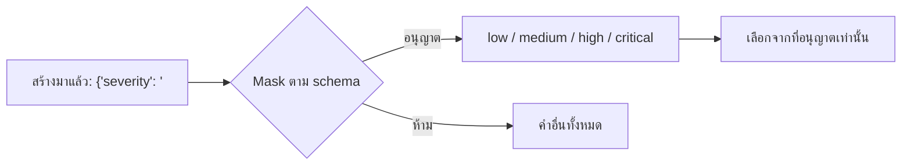
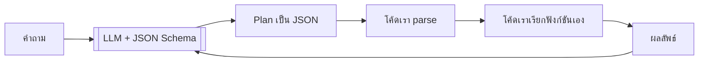
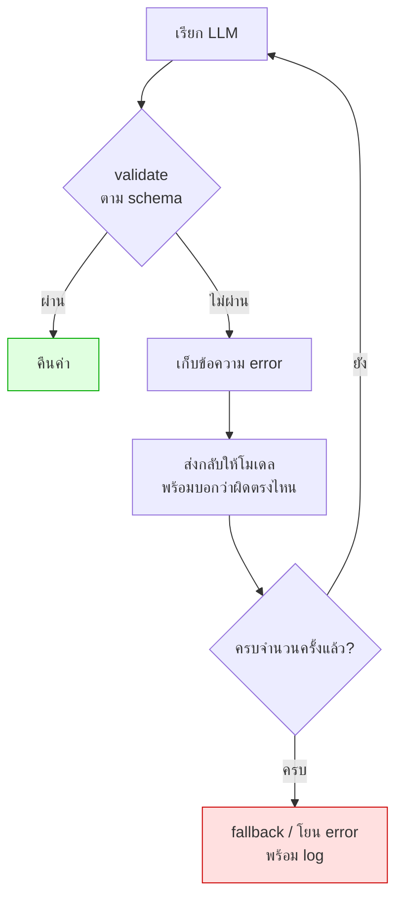

# Module 3 · API ขั้นสูงและ Structured Output

**13:00 – 14:30** · เป้าหมาย: บังคับให้ LLM คืนค่าที่ระบบ parse ได้เสมอ

---

## 1. Parameter ที่มีผลต่อผลลัพธ์



| Parameter | ทำอะไร | ค่าที่ใช้ในโปรเจกต์นี้ |
|---|---|---|
| `temperature` | 0 = เลือกตัวที่มั่นใจที่สุดเสมอ · สูง = สุ่มมากขึ้น | **0.0** สำหรับ plan/intent · **0.3** สำหรับคำตอบ |
| `top_p` | เก็บเฉพาะตัวเลือกที่ความน่าจะเป็นสะสมถึง p | 1.0 (ปล่อยให้ temperature คุม) |
| `top_k` | เก็บ k ตัวแรก | ไม่ใช้ |
| `frequency_penalty` | ลดโอกาสของ token ที่ออกไปแล้วบ่อย | 0 |
| `presence_penalty` | ลดโอกาสของ token ที่เคยออกแล้ว | 0 |
| `max_tokens` | จำกัดความยาว | ตามงาน |

### กฎที่ใช้ได้จริง

| งาน | temperature |
|---|---|
| จำแนกประเภท, สกัดข้อมูล, **วางแผน** | **0.0** |
| ตอบคำถามเชิงเทคนิค | 0.2 – 0.4 |
| เขียนเนื้อหาสร้างสรรค์ | 0.7 – 1.0 |

> **อย่าปรับ temperature และ top_p พร้อมกัน** เลือกคุมตัวใดตัวหนึ่ง ไม่งั้นจะแยกไม่ออกว่าผลที่เปลี่ยนมาจากอะไร

---

## 2. Structured Output — ปัญหาที่ต้องแก้



**สิ่งที่โมเดลชอบทำพัง**
- ครอบด้วย ` ```json ` ทั้งที่สั่งว่าห้าม
- ใส่คำนำ *"นี่คือ JSON ที่คุณขอครับ"*
- มี trailing comma
- ใส่ค่าที่ไม่มีใน enum
- ตอบเป็นภาษาไทยในฟิลด์ที่ต้องเป็น enum ภาษาอังกฤษ

### เหตุผลที่ประเด็นนี้ไม่ใช่เพียงเรื่อง "ความเสียเวลา"

หากไม่มี schema บังคับ โค้ดที่นำค่าไปใช้ต่อจะเกิดข้อผิดพลาดแบบสุ่ม เนื่องจากโมเดลไม่ได้ตอบในรูปแบบเดิมทุกครั้ง วันนี้อาจได้ `"severity": "สูง"` แต่พรุ่งนี้อาจได้ `"severity": "high (ด่วน)"` — โค้ดที่กรองตาม severity จึงไม่สามารถระบุค่าที่แน่นอนได้ เพราะไม่อาจทราบล่วงหน้าว่าจะพบรูปแบบใด

ตัวอย่างที่ชัดเจนที่สุดในระบบนี้คือ `ReactDecision` ของวันที่ 2 (`agent/react.py`): ทุกรอบของ ReAct loop โมเดลต้องตอบ `tool` เป็น**ชื่อ tool ที่มีอยู่จริงเท่านั้น** หากไม่บังคับ schema โมเดลอาจตอบเป็นข้อความอิสระ เช่น *"ผมจะไปค้น ticket ให้ครับ"* ซึ่งโค้ดไม่มีทางทราบได้ว่าต้องเรียกฟังก์ชันใดด้วย argument ใด — **schema คือสิ่งที่แปลง "คำพูด" ให้กลายเป็น "คำสั่งที่โปรแกรมรันได้จริง"** ไม่ใช่เพียงเรื่องความเป็นระเบียบเท่านั้น

---

## 3. สามระดับของการบังคับ (จากอ่อนไปแข็ง)

| ระดับ | วิธี | ความน่าเชื่อถือ |
|---|---|---|
| 1 | บอกใน prompt ว่า "ตอบเป็น JSON" | ต่ำ |
| 2 | ส่ง JSON Schema ไปใน prompt ด้วย | ปานกลาง |
| 3 | **Guided / constrained decoding** — บังคับที่ระดับการ sample token | **สูงมาก** |

### ระดับ 3 ทำงานอย่างไร

ตอนสร้าง token แต่ละตัว ระบบจะ **ปิด (mask) token ที่จะทำให้ JSON ผิด schema** ออกจากตัวเลือกทั้งหมด



โมเดลจึง **ไม่มีทางสร้าง JSON ที่ผิด schema ได้เลย** เพราะ token ที่ผิดไม่เคยอยู่ในตัวเลือก

| ตัวรัน | รองรับอย่างไร |
|---|---|
| Ollama | `format` รับ JSON Schema |
| vLLM | `guided_json` / `response_format` |
| LiteLLM Proxy | ส่งต่อไปยัง backend |

> ⚠️ **ต้องทดสอบก่อนใช้จริง** ว่า gateway ขององค์กรรองรับ ถ้าไม่รองรับต้องพึ่ง auto-retry (หัวข้อถัดไป)

---

## 4. เหตุผลที่ไม่ใช้ native function calling (แม้ Qwen จะรองรับ)

`qwen/qwen3-30b-a3b` มี native tool-calling API ในตัวจริง (`tools`/`tool_choice` แบบเดียวกับโมเดลใหญ่ทั่วไป) แต่ workshop นี้**เลือกไม่ใช้โดยตั้งใจ**

**เหตุผล**: tool call ที่แท้จริงคือ JSON ที่ระบุว่า *"เรียกใช้ฟังก์ชันใด ด้วย argument ใด"* ไม่ว่าจะมาจาก native API หรือการบังคับด้วย JSON Schema เอง กลไกภายในเหมือนกัน — แต่การบังคับด้วย JSON Schema เองให้ข้อดี 3 ประการ ดังนี้

1. **สลับ LLM provider ได้** โดยไม่ต้องเขียน agent loop ใหม่ (native tool-calling ของผู้ให้บริการแต่ละรายมี schema ไม่เหมือนกัน)
2. **ควบคุม validation/retry เองได้เต็มที่** (โยงไปหัวข้อ 5 — Auto-retry)
3. **เข้าใจกลไกจริง**ที่ซ่อนอยู่หลัง native API ด้วย เพราะสุดท้ายแล้วกลไกที่แท้จริงคือ JSON ร่วมกับ parser เช่นเดียวกัน



> **LLM ไม่เคยรันโค้ดเอง** ไม่ว่าจะมี native tool API หรือไม่
> โมเดลทำหน้าที่เพียง "เลือกชื่อฟังก์ชันและกรอก argument" เท่านั้น — ส่วนที่เหลือเป็นหน้าที่ของโค้ดฝั่งเราเสมอ

นี่คือเหตุผลที่วันที่ 2 กำหนดให้เขียน agent loop ขึ้นเอง: เมื่อเข้าใจว่ากลไกที่แท้จริงคือ JSON ร่วมกับ parser การเลือกใช้ framework ใดก็เป็นเพียงรายละเอียดปลีกย่อยเท่านั้น

ดูของจริงที่ `apps/agent-api/agent/llm.py` ฟังก์ชัน `complete_structured()`

---

## 5. Auto-retry ที่ฉลาดกว่าการลองใหม่เฉยๆ



**หัวใจคือขั้น D** — การลองใหม่เฉยๆ มักได้ผลผิดแบบเดิม แต่การบอกว่าผิดตรงไหนทำให้โมเดลแก้ถูก

ดูโค้ดจริงใน `complete_structured()`: apps/agent-api/agent/llm.py

```python
conversation += [
    {"role": "assistant", "content": raw[:1000]},
    {"role": "user", "content": f"That did not validate.\nError: {last_error}\nReturn corrected JSON only."},
]
```

---

## 6. ออกแบบ Schema ให้โมเดลทำถูกได้ง่าย

| หลักการ | ตัวอย่างจากโปรเจกต์นี้ |
|---|---|
| ใช้ `Enum` แทน string อิสระ | `IntentLabel` มี 4 ค่า ไม่ใช่ string ว่างเปล่า |
| ใส่ `description` ทุกฟิลด์ | `ReactDecision.tool` อธิบายว่า null หมายถึงพร้อมตอบแล้ว |
| กำหนดขอบเขตตัวเลข | `confidence: float = Field(ge=0, le=1)` |
| ฟิลด์ที่ไม่บังคับต้องมี default | `missing_information: list = Field(default_factory=list)` |
| **หลีกเลี่ยง nested ลึกเกิน 3 ชั้น** | โมเดลพลาดมากขึ้นตามความลึก |

ดูตัวอย่างเต็มที่ `apps/agent-api/schemas.py`

---

## 7. ทดลอง (15 นาที)

> ต้องใช้ `uv run python` เสมอ **ห้ามใช้ `python`/`python3` โดยตรง** — เนื่องจากหาก python บนเครื่อง (เช่น Anaconda) เป็นรุ่นเก่ากว่า 3.10
> โค้ดทั้งโปรเจกต์ที่ใช้ syntax `X | Y` (เช่น `dict | list | str | None` ใน `schemas.py`) จะพังทันทีตอน import ด้วย
> `TypeError: unsupported operand type(s) for |: 'type' and 'type'` — `uv run` การันตีว่าใช้ Python 3.12 ของโปรเจกต์เสมอ ไม่ว่า PATH จะชี้ไปที่ไหน
>
> ต้องเรียก `load_dotenv()` เองก่อน import `agent.llm` เสมอ เนื่องจากการรันด้วย `-c` โดยตรงเช่นนี้จะไม่มีการโหลด `.env` ให้โดยอัตโนมัติ —
> `agent/llm.py` อ่าน `LLM_API_KEY` เป็นค่าคงที่ตอน import ถ้ายังไม่โหลด `.env` จะได้ default `"not-needed"` ไปแทน
> และจะพบข้อผิดพลาด `401 - Missing Authentication header` จาก OpenRouter ในเวลาต่อมา (คนละสาเหตุกับ error `unsupported operand` ข้างต้น แต่พบได้บ่อยเช่นกัน)

```bash
uv run python -c "
import asyncio, sys; sys.path.insert(0,'apps/agent-api')
from dotenv import load_dotenv; load_dotenv('.env')
from agent import llm
from schemas import IntentResult
async def go():
    r = await llm.complete_structured(
        [{'role':'system','content':'Classify the user question.'},
         {'role':'user','content':'ticket ที่นนทบุรีมีอะไรบ้าง'}],
        IntentResult)
    print(r.model_dump_json(indent=2, ensure_ascii=False))
asyncio.run(go())
"
```

ลองตั้ง `LLM_GUIDED_DECODING=false` ใน `.env` แล้วรันซ้ำ 10 ครั้ง เทียบว่าพลาดกี่ครั้ง

---

## 8. ต่อไป

→ [Workshop 1: JSON + Auto-retry](06-workshop1-json-autoretry.md)
