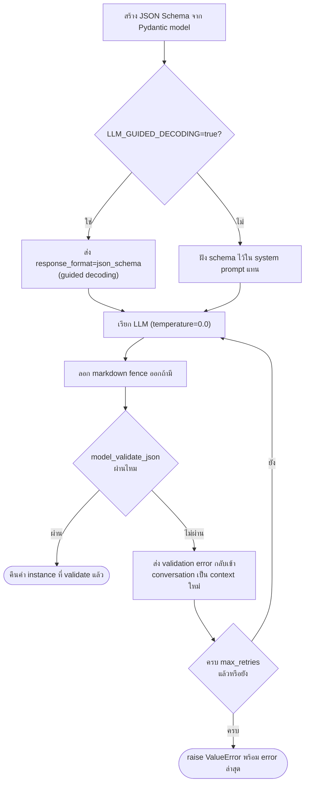

# Module 3 · เรียก API และให้ตอบเป็น JSON

**14:00 – 15:00** (60 นาที) · เป้าหมาย: เข้าใจส่วนประกอบสี่อย่างที่ทำให้เรียกใช้ LLM แล้วได้ผลลัพธ์ที่ระบบ parse ได้เสมอ — system prompt, temperature, JSON Schema และ Pydantic — และเห็นว่ากลไก guided decoding + auto-retry ในโค้ดจริงของโปรเจกต์ทำงานอย่างไร ก่อนไปเขียนเองใน Workshop 1

---

## 1. System Prompt: กำหนดบทบาทและกฎก่อนเริ่มงาน

ข้อความที่ส่งให้ LLM แบ่งเป็น "role" หลายแบบ (`system`, `user`, `assistant`) `system` เป็น role ที่ใช้กำหนดกติกาที่ต้องคงอยู่ตลอดการสนทนา ไม่ใช่คำถามของผู้ใช้ในแต่ละ turn

จุดที่ system prompt สำคัญที่สุดสำหรับ Module นี้: เมื่อบังคับให้โมเดลตอบเป็น JSON ต้องระบุ **schema ที่ต้องการ** ไว้ใน system prompt เสมอ ไม่ใช่หวังให้โมเดลเดาโครงสร้างเอง ตัวอย่างจริงจาก `apps/agent-api/agent/llm.py` (ฟังก์ชัน `complete_structured`) เมื่อ gateway ไม่รองรับการบังคับ schema โดยตรง จะ fallback มาเป็นการฝัง schema ลงใน system message แทน:

```python
conversation = conversation + [{
    "role": "system",
    "content": ("Respond with a single JSON object matching this schema. "
                "No prose, no markdown fence.\n"
                + json.dumps(json_schema, ensure_ascii=False)),
}]
```

---

## 2. Temperature: ทำไม structured output ต้องใช้ค่าต่ำ

Temperature ควบคุมความสุ่มของคำที่โมเดลเลือกในแต่ละ token — ค่าสูงทำให้คำตอบหลากหลายและสร้างสรรค์กว่า ค่าต่ำทำให้คำตอบเดิมซ้ำเดิมมากที่สุดเมื่อได้ input เดียวกัน

งานที่ต้อง parse เป็น JSON ต้องการความ**คงเส้นคงวา** ไม่ใช่ความคิดสร้างสรรค์ — นี่คือเหตุผลที่ `complete_structured` ใน `agent/llm.py` ตั้งค่า default `temperature=0.0` และตารางบทบาทโมเดลทั้งหมดในโปรเจกต์ (`reference/model-stack.md`) ก็ใช้ temperature 0.0 กับทุกจุดที่ต้องการผลลัพธ์แบบมีโครงสร้าง (Intent, ReAct step, Grounding) ในขณะที่ Synthesizer ซึ่งสร้างคำตอบเป็นข้อความอ่านให้คนใช้ ตั้งไว้ที่ 0.3 เพื่อให้ภาษาลื่นไหลขึ้นโดยยังไม่เปิดให้หลุดจากหลักฐานมากเกินไป

| งาน | temperature | เหตุผล |
|---|---|---|
| จำแนก intent / ตัดสินใจ / ตรวจสอบ | `0.0` | ต้องคงเส้นคงวา ทดสอบซ้ำได้ |
| สกัดข้อมูลเป็น JSON | `0.0` | ต้องการค่าเดิมทุกครั้งที่ input เดิม |
| สร้างข้อความคำตอบให้คนอ่าน | `0.2–0.3` | ต้องการภาษาที่อ่านลื่น แต่ยังไม่เปิดกว้างจนหลุดหลักฐาน |

---

## 3. JSON Schema และ Pydantic

การบอกโมเดลว่า "ตอบเป็น JSON" เฉย ๆ ไม่พอ ต้องระบุ **โครงสร้างที่แน่นอน** (field ใดบ้าง ชนิดข้อมูลอะไร ค่าไหนที่รับได้) — นี่คือหน้าที่ของ JSON Schema

Pydantic ทำสองอย่างพร้อมกันในบทบาทนี้:

1. **สร้าง JSON Schema จาก class ที่ประกาศเป็นภาษา Python** — `schema.model_json_schema()` แปลง `BaseModel` เป็น JSON Schema ให้อัตโนมัติ ไม่ต้องเขียน schema แยกสองที่
2. **ตรวจสอบ (validate) ผลลัพธ์ที่โมเดลตอบกลับมา** — `schema.model_validate_json(raw)` จะ raise exception ทันทีถ้า JSON ที่ได้ไม่ตรงกับ schema (field หาย, ชนิดข้อมูลผิด, ค่าที่ enum ไม่รับ)

```python
from enum import Enum
from pydantic import BaseModel, Field

class Severity(str, Enum):
    LOW = "Low"
    MEDIUM = "Medium"
    HIGH = "High"
    CRITICAL = "Critical"

class ExampleSchema(BaseModel):
    severity: Severity
    confidence: float = Field(ge=0.0, le=1.0)
```

**ลองให้โมเดลสร้าง JSON ตาม schema นี้จริง**:

```bash
uv run python - <<'PY'
import asyncio
import sys
from pathlib import Path
from dotenv import load_dotenv

load_dotenv(".env")
sys.path.insert(0, str(Path("apps/agent-api")))

from enum import Enum
from pydantic import BaseModel, Field
from agent import llm

class Severity(str, Enum):
    LOW = "Low"
    MEDIUM = "Medium"
    HIGH = "High"
    CRITICAL = "Critical"

class ExampleSchema(BaseModel):
    severity: Severity
    confidence: float = Field(ge=0.0, le=1.0)

async def main():
    result = await llm.complete_structured(
        messages=[
            {"role": "system", "content": "ประเมินระดับความรุนแรงของเหตุการณ์นี้"},
            {"role": "user", "content": "ลูกค้าทั้งไซต์ NBI แจ้งว่าอินเทอร์เน็ตหลุดพร้อมกันหมดตั้งแต่เมื่อคืน"},
        ],
        schema=ExampleSchema,
    )
    print(result.model_dump_json(indent=2))

asyncio.run(main())
PY
```

**ผลลัพธ์ที่ควรเห็น**:

```json
{
  "severity": "High",
  "confidence": 0.95
}
```

`complete_structured()` คือฟังก์ชันเดียวกับที่ใช้ในสไนป์เป็ต `QuickCheck` ท้ายหัวข้อนี้ — เปลี่ยนแค่ schema กับข้อความที่ส่งเข้าไป โมเดลก็ต้องตอบเป็น `severity`/`confidence` ตาม `ExampleSchema` ทันที ไม่มีทางตอบเป็นรูปแบบอื่น เพราะ guided decoding บังคับไว้ที่ระดับการเลือก token (อธิบายในหัวข้อ 4 ด้านล่าง) ไม่ใช่แค่ขอร้องในคำสั่ง

**ตัวอย่าง JSON ที่ validate ไม่ผ่าน** พร้อมเหตุผล (กรณีไม่ได้ผ่าน guided decoding เช่น โมเดลอื่นที่ไม่รองรับ หรือปิด `LLM_GUIDED_DECODING` ไว้):

```json
{
  "severity": "สูง",
  "confidence": "85%"
}
```

ผิด 2 จุดพร้อมกัน: `"สูง"` ไม่ใช่หนึ่งใน 4 ค่าที่ `Severity` enum กำหนดไว้ (`Low`/`Medium`/`High`/`Critical`) ต่อให้ความหมายตรงกันในภาษาไทยก็ตาม และ `"85%"` เป็น string ไม่ใช่ `float` ที่อยู่ในช่วง `0.0-1.0` ตามที่ `Field(ge=0.0, le=1.0)` กำหนด — ข้อความ error ที่ Pydantic โยนออกมาจากทั้งสองจุดนี้คือสิ่งที่ถูกส่งกลับให้โมเดลเห็นในรอบ retry ถัดไป (ตามกลไกในหัวข้อ 4 ด้านล่าง)

ข้อดีของการใช้ `Enum` แทน `str` ธรรมดา: โมเดลถูกจำกัดให้เลือกจากค่าที่กำหนดไว้เท่านั้นตั้งแต่ระดับ schema ไม่ใช่ปล่อยให้ตอบอะไรก็ได้แล้วมาตรวจทีหลัง — ยิ่งจำกัดตั้งแต่ schema เท่าไร โอกาสที่ผลลัพธ์จะ validate ผ่านในรอบแรกยิ่งสูงขึ้นเท่านั้น

### ถ้าไม่คุมด้วย Enum จะเกิดอะไรขึ้น

ลองเปลี่ยน `severity: Severity` เป็น `severity: str` ธรรมดา (`LooseSchema`) แล้วยิงคำถามเดิม:

```python
class LooseSchema(BaseModel):
    severity: str            # ← ไม่ผูกกับ Enum แล้ว
    confidence: float = Field(ge=0.0, le=1.0)
```

**ผลลัพธ์ที่เห็นจริงตอนทดสอบ** (เปลี่ยนแค่ schema จาก `ExampleSchema` เป็น `LooseSchema` ในโค้ดด้านบน คำถามเดิมทุกตัวอักษร):

```json
{
  "severity": "high",
  "confidence": 0.95
}
```

**สังเกตความต่างที่ละเอียดแต่สำคัญ**: `ExampleSchema` (มี `Enum`) ได้ `"High"` ตัวพิมพ์ใหญ่เป๊ะตามที่ enum กำหนดไว้เสมอไม่ว่าจะรันกี่รอบ เพราะ guided decoding บังคับให้เลือกได้เฉพาะสาย token ที่ตรงกับค่าที่ประกาศไว้เท่านั้น ส่วน `LooseSchema` (ไม่มี `Enum`) ได้ `"high"` ตัวพิมพ์เล็ก — **ไม่มีอะไรบังคับเรื่องตัวพิมพ์เลย เป็นแค่สิ่งที่โมเดลเลือกเขียนเองล้วนๆ** ลองยิงซ้ำหลายรอบและลองสั่งเป็นภาษาไทยตรงๆ ("ตอบเป็นภาษาไทย") ก็ยังได้คำแบบนี้เหมือนเดิม (แม้ตัวพิมพ์อาจไม่คงที่ทุกครั้งก็ตาม) เพราะโมเดลนี้เอนเอียงไปทางศัพท์ภาษาอังกฤษสำหรับคำว่า severity อยู่แล้วจากข้อมูลที่ใช้ฝึก

**นี่คือจุดที่อันตราย**: ผลลัพธ์ดูเหมือนใช้ `str` ธรรมดาก็ยังพอใช้ได้ เพราะบังเอิญเจอแต่กรณีที่โมเดล "เดาถูก" (ทั้งค่าและรูปแบบตัวพิมพ์) — แต่ `str` ธรรมดา**ไม่มีการรับประกันอะไรเลยในระดับ schema** ไม่ว่าจะเป็นค่า หรือแม้แต่รูปแบบตัวพิมพ์ ต่างจาก `Enum` ที่รับประกัน 100% ทั้งสองเรื่อง

พิสูจน์ได้แบบไม่ต้องพึ่งดวงว่าโมเดลจะตอบอะไร — validate ค่าที่หลุดขอบเขตด้วยมือกับทั้งสอง schema โดยตรง:

```python
weird = '{"severity": "URGENT", "confidence": 0.9}'

LooseSchema.model_validate_json(weird)    # ผ่านฉลุย ได้ severity='URGENT'
ExampleSchema.model_validate_json(weird)  # ValidationError ทันที: 'URGENT' ไม่อยู่ใน Low/Medium/High/Critical
```

`"URGENT"` เป็นคำที่สมเหตุสมผลสำหรับมนุษย์ และเป็นไปได้สูงที่โมเดลจะเลือกใช้คำนี้ถ้าเปลี่ยนคำถามหรือ prompt เพียงเล็กน้อย (เช่น ถามในบริบทที่โน้มเอียงไปทาง incident-response แทนที่จะเป็น network monitoring) — `LooseSchema` จะรับค่านี้เข้ามาเงียบๆ โดยไม่มีสัญญาณเตือนใดๆ แล้วโค้ดส่วนอื่นที่คาดหวังแค่ 4 ค่า (`Low`/`Medium`/`High`/`Critical`) จะพังตอนนำไปใช้ต่อ ไม่ใช่พังตอน validate — ซึ่งแก้ยากกว่ามากเพราะจุดที่ error กับจุดที่สาเหตุจริงอยู่คนละที่กัน

---

## 4. Guided Decoding และ Auto-Retry: กลไกจริงใน `agent/llm.py`

การส่ง schema ไปใน system prompt เฉย ๆ เป็นเพียง "คำขอร้อง" โมเดลยังมีโอกาสตอบผิดรูปแบบได้เสมอ **Guided decoding** คือการบังคับที่ระดับ inference engine ให้สร้างได้เฉพาะ token ที่ทำให้ผลลัพธ์ valid ตาม schema เท่านั้น (ผ่านพารามิเตอร์ `response_format` แบบ OpenAI-compatible) ซึ่งเข้มงวดกว่าการขอด้วยคำพูดมาก

`complete_structured()` ใน `apps/agent-api/agent/llm.py` ประกอบทั้งสี่หัวข้อข้างต้นเข้าด้วยกันเป็น pipeline เดียว:



จุดที่สำคัญที่สุดของกลไก retry นี้: **การ retry ไม่ใช่การขอซ้ำแบบเดิม** แต่ป้อน error message จริงจาก Pydantic กลับเข้าไปเป็นส่วนหนึ่งของบทสนทนา (`role: user`) ให้โมเดลเห็นว่าตัวเองพลาดตรงไหน:

```python
conversation = conversation + [
    {"role": "assistant", "content": raw[:1000]},
    {
        "role": "user",
        "content": (
            f"That did not validate against the schema.\n"
            f"Error: {last_error}\n"
            f"Return corrected JSON only."
        ),
    },
]
```

นี่คือความต่างระหว่าง "retry แบบสุ่มลองใหม่" กับ "retry ที่ฉลาดขึ้นทุกรอบ" — Workshop 1 ในช่วงบ่ายจะให้เขียนกลไกลักษณะนี้เองทั้งหมด

### ทดลองสั้น ๆ

```bash
uv run python - <<'PY'
import asyncio
import sys
from pathlib import Path
from dotenv import load_dotenv

load_dotenv(".env")  # ต้องโหลดก่อน import agent.llm เสมอ - llm.py อ่านค่า env
                      # เป็นค่าคงที่ระดับโมดูลตอน import (BASE_URL/API_KEY/MODEL)
                      # ต้องระบุ path ตรงๆ เพราะรันผ่าน stdin (heredoc) ทำให้
                      # load_dotenv() แบบไม่ระบุ path หา caller ไม่เจอแล้ว error
sys.path.insert(0, str(Path("apps/agent-api")))

from pydantic import BaseModel, Field
from agent import llm

class QuickCheck(BaseModel):
    is_thai: bool
    language_confidence: float = Field(ge=0.0, le=1.0)

async def main():
    result = await llm.complete_structured(
        messages=[
            {"role": "system", "content": "จำแนกว่าข้อความที่ให้มาเป็นภาษาไทยหรือไม่"},
            {"role": "user", "content": "วงจรที่ไซต์ NBI หลุดตั้งแต่เมื่อคืน"},
        ],
        schema=QuickCheck,
    )
    print(result.model_dump_json(indent=2))

asyncio.run(main())
PY
```

สังเกต log ที่ปรากฏถ้าลอง set `LLM_GUIDED_DECODING=false` ชั่วคราวใน `.env` — จะเห็นว่า schema ถูกฝังในข้อความแทน และมีโอกาส parse ไม่ผ่านสูงขึ้นในรอบแรก

### ผลลัพธ์ที่ควรเห็น

```json
{
  "is_thai": true,
  "language_confidence": 0.95
}
```

**วิธีอ่านผลลัพธ์นี้**:

- ผลลัพธ์เป็น JSON ที่ parse ผ่าน schema `QuickCheck` ได้ทันทีในความพยายามแรก **ทุกครั้งที่รัน** — ไม่ใช่เพราะโมเดลเก่งพอที่จะ "จำ" รูปแบบได้เอง แต่เพราะ guided decoding บังคับที่ระดับการ sample token ว่าต้องออกมาเป็น JSON ตาม schema เท่านั้น (ตามที่อธิบายไว้ในหัวข้อ 3) จึง**ไม่มีทางได้ field ชื่ออื่น หรือค่าที่ผิดประเภท** ออกมาเลย
- `is_thai: true` ถูกต้องตามข้อความ `"วงจรที่ไซต์ NBI หลุดตั้งแต่เมื่อคืน"` ซึ่งเป็นภาษาไทยล้วน
- `language_confidence` เป็นตัวเลข `0.0-1.0` เสมอเพราะ `Field(ge=0.0, le=1.0)` บังคับขอบเขตไว้ใน schema — ถ้าลบเงื่อนไขนี้ออก โมเดลอาจตอบค่าที่หลุดขอบเขต (เช่น `95` แทน `0.95`) โดย schema ไม่ทันจับ
- หากรันด้วย `LLM_GUIDED_DECODING=false` ตามที่แนะนำด้านบน ผลลัพธ์ควรยังถูกต้องในกรณีข้อความง่ายแบบนี้ แต่ log จะแสดงว่าโมเดลได้รับ schema แบบฝังในคำสั่ง (prompt) แทนการบังคับที่ระดับ token — ลองเปรียบเทียบกับข้อความที่กำกวมกว่านี้จะเห็นอัตรา parse ไม่ผ่านรอบแรกสูงขึ้นชัดเจนกว่า

> Module นี้เป็นบรรยาย + ทดลองสั้น ไม่มี lab แยกที่ต้องส่งงาน — ทุกกลไกที่เห็นในหัวข้อ 4 จะถูกนำไปใช้ซ้ำและเขียนขึ้นเองใน Workshop 1 ถัดไป

---

## ต่อไป

→ [Workshop 1: ตัวแยกข้อมูล Ticket](07-workshop1-ticket-extractor.md)
