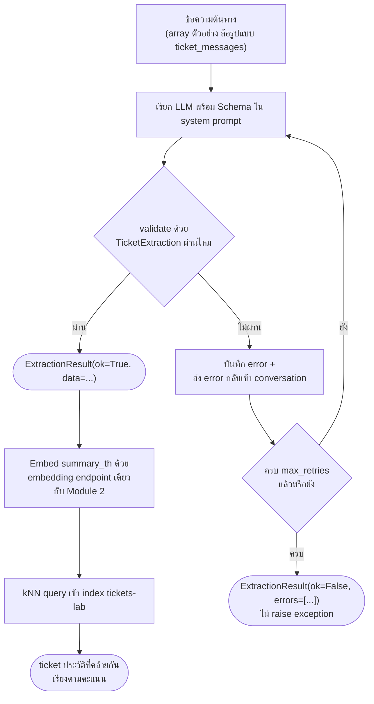

# Workshop 1 · ตัวแยกข้อมูล Ticket

**15:15 – 16:30** (75 นาที) · เป้าหมาย: เขียน pipeline ที่แยกข้อความแจ้งเหตุต้นทางให้เป็น JSON โครงสร้างชัดเจนด้วยตัวเอง พร้อมกลไก retry เมื่อผลลัพธ์ผิดรูปแบบ (Module 3) แล้วนำผลลัพธ์นั้นไปค้นหา ticket ประวัติที่คล้ายกันในดัชนีที่สร้างไว้ใน Module 2 — เป็นครั้งแรกของวันที่โมดูลก่อนหน้าถูกนำมาต่อกันเป็นระบบเดียว

---

## สถานการณ์

ทีม NOC ได้รับข้อความแจ้งเหตุจากลูกค้าและบทสนทนาระหว่างเจ้าหน้าที่กับลูกค้าเป็นข้อความ (free text) ไม่มีโครงสร้างตายตัว ก่อนจะส่งต่อให้ทีมช่างเทคนิค ต้องมีขั้นตอนอัตโนมัติที่:

**ตัวอย่างข้อความต้นทางจริง** (จากตาราง `ticket_messages`, ticket `TK-25-00001`):

```
customer  2026-09-13 23:26:22  ใช้งาน video conference แล้วหลุดบ่อยมากครับ วันละ 5-6 ครั้ง
engineer  2026-09-13 23:56:22  รับเรื่องแล้วครับ จะตรวจสอบ circuit ให้ กรุณาแจ้งเวลาที่หลุดล่าสุดด้วยครับ
```

สังเกตว่าไม่มี field ไหนบอกตรงๆ ว่า `category` คืออะไรหรือ `severity` ระดับไหน — โมเดลต้องอนุมานเอาเองจากบริบทของบทสนทนาทั้งหมด (เช่น "หลุดบ่อยมากครับ วันละ 5-6 ครั้ง" บ่งชี้ `intermittent` ไม่ใช่ `link_down`)

1. อ่านข้อความต้นทางแล้วสกัดออกมาเป็นข้อมูลโครงสร้าง (ประเภทปัญหา, ความรุนแรง, อุปกรณ์/ไซต์ที่เกี่ยวข้อง, สรุปสั้น) เพื่อ prefill เข้า dashboard
2. ถ้า LLM ตอบผิดรูปแบบ ต้องแก้ไขเองอัตโนมัติโดยไม่ต้องมีคนมานั่งเฝ้า และต้อง**ไม่ทำให้ระบบล่ม**แม้จะแก้ไม่สำเร็จเลยสักครั้ง
3. เมื่อสกัดข้อมูลสำเร็จ ต้องค้นดูทันทีว่ามี ticket เก่าที่มีอาการคล้ายกันหรือไม่ เพื่อช่วยให้ช่างตัดสินใจได้เร็วขึ้นว่าเป็นปัญหาที่เคยเจอมาก่อน

---

## สิ่งที่ให้มา

- ตาราง `ticket_messages` ใน PostgreSQL — บทสนทนาจริงของแต่ละ ticket (คอลัมน์ `ticket_id`, `author_role`, `message`, `created_at`) อ่านผ่านบัญชี read-only `mcp_reader` (`PG_DSN` ใน `.env.example`)
- ดัชนี `tickets-lab` บน OpenSearch ที่สร้างไว้แล้วใน [Module 2](04-module2-embeddings-opensearch.md) — ต้องรัน `ticket_opensearch_lab.py` ให้เสร็จก่อนเริ่ม workshop นี้
- รูปแบบการเรียก LLM และหลักการ guided decoding + auto-retry ที่อธิบายไว้ใน [Module 3](06-module3-json-api.md) — อ้างอิงโครงสร้างจาก `complete_structured()` ใน `apps/agent-api/agent/llm.py` เป็นแนวทางได้ แต่ **ห้าม import ฟังก์ชันนั้นมาใช้ตรง ๆ** ให้เขียน retry loop ของตัวเองเพื่อให้เข้าใจทุกส่วนจริง
- ค่าคงที่ประเภท ticket จริงจากตาราง `ticket_categories` (`docker/postgres/init/03_reference_data.sql`): `link_down`, `intermittent`, `slow`, `config`, `maintenance`, `inquiry`
- ระดับความรุนแรงจริงจาก constraint ของตาราง `tickets`: `low`, `medium`, `high`, `critical`
- ไซต์ที่มีอยู่จริงในชุดข้อมูล (`day0/01-architecture.md` หัวข้อ 5): `BKK`, `NBI`

---

## สิ่งที่ต้องทำ

### 1. นิยาม Schema ด้วย Pydantic

```python
from enum import Enum
from typing import Literal
from pydantic import BaseModel, Field

class Category(str, Enum):
    LINK_DOWN = "link_down"
    INTERMITTENT = "intermittent"
    SLOW = "slow"
    CONFIG = "config"
    MAINTENANCE = "maintenance"
    INQUIRY = "inquiry"

class Severity(str, Enum):
    LOW = "low"
    MEDIUM = "medium"
    HIGH = "high"
    CRITICAL = "critical"

class TicketExtraction(BaseModel):
    category: Category
    severity: Severity
    affected_device: str | None = Field(None, description="รหัสอุปกรณ์ เช่น LPE-NBI-11 ถ้าไม่ทราบให้เป็น null")
    affected_site: Literal["BKK", "NBI"] | None = Field(None, description="ไซต์ที่เกี่ยวข้อง ถ้าไม่ทราบให้เป็น null")
    summary_th: str = Field(description="สรุปเหตุการณ์เป็นภาษาไทยไม่เกิน 2 ประโยค")
    confidence: float = Field(ge=0.0, le=1.0, description="ความมั่นใจของโมเดลต่อผลสกัดทั้งหมด")

class ExtractionResult(BaseModel):
    ok: bool
    data: TicketExtraction | None = None
    attempts: int
    errors: list[str]
```

สังเกตว่า `affected_site` ใช้ `Literal["BKK", "NBI"]` แทน `str` ธรรมดา — ตามหลักการ Module 3 หัวข้อ 3: ยิ่งจำกัดค่าที่ schema รับได้ตั้งแต่ต้น โอกาส validate ผ่านในรอบแรกยิ่งสูง

### 2. เขียน Extractor พร้อม Retry ที่ไม่มีวันพัง

เขียนฟังก์ชัน (หรือ class) ที่:

- เรียก LLM ผ่าน `agent.llm.complete()` (completion ธรรมดา ไม่ใช้ `complete_structured`) พร้อม system prompt ที่ฝัง JSON Schema ของ `TicketExtraction` ไว้ (`TicketExtraction.model_json_schema()`)
- พยายาม `TicketExtraction.model_validate_json(...)` กับผลลัพธ์ที่ได้ (อย่าลืมลอก markdown fence ก่อน validate เหมือนที่ `complete_structured` ทำ)
- ถ้า validate ไม่ผ่าน: บันทึก error, ส่ง error message กลับเข้า conversation เป็น context ของรอบถัดไป, ลองใหม่จนครบ `max_retries` (แนะนำ 3)
- **ไม่ว่าผลจะเป็นอย่างไร ห้าม raise exception ออกจากฟังก์ชันนี้เด็ดขาด** — คืนค่าเป็น `ExtractionResult(ok=False, data=None, attempts=..., errors=[...])` เสมอเมื่อแก้ไม่สำเร็จ



### 3. ต่อยอด: ค้นหา Ticket ที่คล้ายกันจาก Module 2

เมื่อสกัดสำเร็จ (`ok=True`) ให้:

1. Embed ข้อความ (แนะนำ `summary_th` หรือรวมกับ `category`) ด้วย endpoint เดียวกับที่ใช้ใน `ticket_opensearch_lab.py`
2. ยิง kNN query เข้า index `tickets-lab` แบบเดียวกับ Module 2 (`{"size": N, "query": {"knn": {"embedding": {"vector": [...], "k": N}}}}`)
3. แสดงผล ticket ที่ใกล้เคียงที่สุด 3 อันดับแรก พร้อมคะแนน

### 4. ทดสอบด้วย array ของข้อความตัวอย่าง

ตาราง `ticket_messages` จริงแทบไม่เคยพูดถึงรหัสอุปกรณ์หรือไซต์ตรง ๆ เลย (ดูหัวข้อ "สถานการณ์" ด้านบน) ทำให้ `affected_device`/`affected_site` ได้ `null` ทุกใบเสมอถ้าทดสอบด้วยข้อมูลจริงล้วน ๆ — แทนที่จะ query จาก Postgres ตรง ๆ ให้สร้าง **array คงที่** ของบทสนทนาตัวอย่างขึ้นเอง โดยตั้งใจใส่รหัสอุปกรณ์/ไซต์ไว้ในบางใบด้วย เพื่อให้เห็นพฤติกรรมทั้งสองแบบในการรันเดียว:

```python
SAMPLE_CONVERSATIONS: list[tuple[str, str]] = [
    ("TK-DEMO-01",
     "customer: อุปกรณ์ LPE-NBI-11 ที่ไซต์ NBI เน็ตหลุดเป็นช่วงๆ ตั้งแต่เมื่อคืนครับ\n"
     "engineer: รับทราบครับ กำลังตรวจสอบ LPE-NBI-11 ให้ทันที"),
    ("TK-DEMO-02",
     "customer: circuit ที่ APE-BKK-05 ไซต์ BKK ช้าผิดปกติตั้งแต่บ่ายนี้ครับ\n"
     "engineer: ขอเวลาตรวจสอบ throughput ที่ APE-BKK-05 ก่อนครับ"),
    ("TK-DEMO-03",
     "engineer: เปลี่ยนอุปกรณ์ PE-NBI-04 ที่ไซต์ NBI เสร็จแล้ว แต่ link ยังไม่ขึ้นครับ\n"
     "engineer: ตรวจ optical power แล้วปกติ ขอให้ทีม core ช่วยดูอีกที"),
    ("TK-DEMO-04",
     "customer: ใช้งาน video conference แล้วหลุดบ่อยมากครับ วันละ 5-6 ครั้ง\n"
     "engineer: รับเรื่องแล้วครับ จะตรวจสอบ circuit ให้ กรุณาแจ้งเวลาที่หลุดล่าสุดด้วยครับ"),
    ("TK-DEMO-05",
     "engineer: แจ้งแผนงาน maintenance window ที่ CR-BKK-01 ไซต์ BKK เวลา 22:00-02:00 ครับ\n"
     "system: Maintenance window opened\n"
     "engineer: อัปเกรดเสร็จเรียบร้อย ตรวจสอบ adjacency กลับมา Up ปกติครับ"),
    ("TK-DEMO-06",
     "customer: เน็ตกระตุกครับ โหลดไฟล์ค้างกลางทาง\n"
     "engineer: ทดสอบ ping 500 packet ไม่ drop เลยครับ throughput ได้เต็ม speed ขอปิดเคสก่อนนะครับ\n"
     "customer: ok ครับ แต่ถ้าเป็นอีกจะแจ้งใหม่"),
]
```

รูปแบบข้อความยังคงล้อกับที่เคย query จากตาราง `ticket_messages` เป๊ะ (`role: message` ต่อบรรทัด ต่อ ticket) เพียงแต่เขียนขึ้นเองแทนที่จะดึงจากฐานข้อมูล — รันทั้ง pipeline ผ่าน array นี้แล้วสังเกตว่า field ไหนได้ `null` และใบไหนสกัดรหัสอุปกรณ์/ไซต์ได้จริง (ดูคำอธิบายในหัวข้อ "วิธีอ่านผลลัพธ์นี้" ด้านล่างว่าทำไม `null` บางใบถึงเป็นคำตอบที่ถูกต้อง ไม่ใช่โมเดลเดาไม่ตรง)

### ผลลัพธ์ที่ควรเห็น

```
=== Workshop 1: สกัดข้อมูลจาก 6 ticket ===

  guided decoding: True

  ticket        ok   retry  tokens   ms     category
  --------------------------------------------------------------
  TK-DEMO-01    yes  1      395      1507   inquiry
  TK-DEMO-02    yes  1      367      1552   slow
  TK-DEMO-03    yes  1      390      1641   link_down
  TK-DEMO-04    yes  1      355      1401   config
  TK-DEMO-05    yes  1      364      1546   maintenance
  TK-DEMO-06    yes  1      400      1760   intermittent

  --------------------------------------------------------------
  สำเร็จ           6/6
  ต้อง retry       0
  ใช้ fallback     0
  token รวม        2,271
  token เฉลี่ย/ใบ   378

=== Input (ข้อความต้นทาง) → Output (JSON) รายใบ ===

--- TK-DEMO-01 ---
[input]
  customer: อุปกรณ์ LPE-NBI-11 ที่ไซต์ NBI เน็ตหลุดเป็นช่วงๆ ตั้งแต่เมื่อคืนครับ
  engineer: รับทราบครับ กำลังตรวจสอบ LPE-NBI-11 ให้ทันที
[output]
  {
    "category": "inquiry",
    "severity": "medium",
    "affected_device": "LPE-NBI-11",
    "affected_site": "NBI",
    "summary_th": "อุปกรณ์ LPE-NBI-11 ที่ไซต์ NBI เน็ตหลุดเป็นช่วงๆ ตั้งแต่เมื่อคืน",
    "customer_impact": "เน็ตหลุดเป็นช่วงๆ",
    "confidence": 0.9
  }

--- TK-DEMO-02 ---
[input]
  customer: circuit ที่ APE-BKK-05 ไซต์ BKK ช้าผิดปกติตั้งแต่บ่ายนี้ครับ
  engineer: ขอเวลาตรวจสอบ throughput ที่ APE-BKK-05 ก่อนครับ
[output]
  {
    "category": "slow",
    "severity": "medium",
    "affected_device": null,
    "affected_site": "BKK",
    "summary_th": "circuit ที่ APE-BKK-05 ไซต์ BKK ช้าผิดปกติตั้งแต่บ่ายนี้",
    "customer_impact": "ช้าผิดปกติตั้งแต่บ่ายนี้",
    "confidence": 0.7
  }

--- TK-DEMO-03 ---
[input]
  engineer: เปลี่ยนอุปกรณ์ PE-NBI-04 ที่ไซต์ NBI เสร็จแล้ว แต่ link ยังไม่ขึ้นครับ
  engineer: ตรวจ optical power แล้วปกติ ขอให้ทีม core ช่วยดูอีกที
[output]  (รูปแบบเดียวกับด้านบน — category: link_down, affected_device: "PE-NBI-04", affected_site: "NBI")

--- TK-DEMO-04 ---
[input]
  customer: ใช้งาน video conference แล้วหลุดบ่อยมากครับ วันละ 5-6 ครั้ง
  engineer: รับเรื่องแล้วครับ จะตรวจสอบ circuit ให้ กรุณาแจ้งเวลาที่หลุดล่าสุดด้วยครับ
[output]  (category: config, affected_device: null, affected_site: null)

--- TK-DEMO-05 ---
[input]
  engineer: แจ้งแผนงาน maintenance window ที่ CR-BKK-01 ไซต์ BKK เวลา 22:00-02:00 ครับ
  system: Maintenance window opened
  engineer: อัปเกรดเสร็จเรียบร้อย ตรวจสอบ adjacency กลับมา Up ปกติครับ
[output]  (category: maintenance, affected_device: null, affected_site: null — พลาดจับ "CR-BKK-01"/"BKK" ทั้งที่ข้อความระบุตรงๆ)

--- TK-DEMO-06 ---
[input]
  customer: เน็ตกระตุกครับ โหลดไฟล์ค้างกลางทาง
  engineer: ทดสอบ ping 500 packet ไม่ drop เลยครับ throughput ได้เต็ม speed ขอปิดเคสก่อนนะครับ
  customer: ok ครับ แต่ถ้าเป็นอีกจะแจ้งใหม่
[output]  (category: intermittent, affected_device: null, affected_site: null)

=== Ticket ที่คล้ายกันสำหรับ TK-DEMO-01 (จาก index 'tickets-lab') ===

  summary_th: อุปกรณ์ LPE-NBI-11 ที่ไซต์ NBI เน็ตหลุดเป็นช่วงๆ ตั้งแต่เมื่อคืน

  0.826  TK-25-00001  [intermittent]  อินเทอร์เน็ตหลุดเป็นช่วงๆ ตั้งแต่เมื่อวาน
  0.789  TK-25-00005  [intermittent]  เน็ตหลุดซ้ำ เคสเดิมที่เคยแจ้งไว้
  0.788  TK-25-00002  [intermittent]  เน็ตกระตุกเป็นช่วง ใช้งานไม่ต่อเนื่อง
  0.776  TK-25-00004  [intermittent]  หลุดบ่อยช่วงบ่าย
  0.763  TK-25-00006  [config]  ISIS adjacency ไม่ขึ้นหลังเปลี่ยนอุปกรณ์
```

**วิธีอ่านผลลัพธ์นี้**:

- คอลัมน์ `retry` ในตารางแสดงค่า `attempts` (จำนวนครั้งที่พยายามทั้งหมด) ไม่ใช่จำนวนครั้งที่ retry — ค่า `1` หมายถึง**สำเร็จตั้งแต่ความพยายามแรก ไม่ต้อง retry เลย** ถ้าต้อง retry จริงค่านี้จะเป็น `2` ขึ้นไป
- **`สำเร็จ 6/6` และ `ต้อง retry 0` เป็นไปได้ในบางรอบการรัน** — การที่โมเดลตอบผิด schema หรือไม่คือเรื่องที่ไม่แน่นอน (ขึ้นกับ guided decoding และความกำกวมของข้อความแต่ละใบ) หากรันแล้วไม่เห็น retry เกิดขึ้นเลยสักครั้ง ให้ลองรันซ้ำหลายรอบ หรือปิด `LLM_GUIDED_DECODING` ชั่วคราวเพื่อเพิ่มโอกาสเห็นกรณีที่ต้องแก้ไข — เกณฑ์ผ่านข้อที่ต้องมี retry อย่างน้อย 1 ครั้งจึงอาจต้องใช้ความพยายามมากกว่าหนึ่งรอบการรันจึงจะพบ
- **ผลค้นหา ticket ที่คล้ายกัน** แสดงให้เห็นว่าแม้ `summary_th` ที่สกัดได้จะพูดถึง "LPE-NBI-11 ที่ไซต์ NBI" (ไม่ตรงกับคำในหัวข้อ ticket เก่าเป๊ะ) ระบบก็ยังค้นเจอ ticket ที่แท้จริงพูดถึงอาการเดียวกันด้วยคำคนละชุด ("หลุดบ่อยช่วงบ่าย", "เน็ตหลุดซ้ำ") ยืนยันว่าการเชื่อม Workshop 1 เข้ากับ index ของ Module 2 ทำงานได้จริง
- **`affected_device`/`affected_site` สกัดได้บางใบ เป็น `null` บางใบ — ทั้งสองแบบถูกต้องได้** `TK-DEMO-01` และ `TK-DEMO-03` ใส่รหัสอุปกรณ์/ไซต์ไว้ตรง ๆ ในข้อความและโมเดลจับได้ถูกทั้งคู่ แต่ `TK-DEMO-02` (มี `APE-BKK-05` อยู่จริง) กลับได้ `affected_device: null` ทั้งที่ `affected_site: BKK` จับได้ และ `TK-DEMO-05` (มี `CR-BKK-01`/`BKK` อยู่จริงทั้งคู่) กลับได้ `null` ทั้งสอง field — โมเดลพลาดจับรหัสอุปกรณ์/ไซต์บางครั้งแม้ข้อความจะบอกตรง ๆ นี่คือความไม่สมบูรณ์แบบปกติของ LLM ไม่ใช่บั๊กของ pipeline ส่วน `TK-DEMO-04` และ `TK-DEMO-06` ไม่มีรหัสอุปกรณ์/ไซต์ในข้อความเลย จึงต้องได้ `null` ทั้งคู่เสมอไม่ว่ารันกี่ครั้ง (schema สั่งห้ามเดา) — ถ้าเห็นค่าอื่นที่ไม่ใช่ `null` ใน `TK-DEMO-04`/`06` แปลว่าโมเดล hallucinate ซึ่งเป็นปัญหาจริง
- **ทำไม `TK-DEMO-05` พลาดจับ device/site ทั้งที่ระบุตรง ๆ** เทียบข้อความของ `TK-DEMO-05` กับ `TK-DEMO-01`/`03` ที่สกัดสำเร็จ จะเห็นความต่างของ**ตำแหน่งที่วางรหัสอุปกรณ์ในประโยค**: `TK-DEMO-01` เขียนว่า *"อุปกรณ์ LPE-NBI-11 ... เน็ตหลุด"* และ `TK-DEMO-03` เขียนว่า *"เปลี่ยนอุปกรณ์ PE-NBI-04 ... แต่ link ยังไม่ขึ้น"* — รหัสอุปกรณ์อยู่ติดกับอาการผิดปกติโดยตรง ทำให้โมเดลเชื่อมโยงได้ง่ายว่านี่คือ "อุปกรณ์ที่มีปัญหา" ส่วน `TK-DEMO-05` เขียนว่า *"แจ้งแผนงาน maintenance window ที่ CR-BKK-01 ไซต์ BKK เวลา 22:00-02:00"* — รหัสอุปกรณ์ถูกฝังอยู่ในประโยคกำหนดการ (แจ้งล่วงหน้าเรื่องเวลา) ไม่ได้อยู่ติดกับคำอธิบายอาการเสียหายใด ๆ อีกทั้งทั้งข้อความเป็นการแจ้ง/รายงานของ `engineer`/`system` ล้วน **ไม่มี `customer` แจ้งปัญหาเข้ามาเลย** ทำให้บริบทโดยรวมอ่านเหมือนประกาศทางธุรการมากกว่ารายงานเหตุขัดข้อง โมเดลจึงให้น้ำหนักกับรหัสอุปกรณ์ในบริบทนี้ต่ำกว่า — นี่คือคำอธิบายที่เป็นไปได้ (ไม่ใช่ข้อพิสูจน์แน่นอน เพราะไม่มีทางมองเข้าไปในกระบวนการคิดของโมเดลได้ตรง ๆ) และเป็นตัวอย่างที่ดีว่า **ตำแหน่ง/บริบทของข้อมูลในข้อความ มีผลต่อความแม่นยำของการสกัดไม่น้อยไปกว่าการที่ข้อมูลนั้น "มีอยู่จริง" ในข้อความหรือไม่**

---

## เกณฑ์ผ่าน

- [ ] ฟังก์ชัน extract คืนค่า `ExtractionResult` เสมอ ไม่ raise exception ออกมาแม้แต่ครั้งเดียว แม้ LLM จะตอบผิดรูปแบบทุกรอบจนครบ `max_retries`
- [ ] ทดสอบกับข้อความตัวอย่างอย่างน้อย 5 ชุด (array คงที่ที่เขียนเอง ล้อรูปแบบเดียวกับ `ticket_messages`) ได้ครบ พร้อม `attempts` และ `errors` ที่บันทึกไว้ถูกต้อง — อย่างน้อย 2 ชุดต้องมีรหัสอุปกรณ์/ไซต์ระบุตรง ๆ ในข้อความ และอย่างน้อย 1 ชุดต้องไม่มีเลย เพื่อให้เห็นทั้งสองพฤติกรรมของ `affected_device`/`affected_site`
- [ ] มีอย่างน้อย 1 กรณีที่เห็น retry เกิดขึ้นจริง (`attempts > 1`) พร้อมอธิบายได้ว่ารอบแรกผิดตรงไหน และ error message ที่ส่งกลับไปช่วยแก้ได้อย่างไร
- [ ] เมื่อสกัดสำเร็จ ค้นหา ticket ที่คล้ายกันจากดัชนี `tickets-lab` ได้อย่างน้อย 3 รายการ พร้อมคะแนนความคล้าย
- [ ] รัน pipeline ทั้งหมดได้ด้วยคำสั่งเดียว เช่น `uv run python workshop1_extractor.py`

---

## สิ่งที่ต้องส่ง

- ไฟล์สคริปต์ (`workshop1_extractor.py` หรือชื่อที่ตกลงกับวิทยากร)
- ผลลัพธ์ (`ExtractionResult` แบบเต็ม) ของ ticket อย่างน้อย 5 ใบ รวมกรณีที่ retry เกิดขึ้นจริงอย่างน้อย 1 กรณี
- ผลการค้นหา ticket ที่คล้ายกันของอย่างน้อย 1 ตัวอย่างที่สกัดสำเร็จ
- บันทึกสั้น ๆ (3-5 บรรทัด): field ใดที่โมเดลเดาไม่ตรงบ่อยที่สุด และคิดว่าเพราะอะไร

---

<details>
<summary>หากใช้เวลาเกิน 30 นาทีแล้วยังไม่สำเร็จ คลิกเพื่อดูเฉลย</summary>

เฉลยเต็มอยู่ที่ [`solutions/day1/`](../../solutions/day1/) — สองไฟล์ `ticket_opensearch_lab.py` (เฉลย Module 2) และ `workshop1_extractor.py` (เฉลย Workshop นี้) ต้องรันตามลำดับเสมอ เพราะไฟล์ที่สองค้นหา ticket ที่คล้ายกันจาก index `tickets-lab` ที่ไฟล์แรกเป็นผู้สร้าง:

```bash
uv run solutions/day1/ticket_opensearch_lab.py
```

```bash
uv run solutions/day1/workshop1_extractor.py
```

ถ้าเคยรัน `ticket_opensearch_lab.py` ไปแล้วครั้งหนึ่ง (เช็คได้จาก `GET tickets-lab/_count` ใน OpenSearch Dev Tools ว่ามี 117 แถวหรือยัง) ข้ามคำสั่งแรกแล้วรันแค่ `workshop1_extractor.py` ได้เลย

ดูคำอธิบายเจาะลึกจุดที่มักพลาดและเหตุผลของแต่ละดีไซน์ (`_repair_prompt()`, delimiter กัน prompt injection, `model_validator` ตรวจข้ามฟิลด์) ได้ที่ [`solutions/day1/README.md`](../../solutions/day1/README.md)

</details>

---

## ต่อไป

→ [Module 4: ReAct Pattern](../day2/01-module4-react-pattern.md)

เสริม (ไม่บังคับ): [สรุป Day 1: แก้ JSON Template ของ Agent จริงใน App](08-summary-json-template-in-app.md) — ต่อยอดจาก schema ที่เพิ่งเขียนใน Workshop นี้ ไปดูว่า schema จริงที่ agent ใช้อยู่ทุกวันอยู่ที่ไฟล์ไหน แก้ยังไง
