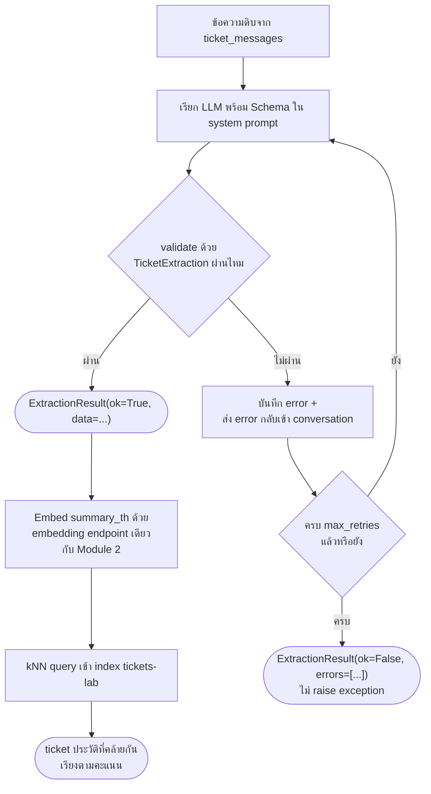

# Workshop 1 · ตัวแยกข้อมูล Ticket

**15:15 – 16:30** (75 นาที) · เป้าหมาย: เขียน pipeline ที่แยกข้อความแจ้งเหตุดิบให้เป็น JSON โครงสร้างชัดเจนด้วยตัวเอง พร้อมกลไก retry เมื่อผลลัพธ์ผิดรูปแบบ (Module 3) แล้วนำผลลัพธ์นั้นไปค้นหา ticket ประวัติที่คล้ายกันในดัชนีที่สร้างไว้ใน Module 2 — เป็นครั้งแรกของวันที่โมดูลก่อนหน้าถูกนำมาต่อกันเป็นระบบเดียว

---

## สถานการณ์

ทีม NOC ได้รับข้อความแจ้งเหตุจากลูกค้าและบทสนทนาระหว่างเจ้าหน้าที่กับลูกค้าเป็นข้อความอิสระ (free text) ไม่มีโครงสร้างตายตัว ก่อนจะส่งต่อให้ทีมช่างเทคนิค ต้องมีขั้นตอนอัตโนมัติที่:

1. อ่านข้อความดิบแล้วสกัดออกมาเป็นข้อมูลโครงสร้าง (ประเภทปัญหา, ความรุนแรง, อุปกรณ์/ไซต์ที่เกี่ยวข้อง, สรุปสั้น) เพื่อ prefill เข้า dashboard
2. ถ้า LLM ตอบผิดรูปแบบ ต้องแก้ไขเองอัตโนมัติโดยไม่ต้องมีคนมานั่งเฝ้า และต้อง**ไม่ทำให้ระบบล่ม**แม้จะแก้ไม่สำเร็จเลยสักครั้ง
3. เมื่อสกัดข้อมูลสำเร็จ ต้องค้นดูทันทีว่ามี ticket เก่าที่มีอาการคล้ายกันหรือไม่ เพื่อช่วยให้ช่างตัดสินใจได้เร็วขึ้นว่าเป็นปัญหาที่เคยเจอมาก่อน

---

## สิ่งที่ให้มา

- ตาราง `ticket_messages` ใน PostgreSQL — บทสนทนาจริงของแต่ละ ticket (คอลัมน์ `ticket_id`, `author_role`, `message`, `created_at`) อ่านผ่านบัญชี read-only `mcp_reader` (`PG_DSN` ใน `.env.example`)
- ดัชนี `tickets-lab` บน OpenSearch ที่สร้างไว้แล้วใน [Module 2](04-module2-embeddings-opensearch.md) — ต้องรัน `ticket_opensearch_lab.py` ให้เสร็จก่อนเริ่ม workshop นี้
- รูปแบบการเรียก LLM และหลักการ guided decoding + auto-retry ที่อธิบายไว้ใน [Module 3](06-module3-json-api.md) — อ้างอิงโครงสร้างจาก `complete_structured()` ใน `apps/agent-api/agent/llm.py` เป็นแนวทางได้ แต่ **ห้าม import ฟังก์ชันนั้นมาใช้ตรง ๆ** ให้เขียน retry loop ของตัวเองเพื่อให้เข้าใจทุกส่วนจริง
- ค่าคงที่ประเภท ticket จริงจากตาราง `ticket_categories` (`docker/postgres/init/03_reference_data.sql`): `link_down`, `intermittent`, `slow`, `config`, `maintenance`, `inquiry`
- ระดับความรุนแรงจริงจาก constraint ของตาราง `tickets`: `low`, `medium`, `high`, `critical`
- ไซต์ที่มีอยู่จริงในชุดข้อมูล (`day0/01-architecture.md` หัวข้อ 5): `BKK`, `NBI`

---

## สิ่งที่ต้องทำ

### 1. นิยาม Schema ด้วย Pydantic

```python
from enum import Enum
from typing import Literal
from pydantic import BaseModel, Field

class Category(str, Enum):
    LINK_DOWN = "link_down"
    INTERMITTENT = "intermittent"
    SLOW = "slow"
    CONFIG = "config"
    MAINTENANCE = "maintenance"
    INQUIRY = "inquiry"

class Severity(str, Enum):
    LOW = "low"
    MEDIUM = "medium"
    HIGH = "high"
    CRITICAL = "critical"

class TicketExtraction(BaseModel):
    category: Category
    severity: Severity
    affected_device: str | None = Field(None, description="รหัสอุปกรณ์ เช่น LPE-NBI-11 ถ้าไม่ทราบให้เป็น null")
    affected_site: Literal["BKK", "NBI"] | None = Field(None, description="ไซต์ที่เกี่ยวข้อง ถ้าไม่ทราบให้เป็น null")
    summary_th: str = Field(description="สรุปเหตุการณ์เป็นภาษาไทยไม่เกิน 2 ประโยค")
    confidence: float = Field(ge=0.0, le=1.0, description="ความมั่นใจของโมเดลต่อผลสกัดทั้งหมด")

class ExtractionResult(BaseModel):
    ok: bool
    data: TicketExtraction | None = None
    attempts: int
    errors: list[str]
```

สังเกตว่า `affected_site` ใช้ `Literal["BKK", "NBI"]` แทน `str` ธรรมดา — ตามหลักการ Module 3 หัวข้อ 3: ยิ่งจำกัดค่าที่ schema รับได้ตั้งแต่ต้น โอกาส validate ผ่านในรอบแรกยิ่งสูง

### 2. เขียน Extractor พร้อม Retry ที่ไม่มีวันพัง

เขียนฟังก์ชัน (หรือ class) ที่:

- เรียก LLM ผ่าน `agent.llm.complete()` (completion ธรรมดา ไม่ใช้ `complete_structured`) พร้อม system prompt ที่ฝัง JSON Schema ของ `TicketExtraction` ไว้ (`TicketExtraction.model_json_schema()`)
- พยายาม `TicketExtraction.model_validate_json(...)` กับผลลัพธ์ที่ได้ (อย่าลืมลอก markdown fence ก่อน validate เหมือนที่ `complete_structured` ทำ)
- ถ้า validate ไม่ผ่าน: บันทึก error, ส่ง error message กลับเข้า conversation เป็น context ของรอบถัดไป, ลองใหม่จนครบ `max_retries` (แนะนำ 3)
- **ไม่ว่าผลจะเป็นอย่างไร ห้าม raise exception ออกจากฟังก์ชันนี้เด็ดขาด** — คืนค่าเป็น `ExtractionResult(ok=False, data=None, attempts=..., errors=[...])` เสมอเมื่อแก้ไม่สำเร็จ



### 3. ต่อยอด: ค้นหา Ticket ที่คล้ายกันจาก Module 2

เมื่อสกัดสำเร็จ (`ok=True`) ให้:

1. Embed ข้อความ (แนะนำ `summary_th` หรือรวมกับ `category`) ด้วย endpoint เดียวกับที่ใช้ใน `ticket_opensearch_lab.py`
2. ยิง kNN query เข้า index `tickets-lab` แบบเดียวกับ Module 2 (`{"size": N, "query": {"knn": {"embedding": {"vector": [...], "k": N}}}}`)
3. แสดงผล ticket ที่ใกล้เคียงที่สุด 3 อันดับแรก พร้อมคะแนน

### 4. ทดสอบด้วยข้อมูลจริงจาก Postgres

```python
import psycopg

with psycopg.connect(PG_DSN) as conn:
    cur = conn.cursor()
    cur.execute("""
        SELECT t.ticket_id,
               string_agg(m.author_role || ': ' || m.message, E'\\n' ORDER BY m.created_at) AS conversation
        FROM tickets t
        JOIN ticket_messages m ON m.ticket_id = t.ticket_id
        GROUP BY t.ticket_id
        ORDER BY t.ticket_id
        LIMIT 5
    """)
    rows = cur.fetchall()
```

รันทั้ง pipeline ผ่านบทสนทนาจริงอย่างน้อย 5 ticket แล้วสังเกตว่า field ไหนที่โมเดลมักเดาไม่ตรง (เช่น `affected_device` เมื่อลูกค้าไม่เคยพูดถึงรหัสอุปกรณ์ตรง ๆ)

### ผลลัพธ์ที่ควรเห็น

```
=== Workshop 1: สกัดข้อมูลจาก 20 ticket ===

  guided decoding: True

  ticket        ok   retry  tokens   ms     category
  --------------------------------------------------------------
  TK-25-00001   yes  1      377      2885   config
  TK-25-00002   yes  1      400      2869   intermittent
  TK-25-00003   yes  1      344      3002   maintenance
  ...
  TK-25-00020   yes  1      301      2841   maintenance

  --------------------------------------------------------------
  สำเร็จ           20/20
  ต้อง retry       0
  ใช้ fallback     0
  token รวม        6,528
  token เฉลี่ย/ใบ   326

=== Ticket ที่คล้ายกันสำหรับ TK-25-00001 (จาก index 'tickets-lab') ===

  summary_th: การใช้งาน video conference พบว่ามีการหลุดบ่อย ประมาณ 5-6 ครั้งต่อวัน

  0.817  TK-25-00004  [intermittent]  หลุดบ่อยช่วงบ่าย
  0.816  TK-25-00001  [intermittent]  อินเทอร์เน็ตหลุดเป็นช่วงๆ ตั้งแต่เมื่อวาน
  0.761  TK-25-00005  [intermittent]  เน็ตหลุดซ้ำ เคสเดิมที่เคยแจ้งไว้
  0.755  TK-25-00003  [intermittent]  circuit drop ซ้ำๆ กระทบระบบ POS
  0.740  TK-25-00102  [slow]  latency สูงผิดปกติช่วงเย็น
```

**วิธีอ่านผลลัพธ์นี้**:

- คอลัมน์ `retry` ในตารางแสดงค่า `attempts` (จำนวนครั้งที่พยายามทั้งหมด) ไม่ใช่จำนวนครั้งที่ retry — ค่า `1` หมายถึง**สำเร็จตั้งแต่ความพยายามแรก ไม่ต้อง retry เลย** ถ้าต้อง retry จริงค่านี้จะเป็น `2` ขึ้นไป
- **`สำเร็จ 20/20` และ `ต้อง retry 0` เป็นไปได้ในบางรอบการรัน** — การที่โมเดลตอบผิด schema หรือไม่คือเรื่องที่ไม่แน่นอน (ขึ้นกับ guided decoding และความกำกวมของข้อความแต่ละใบ) หากรันแล้วไม่เห็น retry เกิดขึ้นเลยสักครั้ง ให้ลองรันซ้ำหลายรอบ หรือปิด `LLM_GUIDED_DECODING` ชั่วคราวเพื่อเพิ่มโอกาสเห็นกรณีที่ต้องแก้ไข — เกณฑ์ผ่านข้อที่ต้องมี retry อย่างน้อย 1 ครั้งจึงอาจต้องใช้ความพยายามมากกว่าหนึ่งรอบการรันจึงจะพบ
- **ผลค้นหา ticket ที่คล้ายกัน** แสดงให้เห็นว่าแม้ `summary_th` ที่สกัดได้จะใช้คำว่า "video conference" (ไม่ใช่ศัพท์เครือข่าย) ระบบก็ยังค้นเจอ ticket ที่แท้จริงพูดถึงอาการเดียวกันด้วยคำคนละชุด ("หลุดบ่อยช่วงบ่าย", "เน็ตหลุดซ้ำ") ยืนยันว่าการเชื่อม Workshop 1 เข้ากับ index ของ Module 2 ทำงานได้จริง

---

## เกณฑ์ผ่าน

- [ ] ฟังก์ชัน extract คืนค่า `ExtractionResult` เสมอ ไม่ raise exception ออกมาแม้แต่ครั้งเดียว แม้ LLM จะตอบผิดรูปแบบทุกรอบจนครบ `max_retries`
- [ ] ทดสอบกับ ticket จริงอย่างน้อย 5 ใบจากตาราง `ticket_messages` ได้ครบ พร้อม `attempts` และ `errors` ที่บันทึกไว้ถูกต้อง
- [ ] มีอย่างน้อย 1 กรณีที่เห็น retry เกิดขึ้นจริง (`attempts > 1`) พร้อมอธิบายได้ว่ารอบแรกผิดตรงไหน และ error message ที่ส่งกลับไปช่วยแก้ได้อย่างไร
- [ ] เมื่อสกัดสำเร็จ ค้นหา ticket ที่คล้ายกันจากดัชนี `tickets-lab` ได้อย่างน้อย 3 รายการ พร้อมคะแนนความคล้าย
- [ ] รัน pipeline ทั้งหมดได้ด้วยคำสั่งเดียว เช่น `uv run python workshop1_extractor.py`

---

## สิ่งที่ต้องส่ง

- ไฟล์สคริปต์ (`workshop1_extractor.py` หรือชื่อที่ตกลงกับวิทยากร)
- ผลลัพธ์ (`ExtractionResult` แบบเต็ม) ของ ticket อย่างน้อย 5 ใบ รวมกรณีที่ retry เกิดขึ้นจริงอย่างน้อย 1 กรณี
- ผลการค้นหา ticket ที่คล้ายกันของอย่างน้อย 1 ตัวอย่างที่สกัดสำเร็จ
- บันทึกสั้น ๆ (3-5 บรรทัด): field ใดที่โมเดลเดาไม่ตรงบ่อยที่สุด และคิดว่าเพราะอะไร

---

## ต่อไป

→ [Module 4: ReAct Pattern](../day2/01-module4-react-pattern.md)
