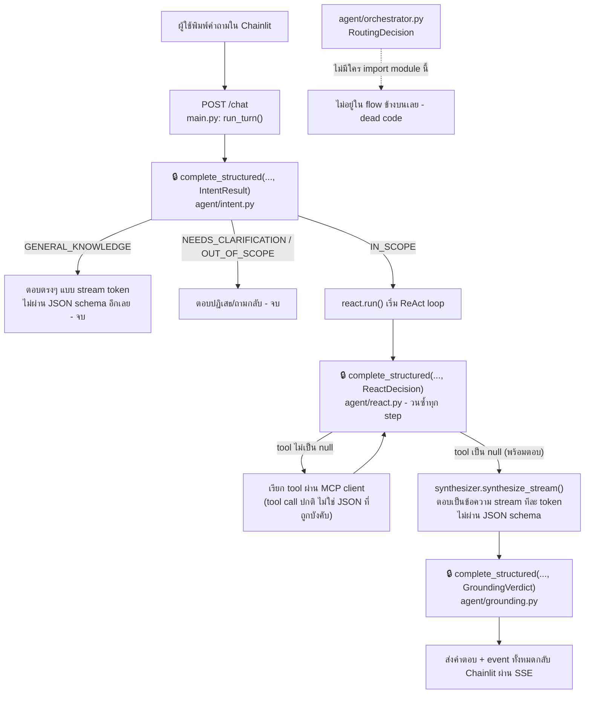

# สรุป Day 1 · แก้ JSON Template ของ Agent จริงใน App

เสริม (ไม่บังคับ) · อ่านเมื่อใดก็ได้หลังจากเรียน Module 3 และ Workshop 1 แล้ว

---

## เหตุผลที่ควรทราบเรื่องนี้

Module 3 และ Workshop 1 สอนหลักการบังคับให้ LLM ตอบเป็น JSON ตาม schema ผ่าน Pydantic ร่วมกับ guided decoding และ auto-retry ด้วยมือตัวเอง อย่างไรก็ตาม `TicketExtraction` ที่เขียนขึ้นใน Workshop 1 เป็นไฟล์ lab แยกต่างหาก **ไม่ได้เชื่อมต่อกับ agent จริงที่รันอยู่ใน `apps/agent-api`** เอกสารนี้สรุปว่าหากต้องการแก้ไข JSON template ของ agent จริง (ตัวที่ Chainlit และ MCP Inspector เรียกใช้งานอยู่เป็นประจำ) ต้องแก้ไขที่ใด

---

## ไฟล์หลักที่ต้องทราบ: `apps/agent-api/schemas.py`

schema ส่วนใหญ่ที่ agent จริงบังคับให้ LLM ตอบตามรวมอยู่ในไฟล์นี้ — **ยกเว้น `RoutingDecision`** ที่ประกาศแยกอยู่ใน `agent/orchestrator.py` เอง (ดูหมายเหตุท้ายตาราง):

| Schema | ใช้ที่ไฟล์ | ทำหน้าที่ | ใช้งานจริงใน `/chat` ไหม |
|---|---|---|---|
| `IntentResult` | `agent/intent.py` | จัดประเภทคำถามผู้ใช้ก่อนเข้า ReAct loop (Module 7 วันที่ 2) | ✅ ทุก request |
| `ReactDecision` | `agent/react.py` | หนึ่งรอบ Thought → Action ของ ReAct loop — รูปแบบเดียวกับ Workshop 1 | ✅ ทุก step ของ loop |
| `StepResult` | `agent/react.py` | บันทึกผลแต่ละ step หลังเรียก tool | ✅ ทุก step ของ loop |
| `GroundingVerdict` | `agent/grounding.py` | ตรวจสอบว่าคำตอบสุดท้ายมีหลักฐานรองรับจริงหรือไม่ | ✅ ท้ายสุดของทุก request |
| `TopicState` / `MemorySnapshot` | `agent/memory.py` | โครงสร้าง memory ข้ามเทิร์น | ✅ ใช้ตลอด session |
| `ChatRequest` / `Usage` | `main.py` | รูปร่างของ request/response ใน REST API | ✅ ทุก request |
| `RoutingDecision` (อยู่ใน `orchestrator.py` ไม่ใช่ `schemas.py`) | `agent/orchestrator.py` | ออกแบบไว้สำหรับจัดเส้นทางคำถามไปยัง specialist (tickets/topology/logs) | ❌ **ไม่ได้ถูกเรียกจากที่ไหนเลย** — ไม่มีไฟล์ใด import `orchestrator` แม้แต่จุดเดียว เป็นโค้ดที่เขียนไว้แต่ไม่ได้ต่อเข้า pipeline จริง |

**ไม่มี schema ใดใน `apps/` ที่เกี่ยวข้องกับการสกัด ticket แบบ `TicketExtraction` ของ Workshop 1** — หากต้องการให้ agent จริงสกัด ticket ได้ในลักษณะเดียวกัน จำเป็นต้องเขียน schema ใหม่เพิ่มลงในไฟล์นี้เอง ระบบไม่มีให้โดยอัตโนมัติ

---

## Flow ของ JSON ที่ถูกบังคับ ผ่าน module ต่างๆ

หนึ่งคำถามจากผู้ใช้ไม่ได้ผ่าน `complete_structured()` แค่จุดเดียว — เส้นทางจริงของ request หนึ่งครั้ง (`POST /chat`) ผ่าน 3 จุดบังคับ JSON เรียงกัน คั่นด้วยช่วงที่เป็น**ข้อความธรรมดา ไม่ถูกบังคับ schema**:



**สังเกต**: จุดที่มี 🔒 คือจุดที่ LLM **ถูกบังคับ** ให้ตอบ JSON ตาม schema (guided decoding) มี 3 จุด (`IntentResult` → `ReactDecision` ×N รอบ → `GroundingVerdict`) ส่วนคำตอบสุดท้ายที่ผู้ใช้เห็นจริง ๆ (`synthesizer.synthesize_stream`) กลับ**ไม่ได้**ถูกบังคับ schema — เป็นข้อความธรรมดาที่ stream ออกมาทีละ token เหมือน ChatGPT ปกติ เหตุผลคือคำตอบสุดท้ายต้องเป็นภาษาธรรมชาติอ่านง่าย ไม่ใช่ข้อมูลโครงสร้างที่ระบบอื่นต้องเอาไปประมวลผลต่อแบบ `IntentResult`/`ReactDecision`/`GroundingVerdict`

---

## กลไกเบื้องหลัง (หลักการเดียวกับ Module 3)

`apps/agent-api/agent/llm.py` → `complete_structured()` ทำงานตามหลักการเดียวกับที่ Module 3 สอนและ Workshop 1 ให้ฝึกเขียนเอง:

```python
json_schema = schema.model_json_schema()
kwargs["response_format"] = {
    "type": "json_schema",
    "json_schema": {"name": schema.__name__, "schema": json_schema, "strict": True},
}
```

เมื่อแก้ไข field ใน schema (`schemas.py`) ฟังก์ชัน `model_json_schema()` จะปรับปรุงข้อมูลโดยอัตโนมัติ และ guided decoding จะบังคับให้ LLM ตอบตามรูปแบบใหม่ทันที ไม่จำเป็นต้องแก้ไขส่วนอื่นเพิ่มเติม หากเป็นเพียงการเพิ่ม field ใหม่

---

## ตัวอย่างการแก้ไขจริง: เพิ่ม field `confidence` ให้ `ReactDecision`

**ก่อนแก้ไข** (`apps/agent-api/schemas.py`):

```python
class ReactDecision(BaseModel):
    thought: str = Field(description="...")
    tool: str | None = Field(default=None, description="...")
    arguments: dict = Field(default_factory=dict)
```

**หลังแก้ไข**:

```python
class ReactDecision(BaseModel):
    thought: str = Field(description="...")
    tool: str | None = Field(default=None, description="...")
    arguments: dict = Field(default_factory=dict)
    confidence: float = Field(
        ge=0.0, le=1.0,
        description="ความมั่นใจของโมเดลต่อการตัดสินใจนี้ - หลักการเดียวกับ confidence ใน TicketExtraction ของ Workshop 1",
    )
```

เพียงเท่านี้ LLM จะต้องตอบ field `confidence` มาด้วยทุกรอบของ ReAct loop โดยถูกบังคับผ่าน guided decoding เช่นเดียวกับ Workshop 1

**อย่างไรก็ตาม field ใหม่นี้จะยังไม่ถูกนำไปใช้งานจริง** จนกว่าจะแก้ไข `apps/agent-api/agent/react.py` ให้อ่านค่านั้นด้วย ตัวอย่างเช่นบรรทัดนี้ (มีอยู่แล้วในโค้ด):

```python
yield EventType.THOUGHT, {"step": step_num, "thought": decision.thought, "tool": decision.tool}
```

แก้ไขเป็น:

```python
yield EventType.THOUGHT, {"step": step_num, "thought": decision.thought,
                          "tool": decision.tool, "confidence": decision.confidence}
```

นี่คือหลักการเดียวกับที่เกณฑ์ผ่านของ Workshop 1 ได้กล่าวถึง — การเพิ่ม field ใน schema เพียงอย่างเดียวยังไม่เพียงพอ ต้องมีโค้ดที่นำ field นั้นไปใช้งานจริงด้วย มิฉะนั้นค่าที่ได้จะเป็นเพียงข้อมูลที่ "มีอยู่" แต่ไม่ส่งผลใด ๆ ต่อการทำงานของระบบ

---

## ขั้นตอนหยุดและรันระบบใหม่เพื่อให้เห็นผลการแก้ไข

| service | หยุด (ถ้ากำลังรันอยู่) | คำสั่งรัน | รองรับ reload อัตโนมัติหรือไม่ |
|---|---|---|---|
| `apps/agent-api` (ไฟล์ที่มี `schemas.py`) | `Ctrl+C` | `uv run uvicorn main:app --app-dir apps/agent-api --reload --port 8080` | ✅ มี `--reload` — บันทึกไฟล์แล้วเห็นผลทันที ปกติไม่ต้อง `Ctrl+C`/รันใหม่เอง (ใช้ตอนเริ่มต้นครั้งแรก หรือ process ค้างเท่านั้น) |
| `apps/chainlit-ui` | `Ctrl+C` | `uv run chainlit run apps/chainlit-ui/app.py --port 8000 -w` | ✅ มี `-w` (watch mode) เช่นกัน |
| `apps/mcp-server` | `Ctrl+C` | `uv run python apps/mcp-server/server.py --transport streamable-http --port 9000` | ❌ **ไม่มี reload flag** — ต้องกด `Ctrl+C` แล้วรันคำสั่งใหม่ทุกครั้งที่แก้ไขโค้ดส่วนนี้ |

**วิธีทดสอบว่าการแก้ไขได้ผลจริง**:

1. แก้ไข `schemas.py` (และ `react.py` หากต้องการใช้ field นั้นจริง) แล้วบันทึกไฟล์
2. ตรวจสอบ log ของ terminal ที่รัน `uv run uvicorn main:app --app-dir apps/agent-api --reload --port 8080` ว่าปรากฏข้อความ `Reloading...` หรือ `Application startup complete` ใหม่หรือไม่ (หากไม่ auto-reload ให้ตรวจสอบว่ารันด้วย `--reload` จริงหรือไม่ ถ้ายังไม่ได้ ให้ `Ctrl+C` แล้วรันคำสั่งเดิมใหม่)
3. เปิด Chainlit ([http://localhost:8000](http://localhost:8000)) แล้วถามคำถามที่ต้องเข้า ReAct loop เช่น *"ทำไมช่วงนี้มีลูกค้าแจ้งเน็ตหลุดซ้ำๆ หลายราย"*
4. ตรวจสอบ event `THOUGHT` ที่ส่งออกมา (จาก log ฝั่ง `agent-api` หรือผ่าน MCP Inspector) ว่ามี field ใหม่ (`confidence`) ปรากฏจริงในแต่ละ step หรือไม่

หากแก้ไข schema แล้วยังไม่พบ field ใหม่ในผลลัพธ์ ให้ตรวจสอบตามลำดับดังนี้:

- โมเดลที่ใช้งานรองรับ guided decoding จริงหรือไม่ (`LLM_GUIDED_DECODING=true` ใน `.env`) — หากปิดอยู่ โมเดลอาจข้าม field ที่ไม่บังคับหรือระบุ type ไม่ถูกต้อง
- แก้ไข `schemas.py` ถูกไฟล์จริงหรือไม่ (มีเพียงไฟล์เดียว ไม่มีชุดซ้ำกันที่อื่น)
- ฝั่งที่แสดงผล (Chainlit/MCP Inspector) มีโค้ดสำหรับอ่าน field ใหม่แล้วหรือยัง (ค่าอาจถูกส่งมาถึงจริงแล้ว แต่ UI ยังไม่ได้แสดงผลออกมา)

---

## ความเชื่อมโยงกับเนื้อหา Day 1

- แนวคิด "schema คือสัญญาที่ LLM ต้องปฏิบัติตาม" = [Module 3](06-module3-json-api.md)
- แนวคิด "retry ด้วยการส่ง error message กลับไป แทนการสุ่มใหม่" ที่ `complete_structured()` ใช้งานจริง คือหลักการเดียวกับที่ฝึกเขียนเองใน [Workshop 1](07-workshop1-ticket-extractor.md)
- `ReactDecision` ที่ยกตัวอย่างข้างต้นคือ schema ตัวเดียวกับที่ [Module 5 วันที่ 2](../day2/03-module5-react-loop.md) ให้เขียน ReAct loop เองมาใช้งานจริง

---

## ต่อไป

→ [Module 4: ReAct Pattern](../day2/01-module4-react-pattern.md)
