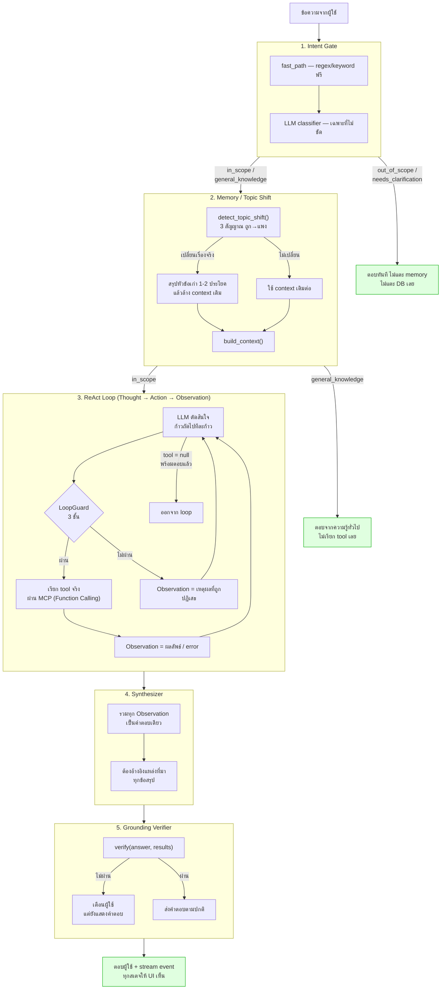

# Day 2 · ภาพรวมสถาปัตยกรรม — หนึ่ง turn เดินทางผ่านอะไรบ้าง

ก่อนเข้าแต่ละโมดูล/แล็บ ให้ดูภาพนี้ก่อนหนึ่งครั้ง — วันที่ 2 ทั้งวันคือการเจาะลึกทีละกล่องในผังนี้ ไม่ใช่หัวข้อที่แยกจากกัน ทุกกล่องเป็นสเตจจริงใน `apps/agent-api/main.py` ฟังก์ชัน `run_turn()` เรียงลำดับตรงตามนี้เป๊ะ — คอมเมนต์ในโค้ดพูดไว้ตรงๆ ว่า **"the order below is the agent's control flow, and it is deliberate: intent before memory, memory before the ReAct loop, and grounding after the answer but before it is considered final"**

---

## ผังรวม

---

## แต่ละกล่อง → โค้ดจริง → เรียนที่ไหน

| # | สเตจ | โค้ดจริง | อยู่ใน Lab/Module ไหน |
|---|---|---|---|
| 1 | **Intent Gate** — คัดคำถามก่อนแตะ DB/GPU | `agent/intent.py` | [Lab 2 · Intent Gate](05-lab2-intent-gate.md) |
| 2 | **Memory / Topic Shift** — จำหัวข้อ, ตัดสินใจเปลี่ยนเรื่อง, สรุปก่อนทิ้ง | `agent/memory.py` | [Lab 3 · Context Memory](06-lab3-context-memory.md) · แนวคิดกว้างๆ ที่ [Module 4 §5-6](01-module4-react-memory.md) |
| 3a | **ReAct Loop** — วน Thought/Action ทีละก้าว + LoopGuard กัน loop | `agent/react.py` | [Module 4 §2-4](01-module4-react-memory.md) |
| 3b | **Function Calling** — โมเดลเลือก tool+argument, โค้ดเราเป็นคนรัน tool จริง | `agent/mcp_client.py` + `apps/mcp-server/tools/*.py` | [Module 5 · Function Calling](02-module5-function-calling.md), ฝึกจริงที่ [โจทย์ที่ 3 · Tool Description Battle](03-challenge3-tool-description-battle.md) |
| 4 | **Synthesizer** — รวมผลเป็นคำตอบพร้อม citation | `agent/synthesizer.py` | กล่าวถึงในเฉลย [Workshop 2](07-workshop2-agent-loop.md) (บั๊ก citation หลอน) |
| 5 | **Grounding Verifier** — เช็คว่าคำตอบมีหลักฐานรองรับก่อนส่งออก | `verifier.py` | [Lab เสริม · Grounding](09-lab-grounding-verification.md) |

**นอกผังหลัก** (ไม่ได้อยู่ใน turn ปกติของระบบนี้ แต่ต้องรู้จักไว้):

| อะไร | โค้ดจริง | เรียนที่ไหน |
|---|---|---|
| Multi-Agent / Orchestrator-Workers — รูปแบบทางเลือกที่ **ไม่ได้ใช้จริง** ในระบบนี้ ใช้แค่เทียบต้นทุน | `agent/orchestrator.py`, `solutions/day2/workshop2_agent.py` | [Module 6 · Multi-Agent](04-module6-multi-agent.md) |
| ทดสอบทั้ง pipeline พร้อมกันด้วยบทสนทนาต่อเนื่อง 10 turn | `data/questions/L4-conversation.yaml` | [โจทย์ที่ 4 · Topic Shift Survival](08-challenge4-topic-shift-survival.md) |
| เขียนทั้ง loop เองตั้งแต่ศูนย์ (ไม่พึ่งโค้ดที่ให้มา) | `solutions/day2/workshop2_agent.py` | [Workshop 2](07-workshop2-agent-loop.md) |

---

## ทำไมลำดับถึงเป็นแบบนี้ ห้ามสลับ

- **Intent ต้องมาก่อน Memory เสมอ** — ถ้าสลับ ประโยคนอกขอบเขต ("แถวนี้มีร้านอาหารแนะนำไหม") อาจไปกระตุ้น `detect_topic_shift` ให้เข้าใจผิดว่าเปลี่ยนเรื่อง ทั้งที่ยังไม่ควรแตะ memory เลยด้วยซ้ำ (ดู Hint ของ [08](08-challenge4-topic-shift-survival.md))
- **Memory ต้องมาก่อน ReAct loop เสมอ** — ReAct loop ต้องเห็น context ที่ถูกต้อง (สรุปหัวข้อเก่า + turn ล่าสุดของหัวข้อปัจจุบัน) ตั้งแต่ก้าวแรกที่มันตัดสินใจ ไม่งั้นจะเสีย tool call ไปกับการถามซ้ำสิ่งที่เคยรู้แล้ว
- **Grounding ต้องมาหลังคำตอบ แต่ก่อนที่ผู้ใช้จะเห็นว่า "จบแล้ว"** — ต้องมีคำตอบเต็มก่อนถึงจะเช็คได้ว่าทุกข้ออ้างมีหลักฐานไหม เช็คระหว่างทางไม่ได้ เพราะคำตอบยังไม่สมบูรณ์

> ⚠️ **จุดที่คนพลาดบ่อยที่สุดเวลามองภาพรวมนี้ครั้งแรก** — เข้าใจผิดว่า Grounding Verifier (สเตจ 5) เป็นส่วนหนึ่งของ ReAct loop (สเตจ 3) เพราะทั้งคู่ "ตรวจสอบ" เหมือนกัน แต่จริงๆ คนละหน้าที่คนละจังหวะ: ReAct loop ตรวจว่า **tool ควรเรียกไหม/เรียกซ้ำไหม** ระหว่างที่ยังหาคำตอบอยู่ ส่วน Grounding Verifier ตรวจว่า **คำตอบที่ได้แล้ว** อ้างอิงหลักฐานถูกไหม หลังจากหาคำตอบเสร็จแล้ว — สองอย่างนี้แก้บั๊กคนละแบบ แก้ที่หนึ่งไม่ทำให้อีกที่หายไป (ตัวอย่างจริง: บั๊ก negation ใน `verifier.py` ไม่เกี่ยวอะไรกับ `LoopGuard` ใน `react.py` เลย ทั้งที่ทั้งคู่อยู่ใน pipeline เดียวกัน)

---

## ต่อไป

→ [Module 4: วิธีคิดของ Agent (ReAct Pattern)](01-module4-react-memory.md) — เจาะสเตจ 3 ในผังข้างบน
