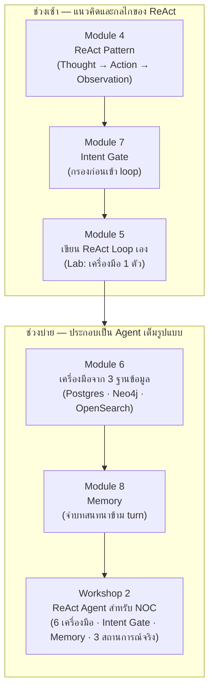

# Day 2 · ภาพรวมกิจกรรมทั้งวัน — เขียน ReAct Agent เองตั้งแต่ต้น

ก่อนเริ่มกิจกรรม ควรพิจารณาภาพรวมนี้หนึ่งครั้ง — วันนี้ไม่มี framework ใดๆ มาช่วย และยังไม่มี MCP ด้วยซ้ำ เครื่องมือทุกตัวเป็นฟังก์ชัน Python ธรรมดาที่เรียกตรง เป้าหมายคือให้เข้าใจกลไกจริงเบื้องหลัง ReAct loop รวมถึงชั้น Intent Gate และ Memory ที่ห่อหุ้มอยู่รอบ loop นั้น ก่อนที่วันที่ 3 จะห่อเครื่องมือชุดเดียวกันนี้เป็น MCP Server

---

## ภาพรวมกิจกรรมทั้งวัน

---

## จุดที่ต้องลงมือเขียนโค้ดจริง

| กิจกรรม | ไฟล์ที่ต้องสร้าง | ลักษณะงาน |
|---|---|---|
| [Module 4 · ReAct Pattern](01-module4-react-pattern.md) | — | บรรยายเชิงแนวคิด ไม่มี Lab — อ่าน trace ตัวอย่างเท่านั้น |
| [Module 7 · Intent Gate](02-module7-intent-gate.md) | — | รันสคริปต์ทดสอบสั้นๆ กับคำถามตัวอย่าง ไม่มีไฟล์แยก (ใช้ `agent/intent.py` ที่มีอยู่แล้ว) |
| [Module 5 · เขียน ReAct Loop เอง](03-module5-react-loop.md) | `my_react_loop.py` | เขียน loop สี่ส่วน (prompt, parse_action, stop sequence, max_steps) เองด้วยเครื่องมือเดียว ห้ามเปิดเฉลยจนกว่าจะเขียนเสร็จ |
| [Module 6 · เครื่องมือจาก 3 ฐานข้อมูล](04-module6-tools-3-databases.md) | — | แบบฝึกหัดออกแบบ docstring ของเครื่องมือตัวที่ 6 (`search_docs_semantic`) ไม่มีไฟล์ให้รันแยก |
| [Module 8 · Memory](05-module8-memory.md) | — | รันสคริปต์ทดสอบกับบทสนทนา 3 turn ไม่มีไฟล์แยก (ใช้ `agent/memory.py` ที่มีอยู่แล้ว) |
| [Workshop 2 · ReAct Agent สำหรับ NOC](06-workshop2-noc-agent.md) | `workshop2_noc_agent.py` | งานหลักของวันนี้ — ประกอบ 6 เครื่องมือ + Intent Gate + Memory เข้ากับ loop จาก Module 5 แล้วทดสอบกับ 3 สถานการณ์จริง |

> **ข้อควรทราบ**: `solutions/day2/workshop2_agent.py` คือเฉลยที่ทำงานสมบูรณ์อยู่แล้ว (โครง ~200 บรรทัด ไม่มี framework ไม่มี MCP) ใช้เป็นตัวเปรียบเทียบหลังลงมือทำ Module 5 และเป็นฐานสำหรับต่อยอดใน Workshop 2 ส่วน `agent/intent.py` และ `agent/memory.py` ที่ Module 7/8 ใช้ เป็นโค้ดจริงจากระบบ production เดียวกัน ไม่ต้องเขียนใหม่ นำมาต่อเข้ากับ loop ได้ตรงๆ

---

## เหตุผลของการจัดลำดับกิจกรรม

- **Module 4 ต้องมาก่อน Module 7** — ต้องเข้าใจว่า loop ทำงานอย่างไรก่อน จึงจะเห็นภาพว่า Intent Gate เป็นด่านที่อยู่ **นอก** loop นั้น ไม่ใช่ส่วนหนึ่งของมัน
- **Module 7 ต้องมาก่อน Module 5** — ต้องรู้ก่อนว่าคำถามแบบไหนไม่ควรเข้า loop เลยด้วยซ้ำ ก่อนจะลงมือเขียน loop เอง จะได้ไม่ลืมใส่ด่านนี้ไว้ตั้งแต่ต้น
- **Module 5 ต้องมาก่อน Module 6** — Lab ของ Module 5 ใช้เครื่องมือเดียวโดยตั้งใจ เพื่อให้เห็นกลไกของ loop ชัดเจนก่อน แล้ว Module 6 จึงค่อยขยายไปสู่การห่อ query จริงจากทั้ง 3 ฐานข้อมูลเป็นชุดเครื่องมือที่ครบ
- **Module 6 ต้องมาก่อน Module 8** — ต้องมีชุดเครื่องมือครบก่อน จึงจะเห็นได้ชัดว่าเครื่องมือที่ถูกเรียกในแต่ละ turn ต้องอ้างอิง context จากบทสนทนาก่อนหน้าอย่างไร
- **Workshop 2 ต้องอยู่หลังทุกโมดูล** — เป็นการประกอบทุกส่วนที่เพิ่งเขียน (loop + เครื่องมือ 6 ตัว + Intent Gate + Memory) เข้าด้วยกัน ทำก่อนหน้านั้นไม่ได้เพราะยังไม่มีส่วนประกอบครบ
- **เครื่องมือทั้งหมดยังเป็นฟังก์ชัน Python ตรงๆ โดยตั้งใจ** — วันที่ 3 จะนำเครื่องมือชุดเดียวกันนี้ไปห่อเป็น MCP Server โดยไม่แก้ไข ReAct loop เลยแม้แต่บรรทัดเดียว นี่คือประเด็นที่ต้องเห็นด้วยตนเอง: MCP เปลี่ยนแค่ชั้นการเรียก ไม่เปลี่ยนตัว loop

---

## ต่อไป

→ [Module 4: ReAct Pattern](01-module4-react-pattern.md)
