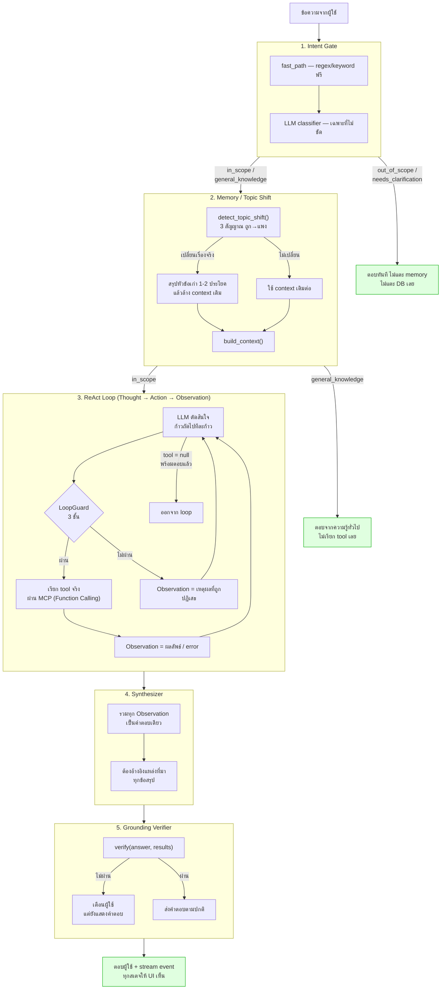

# Day 2 · ภาพรวมสถาปัตยกรรม — หนึ่ง turn เดินทางผ่านอะไรบ้าง

ก่อนเริ่มกิจกรรม ควรพิจารณาภาพรวมนี้หนึ่งครั้ง — กิจกรรมตลอดทั้งวันเป็นการเจาะลึกทีละสเตจในผังนี้ตามลำดับ มิใช่หัวข้อที่แยกจากกัน ทุกสเตจสอดคล้องกับลำดับการทำงานจริงในฟังก์ชัน `run_turn()` ของ `apps/agent-api/main.py` อย่างเคร่งครัด ดังที่ระบุไว้ในคอมเมนต์ของโค้ดต้นฉบับ:

> *"the order below is the agent's control flow, and it is deliberate: intent before memory, memory before the ReAct loop, and grounding after the answer but before it is considered final"*

---

## ผังภาพรวมสถาปัตยกรรม

---

## ตำแหน่งของแต่ละสเตจในโค้ดจริงและเอกสารที่เกี่ยวข้อง

| # | สเตจ | โค้ดจริง | อยู่ใน Lab/Module ไหน |
|---|---|---|---|
| 1 | **Intent Gate** — คัดกรองคำถามก่อนแตะฐานข้อมูลหรือ GPU | `agent/intent.py` | [Lab 2 · Intent Gate](05-lab2-intent-gate.md) |
| 2 | **Memory / Topic Shift** — บันทึกหัวข้อ ตัดสินใจเปลี่ยนเรื่อง สรุปก่อนล้าง context | `agent/memory.py` | [Lab 3 · Context Memory](06-lab3-context-memory.md) · แนวคิดกว้างๆ ที่ [Module 4 หัวข้อ 5-6](01-module4-react-memory.md) |
| 3a | **ReAct Loop** — วน Thought/Action ทีละก้าว พร้อม LoopGuard ป้องกันการวนซ้ำ | `agent/react.py` | [Module 4 หัวข้อ 2-4](01-module4-react-memory.md) |
| 3b | **Function Calling** — โมเดลเลือก tool และ argument ส่วนโค้ดของเราเป็นผู้เรียก tool จริง | `agent/mcp_client.py` + `apps/mcp-server/tools/*.py` | [Module 5 · Function Calling](02-module5-function-calling.md) ฝึกปฏิบัติจริงที่ [โจทย์ที่ 3 · Tool Description Battle](03-challenge3-tool-description-battle.md) |
| 4 | **Synthesizer** — รวมผลลัพธ์เป็นคำตอบเดียวพร้อม citation | `agent/synthesizer.py` | กล่าวถึงในเฉลย [Workshop 2](07-workshop2-agent-loop.md) (บั๊ก citation หลอน) |
| 5 | **Grounding Verifier** — ตรวจสอบว่าคำตอบมีหลักฐานรองรับก่อนส่งออก | `verifier.py` | [Lab เสริม · Grounding](09-lab-grounding-verification.md) |

**เนื้อหาเพิ่มเติมนอกผังหลัก** (ไม่ได้อยู่ใน turn ปกติของระบบนี้ แต่ควรทราบ):

| หัวข้อ | โค้ดจริง | เรียนที่ไหน |
|---|---|---|
| Multi-Agent / Orchestrator-Workers — รูปแบบทางเลือกที่ **ไม่ได้ใช้จริง** ในระบบนี้ ใช้เพื่อเปรียบเทียบต้นทุนเท่านั้น | `agent/orchestrator.py`, `solutions/day2/workshop2_agent.py` | [Module 6 · Multi-Agent](04-module6-multi-agent.md) |
| ทดสอบทั้ง pipeline พร้อมกันด้วยบทสนทนาต่อเนื่อง 10 turn | `data/questions/L4-conversation.yaml` | [โจทย์ที่ 4 · Topic Shift Survival](08-challenge4-topic-shift-survival.md) |
| เขียน loop ทั้งหมดขึ้นเองตั้งแต่ต้น โดยไม่พึ่งโค้ดที่ให้มา | `solutions/day2/workshop2_agent.py` | [Workshop 2](07-workshop2-agent-loop.md) |

---

## เหตุผลของการจัดลำดับสเตจ

- **Intent ต้องมาก่อน Memory เสมอ** — หากสลับลำดับ คำถามนอกขอบเขต (เช่น "แถวนี้มีร้านอาหารแนะนำไหม") อาจทำให้ `detect_topic_shift` เข้าใจผิดว่าเป็นการเปลี่ยนเรื่อง ทั้งที่ยังไม่ควรแตะ memory เลย (ดู Hint ของ [โจทย์ที่ 4](08-challenge4-topic-shift-survival.md))
- **Memory ต้องมาก่อน ReAct Loop เสมอ** — ReAct loop ต้องได้รับ context ที่ถูกต้อง (สรุปหัวข้อเดิมและ turn ล่าสุดของหัวข้อปัจจุบัน) ตั้งแต่ก้าวแรกที่ตัดสินใจ มิเช่นนั้นจะเสีย tool call ไปกับการสอบถามซ้ำในสิ่งที่ทราบอยู่แล้ว
- **Grounding ต้องอยู่หลังคำตอบ แต่ก่อนที่ระบบจะถือว่าคำตอบนั้นสมบูรณ์** — ต้องมีคำตอบฉบับเต็มก่อนจึงจะตรวจสอบได้ว่าทุกข้ออ้างมีหลักฐานรองรับหรือไม่ ไม่สามารถตรวจสอบระหว่างทางได้เนื่องจากคำตอบยังไม่สมบูรณ์

> **ข้อควรทราบ** — ข้อผิดพลาดที่พบบ่อยที่สุดเมื่อพิจารณาภาพรวมนี้ครั้งแรกคือการเข้าใจว่า Grounding Verifier (สเตจ 5) เป็นส่วนหนึ่งของ ReAct Loop (สเตจ 3) เนื่องจากทั้งคู่ทำหน้าที่ "ตรวจสอบ" เหมือนกัน แต่แท้จริงแล้วเป็นคนละหน้าที่และคนละจังหวะเวลา: ReAct loop ตรวจสอบว่า **ควรเรียก tool หรือไม่ / ซ้ำหรือไม่** ระหว่างที่ยังหาคำตอบอยู่ ส่วน Grounding Verifier ตรวจสอบว่า **คำตอบที่ได้แล้ว** อ้างอิงหลักฐานถูกต้องหรือไม่ หลังจากหาคำตอบเสร็จสิ้น ทั้งสองแก้ปัญหาคนละประเภท การแก้ไขจุดหนึ่งจึงไม่ทำให้อีกจุดหายไป (ตัวอย่างจริง: บั๊ก negation ใน `verifier.py` ไม่เกี่ยวข้องกับ `LoopGuard` ใน `react.py` เลย แม้ทั้งคู่จะอยู่ใน pipeline เดียวกัน)

---

## ต่อไป

→ [Module 4: วิธีคิดของ Agent (ReAct Pattern)](01-module4-react-memory.md) — เจาะสเตจ 3 ในผังข้างต้น
