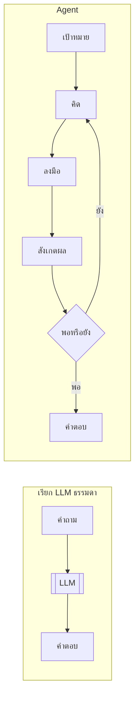
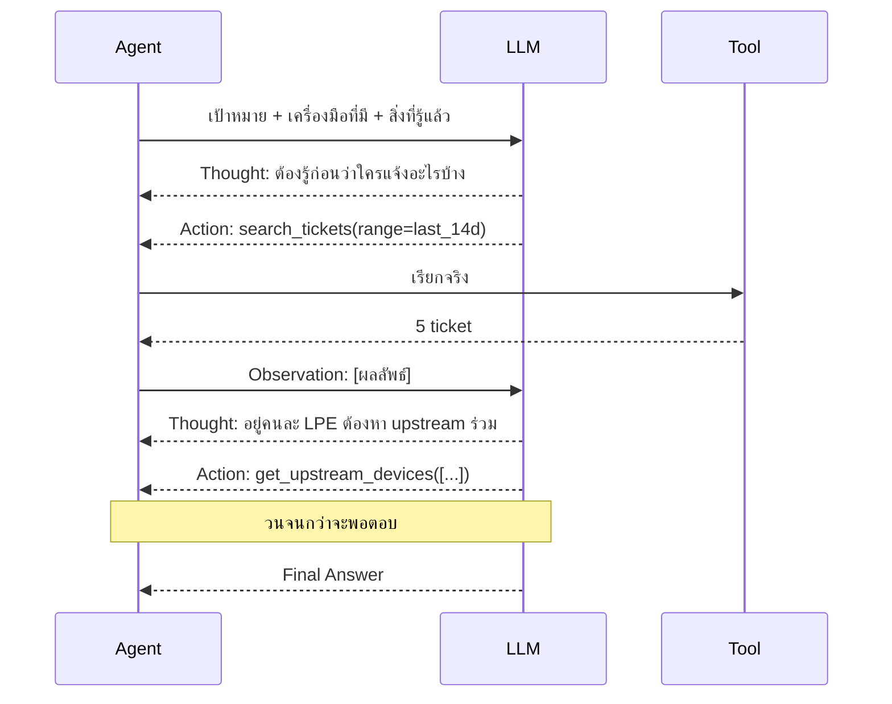
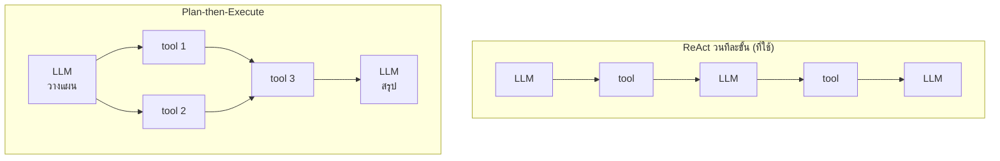
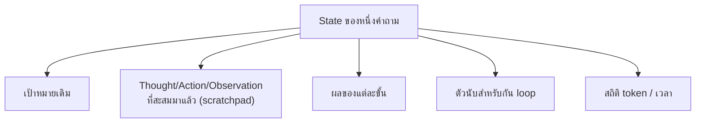
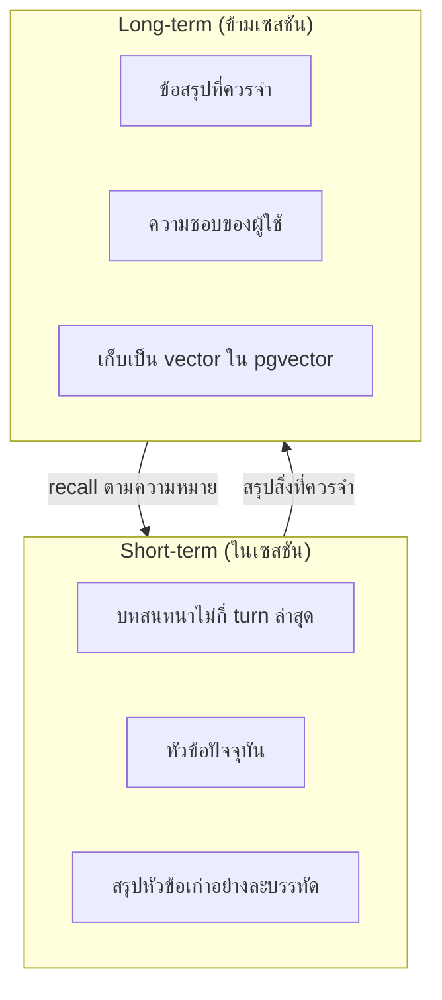
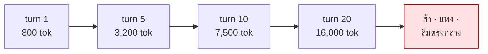
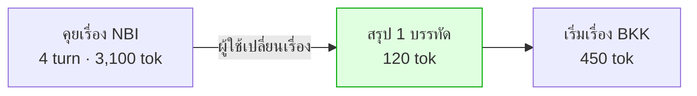

# Module 4 · วิธีคิดของ Agent (ReAct Pattern)

**09:00 – 10:30** · เป้าหมาย: เข้าใจวงจรการคิดของ agent และการจัดการความจำ

---

## 1. Agent ต่างจากการเรียก LLM ธรรมดาอย่างไร

Agent = LLM + **วงจรที่ทำซ้ำได้** + **เครื่องมือ** + **สถานะ**

---

## 2. ReAct — Reasoning and Acting

**หัวใจ**: โมเดลไม่ได้ตอบทันที แต่สลับระหว่าง *คิด* กับ *ทำ* โดยผลของการทำกลับเข้าไปเป็น input ของการคิดรอบถัดไป

---

## 3. ReAct แบบวนทีละขั้น vs วางแผนก่อนแล้วค่อยทำ

โปรเจกต์นี้ใช้แบบ **ReAct วนทีละขั้น** ตรงตามที่อธิบายในหัวข้อ 2 — ไม่มี "แผน" ก้อนเดียวที่สร้างไว้ล่วงหน้าอีกต่อไป ทุกครั้งที่โมเดลจะเรียกเครื่องมือถัดไป โมเดลจะเห็นเฉพาะคำถามกับผลลัพธ์ที่สะสมมาแล้วในบทสนทนา แล้วตัดสินใจ **ทีละก้าวเดียว**

| | **ReAct วนทีละขั้น (ที่ใช้)** | Plan-then-Execute |
|---|---|---|
| เรียก LLM | ทุกขั้นตอน (N tool call ต้องใช้ N+1 ครั้ง) | คงที่ 2 ครั้ง (วางแผน + สรุป) |
| ปรับตัวระหว่างทาง | **ดีมาก** — เห็นผลจริงก่อนตัดสินใจก้าวถัดไปเสมอ | ต้อง re-plan ถ้าของจริงไม่ตรงที่คาด |
| ทำขนานได้ | ไม่ได้ — ตัดสินใจทีละก้าว ไม่รู้ dependency ล่วงหน้า | ได้ เพราะรู้ dependency ล่วงหน้า |
| ตรวจสอบก่อนรัน | ไม่ได้ — รู้ว่า tool ผิดก็ต่อเมื่อเรียกไปแล้ว | ได้ — validate plan ก่อนแตะฐานข้อมูล |
| ผู้ใช้เห็นว่าจะทำอะไร | เห็นทีละ Thought ขณะที่โมเดลกำลังคิด (event `thought`) | เห็นแผนทั้งหมดตั้งแต่ต้น (event `plan_created`) |

> เหตุผลที่เปลี่ยนมาใช้ ReAct: คำถามจริงจำนวนมากคาดเดารูปแบบ query ไม่ได้ล่วงหน้า 100% — ผลลัพธ์ที่ไม่คาดคิด (ticket ว่างเปล่า, device_id ที่ไม่มีจริง) ควรเปลี่ยนสิ่งที่ทำต่อได้ทันที ไม่ใช่ทำตามแผนเดิมต่อจนจบแล้วค่อยพบว่าผิดทาง
>
> **ราคาที่จ่าย** (ดูรายละเอียดที่ [reference/prompt-examples.md](../reference/prompt-examples.md)): ต้นทุน/เวลาต่อคำถามแปรผันตามจำนวนขั้นตอนแทนที่จะคงที่ และเสียการรันคู่ขนานของขั้นที่ไม่ขึ้นต่อกัน — ทั้งสองอย่างนี้คือ trade-off ที่ยอมรับ ไม่ใช่ผลข้างเคียงที่ไม่ตั้งใจ

---

## 4. State Management

**ทำไมต้องแยกเป็น 5 ก้อน ไม่ใช่สตริงยาวก้อนเดียว**: หากรวมทุกอย่างไว้เป็น context เดียว จะไม่สามารถแยกได้ว่าอะไรคือ "เป้าหมายที่ต้องยึดไว้ตลอด" กับ "สิ่งที่เพิ่งทราบล่าสุดและอาจไม่ถูกต้องก็ได้" — เมื่อแยกเป็นก้อนตามหน้าที่แล้ว โค้ดจึงสามารถระบุได้ว่าก้อนใดต้องคงอยู่ตลอด (เป้าหมาย) ก้อนใดตัดทิ้งได้เมื่อเปลี่ยนเรื่อง (scratchpad) และก้อนใดต้องตรวจสอบก่อนอนุญาตให้ดำเนินการต่อ (ตัวนับป้องกันการวนซ้ำ)

Agent ต้องเก็บอะไรระหว่างทำงาน

ในโค้ด: `ReactDecision`, `StepResult`, `LoopGuard`, `LLMStats` ที่ `apps/agent-api/agent/react.py`

> **ข้อสังเกต**: LoopGuard มีความสำคัญมากกว่าตอนใช้ plan-then-execute เสียอีก เนื่องจากไม่มีขั้นตอน validate ล่วงหน้าช่วยกรองความผิดพลาดออกไปก่อนแล้ว จึงเป็นแนวป้องกันด่านเดียวที่เหลืออยู่

**หลักการ**: state ที่ตรวจสอบได้ = ระบบที่ debug ได้ หาก state อยู่เพียงในกระบวนคิดของโมเดล เราจะไม่มีทางทราบได้เลยว่าโมเดลกำลังคิดอะไรอยู่

---

## 5. Memory — สั้นและยาว

**ทำไมต้องแยก short-term กับ long-term**: ทั้งสองส่วนตอบคำถามคนละลักษณะ — short-term ตอบคำถามว่า "เพิ่งคุยเรื่องอะไรกันอยู่" (ต้องเรียงตามเวลา มิเช่นนั้นบทสนทนาจะสลับลำดับ) ส่วน long-term ตอบคำถามว่า "เคยเจอเรื่องแบบนี้มาก่อนหรือไม่" (ต้องค้นด้วยความหมาย ไม่ใช่ไล่ตามเวลา เนื่องจากเซสชันเก่าที่เกี่ยวข้องอาจเกิดขึ้นเมื่อใดก็ได้) การใช้กลไกเดียวกันทำหน้าที่ทั้งสองแบบจึงไม่มีประสิทธิภาพเท่ากับการแยกออกจากกัน

| | Short-term | Long-term |
|---|---|---|
| อยู่ที่ไหน | RAM ของกระบวนการ | pgvector |
| อายุ | จบเซสชันก็หาย | ข้ามเซสชัน |
| ค้นอย่างไร | เรียงตามเวลา | semantic search |
| โค้ด | `apps/agent-api/agent/memory.py` | `apps/agent-api/agent/memory_longterm.py` |

> Long-term memory ใช้ **column เดียวกับที่สร้างเองใน Lab 1** — งานวันแรกกลายเป็นฐานของความจำวันที่สอง

---

## 6. ปัญหาที่ต้องแก้ให้ได้ — Context โตไม่หยุด

**วิธีแก้ที่ผิด**: เพิ่ม context window
**วิธีแก้ที่ถูก**: ตรวจสอบว่ามีการเปลี่ยนเรื่องหรือไม่ หากเปลี่ยน ให้สรุปเนื้อหาเดิมเหลือเพียงบรรทัดเดียวแล้วตัดรายละเอียดทิ้ง

### สัญญาณที่ใช้ตรวจ (ถูกไปแพง)

| ลำดับ | สัญญาณ | ต้นทุน |
|---|---|---|
| 1 | ผู้ใช้พูดเองว่า "เปลี่ยนเรื่อง" | ฟรี |
| 2 | entity ที่พูดถึงเป็นคนละพื้นที่ | ฟรี |
| 3 | cosine similarity กับหัวข้อเดิมต่ำ | 1 embedding call |

> ⚠️ **จุดที่คนพลาดบ่อยที่สุดของกลไกนี้** — **คำถามนอกขอบเขตไม่ใช่การเปลี่ยนเรื่อง** ผู้ใช้ที่ถามเรื่องร้านอาหารระหว่างการสืบสวนปัญหา ไม่ได้เปลี่ยนหัวข้องานแต่อย่างใด การล้าง context ในจุดนั้นจึงส่งผลเสียต่อผู้ใช้โดยตรง (ต้องสามารถตอบคำถามนอกเรื่องได้โดยไม่แตะ context เดิมเลย) — ดู turn ที่ 5 ใน `data/questions/L4-conversation.yaml` และ [Lab 3](06-lab3-context-memory.md) ที่วัดผลจุดนี้โดยตรง

---

## 7. ต่อไป

→ [Module 5: Function Calling & Tool Definition](02-module5-function-calling.md)
