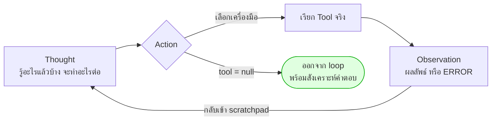

# Module 4 · ReAct Pattern

**09:00 – 10:00** (60 นาที) · เป้าหมาย: เข้าใจวงจร Thought → Action → Observation ของ ReAct และเหตุผลที่ระบบวินิจฉัยเครือข่ายต้องใช้วิธีนี้แทนการตอบทีเดียวจบ (one-shot)

โมดูลนี้เป็นเนื้อหาเชิงแนวคิดล้วน **ไม่มีการลงมือเขียนโค้ด** — การเขียน ReAct loop เองเริ่มที่ [Module 5](03-module5-react-loop.md) หลังจาก [Module 7 · Intent Gate](02-module7-intent-gate.md)

---

## 1. ทำไมการตอบทีเดียวจบถึงใช้ไม่ได้กับงานวินิจฉัยเครือข่าย

ลองพิจารณาคำถามจริงที่ Agent ของ NOC ต้องตอบ: *"ลูกค้าหลายรายแจ้งว่าอินเทอร์เน็ตหลุดเป็นช่วงๆ สาเหตุคืออะไร"*

แนวทาง **one-shot** (ยัด context ทั้งหมดให้โมเดลในครั้งเดียวแล้วขอคำตอบ) และแนวทาง **plan-then-execute** (ให้โมเดลวางแผนทุกขั้นตอนล่วงหน้าก่อนเริ่มทำ) มีจุดอ่อนร่วมกันคือ **ต้องรู้ล่วงหน้าว่าจะเจออะไร** ซึ่งเป็นไปไม่ได้ในทางปฏิบัติ:

- ไม่รู้ล่วงหน้าว่าจะมี ticket กี่ใบ จนกว่าจะ query จริง
- ไม่รู้ล่วงหน้าว่า ticket เหล่านั้นอยู่บนอุปกรณ์ตัวไหนบ้าง จนกว่าจะเห็นผลลัพธ์
- ไม่รู้ล่วงหน้าว่าอุปกรณ์เหล่านั้นมี upstream ร่วมกันหรือไม่ จนกว่าจะ query กราฟ topology
- แผนที่วางไว้ล่วงหน้าจะ "ผิด" ทันทีที่ผลลัพธ์จริงต่างจากที่คาดไว้ — เช่น ticket ว่างเปล่า หรือพบอุปกรณ์ที่ไม่มีใครคาดถึง

`apps/agent-api/agent/react.py:1-9` อธิบายหลักการนี้ตรงไปตรงมา: ไม่มีการสร้าง plan object ล่วงหน้า ในทุกรอบโมเดลเห็นเป้าหมายและทุก observation ที่มีอยู่ ณ ขณะนั้น แล้วตัดสินใจ "ก้าวถัดไปหนึ่งก้าว" เท่านั้น สิ่งที่ต้องแลกคือความสามารถตรวจสอบแผนล่วงหน้า (inspectability) ที่ plan-then-execute ให้ได้ แต่สิ่งที่ได้กลับมาคือความสามารถปรับตัวกลางทาง

---

## 2. วงจร ReAct: Thought → Action → Observation



องค์ประกอบทั้งสามในโค้ดจริงของ `solutions/day2/workshop2_agent.py`:

| ส่วน | คืออะไร | อยู่ตรงไหนในโค้ด |
|---|---|---|
| **Thought** | เหตุผลสั้นๆ หนึ่งประโยคว่ารู้อะไรแล้วและจะทำอะไรต่อ | field `thought` ของ `ReactDecision` — `solutions/day2/workshop2_agent.py:224` |
| **Action** | ชื่อเครื่องมือที่จะเรียก + argument หรือ `null` ถ้าพอตอบแล้ว | field `tool`/`arguments` ของ `ReactDecision` — `solutions/day2/workshop2_agent.py:225-228`, เรียกจริงใน `call_one_tool()` — `solutions/day2/workshop2_agent.py:351-362` |
| **Observation** | ผลลัพธ์ของ tool (สำเร็จ) หรือข้อความ error (ล้มเหลว) ถูกใส่กลับเข้าไปใน scratchpad เป็น turn ถัดไป | `append_turn()` — `solutions/day2/workshop2_agent.py:365-381` |

จุดที่มักเข้าใจผิด: **ไม่มีขั้นตอน "ซ่อมแซม argument" แยกต่างหาก** เมื่อ tool call ล้มเหลว ข้อความ error จะกลายเป็น observation ของรอบถัดไปโดยตรง (`ERROR: ...` ตามรูปแบบใน `append_turn()` บรรทัด 379-380) แล้วโมเดลจะแก้ไข argument เองในรอบคิดถัดไป เหมือนกับการปรับตัวจาก observation ประเภทอื่นทุกประการ — ตามที่ระบุไว้ใน docstring ของไฟล์เดียวกัน (`solutions/day2/workshop2_agent.py:15-17`)

วงจรนี้ถูกจำกัดด้วยเพดานสามชั้นเสมอ (รายละเอียดอยู่ใน Module 5): จำนวนขั้นตอนรวม (`MAX_STEPS`), การเรียกซ้ำด้วย argument เดิม, และจำนวนครั้งสูงสุดต่อหนึ่งเครื่องมือ (`MAX_SAME_TOOL`) — ดู `solutions/day2/workshop2_agent.py:56-57` และคลาส `LoopGuard` ที่ `solutions/day2/workshop2_agent.py:316-344`

---

## 3. เปรียบเทียบกับการตอบทีเดียวจบ (One-Shot / Plan-then-Execute)

| มิติ | One-Shot | Plan-then-Execute | ReAct |
|---|---|---|---|
| ปรับตัวเมื่อผลลัพธ์ไม่ตรงคาด | ทำไม่ได้ — คำตอบเดียวจบ | ทำไม่ได้กลางทาง ต้องวางแผนใหม่ทั้งหมด | ปรับได้ทุกรอบ เพราะตัดสินใจหลังเห็น observation แล้ว |
| ตรวจสอบก่อนรันจริง (inspectability) | ไม่มีอะไรให้ตรวจ | ตรวจ plan ทั้งหมดได้ก่อนเริ่ม | ตรวจได้ทีละก้าวเท่านั้น ไม่เห็นล่วงหน้า |
| ความเสี่ยง loop ไม่จบ | ไม่มี (ไม่มี loop) | ต่ำ (จำนวนขั้นตอนถูกกำหนดไว้ในแผน) | มีจริง — ต้องมี `LoopGuard` ป้องกัน |
| เหมาะกับคำถามที่ต้องเชื่อมหลายแหล่งข้อมูล | ไม่เหมาะ | พอใช้ได้ถ้ารู้ลำดับล่วงหน้า | เหมาะที่สุด เพราะไม่รู้ล่วงหน้าว่าต้องข้ามไปแหล่งไหนต่อ |
| ต้นทุน token ต่อคำถาม | ต่ำสุด | ปานกลาง | สูงสุด — เรียก LLM ทุกรอบของ loop |

**ข้อสรุป**: ไม่มีรูปแบบใดชนะทุกกรณี ระบบของ workshop นี้เลือก ReAct เพราะโจทย์วินิจฉัยเครือข่าย (เช่นเหตุการณ์ interface flapping ใน `data/scenarios.md`) ต้องอาศัยการค้นพบสาเหตุร่วมที่ไม่ปรากฏใน ticket ตั้งแต่ต้น — รู้ได้ก็ต่อเมื่อเห็นผลลัพธ์จริงจาก Neo4j เสียก่อน

---

## 4. อ่าน ReAct Trace ตัวอย่าง

พิจารณาเป้าหมายเดียวกับที่ใช้เป็นตัวอย่างในไฟล์เฉลย (`solutions/day2/workshop2_agent.py:472-473`, ตรงกับตัวอย่างการเรียกใช้ใน docstring บรรทัด 4-5):

```
python solutions/day2/workshop2_agent.py "หา ticket ที่ยังไม่ปิดของสัปดาห์นี้ ทำรายงานสรุป แล้วส่งเมลให้ทีม NOC"
```

Trace ด้านล่างเป็นตัวอย่างประกอบ (ค่าตัวเลขสมมติ) ที่แสดงรูปแบบผลลัพธ์จริงตามฟังก์ชัน `run()` (`solutions/day2/workshop2_agent.py:424-469`):

```
  [ReAct loop]
    1. คิด: ต้องหา ticket ที่ยังไม่ปิดก่อนจึงจะสรุปได้
       เรียก search_tickets({"status": "open", "days": 7})
        -> สำเร็จ 42 ms
    2. คิด: มี 3 ticket ที่ยังไม่ปิด ผู้ใช้ขอให้ "ส่งเมล" ต้องทำรายงานไฟล์ก่อนแนบ
       เรียก export_report({"title": "Ticket ค้างสัปดาห์นี้", "rows": [...]})
        -> สำเร็จ 8 ms
    3. คิด: มีไฟล์รายงานพร้อมแนบแล้ว ส่งเมลให้ทีม NOC ได้เลย
       เรียก send_notification({"subject": "สรุป ticket ค้าง", "body": "...",
                                "attachment": "data/reports/report-....md"})
        -> สำเร็จ 210 ms
    4. คิด: มีหลักฐานครบตามที่ผู้ใช้ขอแล้ว พร้อมสรุปคำตอบ

  [สรุป]
  พบ ticket ที่ยังไม่ปิด 3 ใบ ... (PostgreSQL: TK-25-000xx) ...
  ทำรายงานและส่งเมลให้ทีม NOC เรียบร้อย (แนบไฟล์ data/reports/report-....md)

  3/3 เครื่องมือสำเร็จ · ใช้เวลารวม 1.9 วินาที
  ตรวจอีเมลที่ http://localhost:8025
```

**จุดที่ควรสังเกตในการอ่าน trace นี้**

1. รอบที่ 4 คือจุดที่โมเดลตั้ง `tool = null` — ออกจาก loop ทันทีตามเงื่อนไขที่ `solutions/day2/workshop2_agent.py:437-438`
2. ลำดับ `export_report` ก่อน `send_notification` **ไม่ใช่เรื่องบังเอิญ** แต่เป็นกติกาที่บังคับไว้ในพร้อมต์ (`REACT_PROMPT` ข้อ 3 — `solutions/day2/workshop2_agent.py:268-269`): "ถ้าผู้ใช้ขอให้ส่งผลให้ทีม ต้องเรียก `export_report` ก่อน `send_notification` เสมอ" — แสดงว่าลำดับการกระทำใน ReAct ไม่ได้เกิดขึ้นเองอัตโนมัติ แต่ต้องระบุไว้ในพร้อมต์อย่างชัดเจน
3. แต่ละ Observation (ผลลัพธ์ของแต่ละขั้น) กลายเป็นข้อมูลตั้งต้นของ **การสังเคราะห์คำตอบ** (`synthesize()` — `solutions/day2/workshop2_agent.py:405-417`) ซึ่งบังคับให้ต้องอ้างอิงแหล่งที่มาจริงของทุกข้อสรุป (`SYNTH_PROMPT` — `solutions/day2/workshop2_agent.py:388-402`) — ป้องกันไม่ให้โมเดลเดาหมายเลข ticket หรืออุปกรณ์ที่ไม่มีในหลักฐาน

---

## ต่อไป

→ [Module 7: Intent Gate](02-module7-intent-gate.md) — ก่อนลงมือเขียน loop เต็มรูปแบบ ต้องรู้ก่อนว่าคำถามแบบไหนไม่ควรเข้า loop เลยด้วยซ้ำ
