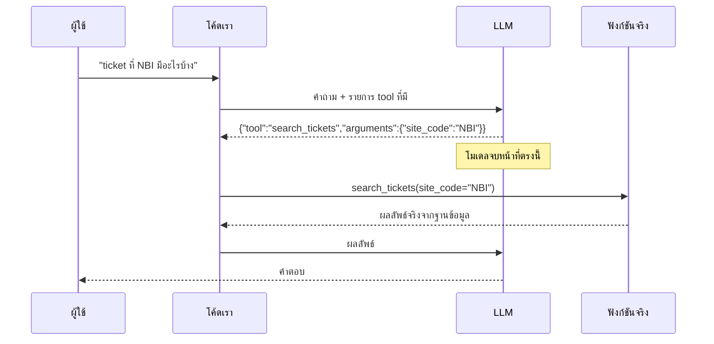
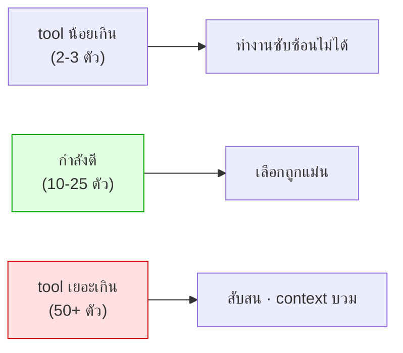

# Module 5 · Function Calling & Tool Definition

**10:45 – 11:35** · เป้าหมาย: เข้าใจกลไกจริงของ function calling และเขียน tool description ที่โมเดลใช้ถูก

---

## 1. ความเข้าใจผิดที่ต้องแก้ก่อน

> **LLM ไม่ได้รันโค้ด**

สิ่งที่โมเดลทำคือ *เลือกชื่อฟังก์ชันและกรอก argument* เป็นข้อความ ที่เหลือเป็นหน้าที่โค้ดเราทั้งหมด



**ผลที่ตามมาซึ่งสำคัญมาก**: ทุกอย่างที่เกิดขึ้นจริงผ่านโค้ดเราเสมอ ดังนั้น**เราคือคนควบคุมความปลอดภัย ไม่ใช่โมเดล** (โยงไป Module 8)

---

## 2. ทำไมเราไม่ใช้ native tool API (แม้ Qwen จะรองรับ)

`qwen/qwen3-30b-a3b` มี native tool-calling API ในตัว แต่ workshop นี้เลือกไม่ใช้ เพราะ tool call จริง ๆ ก็คือ JSON เหมือนกันทั้งคู่

| แบบ | ที่มาของ JSON |
|---|---|
| Native tool API | โมเดลคืน `tool_calls` มาให้ |
| **Structured output (ที่ใช้)** | บังคับ schema แล้ว parse เอง |

ทั้งสองแบบ **โค้ดเราเป็นคนเรียกฟังก์ชันเหมือนกัน** ต่างแค่รูปแบบที่ JSON เดินทางมา — ข้อดีของแบบที่ใช้คือสลับ LLM provider ได้โดยไม่ต้องเขียน agent loop ใหม่

---

## 3. Tool Description คือ prompt ที่สำคัญที่สุดในระบบ

โมเดลเลือก tool จาก description อย่างเดียว ไม่ได้เห็นโค้ดข้างใน

### กฎข้อที่ 1 — บอกว่า "เมื่อไหร่ห้ามใช้"

โมเดลเลือกผิดเพราะ **ขาดข้อห้าม** มากกว่าเพราะคำอธิบายไม่ชัด

❌ **แย่**
```
search_tickets: ค้นหา ticket ในระบบ
search_logs: ค้นหา log ในระบบ
```
คำถาม *"อุปกรณ์นี้มีปัญหาอะไร"* → เดาสุ่ม เพราะทั้งคู่ฟังดูใช้ได้

✅ **ดี**
```
search_tickets: ใช้เพื่อรู้ว่ามีอะไรถูก "แจ้ง" เข้ามาบ้าง
  อย่าใช้เพื่อดูว่าอุปกรณ์กำลังทำอะไรอยู่ เพราะปัญหาจำนวนมากไม่มีใครแจ้งเลย
  ถ้าต้องการพฤติกรรมจริงของอุปกรณ์ ให้ใช้ search_logs
```

### กฎข้อที่ 2 — บอกว่า "คืนอะไร" ไม่ใช่ "ทำงานอย่างไร"

โมเดลไม่ต้องรู้ว่าใช้ HNSW หรือ aggregation แบบไหน แต่ต้องรู้ว่าจะได้อะไรกลับมาเพื่อวางแผนขั้นถัดไป

### กฎข้อที่ 3 — ฝังความรู้เชิงปฏิบัติลงไปใน description

**ปัญหาที่ต้องกัน**: ข้อมูลจำลองมี **scenario S4** — อุปกรณ์ `APE-BKK-05` มี log ระดับ critical จำนวนมาก (`SYS-RELOAD`) แต่นั่น**คืองานบำรุงรักษาที่แจ้งไว้ล่วงหน้า** ไม่ใช่เหตุขัดข้องจริง ถ้าโมเดลเห็น log แรงๆ แล้วสรุปทันทีว่าเป็นเหตุเสีย นี่คือ **hallucination ที่อันตรายที่สุด** เพราะมีหลักฐานจริงรองรับ แต่ตีความผิด (คนละแบบกับการมั่วข้อมูลขึ้นมาลอยๆ)

โมเดลไม่มีทางรู้กติกาข้อนี้เอง — ต้องบอกไว้ตรงๆ ใน docstring ของ `search_logs` เอง ([logs.py:58-61](../../apps/mcp-server/tools/logs.py:58)):

> *"a burst of severe log entries is NOT automatically an incident. Planned maintenance produces logs that look identical to a major outage. Before describing anything as a fault, check `search_tickets` with category "maintenance" for the same window."*

**ผลต่างที่วัดได้จริง**:

| | ไม่มีประโยคนี้ | มีประโยคนี้ |
|---|---|---|
| โมเดลเห็น log critical ที่ `APE-BKK-05` | สรุปทันทีว่า "เหตุขัดข้องร้ายแรง" | รู้ว่าต้องเช็ค `search_tickets(category="maintenance")` ก่อน |
| ผลลัพธ์ | รายงานผิด ทั้งที่หลักฐานทุกอย่างดู "ถูกต้อง" | เจอ ticket แจ้งอัปเกรด firmware ที่ครอบคลุมช่วงเวลาเดียวกัน → สรุปถูกว่าเป็นแผนงาน ไม่ใช่เหตุเสีย |

**ประโยคเดียวใน description แก้ปัญหานี้ได้ ถูกกว่าการเพิ่ม tool ใหม่หรือเขียน logic ตรวจสอบเพิ่มในโค้ดมาก** — เพราะโมเดลเป็นคนตัดสินใจเรียก `search_tickets` เพิ่มเองโดยไม่ต้อง hardcode ทุก pattern ไว้ล่วงหน้า

### กฎข้อที่ 4 — งานที่เขียนเป็นโค้ดได้แน่นอน อย่าให้โมเดลทำ

**ปัญหาที่ต้องกัน**: คำถามแบบ scenario S1 ต้องหาว่าอุปกรณ์ 3 ตัว (`LPE-NBI-11`, `-12`, `-13`) ทั้งหมด **uplink ไปที่ตัวเดียวกันหรือไม่** — นี่คือการหา "จุดร่วม" (set intersection) ของ path หลายเส้น ซึ่งเป็นงาน**คำนวณตรงไปตรงมาสำหรับโค้ด แต่พลาดง่ายมากสำหรับ LLM** (โมเดลต้อง "อ่าน" รายการ path หลายชุดแล้วเทียบเองในหัว ซึ่งเป็นจุดที่โมเดลทำเลขผิดบ่อยที่สุด)

**ถ้าปล่อยให้โมเดลหาเอง** — `get_upstream_devices` จะคืนแค่ raw path ของอุปกรณ์แต่ละตัว แล้วให้โมเดลไล่เทียบเองว่าตัวไหนซ้ำกันบ้าง

**ที่ทำจริง** ([network.py:100-124](../../apps/mcp-server/tools/network.py:100)) — โค้ด**คำนวณจุดร่วมให้เสร็จเลย** ก่อนส่งกลับ:

```python
shared = [...]                                    # ทุกอุปกรณ์ upstream + ใครพึ่งพามันบ้าง
common = [s for s in shared if s["dependent_count"] == len(set(device_ids))]  # ← intersection ทำที่นี่
return {
    "queried_devices": device_ids,
    "upstream_devices": shared,
    "shared_by_all": common,                      # ← คำตอบพร้อมใช้ ไม่ต้องคำนวณต่อ
    "interpretation": f"อุปกรณ์ {common_device} เป็นจุดร่วมที่ใกล้ที่สุด ...",
}
```

โมเดลแค่**อ่าน** `shared_by_all`/`interpretation` แล้วเอาไปตอบต่อได้เลย ไม่ต้องนับ ไม่ต้องเทียบ ไม่ต้องมโนว่า path ไหนซ้ำกับ path ไหน — **หลักการทั่วไป**: ถ้างานนั้นมีสูตรคำนวณที่ตายตัว (นับ, กรอง, หา intersection, เรียงลำดับ) ให้โค้ดทำแล้วส่งคำตอบสำเร็จรูปให้โมเดล อย่าหวังให้โมเดล "คิดเลข" เอง

---

## 4. ออกแบบ argument ให้พลาดยาก

| หลักการ | ตัวอย่างในโปรเจกต์นี้ |
|---|---|
| ใช้ enum แทน string อิสระ | `severity: critical\|error\|warning\|notice\|info` |
| **ห้ามรับวันที่ absolute** | รับแค่ `last_24h`, `last_7d`, ... |
| มี default ที่สมเหตุสมผล | `range="last_24h"`, `limit=20` |
| จำกัดค่าที่รับได้ | `limit` ถูก clamp ด้วย `clamp_limit()` |

> **ทำไมห้ามวันที่ absolute** — โมเดลไม่รู้ว่าวันนี้วันที่เท่าไหร่
> ทุกวันที่ที่มันคิดขึ้นเอง คือวันที่ที่มันมีโอกาสคิดผิด

### `clamp_limit()` คืออะไร ทำไมต้องมี

**ปัญหา**: `limit` เป็น argument ที่โมเดลกรอกเอง — ต่อให้บอกใน description ว่า "ใส่ตัวเลขพอสมควร" ก็**ไม่มีอะไรบังคับ**ว่าโมเดลจะไม่ใส่ `limit=0` หรือ `limit=999999` มา (เผลอ, มโนไปเอง, หรือแม้แต่ถูกป้อนคำสั่งแปลกๆ มา) ถ้า tool เชื่อค่าที่ได้มาตรงๆ อาจได้ `LIMIT 0` (query ไม่คืนอะไรเลยทั้งที่มีข้อมูล) หรือ `LIMIT 999999` (ดึงข้อมูลมหาศาลจนกิน context/token ระเบิด)

**วิธีแก้**: บังคับด้วยโค้ด ไม่ใช่แค่บอกในคำอธิบาย ([guardrails.py:109-116](../../apps/mcp-server/security/guardrails.py:109)):

```python
def clamp_limit(requested: int | None, tool: str, ceiling: int | None = None) -> int:
    ceiling = ceiling or settings().max_rows   # เพดานสูงสุดของระบบ เช่น 100
    if requested is None:
        return min(20, ceiling)    # ไม่ระบุมา → ใช้ค่า default ที่สมเหตุสมผล
    if requested < 1:
        return 1                  # ขอ 0 หรือติดลบมา → บังคับเป็นอย่างน้อย 1
    return min(requested, ceiling)  # ขอเกินเพดาน → ตัดลงมาที่เพดาน ไม่ปฏิเสธทั้งคำขอ
```

**ทุก tool ที่มี `limit` เรียกฟังก์ชันนี้ก่อนใช้งานจริงเสมอ** — ไม่ว่าโมเดลจะส่งค่าอะไรมา ผลลัพธ์สุดท้ายอยู่ในช่วงที่ปลอดภัยเสมอ (1 ถึงเพดานของระบบ) นี่คือหลักการเดียวกับที่ Module 8 พูดถึง: **"กฎ" ต้องบังคับด้วยโค้ด ไม่ใช่แค่ "ขอ" ผ่าน prompt/description**

> ⚠️ **จุดที่คนพลาดบ่อยที่สุดของหัวข้อนี้** — เขียนใน description ว่า "ใส่ตัวเลขพอสมควร" หรือ "อย่าเกิน 100" แล้วคิดว่าจบ ปัญหาคือ**ประโยคนี้ไม่ได้บังคับอะไรเลย** — โมเดลอ่านแล้วอาจจะทำตามหรือไม่ทำตามก็ได้ (เผลอใส่ผิด, มโนไปเอง, หรือถูกป้อนคำสั่งแปลกๆ มา) ถ้า tool เชื่อค่าที่ได้มาตรงๆ ระบบจริงพังได้ทันที ไม่ใช่แค่ "คำตอบแปลกๆ" — ต้องกันด้วยโค้ด (`clamp_limit()`) ไม่ใช่แค่กันด้วยคำในคำอธิบาย

---

## 5. Tool Annotations (MCP spec รุ่นใหม่)

**ปัญหาที่แก้**: client (เช่น Claude Desktop) ต้องตัดสินใจว่า **"เรียก tool นี้ได้เลยไหม หรือต้องถามผู้ใช้ก่อน"** แต่ client ไม่รู้จักและไม่ได้อ่านโค้ดข้างในของ tool แต่ละตัว (เห็นแค่ชื่อ+description เหมือนโมเดล) — MCP spec รุ่นใหม่เลยเพิ่ม **metadata สั้นๆ ติดไว้ที่ตัว tool เอง** เป็นคำตอบสำเร็จรูปให้ client อ่านแทนที่จะต้องเดา

ตั้งค่าตรงนี้ในโค้ดจริง ที่ `@mcp.tool(annotations={...})` ของแต่ละฟังก์ชัน เช่น [tickets.py:190-191](../../apps/mcp-server/tools/tickets.py:190) (อ่านอย่างเดียว) เทียบกับ [notifications.py:9-16](../../apps/mcp-server/tools/notifications.py:9) (ส่งอีเมลจริง):

```python
# get_device_config — แค่อ่านค่า config มาโชว์
annotations={"title": "Get device configuration", "readOnlyHint": True,
             "idempotentHint": True, "openWorldHint": False}

# send_notification — ส่งอีเมลออกไปจริง เปลี่ยนสถานะโลกภายนอก
annotations={"title": "Send a notification", "readOnlyHint": False,
             "destructiveHint": False, "idempotentHint": False, "openWorldHint": False}
```

| Annotation | ตอบคำถามว่า | ตัวอย่างในระบบนี้ |
|---|---|---|
| `readOnlyHint` | tool นี้แก้ไขข้อมูลอะไรไหม | `true` ทุกตัว **ยกเว้น** `generate_report` กับ `send_notification` (2 ตัวเดียวที่เขียน/ส่งของจริง) |
| `destructiveHint` | ถ้าแก้ไข จะ**ลบหรือทับ**ข้อมูลเดิมถาวรไหม | `false` ทั้งหมด — ระบบนี้ไม่มี tool ไหนลบข้อมูลเลย |
| `idempotentHint` | เรียกซ้ำด้วย argument เดิม ได้ผลเหมือนเดิมไหม | `true` เกือบทั้งหมด ยกเว้น `send_notification` (ส่งซ้ำ = อีเมลซ้ำอีกฉบับ ไม่ใช่ผลเดิม) |
| `openWorldHint` | ข้อมูลออกไปนอกองค์กรไหม (เช่นเรียก API ภายนอก) | `false` ทั้งหมด — แม้แต่ `send_notification` ก็ส่งแค่ในเครือข่ายภายใน (MailHog) |

**ประโยชน์จริง**: client เห็น `readOnlyHint: false` บน `send_notification` ก็รู้ทันทีว่า**ควรถามผู้ใช้ก่อนเรียก** โดยไม่ต้องอ่าน description ยาวๆ หรือเดาจากชื่อฟังก์ชัน — ต่างจาก tool อ่านอย่างเดียวอีก 17 ตัวที่เรียกอัตโนมัติได้เลยไม่ต้อง popup ถาม

---

## 6. จำนวน tool ที่เหมาะสม



ระบบนี้มี 19 tools อยู่ในช่วงที่ดี — แบ่งตามฐานข้อมูลที่แตะ:

**PostgreSQL** (`tools/tickets.py`) — 6 tools

| Tool | ทำอะไร |
|---|---|
| `search_tickets` | ค้น ticket ตามเงื่อนไข (status, severity, site, category, ช่วงเวลา) |
| `get_ticket` | ticket เดียวแบบเต็ม รวมบทสนทนาทั้งหมด |
| `search_tickets_semantic` | ค้น ticket เก่าจาก "ความหมาย" ไม่ใช่ keyword ตรงตัว (pgvector) |
| `get_device_config` | ดึงค่า config ที่ตั้งไว้ของอุปกรณ์ |
| `list_devices` | รายชื่ออุปกรณ์ทั้งหมดในระบบ (กรองตามไซต์/role ได้) |
| `get_circuits_by_device` | วงจร (circuit) ของลูกค้าที่ผูกกับอุปกรณ์นั้น |

**Neo4j** (`tools/network.py`) — 5 tools

| Tool | ทำอะไร |
|---|---|
| `get_device_neighbors` | อุปกรณ์ที่เชื่อมต่อโดยตรง |
| `get_upstream_devices` | หาจุดร่วม upstream ของอุปกรณ์หลายตัว (ตัวสำคัญของ scenario S1 — ดูกฎข้อที่ 4 ด้านบน) |
| `get_path_between` | เส้นทางเชื่อมต่อระหว่างอุปกรณ์ 2 ตัว |
| `get_site_topology` | โครงสร้างการเชื่อมต่อทั้งไซต์ |
| `search_devices_semantic` | ค้นอุปกรณ์จากคำอธิบาย ไม่ใช่ device_id ตรงตัว |

**OpenSearch** (`tools/logs.py`) — 4 tools

| Tool | ทำอะไร |
|---|---|
| `search_logs` | ค้น log ดิบที่อุปกรณ์รายงานจริง |
| `count_log_events` | นับ/aggregate log ("กี่ครั้ง", "ตัวไหนเยอะสุด") |
| `search_docs_semantic` | ค้น runbook/config จากความหมาย |
| `calculate_health_score` | คะแนนสุขภาพอุปกรณ์ |

**Reports + Notification** (`tools/reports.py`, `tools/notifications.py`) — 4 tools

| Tool | ทำอะไร | read-only? |
|---|---|---|
| `list_report_scripts` | รายชื่อ report script ที่รันได้ (allowlist) | ✅ |
| `run_report_script` | รัน script ที่อยู่ใน allowlist เท่านั้น | ✅ |
| `generate_report` | สร้างไฟล์รายงาน | ❌ เขียนไฟล์ |
| `send_notification` | ส่งอีเมล/แจ้งเตือนไปทีม NOC | ❌ ส่งออกจริง |

**17 ใน 19 tool เป็น `readOnlyHint: true`** — มีแค่ 2 ตัวสุดท้ายที่เขียน/ส่งข้อมูลจริง ตรงกับตาราง Tool Annotations ในหัวข้อ 5 พอดี

ถ้าจำเป็นต้องมีมากกว่านั้น ค่อยพิจารณา routing แบบ multi-agent (Module 6)

---

## 7. ต่อไป

→ [โจทย์ที่ 3: Tool Description Battle](03-challenge3-tool-description-battle.md)
