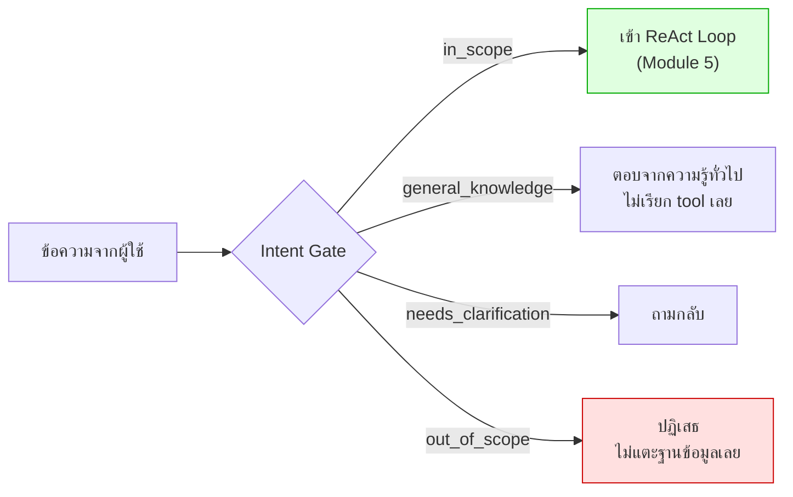

# Module 7 · Intent Gate

**10:00 – 10:30** (30 นาที) · เป้าหมาย: กรองคำถามก่อนเข้า ReAct loop เพื่อไม่ให้คำถามที่ไม่ควรแตะฐานข้อมูลเลยไปเสียทรัพยากรโดยเปล่าประโยชน์

---

## 1. ทำไมต้องกรองก่อน ไม่ใช่ปล่อยให้โมเดลตอบเอง

Intent Gate คือด่านแรกสุดที่ทุกข้อความต้องผ่าน **ก่อน** ที่ ReAct loop ของ Module 5 จะเริ่มทำงานด้วยซ้ำ โค้ดจริงที่ทำหน้าที่นี้ (`apps/agent-api/agent/intent.py:1-17`) ให้เหตุผลไว้ 3 ข้อ เรียงตามความสำคัญ:

1. **การปฏิเสธแต่เนิ่นๆ ทำให้ไม่มี tool ใดถูกเรียกเลย** คำถามที่ไม่เกี่ยวข้องกับระบบจึงไม่แตะฐานข้อมูลใดๆ ในนามของมันแม้แต่ครั้งเดียว
2. **โมเดลบนการ์ดจอที่ใช้ร่วมกันคือทรัพยากรที่หายากที่สุดในห้อง** การไม่เสียรอบการคำนวณไปกับคำถามอย่าง "วันนี้อากาศเป็นอย่างไร" คือการประหยัดที่แท้จริง
3. **การจำแนกคือจุดที่แยก "นอกขอบเขต" ออกจาก "ไม่ชัดเจน"** สองอย่างนี้ควรได้รับการตอบสนองต่างกัน — อย่างแรกควรถูกปฏิเสธ อย่างหลังควรได้รับคำถามกลับ ไม่ใช่การปฏิเสธ



---

## 2. สองชั้นของ Intent Gate เรียงจากถูกไปแพง

| ชั้น | วิธีทำงาน | ต้นทุน |
|---|---|---|
| **Layer 1 — fast_path** | ตรวจด้วย regex/keyword ล้วนๆ ไม่เรียกโมเดลเลย | แทบไม่มีต้นทุน |
| **Layer 2 — classify** | เรียก LLM จำแนกเฉพาะกรณีที่ Layer 1 ตัดสินใจไม่ได้ | ต้นทุนเท่ากับการเรียกโมเดลหนึ่งครั้ง |

โค้ดจริงจาก [`agent/intent.py:34-58`](../../apps/agent-api/agent/intent.py:34):

```python
DOMAIN_TERMS = [
    "ticket", "เคส", "แจ้ง", "ลูกค้า", "วงจร", "circuit", "อุปกรณ์", "device",
    "router", "เราเตอร์", "log", "interface", "mtu", "bgp", "mpls", "topology",
    "หลุด", "ล่ม", "ช้า", "down", "flap", "cpu", "bkk", "nbi", "pe-", "ape-", ...
]
OFF_DOMAIN_TERMS = [
    "อากาศ", "weather", "หุ้น", "stock", "ร้านอาหาร", "restaurant", "เพลง", "หนัง", ...
]
DEVICE_PATTERN = re.compile(r"\b(?:CR|PE|APE|LPE)-[A-Z]{3}-\d{2}\b", re.IGNORECASE)
TICKET_PATTERN = re.compile(r"\bTK-\d{2}-\d{5}\b", re.IGNORECASE)

def fast_path(message: str) -> IntentResult | None:
    """Settle the obvious cases without spending a model call."""
    if DEVICE_PATTERN.search(message) or TICKET_PATTERN.search(message):
        return IntentResult(label=IntentLabel.IN_SCOPE, confidence=0.98, ...)
    off_hits = [t for t in OFF_DOMAIN_TERMS if t in message.lower()]
    domain_hits = [t for t in DOMAIN_TERMS if t in message.lower()]
    if off_hits and not domain_hits:
        return IntentResult(label=IntentLabel.OUT_OF_SCOPE, confidence=0.95, ...)
    if len(domain_hits) >= 2:
        return IntentResult(label=IntentLabel.IN_SCOPE, confidence=0.9, ...)
    return None  # ไม่ชัดเจนพอ ส่งต่อให้ Layer 2
```

**สังเกต**: `fast_path()` คืน `None` เมื่อยังตัดสินใจไม่ได้ — นั่นคือสัญญาณให้ `classify()` เรียกโมเดลต่อ ไม่ใช่การปฏิเสธ

### ตัวอย่างโค้ด Layer 2: classify ด้วย system prompt (copy ไปรันได้ทันที)

`classify()` จริงใน `intent.py` ห่อรายละเอียดไว้ในฟังก์ชัน — ตัวอย่างนี้เขียน system prompt และเรียก `complete_structured()` ตรงๆ ให้เห็นกลไกทั้งหมด (`SYSTEM_PROMPT` ด้านล่างคัดมาจาก `apps/agent-api/agent/intent.py:138` ทั้งฉบับ):

```bash
uv run python -c "
import asyncio, sys
from dotenv import load_dotenv; load_dotenv()  # ต้องโหลดก่อน import agent.llm เสมอ ไม่งั้นเจอ 401
sys.path.insert(0, 'apps/agent-api')
from agent import llm
from schemas import IntentResult

SYSTEM_PROMPT = '''You classify incoming questions for a network operations assistant.

The assistant can answer questions about an IP-MPLS network: trouble tickets,
device configuration, physical topology, routing adjacencies, device logs,
equipment health, customer circuits and operational runbooks. It covers exactly
two sites, BKK and NBI, and ten devices.

Choose exactly one label:

in_scope
    Answerable from the network data. Needs tools.

general_knowledge
    A genuine networking question that needs explanation, not data.
    Example: \\\"what is a router\\\", \\\"how does ISIS work\\\".
    Answer directly, no tools.

needs_clarification
    Relates to the network but is missing something essential - which device,
    which time range, which aspect. Ask rather than guess.

out_of_scope
    Unrelated to network operations. Weather, translation, HR, finance,
    personal requests.
'''

async def classify_with_system_prompt(question: str) -> IntentResult:
    messages = [
        {'role': 'system', 'content': SYSTEM_PROMPT},
        {'role': 'user', 'content': question},
    ]
    return await llm.complete_structured(messages, IntentResult)

async def main():
    questions = [
        'router คืออะไร',
        'แถวนี้มีร้านอาหารแนะนำไหม',
        'ขอดูอุณหภูมิ CPU ของอุปกรณ์ตัวนี้หน่อย',
    ]
    for q in questions:
        result = await classify_with_system_prompt(q)
        print(f'{result.label.value:20} conf={result.confidence:.2f}  {q}')
        print(f'   เหตุผล: {result.reason}')
        print('-' * 60)

asyncio.run(main())
"
```

**ผลลัพธ์จริง** (รันจริงตอนเตรียมเอกสารนี้):

```
general_knowledge    conf=0.95  router คืออะไร
   เหตุผล: The question is asking for a definition of a router, which is a general networking concept. It does not require specific network data or tools to answer.
------------------------------------------------------------
out_of_scope         conf=0.95  แถวนี้มีร้านอาหารแนะนำไหม
   เหตุผล: The question is asking for restaurant recommendations in the area, which is unrelated to network operations. The assistant's scope is limited to IP-MPLS network-related queries such as trouble tickets, device configuration, and physical topology.
------------------------------------------------------------
in_scope             conf=0.95  ขอดูอุณหภูมิ CPU ของอุปกรณ์ตัวนี้หน่อย
   เหตุผล: The user is asking to check the CPU temperature of a device, which is related to equipment health. This is within the scope of network operations as it involves monitoring device health. However, the specific device is not mentioned, so it might require clarification. But since the assistant can answer based on available data, it's considered in scope.
------------------------------------------------------------
```

สังเกตว่าไม่มีคำถามข้อไหนผ่าน `fast_path` เลยในตัวอย่างนี้ (ตั้งใจเลือกคำถามที่ไม่มีรหัสอุปกรณ์/ไม่ตรง `DOMAIN_TERMS` ≥2 คำ) — ทุกข้อจึงต้องพึ่ง LLM ตัดสินใจผ่าน system prompt ล้วนๆ ตรงตามที่ต้องการสาธิต

**หมายเหตุ**: คำถามที่ 3 เป็นกรณีก้ำกึ่งโดยตั้งใจ (ถามเรื่องอุปกรณ์แต่ไม่ระบุว่าตัวไหน) — รันซ้ำอาจได้ `in_scope` หรือ `needs_clarification` สลับกันไป เพราะ LLM ไม่ deterministic 100% แม้แต่ผลลัพธ์เองก็ยังลังเลในเหตุผลที่ให้มา (สังเกตคำว่า "However" ในตัวอย่างข้างบน) — นี่คือตัวอย่างจริงว่าทำไมงาน classification จึงต้องมี `confidence` field ไว้เป็นสัญญาณเสริมด้วย ไม่ใช่เชื่อ label เพียงอย่างเดียว

---

## 3. สี่ป้ายกำกับ ไม่ใช่สอง

ความผิดพลาดที่พบบ่อยที่สุดคือมองเรื่องนี้เป็นคำถามใช่/ไม่ใช่ (จะตอบหรือปฏิเสธ) แต่ [`schemas.py:20-31`](../../apps/agent-api/schemas.py) นิยามไว้ 4 ป้าย:

| ป้าย | ความหมาย | ตัวอย่าง |
|---|---|---|
| `in_scope` | เกี่ยวกับระบบโดยตรง เข้า ReAct loop | "ticket ของ APE-NBI-03 มีอะไรบ้าง" |
| `general_knowledge` | ถามความรู้ทั่วไปที่โมเดลตอบได้เอง ไม่ต้องเรียก tool | "router คืออะไร" |
| `needs_clarification` | ไม่มีข้อมูลพอจะตัดสินใจ ต้องถามกลับ ไม่ใช่ปฏิเสธ | "อุปกรณ์ตัวนี้เป็นยังไง" (ไม่ระบุว่าตัวไหน) |
| `out_of_scope` | ไม่เกี่ยวข้องกับงานโครงข่ายเลย ปฏิเสธ | "แถวนี้มีร้านอาหารแนะนำไหม" |

หากมีแค่ 2 ป้าย คำถามอย่าง "router คืออะไร" จะถูกปฏิเสธอย่างผิดพลาด ทั้งที่ตอบได้ทันทีโดยไม่ต้องแตะฐานข้อมูล

---

## แบบฝึกหัด: ทดสอบ Intent Gate กับคำถามจริง

```bash
uv run python -c "
import asyncio, sys
from dotenv import load_dotenv; load_dotenv()  # ต้องโหลดก่อน import agent.llm เสมอ ไม่งั้น classify() จะเจอ 401
sys.path.insert(0, 'apps/agent-api')
from agent import intent

questions = [
    'ticket ของ APE-NBI-03 มีอะไรบ้าง',       # ควรได้ in_scope จาก fast_path (มีรหัสอุปกรณ์)
    'router คืออะไร',                         # ควรได้ general_knowledge
    'อุปกรณ์ตัวนี้เป็นยังไง',                    # ควรได้ needs_clarification
    'แถวนี้มีร้านอาหารแนะนำไหม',                 # ควรได้ out_of_scope จาก fast_path
    'ช่วยดูให้หน่อยว่าปกติไหม',                  # ควรได้ needs_clarification จาก fast_path เช่นกัน
]

async def main():
    for q in questions:
        result = intent.fast_path(q) or await intent.classify(q)
        print(f'{result.label.value:20} ({result.decided_by:9}) - {q}')

asyncio.run(main())
"
```

### สิ่งที่ต้องสังเกต (ผลจริงจากการรันข้างต้น)

- [ ] คำถามที่มีรหัสอุปกรณ์หรือหมายเลข ticket ได้ `in_scope` จาก `fast_path` เสมอ (`decided_by=fast_path`) โดยไม่เรียกโมเดล
- [ ] `"router คืออะไร"` ไม่มีรหัสอุปกรณ์และไม่ตรง pattern ใดใน `fast_path` เลย จึงเป็นข้อเดียวที่ตกไปเรียกโมเดลจริง (`decided_by=llm`) แล้วได้ `general_knowledge`
- [ ] `"อุปกรณ์ตัวนี้เป็นยังไง"` และ `"ช่วยดูให้หน่อยว่าปกติไหม"` ได้ `needs_clarification` จาก `fast_path` เองเลย (ตรงกับ `VAGUE_PATTERNS` ใน `intent.py`) ไม่ต้องเรียกโมเดลก็จับสำนวนกำกวมแบบนี้ได้
- [ ] `general_knowledge` และ `needs_clarification` ไม่ใช่ `out_of_scope` — ทั้งสองไม่ควรถูกปฏิเสธแบบเดียวกัน

---

## สิ่งที่ต้องส่ง

ผลลัพธ์การรันสคริปต์ข้างต้น พร้อมระบุว่าคำถามข้อใด `decided_by` เป็น `fast_path` และข้อใดต้องตกไปที่ `llm`

---

## ต่อไป

→ [Module 5: เขียน ReAct Loop เอง](03-module5-react-loop.md)
