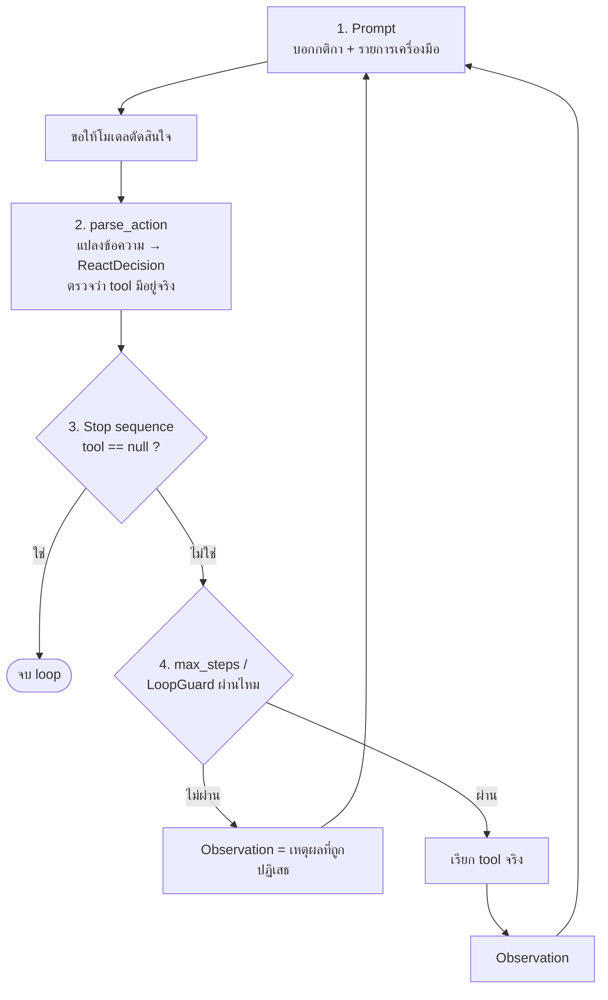

# Module 5 · เขียน ReAct Loop เอง

**10:45 – 12:00** (75 นาที) · เป้าหมาย: เขียน ReAct loop ที่ใช้งานได้จริงด้วยตนเอง โดยไม่พึ่ง agent framework ใดๆ — ทำความเข้าใจโครงสร้างสี่ส่วนที่ประกอบกันเป็น loop แล้วลงมือเขียนเวอร์ชันย่อของตัวเองในช่วง Lab

เนื้อหาทั้งหมดอ้างอิงโครงสร้างจริงของ `solutions/day2/workshop2_agent.py` (~200 บรรทัด ไม่มี framework และไม่มี MCP ตามที่ระบุไว้ใน docstring บรรทัด 7-10) — ไฟล์นี้คือเฉลยที่สมบูรณ์ ส่วน Lab ของโมดูลนี้ให้เขียนเวอร์ชันย่อของตัวเองก่อน แล้วค่อยเปรียบเทียบ

---

## 1. โครงสร้างสี่ส่วนของ ReAct Loop

Loop ทั้งหมดประกอบด้วยสี่ส่วนที่ต้องเขียนแยกจากกันชัดเจน:



### 1.1 Prompt

พร้อมต์ต้องบอกโมเดลสามอย่าง: กติกาการตัดสินใจทีละก้าว, ลำดับที่บังคับ (เช่น export ก่อน notify เสมอ), และ**รายการเครื่องมือที่มีจริง** — แคตตาล็อกเครื่องมือใน `solutions/day2/workshop2_agent.py` ไม่ได้เขียนมือ แต่สร้างจาก signature และ docstring ของฟังก์ชันโดยตรง:

```python
# solutions/day2/workshop2_agent.py:290-292
catalogue = "\n\n".join(
    f"{name}{inspect.signature(fn)}: {(fn.__doc__ or '').strip()}" for name, fn in TOOLS.items()
)
```

ผลคือถ้าแก้ signature หรือ docstring ของฟังก์ชัน tool แคตตาล็อกที่ส่งให้โมเดลจะอัปเดตตามทันที ไม่มีจุดที่ต้องแก้สองที่ กติกาทั้งหมดอยู่ใน `REACT_PROMPT` — `solutions/day2/workshop2_agent.py:258-277`

**ตัวอย่างรันได้ทันที** (ใช้ฟังก์ชันจำลอง ไม่ใช่ `search_tickets` จริง เพื่อไม่ให้ปนกับ Lab ด้านล่าง):

```bash
uv run python -c "
import inspect

def search_tickets(severity: str, site: str | None = None) -> list[dict]:
    '''ค้นหา ticket ตามระดับความรุนแรงและไซต์ (ถ้าไม่ระบุ site จะค้นทุกไซต์)'''
    ...

def get_device_logs(device: str, hours: int = 24) -> list[str]:
    '''ดึง log ของอุปกรณ์ย้อนหลังตามจำนวนชั่วโมงที่ระบุ'''
    ...

TOOLS = {'search_tickets': search_tickets, 'get_device_logs': get_device_logs}

catalogue = '\n\n'.join(
    f'{name}{inspect.signature(fn)}: {(fn.__doc__ or \"\").strip()}' for name, fn in TOOLS.items()
)
print(catalogue)
"
```

**ผลลัพธ์จริง** (รันจริงตอนเตรียมเอกสารนี้):

```
search_tickets(severity: str, site: str | None = None) -> list[dict]: ค้นหา ticket ตามระดับความรุนแรงและไซต์ (ถ้าไม่ระบุ site จะค้นทุกไซต์)

get_device_logs(device: str, hours: int = 24) -> list[str]: ดึง log ของอุปกรณ์ย้อนหลังตามจำนวนชั่วโมงที่ระบุ
```

ลองเปลี่ยน docstring หรือเพิ่ม parameter ในฟังก์ชันจำลองข้างบน แล้วรันซ้ำ — แคตตาล็อกจะเปลี่ยนตามทันทีโดยไม่ต้องแก้โค้ดจุดอื่นเลย ตรงตามหลักการที่อธิบายไว้

### 1.2 parse_action

ผลลัพธ์ดิบจาก LLM เป็นข้อความ (มักห่อด้วย ```` ```json ```` บางครั้ง) ต้องแปลงเป็นโครงสร้างที่ใช้ต่อได้และ**ตรวจสอบก่อนเรียกจริง**:

```python
# solutions/day2/workshop2_agent.py:280-285
def _parse_json(schema: type[BaseModel], raw: str) -> BaseModel:
    text = raw.strip()
    if text.startswith("```"):
        text = text.split("```")[1]
        text = text[4:] if text.lstrip().startswith("json") else text
    return schema.model_validate_json(text.strip())
```

ตามด้วยการตรวจว่าชื่อเครื่องมือที่โมเดลเลือกมีอยู่จริงใน `TOOLS` **ก่อน**เรียก ไม่ใช่ปล่อยให้ล้มเหลวตอนเรียก:

```python
# solutions/day2/workshop2_agent.py:304-308
if decision.tool is not None and decision.tool not in TOOLS:
    decision = ReactDecision(
        thought=f"{decision.thought} (เครื่องมือ '{decision.tool}' ไม่มีจริง)",
        tool=None,
    )
```

เหตุผลที่ตรวจ**ก่อน**เรียก: ชื่อเครื่องมือที่หลอนขึ้นมา (hallucinated) ถ้าจับได้ตรงนี้ไม่มีต้นทุนอะไรเพิ่ม แต่ถ้าปล่อยให้ไปพังตอนเรียกจริง จะเสีย round trip ไปฟรีๆ พร้อม traceback ที่งงกว่าเดิม — ดูคอมเมนต์ที่ `solutions/day2/workshop2_agent.py:301-303`

**ตัวอย่างรันได้ทันที** — ทดสอบ `_parse_json()` กับข้อความดิบ 3 แบบที่พบได้จริงจาก LLM (ไม่เรียก LLM จริง ใช้ข้อความจำลองแทนเพื่อทดสอบ parser ล้วนๆ):

```bash
uv run python -c "
from pydantic import BaseModel

class ReactDecision(BaseModel):
    thought: str
    tool: str | None = None
    arguments: dict = {}

def _parse_json(schema, raw: str):
    text = raw.strip()
    if text.startswith('\`\`\`'):
        text = text.split('\`\`\`')[1]
        text = text[4:] if text.lstrip().startswith('json') else text
    return schema.model_validate_json(text.strip())

samples = [
    ('ไม่มี fence', '{\"thought\": \"ยังไม่มีข้อมูล ต้องค้นก่อน\", \"tool\": \"search_tickets\", \"arguments\": {\"severity\": \"high\"}}'),
    ('มี fence json ขึ้นต้นทันที', '\`\`\`json\n{\"thought\": \"พร้อมตอบแล้ว\", \"tool\": null, \"arguments\": {}}\n\`\`\`'),
    ('มีข้อความนำหน้า fence', 'นี่คือคำตอบ:\n\`\`\`\n{\"thought\": \"ลองอีกครั้ง\", \"tool\": \"search_tickets\", \"arguments\": {}}\n\`\`\`'),
]

for label, raw in samples:
    try:
        decision = _parse_json(ReactDecision, raw)
        print(f'[{label}] สำเร็จ: tool={decision.tool!r}')
    except Exception as exc:
        print(f'[{label}] ล้มเหลว: {type(exc).__name__}')
    print('-' * 60)
"
```

**ผลลัพธ์จริง** (รันจริงตอนเตรียมเอกสารนี้):

```
[ไม่มี fence] สำเร็จ: tool='search_tickets'
------------------------------------------------------------
[มี fence json ขึ้นต้นทันที] สำเร็จ: tool=None
------------------------------------------------------------
[มีข้อความนำหน้า fence] ล้มเหลว: ValidationError
------------------------------------------------------------
```

**สังเกต**: `_parse_json()` เวอร์ชันนี้เช็คแค่ `text.startswith("\`\`\`")` — ถ้า LLM แถมประโยคนำหน้า fence มาด้วย (กรณีที่ 3) ฟังก์ชันจะไม่ตัด fence ออกเลยและ parse ไม่ผ่าน ต่างจาก `_clean()` ใน Workshop 1 วันที่ 1 ที่หาตำแหน่ง `{`/`}` แทนการเช็คจุดเริ่มต้นบรรทัด (ดู [07-workshop1-ticket-extractor.md วันที่ 1](../day1/07-workshop1-ticket-extractor.md)) — เป็นข้อจำกัดจริงที่ควรรู้ไว้ก่อนเขียน Lab ของตัวเอง ไม่ใช่ข้อผิดพลาดในการสาธิตนี้

### 1.3 Stop sequence

Loop หยุดเมื่อโมเดลตั้ง `tool` เป็น `null` (พร้อมตอบแล้ว) — ตรวจสอบเพียงบรรทัดเดียว:

```python
# solutions/day2/workshop2_agent.py:437-438
if decision.tool is None:
    break
```

ข้อควรระวังที่พบบ่อยเมื่อสลับ LLM/gateway: บาง endpoint คืนสตริงตัวอักษร `"null"` แทนที่จะเป็นค่า JSON `null` จริง เวอร์ชัน production (`apps/agent-api/agent/react.py:246`) มีเงื่อนไขเสริมเพื่อดักกรณีนี้ (`decision.tool.strip().lower() == "null"`) — เป็นบั๊กที่พบจริงในทางปฏิบัติ ไม่ใช่ edge case สมมติ

### 1.4 max_steps / LoopGuard

จุดสำคัญที่สุดของทั้งไฟล์: **ไม่มี plan ล่วงหน้าให้ตรวจสอบ** loop guard จึงเป็นสิ่งเดียวที่หยุดโมเดลจากการวนไม่รู้จบ ต้องมีสามชั้นพร้อมกัน มิใช่ชั้นเดียว:

```python
# solutions/day2/workshop2_agent.py:331-344
def check(self, tool: str, arguments: dict) -> str | None:
    self.total += 1
    if self.total > MAX_STEPS:
        return f"เกิน {MAX_STEPS} ขั้นตอน"

    signature = f"{tool}:{json.dumps(arguments, sort_keys=True, default=str)}"
    self.signatures[signature] = self.signatures.get(signature, 0) + 1
    if self.signatures[signature] > 1:
        return f"เรียก {tool} ด้วย argument เดิมซ้ำ"

    self.tool_counts[tool] = self.tool_counts.get(tool, 0) + 1
    if self.tool_counts[tool] > MAX_SAME_TOOL:
        return f"เรียก {tool} เกิน {MAX_SAME_TOOL} ครั้ง"
    return None
```

เหตุผลที่ต้องมีสามชั้น (ตามคอมเมนต์ที่ `solutions/day2/workshop2_agent.py:317-323`): เพดานขั้นตอนรวมอย่างเดียวปล่อยให้ retry เดิมซ้ำจนหมดงบประมาณ, การกันการเรียกซ้ำด้วย argument เดิมอย่างเดียวปล่อยให้โมเดล "สุ่ม" argument ใหม่ไปเรื่อยๆ, และเพดานต่อเครื่องมืออย่างเดียวปล่อยให้สองเครื่องมือ ping-pong กันได้ ต้องมีครบทั้งสามเงื่อนไขจึงจะครอบคลุมทุกรูปแบบ loop ที่พบจริง

**ตัวอย่างรันได้ทันที** — จำลองลำดับการเรียก tool ให้ครบทั้ง 3 เงื่อนไข (ไม่เรียก LLM จริง ป้อนลำดับ tool/argument ตรงๆ เพื่อทดสอบ `LoopGuard` ล้วนๆ):

```bash
uv run python -c "
import json

MAX_STEPS = 8
MAX_SAME_TOOL = 3

class LoopGuard:
    def __init__(self):
        self.total = 0
        self.signatures = {}
        self.tool_counts = {}

    def check(self, tool, arguments):
        self.total += 1
        if self.total > MAX_STEPS:
            return f'เกิน {MAX_STEPS} ขั้นตอน'
        signature = f'{tool}:{json.dumps(arguments, sort_keys=True, default=str)}'
        self.signatures[signature] = self.signatures.get(signature, 0) + 1
        if self.signatures[signature] > 1:
            return f'เรียก {tool} ด้วย argument เดิมซ้ำ'
        self.tool_counts[tool] = self.tool_counts.get(tool, 0) + 1
        if self.tool_counts[tool] > MAX_SAME_TOOL:
            return f'เรียก {tool} เกิน {MAX_SAME_TOOL} ครั้ง'
        return None

guard = LoopGuard()
calls = [
    ('search_tickets', {'severity': 'high'}),
    ('search_tickets', {'severity': 'high'}),      # ซ้ำ argument เดิม
    ('search_tickets', {'severity': 'medium'}),
    ('search_tickets', {'severity': 'low'}),
    ('search_tickets', {'severity': 'critical'}),  # เรียกเครื่องมือเดิมเป็นครั้งที่ 4
    ('get_device_logs', {'device': 'CR-BKK-01'}),
    ('get_device_logs', {'device': 'CR-BKK-02'}),
    ('get_device_logs', {'device': 'CR-BKK-03'}),
    ('get_device_logs', {'device': 'CR-BKK-04'}),  # ก้าวที่ 9 โดยรวม
]
for tool, args in calls:
    refusal = guard.check(tool, args)
    status = f'ถูกปฏิเสธ: {refusal}' if refusal else 'ผ่าน'
    print(f'{tool}({args}) -> {status}')
    print('-' * 60)
"
```

**ผลลัพธ์จริง** (รันจริงตอนเตรียมเอกสารนี้):

```
search_tickets({'severity': 'high'}) -> ผ่าน
------------------------------------------------------------
search_tickets({'severity': 'high'}) -> ถูกปฏิเสธ: เรียก search_tickets ด้วย argument เดิมซ้ำ
------------------------------------------------------------
search_tickets({'severity': 'medium'}) -> ผ่าน
------------------------------------------------------------
search_tickets({'severity': 'low'}) -> ผ่าน
------------------------------------------------------------
search_tickets({'severity': 'critical'}) -> ถูกปฏิเสธ: เรียก search_tickets เกิน 3 ครั้ง
------------------------------------------------------------
get_device_logs({'device': 'CR-BKK-01'}) -> ผ่าน
------------------------------------------------------------
get_device_logs({'device': 'CR-BKK-02'}) -> ผ่าน
------------------------------------------------------------
get_device_logs({'device': 'CR-BKK-03'}) -> ผ่าน
------------------------------------------------------------
get_device_logs({'device': 'CR-BKK-04'}) -> ถูกปฏิเสธ: เกิน 8 ขั้นตอน
------------------------------------------------------------
```

ทั้ง 3 เงื่อนไขถูกกระตุ้นให้เห็นครบในการรันเดียว: การเรียกครั้งที่ 2 (argument ซ้ำ), ครั้งที่ 5 (เครื่องมือเดิมเกิน 3 ครั้ง), และครั้งที่ 9 (เกินเพดานรวม 8 ขั้นตอน)

---

## 2. Lab: เขียน ReAct Loop ของตัวเอง ด้วยเครื่องมือ 1 ตัว

### สิ่งที่ให้มา

- `solutions/day2/workshop2_agent.py` — **ห้ามเปิดดูจนกว่าจะเขียนของตัวเองเสร็จ** ใช้เป็นตัวเปรียบเทียบหลังจากนั้น
- ฟังก์ชัน `search_tickets()` ใช้เป็นเครื่องมือเดียวของ Lab นี้ (คัดลอกมาใช้ได้ตรงๆ จาก `solutions/day2/workshop2_agent.py:64-93` — จุดสนใจของ Lab นี้คือตัว loop ไม่ใช่ตัว tool)
- ค่าตั้งต้นของ LLM (`LLM_BASE_URL`, `LLM_API_KEY`, `LLM_MODEL`) มาจาก `.env` ตามที่ตั้งค่าไว้ตั้งแต่วันที่ 0

### สิ่งที่ต้องทำ

สร้างไฟล์ `my_react_loop.py` ที่ root โปรเจกต์ (ใช้ชื่อนี้ตรงๆ เพื่อให้ตรวจสอบง่าย) แล้วเขียนให้ครบสี่ส่วนตามหัวข้อ 1:

1. **Prompt**: เขียนพร้อมต์ที่บอกกติกา "ตัดสินใจก้าวถัดไปทีละก้าว" และแสดงรายการเครื่องมือ (มีแค่ `search_tickets` ก็พอ)
2. **parse_action**: กำหนด schema แบบ `ReactDecision` เอง (`thought`, `tool: str | None`, `arguments: dict`) และแปลงผลลัพธ์ LLM เป็น object นี้ พร้อมตรวจสอบว่า `tool` เป็น `"search_tickets"` หรือ `None` เท่านั้น
3. **Stop sequence**: หยุด loop เมื่อ `tool is None`
4. **max_steps**: จำกัดจำนวนรอบไม่เกิน 5 รอบ (ไม่ต้องทำครบสามชั้นแบบ `LoopGuard` เต็มรูปแบบ — แค่เพดานรวมก็พอสำหรับ Lab นี้ เพราะมีเครื่องมือเดียวจึงไม่มีปัญหา ping-pong ระหว่างเครื่องมือ)

ทดสอบด้วยคำถาม: `"มี ticket severity สูงที่ยังไม่ปิดกี่ใบในสัปดาห์นี้"`

### เกณฑ์ผ่าน

- [ ] `python my_react_loop.py` รันได้จริงและพิมพ์ Thought ของทุกรอบออกมาให้เห็น
- [ ] เรียก `search_tickets` ได้จริงอย่างน้อย 1 ครั้ง พร้อม argument ที่สมเหตุสมผลกับคำถามทดสอบ
- [ ] loop หยุดเองเมื่อโมเดลตอบว่าพร้อมสรุปแล้ว (ไม่ต้องกด Ctrl+C)
- [ ] ถ้าตั้งเพดานไว้ที่ 5 รอบแล้วยังไม่หยุด ต้องมีข้อความแจ้งว่าเกินเพดาน ไม่ปล่อยให้วนต่อเงียบๆ
- [ ] เทียบโครงสร้างไฟล์ของตัวเองกับ `solutions/day2/workshop2_agent.py` แล้วระบุได้ว่าต่างกันตรงไหนบ้าง (อย่างน้อย 1 ข้อ)

### สิ่งที่ต้องส่ง

ไฟล์ `my_react_loop.py` พร้อม log การรันจริงหนึ่งครั้ง (คัดลอกจาก terminal วางไว้ท้ายไฟล์เป็น comment หรือแยกเป็น `my_react_loop_run.txt` ก็ได้) — ส่งในช่องทางที่วิทยากรแจ้งไว้ต้นวัน

---

## ต่อไป

→ [Module 6: เครื่องมือจาก 3 ฐานข้อมูล](04-module6-tools-3-databases.md) — Lab นี้ใช้เครื่องมือเดียว โมดูลถัดไปขยายไปสู่การห่อ query จริงจาก PostgreSQL, Neo4j และ OpenSearch ให้เป็น tool ที่ครบชุดสำหรับ Workshop 2
