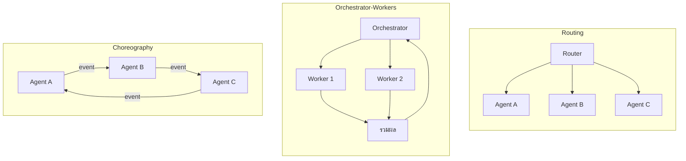
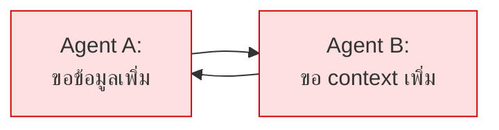

# Module 6 · Multi-Agent & Orchestration Patterns

**13:00 – 13:45** · เป้าหมาย: รู้จักรูปแบบการส่งต่องาน และรู้ว่า**เมื่อไหร่ไม่ควรใช้**

---

## 1. รูปแบบหลัก 3 แบบ



| รูปแบบ | ใครตัดสินใจ | เหมาะกับ | ความเสี่ยง |
|---|---|---|---|
| **Routing** | ตัวกลางตัวเดียว | งานที่แยกประเภทได้ชัด | routing ผิด = ผิดทั้งงาน |
| **Orchestrator-Workers** | ตัวกลางสั่งและรวมผล | งานที่แตกเป็นส่วนย่อยได้ | ต้นทุนประสานงานสูง |
| **Choreography** | ไม่มีใครคุม แต่ละตัวฟัง event | ระบบใหญ่ กระจายศูนย์ | **debug ยากมาก · loop ง่าย** |

---

## 2. ระบบนี้ใช้แบบไหน และทำไม

ระบบนี้ใช้ **ReAct loop ตัวเดียว** ซึ่งไม่ใช่ multi-agent เลย

เหตุผล:

| | ReAct loop ตัวเดียว (ที่ใช้) | Multi-agent |
|---|---|---|
| เรียก LLM ต่อคำถาม | N+2 ครั้ง (N = จำนวน tool call) | 5-8 ครั้ง โดยประมาณ |
| เวลาตอบ | เร็วกว่า (ไม่มีต้นทุนประสานงานข้าม agent) | ช้ากว่า |
| ทำงานข้ามระบบ | **ทำได้ดี** เพราะเห็น tool ครบพร้อมกันทุกรอบตัดสินใจ | ต้องประสานงานเพิ่ม |
| debug | ตามได้ตรงๆ ทีละ Thought | ต้องไล่หลายตัว |

> **โมเดลเดียวสามารถจัดการ 19 tools ได้อย่างมีประสิทธิภาพ** ต้นทุนการประสานงานของ multi-agent จึงยังไม่คุ้มค่า
> ตัวเลข "N+2 ครั้ง" ไม่คงที่เหมือนตอนใช้ plan-then-execute (ที่เคยเป็น 2-3 ครั้งคงที่) — นี่คือ trade-off ที่ยอมรับเพื่อแลกกับการปรับตัวระหว่างทาง (Module 4 หัวข้อ 3)

`apps/agent-api/agent/orchestrator.py` มีเวอร์ชัน Orchestrator-Workers `uv run solutions/day2/workshop2_agent.py` ให้ **เพื่อเทียบ ไม่ใช่เพื่อใช้**

### เมื่อไหร่ที่ multi-agent เริ่มคุ้ม

- tool เกิน ~50 ตัว จนใส่ใน context พร้อมกันไม่ไหว
- แต่ละโดเมนต้องการ system prompt ที่ต่างกันมาก
- ต้องใช้โมเดลคนละตัวกับงานคนละแบบ
- ทีมคนละทีมดูแลคนละ agent และ deploy แยกกัน

---

## 3. การสื่อสารระหว่าง Agent

ไม่ว่าจะใช้รูปแบบไหน ข้อความที่ส่งต่อกันควรมีอย่างน้อย:

```python
class AgentMessage(BaseModel):
    from_agent: str
    to_agent: str
    task: str
    context: dict
    depth: int        # กัน loop
    trace_id: str     # ตามรอยได้ตลอดสาย
```

**`depth` และ `trace_id` ไม่ใช่ของเสริม** — ระบบ multi-agent ที่ไม่มีสองฟิลด์นี้จะกลายเป็นระบบที่ debug ไม่ได้ทันทีที่เกิดปัญหา

มาตรฐานที่กำลังก่อตัว: Agent2Agent (A2A), ACP — ยังเปลี่ยนเร็ว ควรออกแบบให้เปลี่ยนได้

---

## 4. Infinite Loop — ปัญหาที่ต้องกันตั้งแต่ต้น



### รูปแบบ loop ที่พบจริง

| รูปแบบ | ตัวอย่าง |
|---|---|
| ปิงปอง | สองตัวโยนงานกลับไปกลับมา |
| retry ไม่จบ | tool คืน "ไม่พบ" โมเดลตัดสินใจค้นใหม่ทุกครั้ง |
| fuzzing argument | เรียก tool เดิมโดยเปลี่ยน argument ไปเรื่อยๆ |
| วางแผนวน | re-plan แล้วได้แผนเดิม |

### กันด้วย 3 ชั้นพร้อมกัน

โปรเจกต์นี้ทำใน `apps/agent-api/agent/react.py` คลาส `LoopGuard`:

```python
1. total_steps > MAX_STEPS                    # งบรวม
2. เรียก tool เดิมด้วย argument เดิมซ้ำ         # ปิงปองและ retry
3. เรียก tool เดิมเกิน N ครั้ง                 # fuzzing argument
```

**การป้องกันเพียงชั้นเดียวไม่เพียงพอ** — งบรวมอย่างเดียวยอมให้วนซ้ำถึง 8 รอบก่อนหยุด ซึ่งทั้งช้าและสิ้นเปลือง

ทดสอบ:

```bash
uv run pytest tests/test_loop_guard.py -v
```

---

## 5. ทดลองเทียบด้วยตัวเอง (15 นาที)

รันคำถามเดียวกันสองแบบ แล้วเทียบ

```python
# แบบที่ใช้จริง - วนจนพอตอบ
async for event_type, payload in react.run(q):
    ...

# แบบ multi-agent - แค่ routing ครั้งเดียว
decision = await orchestrator.route(q)
```

โค้ดเต็มอยู่ที่ [`compare_q21.py`](../../compare_q21.py) ที่ root ของโปรเจกต์แล้ว รันตรงๆ ได้เลย:

```bash
uv run compare_q21.py "ลูกค้า 3 รายในโซน NBI ที่ใช้อุปกรณ์ LPE คนละตัวกัน (คนละพื้นที่) แจ้งเน็ตหลุดเป็นพักๆ ซ้ำหลายครั้งในช่วง 14 วันที่ผ่านมา ให้หาว่าอุปกรณ์ใดคือต้นเหตุร่วมที่แท้จริง" --expect-contains "APE-NBI-03"
```

> **หมายเหตุสำคัญ**: คอลัมน์ ReAct ในตารางคือต้นทุนของ **ทั้งคำถาม** (วนจนตอบได้) ส่วนคอลัมน์ Orchestrator เป็นแค่ **การตัดสินใจ routing ครั้งเดียว** ไม่ใช่ต้นทุนเต็มของ multi-agent (ที่ต้องมี worker ทำงานต่อด้วย) — สคริปต์บอกความต่างระดับนี้ไว้ในผลลัพธ์แล้ว อ่านให้ครบก่อนกรอกตาราง

| วัด | ReAct (ทั้งคำถาม) | Orchestrator (แค่ routing) |
|---|---|---|
| จำนวนครั้งที่เรียก LLM | | |
| token รวม | | |
| เวลารวม | | |
| ตอบถูกไหม | | |

นี่คือเหตุผลที่ตารางเปรียบเทียบข้อ 5 นี้เห็นความต่างชัด: ReAct วนตัดสินใจได้ทีละขั้นตามที่ tool ก่อนหน้าคืนผลมา ส่วน Orchestrator ที่ routing ครั้งเดียวไม่มีทางวางแผน 3 ขั้นที่มี dependency แบบนี้ได้ตั้งแต่ต้น — ต้องมี worker มาทำงานต่อ ซึ่งนั่นคือต้นทุนที่ตารางนี้ยังไม่ได้นับ (ดูหมายเหตุด้านบน)

### วิธีอ่านผลลัพธ์จริงที่ได้จาก `uv run compare_q21.py`

ตัวอย่างผลจากรันจริงหนึ่งรอบ ใช้คำถามแคบกว่า Q21 (ใบ้โซนและประเภทอุปกรณ์ ดูหัวข้อถัดไปว่าทำไมถึงเลือกคำถามนี้) พร้อมตรวจสอบคำตอบด้วย `--expect-contains`:

```bash
uv run compare_q21.py "ลูกค้า 3 รายในโซน NBI ที่ใช้อุปกรณ์ LPE คนละตัวกัน (คนละพื้นที่) แจ้งเน็ตหลุดเป็นพักๆ ซ้ำหลายครั้งในช่วง 14 วันที่ผ่านมา ให้หาว่าอุปกรณ์ใดคือต้นเหตุร่วมที่แท้จริง" --expect-contains "APE-NBI-03"
```

(ตัวเลขจะไม่เหมือนกันทุกครั้งเพราะ `temperature` ไม่ใช่ 0 ในเส้นทางนี้)

| วัด | ReAct | Orchestrator |
|---|---|---|
| จำนวนครั้งที่เรียก LLM | 10 | 1 |
| token รวม | 77,870 | 277 |
| เวลารวม | 37.98s | 1.13s |
| ตอบถูกไหม | ถูก | N/A (ยังไม่มีคำตอบให้ตรวจ - แค่ routing) |

**สิ่งที่ควรพิจารณาให้ครบถ้วนจากตัวเลขนี้**:

1. **แม้ตอบถูก ก็ยังไม่ได้แปลว่าเดินตรงตาม `expected_plan_shape`** ใน yaml (3 ขั้น: `search_tickets` → `get_upstream_devices` → `search_logs`) — รอบตัวอย่างนี้ตอบถูก (`APE-NBI-03`) แต่ใช้ tool ไป 9 ครั้ง (+1 ขั้น synthesize = 10 LLM calls) เนื่องจากหลังจากพบคำตอบที่ถูกต้องแล้ว ยังตรวจสอบ `get_device_config` ต่ออีกหลายอุปกรณ์ และ 3 ครั้งสุดท้าย fail เพราะเรียกซ้ำด้วย argument เดิม (ถูก LoopGuard บล็อกไว้) — **"ตอบถูก" กับ "ประหยัด" เป็นคนละแกนกัน** ต้องพิจารณาทั้งสองอย่างคู่กันเสมอ
2. **จำนวนครั้งที่เรียก tool ไม่คงที่และไม่จำเป็นต้องชน `MAX_STEPS`** (`AGENT_MAX_STEPS = 8` ใน [`agent/react.py`](../../apps/agent-api/agent/react.py)) — ถ้าเจอเลขพอดี 8 ให้สงสัยว่า LoopGuard ตัดจบเพราะชนงบรวม ไม่ใช่คิดจบเอง แต่ถ้าเจอเลขอื่น (เช่น 9-10 แบบนี้) แปลว่า agent เดินอ้อมด้วยเหตุผลอื่น (ในที่นี้คือ retry ที่ผิดซ้ำ) ไม่เกี่ยวกับเพดานเลย

> ⚠️ **จุดที่คนพลาดบ่อยที่สุดของการอ่านผลเปรียบเทียบนี้** — เห็นว่า ReAct ใช้ 10 ครั้ง/77,870 token/37.98s แล้วสรุปทันทีว่า "multi-agent เร็วกว่า/ถูกกว่าเสมอ" ทั้งที่แถว Orchestrator ในตารางนี้คือ**แค่ routing ครั้งเดียว** (277 token, 1.13s) ยังไม่มี worker ไปทำงานจริงสักขั้นเดียว ถ้าจะเทียบให้แฟร์ ต้องบวกต้นทุนของ worker ที่ต้องมาทำ 3 ขั้น (search_tickets → get_upstream_devices → search_logs) เข้าไปด้วย ซึ่งอาจจะมากกว่าหรือน้อยกว่า ReAct ก็ได้ ขึ้นอยู่กับว่า orchestrator ออกแบบให้ worker ทำงานขนานกันได้แค่ไหน — ตารางนี้ตั้งใจโชว์ **จำนวนครั้งเรียก LLM ของสองสิ่งที่ไม่เท่ากัน** เพื่อให้เห็นว่าการเทียบ "ตัวเลขดิบ" โดยไม่อ่านว่าแต่ละตัวเลขวัดอะไรจริงๆ นั้นอันตรายแค่ไหน
3. **แถว "ตอบถูกไหม" ตรวจสอบกับเกณฑ์จริง** — ถ้าใช้ Q21 เดิม (ไม่ใส่ argument) จะตรวจสอบกับ `expect` จาก `data/questions/L3-three-source.yaml` (`must_contain`, `must_cite` — เกณฑ์เดียวกับที่ `make eval` ใช้) ถ้าใส่คำถามเองพร้อม `--expect-contains` จะตรวจสอบกับคำที่กำหนดเอง — ทั้งสองแบบไม่ใช่แค่ "เรียก tool สำเร็จไหม" เหมือนเวอร์ชันแรกของสคริปต์นี้อีกต่อไป

### ทดลองด้วยคำถามที่แคบกว่า Q21 — เพื่อดูว่าต้องให้คำใบ้มากเพียงใดจึงตอบถูกต้องสม่ำเสมอ

`compare_q21.py` รับคำถามกำหนดเองแทน Q21 ได้ พร้อมกำหนดเกณฑ์ตรวจสอบเองด้วย `--expect-contains` (ตัวอย่างเดียวกับที่ใช้รันด้านบน) คำถามนี้ใบ้ **จำนวนราย, โซน (NBI), ประเภทอุปกรณ์ (LPE)** ไว้ตรงๆ — ต่างจาก Q21 เดิมที่ตั้งใจไม่ใบ้อะไรเลย ผลคือ ReAct ตอบถูก (`APE-NBI-03`) ได้สม่ำเสมอกว่า Q21 เดิมมาก (ทดลองแล้วถูกทุกรอบในหลายครั้งที่ลอง เทียบกับ Q21 เดิมที่ถูกต้องบ้างและผิดพลาดบ้าง) เนื่องจากการใบ้ช่วยตัดปัญหาที่แท้จริงของ Q21 ออกไป: **ข้อมูล ticket จริงมีทั้งฝั่ง NBI (อาการซ้ำ 3 เครื่อง) และ BKK (เหตุการณ์เดี่ยว ไม่เกี่ยวกัน) ปนกันอยู่ในช่วง 14 วันเดียวกัน** — ถ้าไม่ใบ้โซน agent มักจะไปรวม ticket ทั้งสองฝั่งเข้าด้วยกัน (เพราะกฎ "หาอุปกรณ์จาก ticket แล้วหา shared upstream" ในระบบไม่ได้บอกให้กรองว่าเป็นอาการเดียวกันจริงไหมก่อน) แล้วไปเจอ `CR-BKK-01` (core router ที่ทุกอุปกรณ์เชื่อมกันหมดในที่สุด) ซึ่ง**ถูกในแง่ topology แต่ไม่ใช่คำตอบที่ต้องการ**

นี่คือตัวอย่างที่จับต้องได้ว่า **"ความกำกวมของคำถาม" กับ "ความสามารถของ agent ในการกรองข้อมูลที่ไม่เกี่ยวข้องออก" เป็นคนละเรื่องกัน** — เพิ่มคำใบ้ช่วยแก้ปัญหาแรกได้ทันที แต่ไม่ได้แปลว่าแก้ปัญหาที่สอง (ยังต้องปรับปรุงที่ระบบเอง เช่น กฎการกรอง ticket หรือ tool design ไม่ใช่แค่คำถาม)

---

## 6. ต่อไป

→ [Lab 2: Intent Gate](05-lab2-intent-gate.md) และ [Lab 3: Context Memory](06-lab3-context-memory.md)
