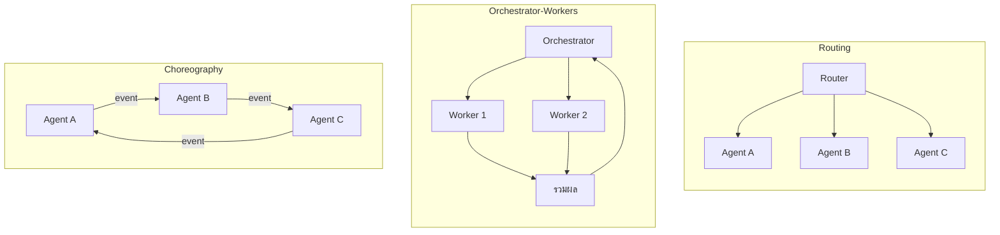
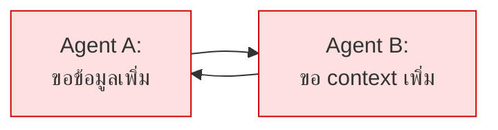

# Module 6 · Multi-Agent & Orchestration Patterns

**13:00 – 13:45** · เป้าหมาย: รู้จักรูปแบบการส่งต่องาน และรู้ว่า**เมื่อไหร่ไม่ควรใช้**

---

## 1. รูปแบบหลัก 3 แบบ



| รูปแบบ | ใครตัดสินใจ | เหมาะกับ | ความเสี่ยง |
|---|---|---|---|
| **Routing** | ตัวกลางตัวเดียว | งานที่แยกประเภทได้ชัด | routing ผิด = ผิดทั้งงาน |
| **Orchestrator-Workers** | ตัวกลางสั่งและรวมผล | งานที่แตกเป็นส่วนย่อยได้ | ต้นทุนประสานงานสูง |
| **Choreography** | ไม่มีใครคุม แต่ละตัวฟัง event | ระบบใหญ่ กระจายศูนย์ | **debug ยากมาก · loop ง่าย** |

---

## 2. ระบบนี้ใช้แบบไหน และทำไม

ระบบนี้ใช้ **ReAct loop ตัวเดียว** ซึ่งไม่ใช่ multi-agent เลย

เหตุผล:

| | ReAct loop ตัวเดียว (ที่ใช้) | Multi-agent |
|---|---|---|
| เรียก LLM ต่อคำถาม | N+2 ครั้ง (N = จำนวน tool call) | 5-8 ครั้ง โดยประมาณ |
| เวลาตอบ | เร็วกว่า (ไม่มีต้นทุนประสานงานข้าม agent) | ช้ากว่า |
| ทำงานข้ามระบบ | **ทำได้ดี** เพราะเห็น tool ครบพร้อมกันทุกรอบตัดสินใจ | ต้องประสานงานเพิ่ม |
| debug | ตามได้ตรงๆ ทีละ Thought | ต้องไล่หลายตัว |

> **19 tools บนโมเดลเดียวยังจัดการได้สบาย** ต้นทุนการประสานงานของ multi-agent จึงยังไม่คุ้ม
> ตัวเลข "N+2 ครั้ง" ไม่คงที่เหมือนตอนใช้ plan-then-execute (ที่เคยเป็น 2-3 ครั้งคงที่) — นี่คือ trade-off ที่ยอมรับเพื่อแลกกับการปรับตัวระหว่างทาง (Module 4 หัวข้อ 3)

`apps/agent-api/agent/orchestrator.py` มีเวอร์ชัน Orchestrator-Workers `uv run solutions/day2/workshop2_agent.py` ให้ **เพื่อเทียบ ไม่ใช่เพื่อใช้**

### เมื่อไหร่ที่ multi-agent เริ่มคุ้ม

- tool เกิน ~50 ตัว จนใส่ใน context พร้อมกันไม่ไหว
- แต่ละโดเมนต้องการ system prompt ที่ต่างกันมาก
- ต้องใช้โมเดลคนละตัวกับงานคนละแบบ
- ทีมคนละทีมดูแลคนละ agent และ deploy แยกกัน

---

## 3. การสื่อสารระหว่าง Agent

ไม่ว่าจะใช้รูปแบบไหน ข้อความที่ส่งต่อกันควรมีอย่างน้อย:

```python
class AgentMessage(BaseModel):
    from_agent: str
    to_agent: str
    task: str
    context: dict
    depth: int        # กัน loop
    trace_id: str     # ตามรอยได้ตลอดสาย
```

**`depth` และ `trace_id` ไม่ใช่ของเสริม** — ระบบ multi-agent ที่ไม่มีสองฟิลด์นี้จะกลายเป็นระบบที่ debug ไม่ได้ทันทีที่เกิดปัญหา

มาตรฐานที่กำลังก่อตัว: Agent2Agent (A2A), ACP — ยังเปลี่ยนเร็ว ควรออกแบบให้เปลี่ยนได้

---

## 4. Infinite Loop — ปัญหาที่ต้องกันตั้งแต่ต้น



### รูปแบบ loop ที่พบจริง

| รูปแบบ | ตัวอย่าง |
|---|---|
| ปิงปอง | สองตัวโยนงานกลับไปกลับมา |
| retry ไม่จบ | tool คืน "ไม่พบ" โมเดลตัดสินใจค้นใหม่ทุกครั้ง |
| fuzzing argument | เรียก tool เดิมโดยเปลี่ยน argument ไปเรื่อยๆ |
| วางแผนวน | re-plan แล้วได้แผนเดิม |

### กันด้วย 3 ชั้นพร้อมกัน

โปรเจกต์นี้ทำใน `apps/agent-api/agent/react.py` คลาส `LoopGuard`:

```python
1. total_steps > MAX_STEPS                    # งบรวม
2. เรียก tool เดิมด้วย argument เดิมซ้ำ         # ปิงปองและ retry
3. เรียก tool เดิมเกิน N ครั้ง                 # fuzzing argument
```

**ชั้นเดียวเอาไม่อยู่** — งบรวมอย่างเดียวยอมให้วน 8 รอบก่อนหยุด ซึ่งช้าและเปลือง

ทดสอบ:

```bash
uv run pytest tests/test_loop_guard.py -v
```

---

## 5. ทดลองเทียบด้วยตัวเอง (15 นาที)

รันคำถามเดียวกันสองแบบ แล้วเทียบ

```python
# แบบที่ใช้จริง - วนจนพอตอบ
async for event_type, payload in react.run(q):
    ...

# แบบ multi-agent - แค่ routing ครั้งเดียว
decision = await orchestrator.route(q)
```

โค้ดเต็มอยู่ที่ [`compare_q21.py`](../../compare_q21.py) ที่ root ของโปรเจกต์แล้ว รันตรงๆ ได้เลย:

```python
uv run compare_q21.py
```

> **หมายเหตุสำคัญ**: คอลัมน์ ReAct ในตารางคือต้นทุนของ **ทั้งคำถาม** (วนจนตอบได้) ส่วนคอลัมน์ Orchestrator เป็นแค่ **การตัดสินใจ routing ครั้งเดียว** ไม่ใช่ต้นทุนเต็มของ multi-agent (ที่ต้องมี worker ทำงานต่อด้วย) — สคริปต์บอกความต่างระดับนี้ไว้ในผลลัพธ์แล้ว อ่านให้ครบก่อนกรอกตาราง

| วัด | ReAct (ทั้งคำถาม) | Orchestrator (แค่ routing) |
|---|---|---|
| จำนวนครั้งที่เรียก LLM | | |
| token รวม | | |
| เวลารวม | | |
| ตอบถูกไหม | | |

ใช้คำถาม **Q21** จาก `data/questions/L3-three-source.yaml`:

> "ทำไมช่วงสองสัปดาห์นี้ถึงมีลูกค้าแจ้งเน็ตหลุดซ้ำๆ หลายราย"

**ทำไมต้องเป็นคำถามนี้** — Q21 คือคำถามระดับ **L3 (ยากสุด)** ของทั้งหลักสูตร ออกแบบมาให้ทดสอบสิ่งที่ single-agent ตัดสินใจทีละขั้นทำได้ แต่ routing ครั้งเดียวของ Orchestrator ทำไม่ได้:

- **ต้องใช้ครบ 3 แหล่งข้อมูล** (`postgres`, `neo4j`, `opensearch`) และต้องมี **citation** อ้างอิงว่าแต่ละข้อสรุปมาจากแหล่งไหน ไม่ใช่แค่สรุปลอยๆ
- **แผนต้องมี dependency เป็นลำดับ** ไม่ใช่ยิงขนานมั่ว — แต่ละขั้นต้องใช้ผลจากขั้นก่อนหน้า:
  1. `search_tickets` → หา ticket ในช่วง 14 วัน เพื่อรู้ว่าใครแจ้งบ้าง
  2. `get_upstream_devices` → เอาอุปกรณ์จาก ticket ไปหาจุดร่วมใน network topology (**ต้องรู้ผลข้อ 1 ก่อน**)
  3. `search_logs` → ตรวจ log ของจุดร่วมนั้นในช่วงเวลาเดียวกับ ticket (**ต้องรู้ผลข้อ 2 ก่อน**)
- **มีกับดักซ่อนอยู่**: ข้อความใน ticket ไม่มีคำว่า `APE-NBI-03` (คำตอบที่ถูกต้อง) อยู่เลยสักคำ — ถ้า agent ดูแค่ ticket ก็จะสรุปผิดว่าเป็นปัญหาฝั่งลูกค้า ต้องเชื่อม ticket → topology → log เข้าด้วยกันถึงจะเจอ root cause จริง (`must_not_contain: "ไม่ทราบสาเหตุ"`)

นี่คือเหตุผลที่ตารางเปรียบเทียบข้อ 5 นี้เห็นความต่างชัด: ReAct วนตัดสินใจได้ทีละขั้นตามที่ tool ก่อนหน้าคืนผลมา ส่วน Orchestrator ที่ routing ครั้งเดียวไม่มีทางวางแผน 3 ขั้นที่มี dependency แบบนี้ได้ตั้งแต่ต้น — ต้องมี worker มาทำงานต่อ ซึ่งนั่นคือต้นทุนที่ตารางนี้ยังไม่ได้นับ (ดูหมายเหตุด้านบน)

### วิธีอ่านผลลัพธ์จริงที่ได้จาก `uv run compare_q21.py`

ตัวอย่างผลจากรันจริงหนึ่งรอบ (ตัวเลขจะไม่เหมือนกันทุกครั้งเพราะ `temperature` ไม่ใช่ 0 ในเส้นทางนี้):

| วัด | ReAct | Orchestrator |
|---|---|---|
| จำนวนครั้งที่เรียก LLM | 8 | 1 |
| token รวม | 49,683 | 194 |
| เวลารวม | 14.94s | 0.72s |
| ตอบถูกไหม | ถูก | ถูก |

**สิ่งที่ต้องมองให้ออกจากตัวเลขนี้**:

1. **8 ครั้งพอดีเท่ากับ `MAX_STEPS` default** ([`agent/react.py`](../../apps/agent-api/agent/react.py) บรรทัดที่ตั้ง `AGENT_MAX_STEPS = 8`) — ถ้าจำนวนครั้งที่เรียก tool ชนเลข 8 พอดี ให้สงสัยว่า **LoopGuard ตัดจบเพราะชนงบรวม** ไม่ใช่ agent คิดจบได้เองตามธรรมชาติ ลองพิมพ์ `payload["thought"]` เต็มๆ (ไม่ตัดที่ 70 ตัวอักษร) ดูว่ารอบสุดท้าย agent สรุปคำตอบจริงหรือยังค้างอยู่ระหว่างทาง
2. **เส้นทางที่ agent เดินอาจไม่ตรงกับ `expected_plan_shape`** ใน yaml (3 ขั้นตรงๆ) — บางรอบ agent จะเดินอ้อม เช่น เรียก `search_tickets` ซ้ำ หรือไล่ `get_device_neighbors` หลายรอบ ก่อนจะถึงคำตอบ นี่คือของจริงของ ReAct ที่ Module 6 เตือนไว้ว่า "N+2 ครั้งไม่คงที่" ต่างจาก plan-then-execute
3. **แถว "ตอบถูกไหม" ในสคริปต์นี้เป็นแค่ placeholder** — ไปดูโค้ดจริงใน `compare_q21.py` จะเห็นว่ามันเช็คแค่ `any(tool call ที่สำเร็จ)` (ฝั่ง ReAct) กับ `len(specialists) > 0` (ฝั่ง Orchestrator) **ไม่ได้เทียบกับคำตอบที่ถูกต้องใน `expect.must_contain` ของ yaml เลย** ดังนั้นแม้ตารางจะโชว์ "ถูก" ทั้งคู่ ก็ไม่ได้แปลว่าคำตอบสุดท้ายมีคำว่า `APE-NBI-03` จริง — ต้องเปิด transcript เต็มดูคำตอบสุดท้ายเองถึงจะรู้ นี่คือเหตุผลที่ `make eval` (โจทย์ที่ 6) ถึงมีความหมายกว่าสคริปต์เดโมนี้ เพราะ `make eval` เช็คกับ ground truth จริง

---

## 6. ต่อไป

→ [Lab 2: Intent Gate](05-lab2-intent-gate.md) และ [Lab 3: Context Memory](06-lab3-context-memory.md)
