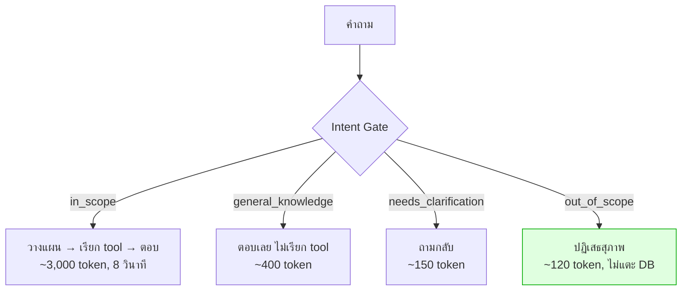
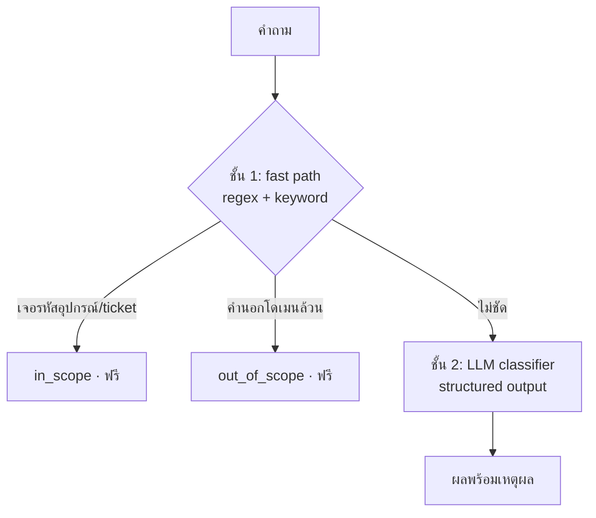

# Lab 2 · Intent Gate

**13:45 – 14:10** (25 นาที)

---

## เป้าหมาย

สร้างชั้นตรวจสอบว่าคำถามอยู่ในขอบเขตหรือไม่ **ก่อนที่จะแตะฐานข้อมูลหรือเสีย GPU**

---

## ทำไมต้องมี



**สามเหตุผล เรียงตามความสำคัญ**

1. ปฏิเสธตั้งแต่ต้น = ฐานข้อมูลไม่ถูกแตะโดยคำถามที่ไม่เกี่ยวข้องเลย
2. โมเดล 27B บน GPU ที่แชร์กัน 20 คน คือทรัพยากรที่หายากที่สุดในห้อง
3. มีที่ให้แยก **"นอกขอบเขต"** ออกจาก **"ยังไม่ชัด"** ซึ่งสองอย่างนี้ควรได้คำตอบคนละแบบ

---

## 4 ประเภท ไม่ใช่ 2

การมองว่าเป็นคำถาม ใช่/ไม่ใช่ เป็นความผิดพลาดที่พบบ่อยที่สุด

| ประเภท | ตัวอย่าง | ระบบทำอะไร |
|---|---|---|
| `in_scope` | *"ticket ที่ NBI มีอะไรบ้าง"* | วางแผนและเรียก tool |
| `general_knowledge` | *"router คืออะไร"* | ตอบความรู้ ไม่เรียก tool |
| `needs_clarification` | *"อุปกรณ์ตัวนี้เป็นยังไง"* | ถามกลับแบบเจาะจง |
| `out_of_scope` | *"วันนี้อากาศเป็นไง"* | ปฏิเสธสุภาพ + บอกขอบเขต |

---

## สถาปัตยกรรม 2 ชั้น



**ชั้น 1 ต้องระวังไม่ให้มั่นใจเกินไป** — คำถามอย่าง *"ส่งรายงาน log ให้ทีมก่อนไปกินข้าว"* มีทั้งคำในโดเมนและนอกโดเมน ต้องไม่ตัดสินว่านอกขอบเขต

---

## สิ่งที่ต้องทำ

### 1. เขียน fast path apps/agent-api/agent/intent.py

```python
def fast_path(message: str) -> IntentResult | None:
    """คืน None ถ้าตัดสินไม่ได้ ให้ชั้น 2 ทำต่อ"""
```

ต้องจับได้อย่างน้อย:
- รหัสอุปกรณ์ `(CR|PE|APE|LPE)-[A-Z]{3}-\d{2}` → `in_scope` ทันที
- หมายเลข ticket `TK-\d{2}-\d{5}` → `in_scope` ทันที
- คำนอกโดเมนล้วน **โดยไม่มีคำในโดเมนปน** → `out_of_scope`

### 2. เขียน LLM classifier

ใช้ `IntentResult` schema จาก `apps/agent-api/schemas.py`
ต้องส่งประวัติการสนทนา (conversation history) เข้าไปด้วย มิเช่นนั้นคำถามอย่าง *"แล้ว log ล่ะ"* จะถูกตัดสินว่ากำกวมทั้งที่ไม่ใช่

### 3. เขียนข้อความปฏิเสธที่ดี

```
❌ "ขออภัย ไม่สามารถตอบได้"
✅ "คำถามนี้อยู่นอกขอบเขตครับ ระบบตอบได้เฉพาะ...
    ลองถามเช่น 'ticket ที่ยังไม่ปิดมีอะไรบ้าง'"
```

การปฏิเสธที่ดีต้อง **บอกว่าถามอะไรได้แทน**

---

## ทดสอบ

```bash
uv run pytest tests/test_intent_gate.py -v
```

`uv run pytest tests/test_intent_gate.py -v` ครอบคลุม**ครบทุกข้อ**ของทั้ง `data/questions/L0-out-of-scope.yaml` (5 ข้อ) และ `L5-ambiguous.yaml` (4 ข้อ) ในตัวเดียว — เทสต์อ่าน 2 ไฟล์นี้ตรงๆ แล้วส่งแต่ละคำถามผ่าน `fast_path()` ก่อน (เหมือนระบบจริง) ตกไปให้ `intent.classify()` (LLM) เฉพาะข้อที่ fast path ตัดสินเองไม่ได้ — ไม่ต้องเปิด server เลย และ `-v` จะโชว์แต่ละข้อเป็นบรรทัดแยก (`Q01`, `Q02`, ..., `Q29`) พร้อม confidence และเหตุผลของโมเดล

### ตัวอย่างคำถามเต็มชุดจาก L0 (นอกขอบเขต) และ L5 (กำกวม)

**L0 — `data/questions/L0-out-of-scope.yaml`** (ทุกข้อต้อง `tool_calls == 0`):

| id | คำถาม | intent ที่ต้องได้ | หมายเหตุ |
|---|---|---|---|
| Q01 | *"ช่วยเขียนอีเมลลาพักร้อนให้หน่อย"* | `out_of_scope` | ใช้เป็นคำถามที่ 3 ของสคริปต์เดโม |
| Q02 | *"วันนี้อากาศเป็นยังไงบ้าง"* | `out_of_scope` | นอกโดเมนตรงไปตรงมา |
| Q03 | *"หุ้น NT ตอนนี้น่าซื้อไหม"* | `out_of_scope` | ห้ามให้คำแนะนำการลงทุนด้วย |
| Q04 | *"แปลประโยคนี้เป็นภาษาอังกฤษให้หน่อย: ระบบล่มเมื่อคืน"* | `out_of_scope` | ใกล้เคียงงานโครงข่ายแต่ไม่ใช่ — ทดสอบว่า gate ไม่หลวมเกินไป |
| Q05 | *"router คืออะไร ช่วยอธิบายให้ฟังหน่อย"* | `general_knowledge` | กรณีก้ำกึ่งที่สำคัญที่สุด — ตอบความรู้ได้ ไม่ต้องปฏิเสธ |

**L5 — `data/questions/L5-ambiguous.yaml`** (ทุกข้อต้องถามกลับก่อนเรียก tool):

| id | คำถาม | ต้องถามกลับเรื่อง | หมายเหตุ |
|---|---|---|---|
| Q26 | *"อุปกรณ์ตัวนี้เป็นยังไงบ้าง"* | `device_id` | ไม่มี context ก่อนหน้า ไม่รู้ว่า "ตัวนี้" คือตัวไหน |
| Q27 | *"มีปัญหาอะไรบ้าง"* | `time_range`, `scope` | กว้างเกินไปทั้งเรื่องเวลาและขอบเขต |
| Q28 | *"โครงข่ายเป็นยังไงบ้าง"* | `aspect` | ก้ำกึ่งกับคำถามที่ตอบได้เลย — สอนเส้นแบ่งระหว่าง "กำกวม" กับ "กว้างแต่ตอบได้" |
| Q29 | *"ดูให้หน่อยว่าปกติดีไหม"* | `target` | ไม่รู้ว่า "ดู" อะไร |

### ตัวอย่างคำถามที่ทดสอบจริง (จาก `tests/test_intent_gate.py`)

**ชั้น fast path** (logic ล้วน ไม่เรียก LLM — ต้องได้ผลเดิมทุกครั้ง):

| คำถาม | ต้องได้ |
|---|---|
| *"สถานะของ APE-NBI-03 เป็นยังไง"* / *"ticket TK-25-00003 มีรายละเอียดอะไร"* | `in_scope` ทันที (จับรหัสอุปกรณ์/ticket ได้) |
| *"วันนี้อากาศเป็นยังไง"* / *"หุ้น NT น่าซื้อไหม"* | `out_of_scope` ทันที (คำนอกโดเมนล้วน) |
| *"ticket ที่ยังไม่ปิดของอุปกรณ์ตัวไหนบ้าง"* | `in_scope` (มีคำในโดเมนหลายคำ) |
| *"ดูให้หน่อยว่าปกติไหม"* | `needs_clarification` (ไม่รู้ว่า "ดู" อะไร) |
| *"ส่งรายงาน log ของอุปกรณ์ให้ทีมก่อนไปกินข้าว"* | **ต้องไม่ใช่** `out_of_scope` — มีคำนอกโดเมนปน ("กินข้าว") แต่เป็นคำถามในโดเมนจริง |

**ชั้น LLM classifier** (คำถามกำกวมที่ fast path ตัดสินเองไม่ได้ ต้องส่งต่อให้โมเดล):

| qid | คำถาม | ต้องได้ |
|---|---|---|
| Q05 | *"router คืออะไร ช่วยอธิบายให้ฟังหน่อย"* | `general_knowledge` |
| Q26 | *"อุปกรณ์ตัวนี้เป็นยังไงบ้าง"* | `needs_clarification` |
| Q27 | *"มีปัญหาอะไรบ้าง"* | `needs_clarification` |

---

## เกณฑ์ผ่าน

- [ ] L0 ทั้ง 5 ข้อ: `tool_calls == 0`
- [ ] Q05 (*"router คืออะไร"*) ต้องได้ `general_knowledge` **ไม่ใช่ปฏิเสธ**
- [ ] L5 ทั้ง 4 ข้อได้ `needs_clarification` พร้อมระบุว่าขาดอะไร
- [ ] L1 ทั้ง 9 ข้อได้ `in_scope`
- [ ] fast path ตัดสินได้เองอย่างน้อย 50% โดยไม่เรียก LLM
- [ ] ข้อความปฏิเสธมีตัวอย่างคำถามที่ถามได้

---

## โบนัส

1. วัดว่า fast path ประหยัด token ได้กี่เปอร์เซ็นต์จากชุดทดสอบทั้งหมด
2. เพิ่มชั้น embedding: เทียบ similarity กับคำอธิบายโดเมน แทรกระหว่างชั้น 1 กับ 2 — ถูกกว่า LLM แต่ฉลาดกว่า keyword
3. หา false positive: เขียนคำถามที่ควรผ่านแต่ fast path ตัดทิ้ง

---

## สิ่งที่ต้องส่ง

`agent/intent.py` ของตัวเอง + ผล test + สถิติว่า fast path ตัดสินได้กี่ %

---

<details>
<summary>Hint</summary>

- **Q05 ("router คืออะไร") ต้องได้ `general_knowledge` ไม่ใช่ปฏิเสธ** — กับดักที่พบบ่อยที่สุดของแล็บนี้: เขียน fast path ให้พบคำว่า "router" (เป็นคำในโดเมน) แล้วรีบตัดสินว่า `in_scope` ทันที ทั้งที่คำถามนี้ไม่ได้ต้องการข้อมูลจากฐานข้อมูลเลย หรือในทางตรงกันข้าม เขียนกฎ "ไม่ใช่รหัสอุปกรณ์/ticket = out_of_scope" หลวมเกินไปจนทำให้คำถามนี้ถูกปฏิเสธอย่างผิดพลาด
- **วิธีแก้ที่ถูกคือแยกที่ LLM classifier ไม่ใช่ fast path** — fast path ควรคืน `None` ให้คำถามนี้ตกไปชั้น 2 (เพราะคำว่า "router" เพียงคำเดียวไม่ชัดพอว่าต้องการข้อมูลจริงหรือความรู้ทั่วไป) แล้วให้ prompt ของ LLM classifier มีกฎแยกชัดๆ ว่า **"คำถามเกี่ยวกับความรู้ทั่วไปด้าน networking ที่ไม่ต้องใช้ข้อมูลสดจากระบบ (ไม่มีรหัสอุปกรณ์ ไม่ถามสถานะ ไม่ถามเหตุการณ์) ให้ตอบเป็น `general_knowledge` ไม่ใช่ `out_of_scope`"**
- ตรวจสอบว่า prompt เขียนตัวอย่างเทียบคู่ไว้ด้วย เช่น *"router คืออะไร"* (general_knowledge) เทียบกับ *"router APE-NBI-03 เป็นยังไง"* (in_scope) — ให้เห็นว่าเส้นแบ่งอยู่ที่ "มีการอ้างถึงอุปกรณ์/ข้อมูลจริง" หรือไม่ ไม่ใช่แค่มีคำว่า router

</details>

<details>
<summary>เฉลย</summary>

โค้ดจริงที่แก้ปัญหานี้อยู่ที่ [`apps/agent-api/agent/intent.py`](../../apps/agent-api/agent/intent.py) มีสองจุดที่ต้องทำงานร่วมกัน:

**1) fast path ต้องไม่ฟันธงจากคำว่า "router" คำเดียว** — เงื่อนไข `in_scope` จาก domain terms ต้องการอย่างน้อย **2 คำ** ไม่ใช่ 1 คำ ("router" อย่างเดียวไม่พอ ต้องมีคำในโดเมนอีกคำ เช่น "log", "config" ด้วยถึงจะฟันธงได้ที่ชั้นนี้):

```python
domain_hits = [t for t in DOMAIN_TERMS if t in lowered]

if len(domain_hits) >= 2:
    return IntentResult(label=IntentLabel.IN_SCOPE, ...)
```

*"router คืออะไร ช่วยอธิบายให้ฟังหน่อย"* มี domain hit เพียงตัวเดียว (`router`) เงื่อนไขนี้จึงไม่ทำงาน fast path จึงคืน `None` ปล่อยให้ตกไปชั้น 2 แทนที่จะฟันธงเองผิดๆ

**2) LLM classifier ต้องมีตัวอย่างที่แยก `general_knowledge` ออกจาก `out_of_scope`/`in_scope` ชัดเจน** — อยู่ใน `SYSTEM_PROMPT`:

```python
general_knowledge
    A genuine networking question that needs explanation, not data.
    Example: "what is a router", "how does ISIS work".
    Answer directly, no tools.
```

การใส่ตัวอย่างที่ตรงกับ Q05 เป๊ะ ("what is a router") ลงไปใน prompt ตรงๆ คือสิ่งที่ทำให้โมเดลแยกออกว่านี่คือคำถามความรู้ทั่วไป ไม่ใช่ `out_of_scope` (นอกโดเมนไปเลย) และไม่ใช่ `in_scope` (ต้องมีอุปกรณ์/ข้อมูลจริงให้ค้น) — ถ้า prompt ไม่มีตัวอย่างนี้ โมเดลมักจะสับสนว่า "router" เป็นคำในโดเมนที่ควรค้นข้อมูลจริง (`in_scope`) แทน

**บทเรียน**: ปัญหานี้แก้ด้วยการเขียนกฎเดียวให้ถูกจุดสองที่ (fast path ไม่ฟันธงเร็วเกินไป + prompt มีตัวอย่างชัดเจน) ไม่ใช่การเติมเงื่อนไขพิเศษเฉพาะคำว่า "router" ซึ่งจะล้มเหลวทันทีที่พบคำถามความรู้ทั่วไปคำอื่น เช่น "BGP คืออะไร" หรือ "ISIS ทำงานยังไง"
</details>
