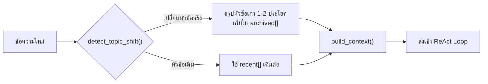

# Module 8 · Memory

**14:15 – 14:45** (30 นาที) · เป้าหมาย: ให้ Agent จำบทสนทนาข้าม turn ได้ โดยไม่ปล่อยให้ context โตจนเกินงบที่คุยไว้ใน Module 1

---

## 1. ปัญหาที่ ReAct loop เพียงอย่างเดียวไม่ได้แก้

Loop ที่เขียนใน Module 5 รับคำถามทีละครั้งแบบแยกอิสระ ไม่มีอะไรจำว่า turn ก่อนหน้าคุยเรื่องอะไรไว้ ถ้าผู้ใช้ถามต่อว่า *"แล้วอุปกรณ์ที่เจอมีกี่ตัว"* โดยไม่ระบุรายละเอียดซ้ำ Agent จะไม่มีทางรู้ว่า "ที่เจอ" หมายถึงอะไร

ทางแก้ที่ตรงไปตรงมาที่สุด — ส่ง `scratchpad` ทั้งหมดของทุก turn ที่ผ่านมากลับเข้าไปทุกครั้ง — สร้างปัญหาใหม่ทันที: context โตขึ้นเรื่อยๆ ไม่มีเพดาน ย้อนกลับไปที่งบ token จำกัดต่อ request ที่คุยไว้ใน [Module 1](../day1/01-module1-llm-basics.md) โดยตรง

โค้ดจริงที่แก้ปัญหานี้คือ [`apps/agent-api/agent/memory.py`](../../apps/agent-api/agent/memory.py) — แนวคิดคือ **เก็บเฉพาะ turn ล่าสุดแบบเต็ม ส่วนหัวข้อเก่าที่คุยจบไปแล้วให้สรุปเหลือ 1-2 ประโยคแทนที่จะแบกไปทั้งดุ้น**



---

## 2. `detect_topic_shift()` — 3 สัญญาณ เรียงจากถูกไปแพง

โค้ดจริงจาก [`agent/memory.py:99-122`](../../apps/agent-api/agent/memory.py:99):

| ลำดับ | สัญญาณ | ตัวอย่าง |
|---|---|---|
| 1 | ผู้ใช้บอกเปลี่ยนเรื่องเอง (regex ตรง) | "เปลี่ยนเรื่องนะ", "อีกเรื่องหนึ่ง" |
| 2 | entity ที่พูดถึงไม่ overlap กับหัวข้อเดิม | หัวข้อเดิมพูดถึง `APE-NBI-03` turn ใหม่พูดถึง `PE-BKK-02` |
| 3 | cosine similarity ของ embedding ต่ำกว่าเกณฑ์ | ข้อความไม่มี entity ชัดเจน แต่เนื้อหาห่างจากหัวข้อเดิมมาก |

ตรวจสัญญาณที่ถูกก่อนเสมอ (regex ก่อน embedding) เพราะ embedding ต้องเรียก API ภายนอก มีต้นทุนสูงกว่า — หลักการเดียวกับ `fast_path`/`classify` สองชั้นของ Intent Gate ใน Module 7

ค่าที่ควบคุมพฤติกรรมนี้อยู่ใน `.env.example`:

```
MEMORY_TOPIC_SHIFT_THRESHOLD=0.3   # cosine similarity ต่ำกว่านี้ = เปลี่ยนหัวข้อ
MEMORY_WINDOW_TURNS=6              # จำนวน turn ล่าสุดที่เก็บแบบเต็ม ก่อนถูกสรุป
```

---

## 3. `build_context()` — ส่งอะไรเข้าโมเดลในแต่ละ turn

```python
def build_context(self) -> list[dict]:
    messages: list[dict] = []
    if self.archived:
        messages.append({
            "role": "system",
            "content": "สรุปเรื่องที่คุยกันไปก่อนหน้านี้ (คนละหัวข้อกับตอนนี้):\n"
                        + "\n".join(f"- {s}" for s in self.archived[-5:]),
        })
    messages.extend(self.recent)
    return messages
```

**สังเกต**: หัวข้อเก่าไม่เคยหายไปทั้งหมด — มันถูกบีบเหลือ 1-2 ประโยคแล้วเก็บไว้ใน `archived[]` เผื่อผู้ใช้ย้อนกลับมาถามเรื่องเดิมอีกใน turn ถัดๆ ไป นี่คือความต่างระหว่าง "ลืม" กับ "จำแบบย่อ"

---

## แบบฝึกหัด: ทดสอบ Memory กับบทสนทนา 3 turn

```bash
uv run python -c "
import asyncio, sys
from dotenv import load_dotenv; load_dotenv()
sys.path.insert(0, 'apps/agent-api')
from agent import memory as agent_memory

async def main():
    session = agent_memory.get('workshop-test-session')

    turns = [
        'ticket ของ APE-NBI-03 มีอะไรบ้าง',        # หัวข้อแรก
        'แล้ว log ของอุปกรณ์นี้ล่ะ',                  # หัวข้อเดิม (ไม่มี entity ใหม่ แต่ไม่ควรเปลี่ยน)
        'เปลี่ยนเรื่องนะ ช่วยดู PE-BKK-02 ให้หน่อย',    # เปลี่ยนหัวข้อจริง
    ]

    for i, msg in enumerate(turns, 1):
        session.turn += 1
        changed, why = session.detect_topic_shift(msg)
        print(f'turn {i}: changed={str(changed):5} | {why}')
        if changed:
            await session.start_topic(msg)
        session.add_turn('user', msg)

    print()
    print('archived summaries:', session.archived)
    print('context_tokens ปัจจุบัน:', session.context_tokens())

asyncio.run(main())
"
```

### สิ่งที่ต้องสังเกต

- [ ] turn 1: `changed=True` เสมอ (ยังไม่มีหัวข้อมาก่อน)
- [ ] turn 2: ควรเป็น `changed=False` (ยังพูดถึงอุปกรณ์เดิม แม้ไม่ได้เอ่ยรหัสซ้ำ)
- [ ] turn 3: `changed=True` เพราะ entity เปลี่ยนจาก `APE-NBI-03` เป็น `PE-BKK-02` และ `archived[]` ควรมีสรุปของหัวข้อแรกปรากฏขึ้น

---

## สิ่งที่ต้องส่ง

ผลลัพธ์การรันสคริปต์ข้างต้น พร้อมระบุว่า turn ใดถูกตรวจพบว่าเปลี่ยนหัวข้อ และเนื้อหาของ `archived[]` ที่ได้

---

## ต่อไป

→ [Workshop 2: ReAct Agent สำหรับ NOC](06-workshop2-noc-agent.md)
