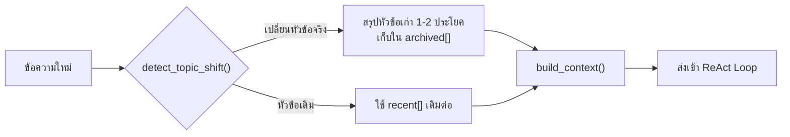

# Module 8 · Memory

**14:15 – 14:45** (30 นาที) · เป้าหมาย: ให้ Agent จำบทสนทนาข้าม turn ได้ โดยไม่ปล่อยให้ context โตจนเกินงบที่คุยไว้ใน Module 1

---

## 1. ปัญหาที่ ReAct loop เพียงอย่างเดียวไม่ได้แก้

Loop ที่เขียนใน Module 5 รับคำถามทีละครั้งแบบแยกอิสระ ไม่มีอะไรจำว่า turn ก่อนหน้าคุยเรื่องอะไรไว้ ถ้าผู้ใช้ถามต่อว่า *"แล้วอุปกรณ์ที่เจอมีกี่ตัว"* โดยไม่ระบุรายละเอียดซ้ำ Agent จะไม่มีทางรู้ว่า "ที่เจอ" หมายถึงอะไร

ทางแก้ที่ตรงไปตรงมาที่สุด — ส่ง `scratchpad` ทั้งหมดของทุก turn ที่ผ่านมากลับเข้าไปทุกครั้ง — สร้างปัญหาใหม่ทันที: context โตขึ้นเรื่อยๆ ไม่มีเพดาน ย้อนกลับไปที่งบ token จำกัดต่อ request ที่คุยไว้ใน [Module 1](../day1/01-module1-llm-basics.md) โดยตรง

โค้ดจริงที่แก้ปัญหานี้คือ [`apps/agent-api/agent/memory.py`](../../apps/agent-api/agent/memory.py) — แนวคิดคือ **เก็บเฉพาะ turn ล่าสุดแบบเต็ม ส่วนหัวข้อเก่าที่คุยจบไปแล้วให้สรุปเหลือ 1-2 ประโยคแทนที่จะแบกไปทั้งดุ้น**



---

## 2. `detect_topic_shift()` — 3 สัญญาณ เรียงจากถูกไปแพง

โค้ดจริงจาก [`agent/memory.py:99-122`](../../apps/agent-api/agent/memory.py:99):

| ลำดับ | สัญญาณ | ตัวอย่าง |
|---|---|---|
| 1 | ผู้ใช้บอกเปลี่ยนเรื่องเอง (regex ตรง) | "เปลี่ยนเรื่องนะ", "อีกเรื่องหนึ่ง" |
| 2 | entity ที่พูดถึงไม่ overlap กับหัวข้อเดิม | หัวข้อเดิมพูดถึง `APE-NBI-03` turn ใหม่พูดถึง `PE-BKK-02` |
| 3 | cosine similarity ของ embedding ต่ำกว่าเกณฑ์ | ข้อความไม่มี entity ชัดเจน แต่เนื้อหาห่างจากหัวข้อเดิมมาก |

ตรวจสัญญาณที่ถูกก่อนเสมอ (regex ก่อน embedding) เพราะ embedding ต้องเรียก API ภายนอก มีต้นทุนสูงกว่า — หลักการเดียวกับ `fast_path`/`classify` สองชั้นของ Intent Gate ใน Module 7

ค่าที่ควบคุมพฤติกรรมนี้อยู่ใน `.env.example`:

```
MEMORY_TOPIC_SHIFT_THRESHOLD=0.3   # cosine similarity ต่ำกว่านี้ = เปลี่ยนหัวข้อ
MEMORY_WINDOW_TURNS=6              # จำนวน turn ล่าสุดที่เก็บแบบเต็ม ก่อนถูกสรุป
```

### ตัวอย่างโค้ดสัญญาณที่ 3: วัด cosine similarity ตรงๆ (copy ไปรันได้ทันที)

สัญญาณที่ 1-2 (regex, entity overlap) ถูกสาธิตแล้วในแบบฝึกหัดท้ายไฟล์ ส่วนสัญญาณที่ 3 (embedding) ยังไม่เคยถูกเรียกใช้จริงในตัวอย่างไหนเลย — ตัวอย่างนี้เรียก `_embed()`/`_cosine()` ตรงๆ แบบเดียวกับที่ `cosine.py` ทำใน [Module 2a วันที่ 1](../day1/02-module2a-pg-vec.md) เพื่อดูตัวเลข similarity จริงเทียบกับเกณฑ์:

```bash
uv run python -c "
import sys
from dotenv import load_dotenv; load_dotenv()
sys.path.insert(0, 'apps/agent-api')
from agent.memory import _embed, _cosine

topic_a = 'ตรวจสอบ ticket ของอุปกรณ์ APE-NBI-03 พบว่ามีปัญหา link down เมื่อคืนนี้ กำลังหาสาเหตุจาก log ของอุปกรณ์'
candidates = [
    ('เรื่องเดิม ต่อยอด', 'log ของ APE-NBI-03 พบ error เกี่ยวกับ optical power ต่ำกว่าเกณฑ์ช่วงเวลาเดียวกัน'),
    ('เรื่องใหม่ เครือข่ายอื่น', 'ขอดูรายงานสุขภาพของ PE-BKK-02 ประจำสัปดาห์นี้หน่อย'),
    ('เรื่องใหม่ นอกโดเมนสิ้นเชิง', 'วันหยุดสุดสัปดาห์นี้อยากไปเที่ยวทะเล มีที่ไหนแนะนำบ้าง'),
]

vec_a = _embed(topic_a)
threshold = 0.3
for label, msg in candidates:
    vec_b = _embed(msg)
    similarity = _cosine(vec_a, vec_b)
    shift = 'เปลี่ยนหัวข้อ' if similarity < threshold else 'หัวข้อเดิม'
    print(f'similarity = {similarity:.4f}  -> {shift} (เกณฑ์ {threshold})')
    print(f'  [{label}] {msg}')
    print('-' * 60)
"
```

**ผลลัพธ์จริง** (รันจริงตอนเตรียมเอกสารนี้):

```
similarity = 0.7028  -> หัวข้อเดิม (เกณฑ์ 0.3)
  [เรื่องเดิม ต่อยอด] log ของ APE-NBI-03 พบ error เกี่ยวกับ optical power ต่ำกว่าเกณฑ์ช่วงเวลาเดียวกัน
------------------------------------------------------------
similarity = 0.5009  -> หัวข้อเดิม (เกณฑ์ 0.3)
  [เรื่องใหม่ เครือข่ายอื่น] ขอดูรายงานสุขภาพของ PE-BKK-02 ประจำสัปดาห์นี้หน่อย
------------------------------------------------------------
similarity = 0.2703  -> เปลี่ยนหัวข้อ (เกณฑ์ 0.3)
  [เรื่องใหม่ นอกโดเมนสิ้นเชิง] วันหยุดสุดสัปดาห์นี้อยากไปเที่ยวทะเล มีที่ไหนแนะนำบ้าง
------------------------------------------------------------
```

**สังเกต** — ผลลัพธ์นี้เผยข้อจำกัดของสัญญาณที่ 3 ที่ตารางด้านบนไม่ได้บอกไว้: ข้อความที่สองพูดถึง **คนละอุปกรณ์คนละไซต์** (`PE-BKK-02` แทน `APE-NBI-03`) แต่ similarity ยังสูงถึง 0.50 เพราะเนื้อหาโดยรวมยังอยู่ในโดเมนเครือข่ายเดียวกัน (พูดถึง "รายงานสุขภาพอุปกรณ์" เหมือนกัน) — **สัญญาณที่ 3 อย่างเดียวจะไม่จับว่านี่คือการเปลี่ยนหัวข้อ** นี่คือเหตุผลว่าทำไม `detect_topic_shift()` ถึงต้องเช็ค**สัญญาณที่ 2 (entity overlap) ก่อน**เสมอ — เพราะรหัสอุปกรณ์ที่ต่างกันคือหลักฐานที่ชัดเจนกว่าความคล้ายเชิงความหมายของเนื้อหาโดยรวม สัญญาณที่ 3 จึงทำหน้าที่เป็นตาข่ายสำรอง (fallback) สำหรับกรณีที่ข้อความไม่มี entity ให้เทียบเลย ไม่ใช่สัญญาณหลัก

---

## 3. `build_context()` — ส่งอะไรเข้าโมเดลในแต่ละ turn

```python
def build_context(self) -> list[dict]:
    messages: list[dict] = []
    if self.archived:
        messages.append({
            "role": "system",
            "content": "สรุปเรื่องที่คุยกันไปก่อนหน้านี้ (คนละหัวข้อกับตอนนี้):\n"
                        + "\n".join(f"- {s}" for s in self.archived[-5:]),
        })
    messages.extend(self.recent)
    return messages
```

**สังเกต**: หัวข้อเก่าไม่เคยหายไปทั้งหมด — มันถูกบีบเหลือ 1-2 ประโยคแล้วเก็บไว้ใน `archived[]` เผื่อผู้ใช้ย้อนกลับมาถามเรื่องเดิมอีกใน turn ถัดๆ ไป นี่คือความต่างระหว่าง "ลืม" กับ "จำแบบย่อ"

### ตัวอย่างโค้ด `_summarise_topic()`: ตัวที่สร้างสรุปใน `archived[]` (copy ไปรันได้ทันที)

`archived[]` แต่ละบรรทัดไม่ได้มาลอยๆ — `_summarise_topic()` เรียก LLM ด้วย system prompt เฉพาะเพื่อบีบบทสนทนาทั้ง turn ให้เหลือ 1-2 ประโยค (ต่างจาก `classify()` ใน Module 7 ตรงที่ตัวนี้ใช้ `llm.complete()` ธรรมดา **ไม่ใช่** `complete_structured()` เพราะผลลัพธ์เป็นข้อความอิสระ ไม่ใช่ JSON ที่มี schema ตายตัว):

```bash
uv run python -c "
import asyncio, sys
from dotenv import load_dotenv; load_dotenv()
sys.path.insert(0, 'apps/agent-api')
from agent import llm

SUMMARY_PROMPT = (
    'สรุปบทสนทนาต่อไปนี้ให้เหลือ 1-2 ประโยคภาษาไทย '
    'โดยต้องเก็บ: อุปกรณ์หรือพื้นที่ที่พูดถึง และข้อสรุปที่ได้ '
    'ถ้ายังไม่ได้ข้อสรุปให้บอกว่ายังไม่ได้ข้อสรุป '
    'ตอบเฉพาะบทสรุป ไม่ต้องมีคำนำ'
)

async def summarise(transcript: str) -> str:
    messages = [
        {'role': 'system', 'content': SUMMARY_PROMPT},
        {'role': 'user', 'content': transcript},
    ]
    return await llm.complete(messages, temperature=0.1, max_tokens=200)

async def main():
    conversations = [
        'user: ticket ของ APE-NBI-03 มีอะไรบ้าง\\nassistant: พบ ticket TK-25-00042 เรื่อง link down ที่ APE-NBI-03 ยังไม่ปิดเคส\\nuser: แล้ว log ของอุปกรณ์นี้ล่ะ\\nassistant: พบ error optical power ต่ำกว่าเกณฑ์ช่วงเวลาเดียวกับที่ ticket แจ้ง',
        'user: ช่วยดูสถานะ PE-BKK-02 ให้หน่อย\\nassistant: กำลังตรวจสอบให้ครับ ขอเวลาสักครู่',
    ]
    for convo in conversations:
        summary = await summarise(convo)
        print('บทสนทนา:')
        for line in convo.split(chr(10)):
            print(f'  {line}')
        print(f'สรุป: {summary}')
        print('-' * 60)

asyncio.run(main())
"
```

**ผลลัพธ์จริง** (รันจริงตอนเตรียมเอกสารนี้):

```
บทสนทนา:
  user: ticket ของ APE-NBI-03 มีอะไรบ้าง
  assistant: พบ ticket TK-25-00042 เรื่อง link down ที่ APE-NBI-03 ยังไม่ปิดเคส
  user: แล้ว log ของอุปกรณ์นี้ล่ะ
  assistant: พบ error optical power ต่ำกว่าเกณฑ์ช่วงเวลาเดียวกับที่ ticket แจ้ง
สรุป: ticket APE-NBI-03 พบปัญหา
------------------------------------------------------------
บทสนทนา:
  user: ช่วยดูสถานะ PE-BKK-02 ให้หน่อย
  assistant: กำลังตรวจสอบให้ครับ ขอเวลาสักครู่
สรุป: อุปกรณ์ที่พูดถึงคือ PE-BKK-02 ยังไม่ได้ข้อสรุปเกี่ยวกับสถานะของอุปกรณ์นี้
------------------------------------------------------------
```

**สังเกต**: บทสนทนาที่สองไม่มีข้อสรุปใดๆ เกิดขึ้นจริง (assistant แค่บอกว่ากำลังตรวจสอบ) — สรุปที่ได้จึงระบุตรงๆ ว่า **"ยังไม่ได้ข้อสรุป"** ตามที่ system prompt สั่งไว้ แทนที่จะเดาหรือแต่งข้อสรุปขึ้นมาเอง ส่วนบทสนทนาแรกแม้จะเก็บชื่ออุปกรณ์ (`APE-NBI-03`) ได้ถูกต้อง แต่สรุป "พบปัญหา" ยังกว้างเกินไป ไม่ได้ระบุว่าเป็น `link down`/`optical power` ตามที่ system prompt ขอให้เก็บ "ข้อสรุปที่ได้" ไว้ด้วย — เป็นตัวอย่างจริงว่าทำไมการสรุปด้วย LLM (ไม่มี schema บังคับ) จึงคาดเดาคุณภาพผลลัพธ์ได้ยากกว่า `complete_structured()` ใน Module 7

---

## แบบฝึกหัด: ทดสอบ Memory กับบทสนทนา 3 turn

```bash
uv run python -c "
import asyncio, sys
from dotenv import load_dotenv; load_dotenv()
sys.path.insert(0, 'apps/agent-api')
from agent import memory as agent_memory

async def main():
    session = agent_memory.get('workshop-test-session')

    turns = [
        'ticket ของ APE-NBI-03 มีอะไรบ้าง',        # หัวข้อแรก
        'แล้ว log ของอุปกรณ์นี้ล่ะ',                  # หัวข้อเดิม (ไม่มี entity ใหม่ แต่ไม่ควรเปลี่ยน)
        'เปลี่ยนเรื่องนะ ช่วยดู PE-BKK-02 ให้หน่อย',    # เปลี่ยนหัวข้อจริง
    ]

    for i, msg in enumerate(turns, 1):
        session.turn += 1
        changed, why = session.detect_topic_shift(msg)
        print(f'turn {i}: changed={str(changed):5} | {why}')
        if changed:
            await session.start_topic(msg)
        session.add_turn('user', msg)

    print()
    print('archived summaries:', session.archived)
    print('context_tokens ปัจจุบัน:', session.context_tokens())

asyncio.run(main())
"
```

### สิ่งที่ต้องสังเกต

- [ ] turn 1: `changed=True` เสมอ (ยังไม่มีหัวข้อมาก่อน)
- [ ] turn 2: ควรเป็น `changed=False` (ยังพูดถึงอุปกรณ์เดิม แม้ไม่ได้เอ่ยรหัสซ้ำ)
- [ ] turn 3: `changed=True` เพราะ entity เปลี่ยนจาก `APE-NBI-03` เป็น `PE-BKK-02` และ `archived[]` ควรมีสรุปของหัวข้อแรกปรากฏขึ้น

---

## สิ่งที่ต้องส่ง

ผลลัพธ์การรันสคริปต์ข้างต้น พร้อมระบุว่า turn ใดถูกตรวจพบว่าเปลี่ยนหัวข้อ และเนื้อหาของ `archived[]` ที่ได้

---

## ต่อไป

→ [Workshop 2: ReAct Agent สำหรับ NOC](06-workshop2-noc-agent.md)
