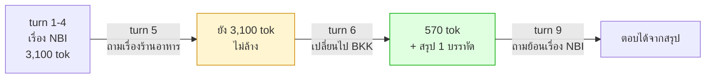

# Lab 3 · Context Memory และการตรวจจับการเปลี่ยนเรื่อง

**14:10 – 14:30** (20 นาที)

---

## เป้าหมาย

ทำให้ขนาด context **ลดลงเมื่อผู้ใช้เปลี่ยนเรื่อง** แทนที่จะโตขึ้นเรื่อยๆ โดยยังตอบเรื่องเก่าได้อยู่

---

## สิ่งที่ต้องเกิดขึ้น



**จุดที่คนพลาดมากที่สุดคือ turn 5** — คำถามนอกขอบเขตไม่ใช่การเปลี่ยนเรื่อง ผู้ใช้แค่แทรกคำถามเล่นๆ การล้าง context ตรงนั้นคือการทำร้ายผู้ใช้

---

## สิ่งที่ต้องทำ

### 1. ตรวจจับการเปลี่ยนเรื่อง — 3 สัญญาณ เรียงจากถูกไปแพง

```python
def detect_topic_shift(self, message: str) -> tuple[bool, str]:
    # 1. ผู้ใช้บอกเอง          — ฟรี
    # 2. entity คนละพื้นที่     — ฟรี
    # 3. cosine similarity ต่ำ  — 1 embedding call
```

**อย่าเริ่มจาก embedding** ถ้าสองสัญญาณแรกตอบได้แล้ว

### 2. สรุปก่อนทิ้ง

เมื่อเปลี่ยนเรื่อง ต้องสรุปเรื่องเก่าเหลือ 1-2 ประโยค **โดยเก็บอุปกรณ์/พื้นที่ที่พูดถึง และข้อสรุปที่ได้** แล้วค่อยทิ้ง detail ทั้งหมด

```
[LPE-NBI-11, APE-NBI-03] พบว่า ticket เน็ตหลุด 3 ใบมี upstream ร่วมกันคือ APE-NBI-03 ซึ่งมี log flapping ตรงกับช่วงเวลา
```

### 3. ประกอบ context ที่ส่งเข้าโมเดล

```
[system] สรุปเรื่องที่คุยไปแล้ว: ...     ← ท้ายๆ ที่โมเดลจำได้ดี
[recent turns ของหัวข้อปัจจุบัน]
[คำถามล่าสุด]                          ← ท้ายสุด
```

โยงกลับ Module 2: วางสิ่งสำคัญไว้ต้นหรือท้าย ไม่ใช่กลาง

### 4. เปิดให้ตรวจสอบได้

```
GET /sessions/{id}/memory
```
### 5. ตรวจสอบ

```
http://localhost:8080/sessions/default/memory
```

`apps/chainlit-ui/app.py` ตอนนี้ hardcode `session_id = "default"` ไว้ให้ทุกคนใช้ session เดียวกัน ([app.py:73](../../apps/chainlit-ui/app.py)) เพื่อให้เปิด URL ข้างบนแล้วเห็นผลลัพธ์ตรงกับที่เพิ่งคุยผ่าน UI ทันที โดยไม่ต้องหา session_id เอง — ถ้าจะแยกความจำของแต่ละคนออกจากกันจริง (เช่นตอน deploy ใช้งานจริงหลายคนพร้อมกัน) ให้เปลี่ยนบรรทัดนั้นเป็น `session_id = cl.user_session.get("session_id") or "default"` แทน

> **⚠️ ความจำหายเมื่อ agent-api restart** — `agent/memory.py` เก็บ state ไว้ใน process memory ล้วนๆ ไม่ได้ persist ลง disk หรือฐานข้อมูลใดๆ ดังนั้นทุกครั้งที่ agent-api หยุด/restart (รวมถึง `--reload` auto-restart ตอนแก้ไฟล์ `.py`) **ทุก session ถูกล้างว่างหมด** ถ้าเปิด URL นี้แล้วเจอ `"recent_turns": []` ทั้งที่เพิ่งคุยไป ให้เช็คก่อนว่า agent-api เพิ่งถูก restart ไปหรือเปล่า ไม่ใช่ endpoint พัง

**สำคัญ** — กลไกความจำมองจากภายนอกไม่เห็น ถ้าไม่มี endpoint นี้ก็ debug ไม่ได้และเรียนรู้ไม่ได้

> `GET /sessions/{id}/memory` บอกแค่ **สถานะล่าสุด** ณ ตอนที่เรียก ไม่มี endpoint ไหนคืน "ประวัติทั้งหมด" ให้ในทีเดียว — ถ้าอยากเห็นว่า context โต/หดยังไงตลอดบทสนทนา (เช่นตอนทำโจทย์ที่ 4) ต้องเรียกซ้ำเองหลังทุก turn แล้วเก็บผลไว้เอง

---

## ทดสอบ

```bash
uv run pytest tests/test_topic_shift.py -v
```

ใช้บทสนทนา 10 turn จาก `data/questions/L4-conversation.yaml`

### บทสนทนาเต็ม 10 turn

| turn | คำถาม | จุดที่ทดสอบ |
|---|---|---|
| 1 | *"ticket ที่ยังไม่ปิดของนนทบุรีมีอะไรบ้าง"* | เริ่มหัวข้อใหม่ (`site:NBI`) |
| 2 | *"ใบแรกเกี่ยวกับอุปกรณ์ตัวไหน"* | อ้างอิงย้อนหลัง — ไม่มี memory จะถามกลับว่า "ใบไหน" |
| 3 | *"ตัวนั้นต่อกับอุปกรณ์อะไรบ้าง"* | ใช้ context เดิมต่อ (`get_device_neighbors`) |
| 4 | *"แล้วมี log ผิดปกติไหม"* | ใช้ context เดิมต่ออีกขั้น ต้องเจอ `APE-NBI-03` |
| 5 | *"ว่าแต่ แถวนี้มีร้านอาหารอร่อยๆ แนะนำไหม"* | **นอกขอบเขตแต่ห้ามล้าง context** — แค่แทรกคำถามเล่นๆ ไม่ได้เปลี่ยนเรื่องงาน |
| 6 | *"เปลี่ยนเรื่อง ขอดูสถานะอุปกรณ์ฝั่งกรุงเทพหน่อย"* | **จุดวัดผลหลัก** — เปลี่ยนหัวข้อจริง (`site:BKK`) ต้องสรุปแล้วล้าง context เดิม |
| 7 | *"PE-BKK-02 เป็นยังไงบ้าง"* | หัวข้อใหม่ต่อเนื่อง ต้องเจอ `CRC` |
| 8 | *"มี ticket ค้างอยู่ไหม"* | ใช้ context ของหัวข้อ BKK คำตอบที่ถูกคือ "ไม่มี" |
| 9 | *"เมื่อกี้ที่คุยเรื่องนนทบุรี สรุปว่าอะไรเป็นสาเหตุ"* | **จุดวัดผลที่สอง** — ต้องตอบจาก "สรุป" ที่เก็บไว้ตอน turn 6 (`APE-NBI-03`) ไม่ใช่ค้นใหม่ทั้งหมด |
| 10 | *"ช่วยส่งสรุปทั้งหมดให้ทีม NOC ด้วย"* | ต้องครอบคลุมทั้งสองหัวข้อ (`generate_report`, `send_notification`) |

### ตัวอย่างผลรันจริง

```
tests/test_topic_shift.py::test_ten_turn_conversation

  turn  context_tokens  tools  topic_changed
     1            532      1  yes           ####
     2            667      1                #####
     3            894      8                #######
     4           1197      2                #########
     5           1197      0                #########
     6            160      8  yes           #
     7            470      3                ###
     8            694      1                #####
     9           1034      6                ########
    10           1184      2                #########

  peak 1197  final 1184
PASSED
```

**อ่านผลนี้ยังไงให้ตรงเกณฑ์ผ่านด้านล่าง**:
- **turn 5**: `tools == 0` ✓ (นอกขอบเขต ไม่เรียก tool) และ `context_tokens` ยังเท่าเดิม (1197) ไม่ถูกล้าง ✓
- **turn 6**: `topic_changed: yes` และ `context_tokens` ร่วงจาก 1197 เหลือ 160 — ลดลง **~87%** (เกินเกณฑ์ 40% ที่ตั้งไว้เยอะ) เห็นชัดจากกราฟแท่งที่ยุบตัวทันที
- **กราฟรวม**: ไม่มีช่วงไหนที่ `context_tokens` โตขึ้นเรื่อยๆ ไม่หยุด — โตแล้วหด โตแล้วหด ตรงกับพฤติกรรมที่ต้องการ ไม่ใช่เส้นที่พุ่งตลอดทาง

หมายเหตุ: ทดสอบไฟล์นี้ใช้เวลานาน (~3 นาทีขึ้นไป) เพราะแต่ละ turn เรียก LLM หลายรอบ (topic detection + ตอบคำถาม) คูณ 10 turn

---

## เกณฑ์ผ่าน

- [ ] turn 5 (นอกขอบเขต): `tool_calls == 0` และ **context ไม่ถูกล้าง**
- [ ] turn 6 (เปลี่ยนเรื่อง): `context_tokens` **ลดลง** จาก turn 5
- [ ] turn 9 (ย้อนเรื่องเดิม): ตอบได้จากสรุป และเรียก tool ไม่เกิน 1 ครั้ง
- [ ] turn 2-4: ใช้ context เดิมได้ (คำถามที่อ้างถึงสิ่งที่พูดไปแล้ว)
- [ ] กราฟ `context_tokens` ทั้ง 10 turn ต้องไม่โตขึ้นตลอด

---

## โบนัส

1. **หา threshold ที่ดี** — ลอง `MEMORY_TOPIC_SHIFT_THRESHOLD` ที่ 0.4 / 0.55 / 0.7 แล้วดูว่าค่าไหนพลาดน้อยที่สุด (ทั้ง false positive และ false negative)
2. **ต่อ long-term memory** — เมื่อสรุปหัวข้อ ให้เก็บลง `agent_memory` ด้วย `memory_longterm.remember()` แล้วลอง recall ในเซสชันใหม่
3. **กลับมาที่หัวข้อเดิม** — ถ้าผู้ใช้กลับมาเรื่อง NBI อีกครั้งที่ turn 10 ควร restore สรุปเดิมกลับมาเป็นหัวข้อปัจจุบันไหม

---

## สิ่งที่ต้องส่ง

`agent/memory.py` + dump `/memory` ทุก turn + กราฟ context_tokens
