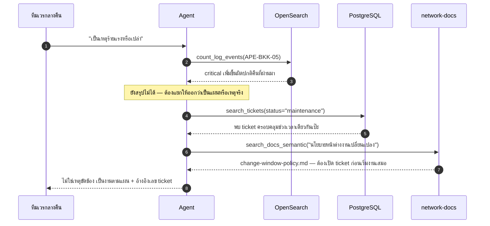

# Workshop 2 · ReAct Agent สำหรับ NOC

**15:00 – 16:30** (90 นาที) · เป้าหมาย: ประกอบ ReAct loop จาก [Module 5](03-module5-react-loop.md) เข้ากับเครื่องมือครบ 6 ตัวจาก [Module 6](04-module6-tools-3-databases.md) พร้อมทั้ง [Intent Gate](02-module7-intent-gate.md) และ [Memory](05-module8-memory.md) เป็น Agent วินิจฉัยเครือข่ายที่ใช้งานได้จริง แล้วทดสอบกับโจทย์จำลอง 3 สถานการณ์ พร้อมบันทึก trace เต็มรูปแบบลงไฟล์ log

นี่คือ workshop ที่ใหญ่ที่สุดของวันนี้ ผลลัพธ์ที่ได้คือไฟล์เดียวจบราว 200 บรรทัด **ไม่มี agent framework และไม่มี MCP** ตามหลักการที่ระบุไว้ใน `solutions/day2/workshop2_agent.py:7-10` — วันที่ 3 จะแทนที่เฉพาะชั้นการเรียก tool ด้วย MCP เท่านั้น ตัว loop ที่เขียนวันนี้จะไม่เปลี่ยนแปลงเลย

---

## สถานการณ์

ทีม NOC ต้องการ Agent ที่ตอบคำถามวินิจฉัยโครงข่ายได้ด้วยตัวเอง โดยอ้างอิงหลักฐานจริงจากสามฐานข้อมูล (ticket, topology, log) และเอกสาร runbook ประกอบการตัดสินใจ ไม่ใช่แค่ตอบจากความรู้ทั่วไปของโมเดล ทุกคำตอบต้องอ้างอิงแหล่งที่มาที่ตรวจสอบได้

---

## สิ่งที่ให้มา

- `solutions/day2/workshop2_agent.py` — เฉลยเต็มรูปแบบ มีเครื่องมือ 5 ตัวพร้อมใช้ (`search_tickets`, `get_upstream_devices`, `count_log_events`, `export_report`, `send_notification`) และ loop ที่สมบูรณ์
- docstring ของ `search_docs_semantic` ที่เขียนไว้ท้าย Module 6 — ใช้เป็นจุดเริ่มต้นของเครื่องมือตัวที่ 6
- ดัชนี OpenSearch `network-docs*` ที่ ingest ไว้แล้วตั้งแต่วันที่ 1 (runbook จาก `data/mock_fs/runbooks/*.md`)
- ข้อมูลจำลองครบชุดตาม `data/scenarios.md` (ห้ามเปิดอ่านไฟล์นี้ก่อนทำโจทย์ — เป็นเฉลยของวิทยากร)
- `apps/agent-api/agent/intent.py` และ `apps/agent-api/agent/memory.py` — โค้ดจริงที่ผ่านมาแล้วใน Module 7 และ Module 8 นำมาต่อเข้ากับ loop ตรงๆ ไม่ต้องเขียนใหม่

---

## สิ่งที่ต้องทำ

### ขั้นที่ 1 — ตั้งไฟล์ทำงาน

คัดลอก `solutions/day2/workshop2_agent.py` มาเป็น `workshop2_noc_agent.py` ที่ root โปรเจกต์ ใช้เป็นฐานตั้งต้น (ไม่ต้องเขียนห้าเครื่องมือแรกใหม่ — ผ่านการอ่านโค้ดจริงมาแล้วใน Module 6 จุดที่ต้องลงมือเพิ่มคือขั้นที่ 2-4 ด้านล่าง)

### ขั้นที่ 2 — ต่อ Intent Gate ไว้หน้า loop

ก่อนที่ `run(goal)` จะเริ่มวน ReAct loop เลย ให้เรียก `intent.classify()` จาก [Module 7](02-module7-intent-gate.md) ก่อนเสมอ:

```python
import sys
sys.path.insert(0, "apps/agent-api")
from agent import intent

async def run(goal: str) -> None:
    decision = await intent.classify(goal)
    if decision.label in ("out_of_scope", "needs_clarification"):
        print(f"[Intent Gate] ปฏิเสธ: {decision.reason}")
        return
    # โค้ด loop เดิมของ solutions/day2/workshop2_agent.py:424-469 ทำงานต่อจากบรรทัดนี้
    ...
```

ทดสอบด้วยคำถามนอกขอบเขต เช่น `"แถวนี้มีร้านอาหารแนะนำไหม"` ต้องเห็นข้อความปฏิเสธทันที **โดยไม่มี tool ใดถูกเรียกเลยแม้แต่ตัวเดียว** ตรงตามหลักการที่ Module 7 สอนไว้ — ตรงข้ามกับคำถามที่มีรหัสอุปกรณ์หรือคำเฉพาะทางปน ซึ่งต้องผ่านเข้า loop ตามปกติ

### ขั้นที่ 3 — implement เครื่องมือตัวที่ 6: `search_docs_semantic`

เติม body ให้ signature ที่ออกแบบไว้ท้าย Module 6 ตามรูปแบบ embedding เดียวกับ `scripts/ingest_docs.py`:

```python
def search_docs_semantic(query: str, top_k: int = 5) -> dict:
    """<docstring ที่เขียนไว้ท้าย Module 6>
    """
    vector = embed_batch([query])[0]          # รูปแบบเดียวกับ scripts/ingest_docs.py:32-53
    client = OpenSearch(hosts=[os.getenv("OPENSEARCH_URL", "http://localhost:9200")])
    response = client.search(
        index=os.getenv("OPENSEARCH_DOC_INDEX", "network-docs"),
        body={"size": top_k,
              "query": {"knn": {"embedding": {"vector": vector, "k": top_k}}}},
    )
    return {
        "count": len(response["hits"]["hits"]),
        "hits": [
            {"title": h["_source"]["title"],
             "source_type": h["_source"].get("source_type"),
             "content": h["_source"]["content"][:500],
             "score": h["_score"]}
            for h in response["hits"]["hits"]
        ],
    }
```

`embed_batch` เขียนตามรูปแบบเดียวกับที่พบใน `scripts/embed_tickets.py:32-49` และ `scripts/ingest_docs.py:32-53` (เรียก `EMBEDDING_BASE_URL/embeddings` แบบ OpenAI-compatible แล้วตรวจว่าจำนวนมิติตรงกับ `EMBEDDING_DIM`) — คัดลอกฟังก์ชันนี้มาใช้ตรงๆ ได้ ไม่ใช่จุดที่ต้องออกแบบใหม่

เพิ่มเข้า `TOOLS` (`solutions/day2/workshop2_agent.py:210-216` เดิม) เป็นตัวที่ 6:

```python
TOOLS = {
    "search_tickets": search_tickets,
    "get_upstream_devices": get_upstream_devices,
    "count_log_events": count_log_events,
    "search_docs_semantic": search_docs_semantic,
    "export_report": export_report,
    "send_notification": send_notification,
}
```

### ขั้นที่ 4 — เพิ่มความรู้ที่ต้องใช้ใน `REACT_PROMPT`

ต่อท้ายส่วน "ความรู้ที่ต้องใช้" ของ `REACT_PROMPT` (`solutions/day2/workshop2_agent.py:271-273`) ด้วยกติกาใหม่ที่ผูกกับเครื่องมือตัวที่ 6:

```
- ก่อนสรุปว่า log ระดับ critical จำนวนมากคือเหตุขัดข้องจริง ให้ตรวจสอบ ticket ประเภท
  maintenance ในช่วงเวลาเดียวกันก่อนเสมอ (search_tickets) และค้นนโยบายที่เกี่ยวข้อง
  ด้วย search_docs_semantic เพื่อยืนยันขั้นตอนที่ถูกต้อง
```

กติกานี้ไม่ได้เกิดขึ้นเองอัตโนมัติ — เหมือนกับกติกา "export ก่อน notify" ที่เห็นใน Module 4 ต้องระบุไว้ในพร้อมต์อย่างชัดเจนจึงจะบังคับพฤติกรรมนี้ได้จริง

### ขั้นที่ 5 — ต่อ Memory ให้จำบทสนทนาข้าม turn

ตอนนี้ `run(goal)` ยังรับคำถามแยกเป็นครั้งๆ ไม่มีอะไรจำการสนทนาก่อนหน้า ให้ต่อ [Module 8](05-module8-memory.md) เข้ากับ loop โดยห่อ `run()` ด้วย session:

```python
sys.path.insert(0, "apps/agent-api")
from agent import memory as agent_memory

async def run_turn(session_id: str, goal: str) -> None:
    session = agent_memory.get(session_id)
    session.turn += 1

    decision = await intent.classify(goal, history=session.build_context())
    if decision.label in ("out_of_scope", "needs_clarification"):
        print(f"[Intent Gate] ปฏิเสธ: {decision.reason}")
        return

    changed, why = session.detect_topic_shift(goal)
    if changed:
        await session.start_topic(goal)
        print(f"[Memory] เปลี่ยนหัวข้อ: {why}")

    session.add_turn("user", goal)
    # ต่อ context จาก session.build_context() เข้ากับ scratchpad ก่อนเรียก decide_next_step() ตามเดิม
    ...
    session.add_turn("assistant", final_answer)
```

ทดสอบว่าใช้งานได้จริงด้วยการเรียก `run_turn()` สองครั้งติดกันด้วย `session_id` เดียวกันในสถานการณ์ที่ 1: ครั้งแรกถามตามโจทย์เต็ม ครั้งที่สองถามคำถามต่อเนื่องสั้นๆ เช่น `"แล้วอุปกรณ์ที่เจอมีกี่ตัว"` (ไม่ระบุรายละเอียดซ้ำ) — Agent ต้องตอบได้จาก context ที่ session เก็บไว้ ไม่ใช่เริ่มสืบใหม่ทั้งหมด

### ขั้นที่ 6 — บันทึก trace เต็มรูปแบบลง log

`append_turn()` (`solutions/day2/workshop2_agent.py:365-381`) เก็บ Thought/Action/Observation ไว้ใน `scratchpad` ที่หน่วยความจำเท่านั้น เมื่อ loop จบ ข้อมูลนี้จะหายไป งานของ workshop นี้คือ**เขียนลงไฟล์ก่อนจบ**:

1. ใน `run()` (`solutions/day2/workshop2_agent.py:424-469`) เพิ่มการเก็บทุก `(decision, outcome)` ที่ผ่าน `append_turn()` ไว้ในลิสต์เดียวสำหรับ export
2. หลังจบ loop (หลังบรรทัดที่พิมพ์ `"[สรุป]"`) เขียนไฟล์ JSON หรือ Markdown ไปที่ `data/reports/trace-<goal-slug>-<timestamp>.json` ประกอบด้วย: เป้าหมายเดิม (`goal`), ทุกก้าว (`step`, `thought`, `tool`, `arguments`, `observation`, `ok`), และคำตอบสุดท้ายจาก `synthesize()`
3. พิมพ์ path ของไฟล์ trace ออกทาง stdout ตอนจบการรัน เพื่อให้อ้างอิงได้ทันทีตอนส่งงาน

---

## ทดสอบกับ 3 สถานการณ์

รันสคริปต์ที่เขียนเสร็จแล้วกับสามโจทย์ต่อไปนี้ (จำลองปัญหาจริงของทีม NOC) แล้วเก็บ trace ของแต่ละครั้งแยกไฟล์:

### สถานการณ์ที่ 1 — Link ล่ม (ทดสอบการเชื่อมข้ามฐานข้อมูล)

> "ลูกค้าหลายรายในโซน NBI แจ้งว่าอินเทอร์เน็ตหลุดเป็นช่วงๆ ต่อเนื่องมาสองสัปดาห์ แต่ละรายดูเหมือนไม่เกี่ยวข้องกัน ช่วยตรวจสอบว่าสาเหตุร่วมคืออะไร ทำรายงานสรุป แล้วส่งเมลแจ้งทีม NOC"

**สิ่งที่ต้องสังเกตใน trace**: Agent ต้องไม่หยุดอยู่แค่ผลจาก `search_tickets` (ซึ่งจะเห็น ticket กระจายอยู่คนละอุปกรณ์ปลายทาง) แต่ต้องเรียก `get_upstream_devices` เพื่อหาจุดร่วมที่ ticket ไม่ได้เอ่ยถึง แล้วยืนยันด้วย `count_log_events` ก่อนสรุปและส่งเมล

### สถานการณ์ที่ 2 — VPN ช้า (ทดสอบการตรวจจับเชิงรุกโดยไม่มี ticket)

> "ลูกค้า Enterprise ที่ใช้บริการ MPLS-VPN ผ่านอุปกรณ์ `PE-BKK-02` แจ้งว่าความเร็วลดลงเรื่อยๆ ตลอดเดือนที่ผ่านมา ทั้งที่ยังไม่มีใครเปิด ticket แจ้งปัญหานี้อย่างเป็นทางการ ช่วยตรวจสอบสุขภาพของอุปกรณ์ตัวนี้ว่ามีแนวโน้มผิดปกติหรือไม่"

**สิ่งที่ต้องสังเกตใน trace**: `search_tickets` จะไม่พบ ticket ใดๆ ของ `PE-BKK-02` เลย (ตั้งใจให้เป็นแบบนั้น) Agent ต้องไม่สรุปว่า "ไม่มีปัญหา" จากการไม่พบ ticket แต่ต้องใช้ `count_log_events` ดูแนวโน้มของ error (CRC, CPU) ตามช่วงเวลา จึงจะเห็นว่าอาการแย่ลงทีละน้อยแม้ไม่มีใครแจ้ง

### สถานการณ์ที่ 3 — อุปกรณ์ reboot (ทดสอบ Grounding ก่อนสรุปว่าเป็นเหตุร้ายแรง)

> "เมื่อคืนอุปกรณ์ `APE-BKK-05` มี log แจ้งเตือนระดับ critical และมีการ reboot เกิดขึ้นหลายครั้ง ทีมเวรกลางคืนกังวลว่าเป็นเหตุขัดข้องร้ายแรง ช่วยตรวจสอบให้ชัดว่าเป็นเหตุเสียจริงหรือเป็นงานตามแผน แล้วแจ้งผลสรุปให้ทีม"

**สิ่งที่ต้องสังเกตใน trace**: นี่คือกับดักสำคัญที่สุดของ workshop นี้ — ถ้า Agent เชื่อ `count_log_events` อย่างเดียวจะสรุปผิดว่าเป็นเหตุร้ายแรง ต้องเรียก `search_tickets(status=...)` เพื่อตรวจสอบ ticket ประเภท `maintenance` ที่ครอบคลุมช่วงเวลาเดียวกัน และควรเรียก `search_docs_semantic` เพื่อค้นนโยบายที่เกี่ยวข้อง (เช่น `data/mock_fs/runbooks/change-window-policy.md` ซึ่งระบุว่าต้องเปิด ticket ก่อนเริ่มงานเสมอ) ก่อนสรุปคำตอบสุดท้าย



---

## เกณฑ์ผ่าน

- [ ] `workshop2_noc_agent.py` มีเครื่องมือครบ 6 ตัวใน `TOOLS` และรันได้จริงโดยไม่มี exception ที่ไม่ได้ตั้งใจ
- [ ] คำถามนอกขอบเขต (เช่น "แถวนี้มีร้านอาหารแนะนำไหม") ถูก Intent Gate ปฏิเสธก่อนเข้า loop โดยไม่มี tool ใดถูกเรียกเลย
- [ ] เรียก `run_turn()` สองครั้งติดกันด้วย `session_id` เดียวกันในสถานการณ์ที่ 1 แล้วครั้งที่สองตอบได้จาก context ที่ session จำไว้ ไม่ใช่สืบใหม่ทั้งหมด
- [ ] `search_docs_semantic` คืนผลลัพธ์จริงจากดัชนี `network-docs*` (ทดสอบแยกด้วยคำค้นสั้นๆ ก่อนใช้ในสถานการณ์เต็ม)
- [ ] รันครบทั้ง 3 สถานการณ์ และแต่ละครั้งมีไฟล์ trace แยกกันใน `data/reports/`
- [ ] trace ของสถานการณ์ที่ 1 แสดงว่ามีการเรียก `get_upstream_devices` จริง ไม่ใช่สรุปจาก `search_tickets` อย่างเดียว
- [ ] trace ของสถานการณ์ที่ 3 แสดงว่า Agent ตรวจสอบ ticket ประเภท `maintenance` **ก่อน** สรุปคำตอบ และคำตอบสุดท้ายไม่ระบุว่าเป็นเหตุขัดข้องร้ายแรง
- [ ] LoopGuard ยังทำงานอยู่ครบ (ทดสอบง่ายๆ ด้วยการลองถามคำถามที่ไม่มีข้อมูลรองรับ แล้วดูว่า loop หยุดเองภายในเพดานที่ตั้งไว้ ไม่วนไม่รู้จบ)

---

## สิ่งที่ต้องส่ง

1. ไฟล์ `workshop2_noc_agent.py` ที่เขียนเสร็จ
2. ไฟล์ trace ทั้ง 3 ไฟล์ (หนึ่งไฟล์ต่อสถานการณ์) จาก `data/reports/` รวมถึงคู่ trace ของสถานการณ์ที่ 1 ที่แสดงการเรียก `run_turn()` สองครั้งติดกันเพื่อพิสูจน์ memory
3. สรุปสั้น 3-4 ประโยค: สถานการณ์ไหนยากที่สุดสำหรับ Agent และทำไม พร้อมระบุว่า `search_docs_semantic` ช่วยแก้ปัญหานั้นได้อย่างไร
4. ถ้าสถานการณ์ใดมีการเรียก `send_notification` ให้แนบ screenshot จาก MailHog (`http://localhost:8025`) ยืนยันว่าอีเมลถูกส่งจริง

ส่งในช่องทางที่วิทยากรแจ้งไว้ต้นวัน

---

## ต่อไป

→ [Day 3 · Module 9: แนะนำ MCP](../day3/01-module9-mcp-intro.md) — เครื่องมือทั้ง 6 ตัวที่เพิ่งสร้างในวันนี้ยังคงเดิมทุกบรรทัด สิ่งที่เปลี่ยนในวันที่ 3 คือชั้นการเรียก tool เท่านั้น จากฟังก์ชัน Python ที่เรียกตรง กลายเป็นการเรียกผ่าน MCP Server แทน — ตัว ReAct loop ที่เขียนขึ้นเองวันนี้จะไม่ถูกแก้ไขเลยแม้แต่บรรทัดเดียว
