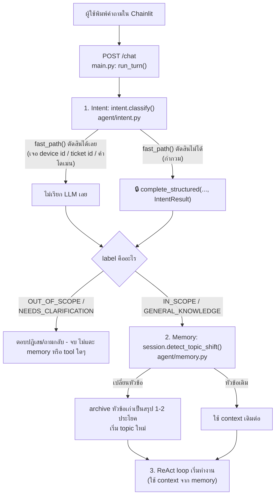

# สรุป Day 2 · แก้ Intent กับ Memory ของ Agent จริงใน App

เสริม (ไม่บังคับ) · อ่านเมื่อใดก็ได้หลังจากเรียน [Module 7: Intent Gate](02-module7-intent-gate.md) และ [Module 8: Memory](05-module8-memory.md) แล้ว

---

## เหตุผลที่ควรทราบเรื่องนี้

Module 7 และ Module 8 อธิบายหลักการของ intent gate (กรองคำถามก่อนเข้า ReAct loop) และ short-term memory (จำบทสนทนาโดยไม่ปล่อยให้ context บวมขึ้นเรื่อยๆ) — เอกสารนี้สรุปว่าหากต้องการปรับพฤติกรรมทั้งสองเรื่องนี้ของ agent จริง (ตัวที่ Chainlit เรียกใช้งานอยู่เป็นประจำ) ต้องแก้ไขไฟล์ใด พร้อมตัวอย่างการแก้ไขจริงที่ผ่านการทดสอบแล้ว

---

## ไฟล์หลักที่ต้องทราบ

| ไฟล์ | ทำหน้าที่ | ใช้งานจริงใน `/chat` หรือไม่ |
|---|---|---|
| `apps/agent-api/agent/intent.py` | Intent gate สองชั้น: `fast_path()` (ใช้ regex/keyword ล้วน ไม่เรียก LLM) จากนั้นจึงเรียก `classify()` (เรียก LLM ผ่าน `complete_structured(..., IntentResult)` เฉพาะกรณีที่ `fast_path` ตัดสินใจไม่ได้) | ✅ ทุก request เป็นจุดแรกที่ทำงานก่อนสิ่งอื่นใด |
| `apps/agent-api/agent/memory.py` | Short-term memory ต่อ session: เก็บบทสนทนาล่าสุด ตรวจจับ topic shift แล้ว archive หัวข้อเดิมเป็นบทสรุป 1-2 ประโยค | ✅ ทุก request (ทั้งอ่าน context และบันทึก turn ใหม่) |
| `apps/agent-api/agent/memory_longterm.py` | ออกแบบไว้สำหรับจดจำข้อเท็จจริงข้ามหลาย session โดยเก็บเป็น embedding ในตาราง `agent_memory` (PostgreSQL) | ❌ **ไม่ได้ถูกเรียกใช้จากที่ใดเลย** — ไม่มีไฟล์ใด import `memory_longterm` แม้แต่จุดเดียว เป็นโค้ดที่เขียนไว้แต่ไม่ได้เชื่อมต่อเข้ากับ pipeline จริง (ลักษณะเดียวกับ `orchestrator.py`/`RoutingDecision` ที่พบใน [สรุป Day 1](../day1/08-summary-json-template-in-app.md)) |

---

## Flow: ลำดับที่ intent กับ memory ทำงานใน 1 request

จาก docstring ของ `run_turn()` ใน `apps/agent-api/main.py` โดยตรง: *"intent before memory, memory before the ReAct loop, and grounding after the answer"* — เป็นลำดับที่ออกแบบไว้อย่างตั้งใจ ไม่ใช่เรื่องบังเอิญ:



**สังเกต**: หากคำถามถูกปฏิเสธตั้งแต่ intent gate (`OUT_OF_SCOPE`/`NEEDS_CLARIFICATION`) — **memory จะไม่ถูกแตะต้องเลย** คำถามนอกเรื่องที่แทรกเข้ามาจะไม่ทำให้หัวข้อสนทนาเดิมเปลี่ยนแปลงหรือสูญหาย (ดูคอมเมนต์ในโค้ดจริงที่ `main.py`: *"An out-of-scope aside must NOT disturb the current topic"*)

---

## ตัวอย่างการแก้ไขจริง 1: เพิ่มคำโดเมนใหม่ให้ Intent Gate

**ปัญหาที่พบได้จริง**: คำถามเกี่ยวกับ VPN circuit เช่น *"VPN ที่ไซต์ BKK ช้าครับ"* อาจไม่ถูกตรวจจับโดย `fast_path()` เนื่องจากคำว่า "VPN" ไม่อยู่ใน `DOMAIN_TERMS` — ส่งผลให้ต้องเสียค่าใช้จ่ายเรียก LLM ผ่าน `classify()` ทั้งที่ควรตัดสินใจได้ทันทีโดยไม่มีค่าใช้จ่ายเพิ่มเติม

**ก่อนแก้** (`apps/agent-api/agent/intent.py`):

```python
DOMAIN_TERMS = [
    "ticket", "เคส", "แจ้ง", "ลูกค้า", "วงจร", "circuit", "อุปกรณ์", "device",
    "router", "เราเตอร์", "log", "ล็อก", "interface", "อินเทอร์เฟซ", "mtu",
    "isis", "adjacency", "bgp", "ldp", "mpls", "topology", "โครงข่าย", "เครือข่าย",
    ...
]
```

**หลังแก้** (เพิ่ม `"vpn"` เข้าไปในลิสต์):

```python
DOMAIN_TERMS = [
    "ticket", "เคส", "แจ้ง", "ลูกค้า", "วงจร", "circuit", "อุปกรณ์", "device",
    "router", "เราเตอร์", "log", "ล็อก", "interface", "อินเทอร์เฟซ", "mtu",
    "isis", "adjacency", "bgp", "ldp", "mpls", "vpn", "topology", "โครงข่าย", "เครือข่าย",
    ...
]
```

เพียงเท่านี้ `fast_path()` จะสามารถตรวจจับคำถามที่มี "vpn" ร่วมกับคำโดเมนอื่นได้ทันที (`len(domain_hits) >= 2`) โดยไม่ต้องเรียก LLM เลย — **ประหยัดทั้งเวลาและ token ในทุกคำถามที่มีคำนี้นับจากนี้เป็นต้นไป**

---

## ตัวอย่างการแก้ไขจริง 2: ให้ Memory ตรวจจับ Topic Shift จาก Ticket ID ด้วย

**ปัญหาที่พบได้จริง**: `extract_entities()` ใน `memory.py` ตรวจจับได้เฉพาะรหัสอุปกรณ์ (`DEVICE_PATTERN`) และชื่อไซต์ (`SITE_PATTERN`) — หากผู้ใช้ถามเรื่อง ticket สองใบติดต่อกันที่ไซต์เดียวกันแต่เป็นคนละเคส (เช่น `TK-25-00001` แล้วตามด้วย `TK-25-00099`) ระบบจะไม่เห็นว่าหัวข้อเปลี่ยนแปลง เนื่องจากไม่มี entity ใดทับซ้อนกันให้เปรียบเทียบ แต่ก็ไม่มีการตรวจจับ ticket id เพื่อยืนยันความแตกต่างนั้นด้วยเช่นกัน

**ก่อนแก้** (`apps/agent-api/agent/memory.py`):

```python
DEVICE_PATTERN = re.compile(r"\b((?:CR|PE|APE|LPE)-([A-Z]{3})-\d{2})\b", re.IGNORECASE)
SITE_PATTERN = re.compile(r"(BKK|NBI|กรุงเทพ|นนทบุรี)", re.IGNORECASE)

def extract_entities(text: str) -> list[str]:
    """Device ids and site codes mentioned in a message."""
    entities = {match.group(1).upper() for match in DEVICE_PATTERN.finditer(text)}
    for match in SITE_PATTERN.finditer(text):
        token = match.group(1)
        entities.add(SITE_ALIASES.get(token, token.upper()))
    return sorted(entities)
```

**หลังแก้** (เพิ่ม `TICKET_PATTERN` — ใช้ pattern เดียวกับที่ `intent.py` มีอยู่แล้ว):

```python
DEVICE_PATTERN = re.compile(r"\b((?:CR|PE|APE|LPE)-([A-Z]{3})-\d{2})\b", re.IGNORECASE)
SITE_PATTERN = re.compile(r"(BKK|NBI|กรุงเทพ|นนทบุรี)", re.IGNORECASE)
TICKET_PATTERN = re.compile(r"\bTK-\d{2}-\d{5}\b", re.IGNORECASE)

def extract_entities(text: str) -> list[str]:
    """Device ids, ticket ids และ site codes ที่พูดถึงในข้อความ"""
    entities = {match.group(1).upper() for match in DEVICE_PATTERN.finditer(text)}
    entities |= {match.group(0).upper() for match in TICKET_PATTERN.finditer(text)}
    for match in SITE_PATTERN.finditer(text):
        token = match.group(1)
        entities.add(SITE_ALIASES.get(token, token.upper()))
    return sorted(entities)
```

เมื่อแก้ไขแล้ว `detect_topic_shift()` จะเห็นว่า `{"TK-25-00001"}` กับ `{"TK-25-00099"}` ไม่มี entity ใดทับซ้อนกันเลย และตัดสินใจว่ามีการเปลี่ยนหัวข้อจริง — เหตุผลของ topic shift (`why`) จะรายงานได้ถูกต้องมากขึ้นในกรณีนี้

---

## ขั้นตอนหยุดและรันระบบใหม่เพื่อให้เห็นผลการแก้ไข

| service | หยุด (ถ้ากำลังรันอยู่) | คำสั่งรัน | รองรับ reload อัตโนมัติหรือไม่ |
|---|---|---|---|
| `apps/agent-api` (ไฟล์ที่มี `intent.py`/`memory.py`) | `Ctrl+C` | `uv run uvicorn main:app --app-dir apps/agent-api --reload --port 8080` | ✅ มี `--reload` — บันทึกไฟล์แล้วเห็นผลทันที |
| `apps/chainlit-ui` | `Ctrl+C` | `uv run chainlit run apps/chainlit-ui/app.py --port 8000 -w` | ✅ มี `-w` (watch mode) เช่นกัน |

**วิธีทดสอบตัวอย่างที่ 1 (Intent)**:

1. แก้ไข `DOMAIN_TERMS` แล้วบันทึกไฟล์ รอจนปรากฏข้อความ `Reloading...` ใน terminal ของ `agent-api`
2. เปิด Chainlit แล้วถามว่า *"VPN ที่ไซต์ BKK ช้าครับ"*
3. ตรวจสอบ event `INTENT_CHECKED` (log ฝั่ง `agent-api` หรือผ่าน MCP Inspector) — ควรเห็น `"decided_by": "fast_path"` แทนที่จะเป็น `"llm"` และ `label: in_scope`
4. เปรียบเทียบกับก่อนแก้ไข (ทดลอง `Ctrl+C` แล้วกลับไปใช้โค้ดเดิมชั่วคราว) — ก่อนแก้ไขควรเห็น `"decided_by": "llm"` แทน เนื่องจาก `fast_path` ไม่สามารถตัดสินใจเองได้

**วิธีทดสอบตัวอย่างที่ 2 (Memory)**:

1. แก้ไข `extract_entities()` แล้วบันทึกไฟล์
2. เปิด session ใหม่ใน Chainlit ถาม *"ticket TK-25-00001 คืบหน้ายังไงบ้าง"* แล้วถามต่อทันทีด้วย *"แล้ว TK-25-00099 ล่ะ"*
3. ตรวจสอบ event `TOPIC_CHANGED` ซึ่งควรเกิดขึ้นในคำถามที่สอง พร้อมเหตุผล (`reason`) ที่อ้างถึง entity คนละตัวกัน
4. เปรียบเทียบกับก่อนแก้ไข — ก่อนแก้ไข event นี้ไม่ควรเกิดขึ้น (ระบบจะเข้าใจว่ายังเป็นหัวข้อเดิม)

หากแก้ไขแล้วยังไม่ปรากฏผล ให้ตรวจสอบตามลำดับดังนี้:

- แก้ไขไฟล์ถูกต้องหรือไม่ (`intent.py`/`memory.py` มีอยู่เพียงชุดเดียวใน `apps/agent-api/agent/`)
- terminal ที่รัน `uvicorn --reload` ยังเป็น process เดิมอยู่หรือไม่ (หาก process ค้างหรือเกิด error ต้อง `Ctrl+C` แล้วรันคำสั่งใหม่)
- ทดสอบด้วย session ใหม่ทุกครั้ง (`session_id` เดิมจะพก topic/entities เก่าติดมาด้วย ทำให้ผลลัพธ์ไม่ตรงตามที่คาดไว้)

---

## ความเชื่อมโยงกับเนื้อหา Day 2

- แนวคิด "ตัดสินใจแบบถูก/แพงต่างกัน — cheapest first" ของ intent gate = [Module 7: Intent Gate](02-module7-intent-gate.md)
- แนวคิด "ไม่ใช่ window ใหญ่ขึ้น แต่ลืมสิ่งที่ไม่เกี่ยวข้องแล้ว" ของ memory = [Module 8: Memory](05-module8-memory.md)
- `IntentResult` และ `TopicState`/`MemorySnapshot` คือ schema ตัวเดียวกับที่พูดถึงใน [สรุป Day 1: แก้ JSON Template ของ Agent จริงใน App](../day1/08-summary-json-template-in-app.md) — เป็นหลักการ "บังคับ JSON" เดียวกันตลอดทั้งระบบ

---

## ต่อไป

→ [Day 3 · Module 9: แนะนำ MCP](../day3/01-module9-mcp-intro.md)
