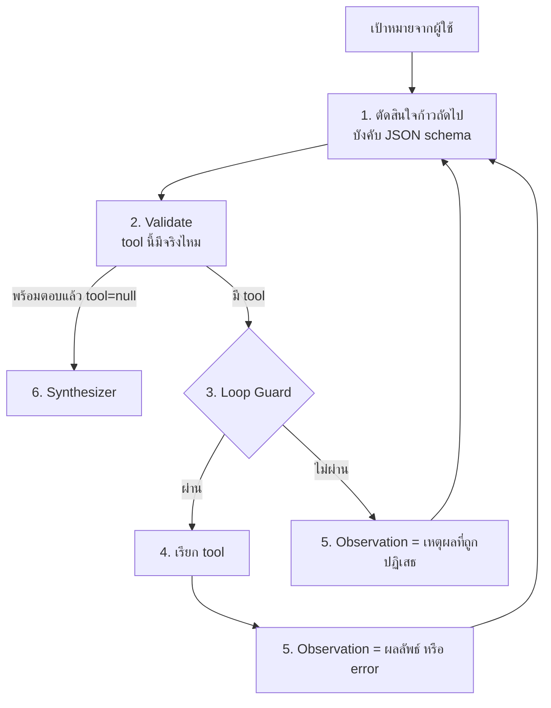

# Workshop 2 · เขียน Agent Loop ด้วยตัวเอง

**14:45 – 16:00** (75 นาที)

---

## โจทย์

เขียนระบบ agent ขึ้นมาเองด้วย Python โดยให้มีความสามารถ **ค้นหาข้อมูล · แปลงไฟล์ · ส่งอีเมล** และให้ระบบ **วนคิดเองว่าต้องทำขั้นตอนไหนก่อนหลัง**

> **ห้ามใช้ LangChain, LlamaIndex หรือ framework agent ใดๆ**
> เป้าหมายคือเข้าใจกลไกจริง ไม่ใช่ใช้ของสำเร็จ

---

## เป้าหมายที่ระบบต้องทำได้

> *"หา ticket ที่ยังไม่ปิดของสัปดาห์นี้ ทำรายงานสรุป แล้วส่งเมลให้ทีม NOC"*

ระบบต้องคิดเองว่าต้อง: ค้นหา → สรุป → สร้างไฟล์ → ส่งเมล ตามลำดับที่ถูกต้อง

---

## เครื่องมือที่ต้องมี

| Tool | ทำอะไร | ใช้อะไร |
|---|---|---|
| `search_tickets` | ค้น ticket จาก PostgreSQL | `psycopg` |
| `count_log_events` | นับ log จาก OpenSearch | `opensearch-py` |
| `get_device_neighbors` | ดู topology จาก Neo4j | `neo4j` |
| `export_report` | แปลงเป็น Markdown / CSV / PDF | `apps/agent-api/tools/file_export.py` |
| `send_notification` | ส่งเมลไป MailHog | `apps/agent-api/tools/notifier.py` |

ตรวจผลเมลที่ http://localhost:8025

---

## โครงที่ต้องเขียน — ReAct loop (Thought → Action → Observation)

ไม่มี "แผน" ก้อนเดียวที่สร้างไว้ล่วงหน้า ระบบตัดสินใจ **ทีละก้าวเดียว** แล้ววนซ้ำ โดยผลของก้าวก่อนหน้ากลายเป็นส่วนหนึ่งของสิ่งที่โมเดลเห็นตอนตัดสินใจก้าวถัดไป



### 1. ตัดสินใจก้าวถัดไป
ใช้ `complete_structured()` จาก Workshop 1 บังคับให้ได้ `ReactDecision` (`thought`, `tool: str | None`, `arguments: dict`) จาก **เป้าหมาย + scratchpad ของทุกรอบก่อนหน้า** — ไม่ใช่แค่เป้าหมายอย่างเดียว

### 2. Validate
ถ้า `tool` ที่โมเดลเลือกไม่มีอยู่จริง อย่าพยายามเรียก ให้ถือว่ายังไม่พร้อมตอบและป้อนกลับเป็น observation แทน

### 3. Loop Guard — 3 ชั้น (สำคัญกว่าที่เคย — ไม่มีขั้น validate ล่วงหน้าช่วยกรองให้แล้ว)
```python
1. total_steps > MAX_STEPS
2. เรียก tool เดิม + argument เดิม ซ้ำ
3. เรียก tool เดิมเกิน N ครั้ง
```

### 4. เรียก tool จริง
เรียกครั้งเดียวต่อรอบ ไม่มีการรันขนาน เพราะยังไม่รู้ว่าก้าวถัดไปจะเป็นอะไรจนกว่าจะเห็นผลของก้าวนี้ก่อน

### 5. ผลลัพธ์กลายเป็น Observation
ต่อ observation (ผลลัพธ์จริง หรือข้อความ error) เข้าไปใน scratchpad แล้ววนกลับไปข้อ 1 — **นี่คือจุดที่แทนที่ `argument_from`/`depends_on` ทั้งหมด**: ก้าวถัดไปอ้างอิงค่าจากก้าวก่อนได้เพราะมันอยู่ในบทสนทนาให้อ่านตรงๆ ไม่ต้องประกาศ path ล่วงหน้า

### 6. Synthesizer
เมื่อโมเดลตั้ง `tool` เป็น `null` แปลว่าพร้อมตอบแล้ว รวมผลทุกรอบเป็นคำตอบ **พร้อมอ้างอิงว่าข้อมูลมาจากไหน** เปิด `http://localhost:8025/` รอ

> **⚠️ ถ้า `send_notification` ส่งไม่ออก (`gaierror: nodename nor servname provided`)**: ตรวจสอบ `.env` ว่า `SMTP_HOST` เป็น `localhost` ไม่ใช่ `mailhog` — `mailhog` คือชื่อ service ใน docker-compose ที่ resolve ได้แค่จากในเครือข่าย Docker เท่านั้น สคริปต์ที่รันตรงบนเครื่อง (`uv run python ...`) ต้องใช้ `localhost` ถึงจะเข้าถึงพอร์ตที่ map ไว้ได้ (`.env.example` แก้ค่านี้ให้ถูกต้องแล้ว ถ้า setup ใหม่จะไม่เจอปัญหานี้เลย ปัญหานี้จะเจอเฉพาะ `.env` เก่าที่ copy มาก่อนหน้านี้เท่านั้น)

> **⚠️ ระวังการหลอน citation เมื่อไม่มีหลักฐาน** — ถ้า Synthesizer ถูกเรียกตอนที่ยังไม่เคยเรียก tool สำเร็จเลยสักครั้ง (เช่นโมเดลตัดสินใจ `tool: null` ตั้งแต่รอบแรกทั้งที่ยังไม่มีข้อมูล) โมเดลมีโอกาสแต่ง ticket ID หรือชื่ออุปกรณ์ขึ้นมาเองโดยไม่มีหลักฐานรองรับ — เจอเคสนี้จริงระหว่างทดสอบ ทางที่ปลอดภัยกว่าคือ**ตรวจสอบด้วยโค้ดก่อนเรียก Synthesizer**: ถ้า `results` ว่างเปล่า (ไม่มีการเรียก tool สำเร็จเลย) ให้ตอบข้อความคงที่ตรงๆ ว่ายังไม่มีหลักฐาน แทนที่จะให้โมเดลพยายามสรุปจากความว่างเปล่า (ดูโค้ดจริงใน `solutions/day2/workshop2_agent.py` ฟังก์ชัน `run()`)

---
### เฉลยอยู่ใน `uv run python solutions/day2/workshop2_agent.py`

คำสั่งสำหรับพิมพ์ในช่องแชต:
```
ให้คุณดำเนินการตามขั้นตอนแบบ End-to-End อย่างเคร่งครัดดังนี้:

1. ค้นหาข้อมูล: ค้นหา Ticket ที่ยังไม่ปิด (open) ประจำสัปดาห์นี้ทั้งหมด

2. สร้างรายงาน: นำผลลัพธ์จากข้อ 1 ไปสร้างไฟล์รายงานด้วยเครื่องมือ generate_report (กำหนด include_tickets: true)

3. ส่งอีเมลแจ้งเตือน: ส่งอีเมลไปยัง noc@nt.co.th ด้วยเครื่องมือ send_notification โดยมีเงื่อนไขดังนี้:

	Subject: "รายงานสรุปสถานะ Ticket ที่ยังไม่ปิดประจำสัปดาห์"

	Body (เนื้อหาอีเมล): ให้เขียนอีเมลด้วยภาษาไทยทางการ ทักทายทีมงาน NOC สรุปจำนวนเคสที่พบทั้งหมด และนำข้อมูล Ticket ทุกรายการที่ค้นพบในข้อ 1 มาแปลงเป็น "ตาราง Markdown" (ระบุ หมายเลข, ระดับ, อุปกรณ์, และหัวข้อ) เขียนลงไปในเนื้อหาอีเมลตรงๆ ให้ครบถ้วนทุกเคส (ห้ามใช้ตัวแปรปีกกา เช่น step.1 หรือเทมเพลตใดๆ เด็ดขาด ให้ใช้ข้อมูลจริงที่อ่านได้จากผลลัพธ์การค้นหาเท่านั้น) พร้อมคำลงท้ายแจ้งให้ตรวจสอบรายละเอียดในไฟล์แนบ

	attachment_path: นำ Path ของไฟล์รายงานที่ได้จากข้อ 2 มาใส่ในพารามิเตอร์นี้ เพื่อแนบไฟล์ไปพร้อมกับอีเมล

กฎเหล็กเพื่อป้องกันความผิดพลาด: ห้ามแต่งเติมข้อมูลเอง ห้ามใช้เทมเพลตตัวแปรดิบ และต้องแสดงตารางข้อมูลทุกรายการให้ครบถ้วนสมบูรณ์
```
---

## เชื่อมกับ UI

ทำให้ Chainlit แสดง `cl.Step` ของแต่ละขั้นได้ ผู้เรียนจะเห็นวงจรการคิดของ agent บนหน้าจอจริง

---

## เกณฑ์ผ่าน

- [ ] เป้าหมายหลักทำได้ครบ: ค้น → รายงาน → ส่งเมล และเห็นเมลใน MailHog
- [ ] แต่ละรอบตัดสินใจมี `thought` ที่อ่านแล้วสมเหตุสมผลกับ observation ก่อนหน้า
- [ ] Loop Guard ทำงาน — ทดสอบโดยจงใจสร้างสถานการณ์วน
- [ ] เมื่อ tool ล้มเหลว ระบบไม่ crash, error กลายเป็น observation, และโมเดลแก้ argument เองในรอบถัดไปได้
- [ ] คำตอบมี citation และ**ต้องไม่มี citation ปลอมเมื่อไม่มีหลักฐาน** — ทดสอบด้วยคำถามที่ทำให้โมเดลไม่เรียก tool เลยสักครั้ง แล้วดูว่าคำตอบยังอ้างเลข ticket/ชื่ออุปกรณ์ที่ไม่เคยค้นมาก่อนไหม
- [ ] UI แสดงแต่ละรอบ Thought/Action ได้

---

## โบนัส

1. **จำกัดความยาว scratchpad** — เมื่อ observation สะสมมากเกิน ให้สรุปรอบเก่าเหลือบรรทัดเดียวแทนที่จะส่งทั้งหมดทุกรอบ (เชื่อมกับ Module 4 เรื่อง context)
2. **ส่งเป็น Telegram** — สลับ `NOTIFIER_BACKEND` โดยไม่แก้โค้ด agent เลย
3. **เทียบกับ multi-agent** — รันด้วย `orchestrator.route()` แล้วเทียบ token/เวลา/ความถูกต้อง (ดู `compare_q21.py`)
4. **แนบ PDF** — ให้เมลมีไฟล์รายงานแนบไปด้วย

---

<details>
<summary>Hint</summary>

- เริ่มจากทำให้การตัดสินใจ 1 รอบถูกก่อน (เรียก tool ที่ถูกต้องด้วย argument ที่ถูกต้อง) อย่าเพิ่งสนใจการวนลูป
- ทดสอบ 1 รอบด้วย scratchpad ที่เขียนมือ ก่อนต่อ loop จริง
- ใช้ `qwen/qwen3-30b-a3b` ระหว่างพัฒนา แล้วค่อยเปลี่ยนเป็นโมเดลจริงตอนส่ง
- `apps/agent-api/agent/react.py` มีตัวอย่างเต็มของ scratchpad, LoopGuard และ loop หลัก
- ถ้า `send_notification` ส่งไม่ออกด้วย error ที่ผิดปกติเกี่ยวกับชื่อโฮสต์ ให้ตรวจสอบ `.env` ก่อนสงสัยโค้ดของตัวเอง
- ถ้าเทสต์คำถามที่ไม่มีข้อมูลจริง (เช่น ticket ไม่มีเลยสักใบ) แล้วคำตอบยังมีเลข ticket โผล่มา ให้สงสัยว่า Synthesizer หลอนจากตัวอย่างใน prompt ของตัวเอง ไม่ใช่จากหลักฐานจริง
</details>

<details>
<summary>เฉลย</summary>

สองบั๊กนี้พบจริงระหว่างทดสอบเฉลย (`solutions/day2/workshop2_agent.py`) — เป็นเคสที่ดีสำหรับศึกษาว่าอาการที่พบเป็นอย่างไร แล้วสาเหตุที่แท้จริงคืออะไร

**1) `send_notification` fail ด้วย `gaierror: nodename nor servname provided`**

สาเหตุ: `.env` ตั้ง `SMTP_HOST=mailhog` ซึ่งเป็นชื่อ service ใน `docker-compose.yml` — resolve ได้แค่จากใน**เครือข่าย Docker เท่านั้น** สคริปต์ที่รันตรงบนเครื่อง (`uv run python ...`) ไม่ได้อยู่ในเครือข่ายนั้น จึง resolve ชื่อไม่ออก

แก้ที่ `.env.example` แล้ว (ไฟล์ต้นทางที่ทุกคน copy เป็น `.env` ตอน setup — ไม่ใช่แค่แก้ `.env` ของตัวเอง เพราะ `.env` ถูก gitignore ไว้ ไม่มีทางถูกแชร์ไปหาคนอื่นได้เลย):
```diff
- SMTP_HOST=mailhog
+ SMTP_HOST=localhost
```
ปลอดภัย เพราะ container จริงใน `docker-compose.yml` ตั้ง `SMTP_HOST: mailhog` แยกให้ตัวเองอยู่แล้ว ([docker-compose.yml:259](../../docker/docker-compose.yml)) ไม่ได้อ่านจาก root `.env`/`.env.example` ไฟล์นี้ การแก้จึงกระทบแค่สคริปต์ที่รันตรงบนเครื่องเท่านั้น — ถ้า `.env` ของตัวเองยังมีค่าเก่าอยู่ (setup มาก่อนหน้านี้) ต้องแก้ตามด้วยมือเช่นกัน

**2) Synthesizer หลอน citation ตอนไม่มีหลักฐานเลย**

สาเหตุ: `SYNTH_PROMPT` เดิมมีตัวอย่าง `(PostgreSQL: ticket TK-25-00001)` ที่ดูสมจริงเกินไป — ตอนที่ agent ไม่ได้เรียก tool สำเร็จเลยสักครั้ง (evidence ว่างเปล่า) โมเดลมีแนวโน้มก็อปเลขตัวอย่างนี้มาใช้ตรงๆ ทั้งที่ไม่ใช่ข้อมูลจริง

แก้ 2 ชั้น (เขียนกฎอย่างเดียวไม่พอ ต้องบังคับด้วยโค้ดด้วย ตรงกับหลักการเดียวกับ Challenge 2):

```python
# ชั้น 1: เขียน prompt ให้ชัดว่าตัวอย่างคือ "รูปแบบ" ไม่ใช่ "ค่าจริง"
SYNTH_PROMPT = """\
...
- อ้างอิงแหล่งที่มาของทุกข้อสรุป ระบุชื่อระบบและค่าจริงจากหลักฐาน เช่น
  "(PostgreSQL: ticket TK-25-00012)" - รูปแบบเท่านั้นที่ให้เลียนแบบ ตัวเลข
  TK-25-00012 เป็นแค่ตัวอย่างการเขียน ไม่ใช่ค่าจริง ห้ามคัดลอกไปใช้เด็ดขาด
  ต้องแทนที่ด้วยหมายเลข ticket ที่อยู่ในหลักฐานจริงเท่านั้น
- ถ้าหลักฐานว่างเปล่า (ไม่มีการเรียกเครื่องมือสำเร็จเลยแม้แต่ครั้งเดียว) ห้ามอ้างอิง
  หมายเลข ticket, ชื่ออุปกรณ์ หรือตัวเลขใดๆ ทั้งสิ้น ต้องบอกตรงๆ ว่ายังไม่ได้
  ตรวจสอบข้อมูลจริงและไม่สามารถสรุปได้
"""

# ชั้น 2: บังคับด้วยโค้ด ไม่พึ่ง prompt อย่างเดียว
print("\n  [สรุป]")
if not results:
    answer = "ยังไม่ได้เรียกเครื่องมือใดเลย จึงไม่มีหลักฐานให้สรุปคำตอบ"
else:
    answer = await synthesize(goal, results)
```

**ข้อควรระวังตอนเขียน prompt ทำนองนี้**: อย่าเขียนตัวอย่างด้วย bracket placeholder แบบ `<หมายเลข ticket จริง>` เพราะโมเดลบางตัวจะตีความ syntax `<...>` เป็นสิ่งที่ต้องเขียนตามตรงๆ (ทดสอบแล้วได้ผลลัพธ์ `<TK-25-00005>` ติด `<>` มาด้วย) — ให้เขียนเป็นประโยคอธิบายแทนว่า "ตัวอย่างนี้ไม่ใช่ค่าจริง" จะปลอดภัยกว่า
</details>

---

## สิ่งที่ต้องส่ง

โค้ด agent ทั้งหมด + ภาพหน้าจอ MailHog + trace ของ Thought/Action/Observation ที่ระบบสร้าง (ทุกรอบ ไม่ใช่แค่รอบสุดท้าย)
