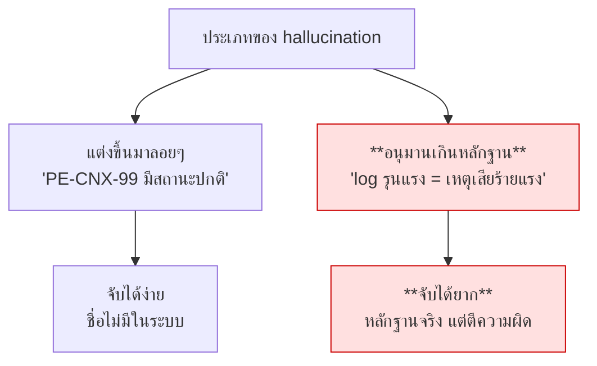

# Lab เสริม · Grounding — ตรวจคำตอบก่อนส่งออก

**20 นาที**

> ตรงกับหัวข้อติดตามผลครั้งที่ 2: *"ตรวจสอบและลดการเกิดข้อมูลที่ผิดพลาด (Hallucination) โดยอ้างอิงความถูกต้องกับโครงสร้างจริงใน Neo4j และประวัติจริงใน PostgreSQL"*

---

## เป้าหมาย

เพิ่มชั้นตรวจสอบว่า **ทุกข้ออ้างในคำตอบมีหลักฐานรองรับจริง** ก่อนส่งให้ผู้ใช้

---

## Hallucination ที่อันตรายที่สุดไม่ใช่การแต่งเรื่องขึ้นมาลอยๆ



scenario **S4** คือกรณีที่สอง — log ที่ดึงมาเป็นของจริงทุกบรรทัด แต่ข้อสรุปผิด

---

## สิ่งที่ต้องทำ

### 0. เริ่มจาก baseline ที่มีบั๊ก

`apps/agent-api/verifier-v0.py` คือ draft แรกที่ดูสมเหตุสมผลตอนอ่านผ่านๆ แต่มีบั๊กจริงซ่อนอยู่ — งานของคุณคือแก้ไฟล์นี้ (หรือใช้เป็นจุดเริ่มต้นเขียน `apps/agent-api/verifier.py` ใหม่) ให้ผ่านเกณฑ์ทั้งหมดด้านล่าง

```bash
uv run apps/agent-api/verifier-v0.py
```

รันดูก่อน **อย่าเพิ่งเปิดเฉลย** — สคริปต์จะไม่ crash เลย (นั่นคือกับดัก) แต่ผลลัพธ์ข้อ 2 (คำตอบที่ถูกต้องอยู่แล้ว) จะถูกตัดสินว่าผิด นั่นคือบั๊กที่ต้องหาให้เจอ

### 1. เขียน verifier

**ทำไมต้องเทียบกับ `results` ไม่ใช่กับ "ความรู้ทั่วไป"**: `results` คือ list ของ `StepResult` ชุดเดียวกับที่ ReAct loop เก็บไว้ใน `agent/react.py` — คือหลักฐานดิบทุกชิ้นที่ agent เห็นจริงก่อนตอบ ไม่ใช่คำตอบสุดท้าย ถ้า verifier ไปเทียบคำตอบกับ "ความรู้ทั่วไปของโมเดลเอง" (เช่น ถามโมเดลอีกตัวว่า "คำตอบนี้ดูสมเหตุสมผลไหม") จะจับ hallucination แบบ "อนุมานเกินหลักฐาน" (scenario S4) ไม่ได้เลย เพราะโมเดลที่ตรวจก็มักจะ "เชื่อ" ข้อสรุปแบบเดียวกับที่โมเดลที่ตอบเชื่อ — นี่คือเหตุผลที่แล็บนี้แนะนำให้ตรวจด้วย regex เทียบกับ evidence ตรงๆ (ดูโบนัสข้อ 1) แทนที่จะเอา LLM มาตรวจ LLM

```python
async def verify(answer: str, results: list[StepResult]) -> GroundingVerdict:
    """ตรวจว่าทุกข้ออ้างในคำตอบมีหลักฐานจาก step results รองรับ"""
```

### 2. เกณฑ์ที่ต้องจับให้ได้

**ทำไมสองคอลัมน์นี้สำคัญพอกัน**: ถ้าเข้มแค่ฝั่งซ้าย (จับให้ได้) แต่ไม่ระวังฝั่งขวา (ต้องไม่จับ) จะได้ระบบที่เตือนพร่ำเพรื่อจนผู้ใช้เลิกเชื่อการเตือนไปเลย — เหมือนสัญญาณกันขโมยที่ดังทุกครั้งที่ลมพัด สุดท้ายไม่มีใครฟังตอนขโมยมาจริงๆ

| ต้องจับว่าไม่มีหลักฐาน | ไม่ต้องจับ |
|---|---|
| ชื่ออุปกรณ์/เลข ticket/ตัวเลขที่ไม่มีในหลักฐาน | ภาษาที่แสดงความไม่แน่ใจอยู่แล้ว |
| อ้างสาเหตุทั้งที่หลักฐานบอกแค่ว่าเกิดพร้อมกัน | การเรียบเรียงหลักฐานใหม่ด้วยคำอื่น |
| **เรียกว่าเหตุเสียทั้งที่มี ticket maintenance ครอบคลุม** | การสรุปความที่สมเหตุสมผล |
| อ้างช่วงเวลานอกขอบเขตข้อมูล | **การปฏิเสธที่ถูกต้อง** ("PE-CNX-99 ไม่พบในระบบ", "ไม่ใช่เหตุเสีย") |

> ⚠️ **จุดที่คนพลาดบ่อยที่สุดในแล็บนี้** — เขียนเช็คแบบ `if "เหตุเสีย" in answer:` (หาคำแบบตรงๆ) แล้วคิดว่าจบ ปัญหาคือประโยค **"ไม่ใช่เหตุเสีย"** ก็มีคำว่า "เหตุเสีย" ปนอยู่ด้วยเหมือนกัน! โค้ดจะแฟลกคำตอบที่ถูกต้องอยู่แล้วว่าบิดเบือนข้อเท็จจริง (false positive) ทั้งที่ประโยคกำลัง**ปฏิเสธ**สิ่งที่มันกล่าวหา — ต้องเช็คด้วยว่ามีคำปฏิเสธ ("ไม่ใช่", "ไม่พบ", "ไม่มีอยู่จริง" ฯลฯ) อยู่ใกล้ๆ คำที่เจอหรือเปล่า ก่อนตัดสิน ไม่ใช่แค่ "เจอคำนี้ไหม"
>
> อีกจุดที่พลาดง่ายไม่แพ้กัน: **"ไม่จับ" ไม่เท่ากับ "ตรวจแล้วผ่าน"** — ถ้าโค้ดไม่มีส่วนไหนเลยที่เอาชื่ออุปกรณ์ในคำตอบไปเทียบกับหลักฐานจริง มันก็จะ "ผ่าน" ทุกคำตอบเกี่ยวกับอุปกรณ์เสมอ ไม่ว่าจะถูกหรือผิด — เทสที่ผ่านเพราะ "ไม่ได้ตรวจอะไรเลย" อันตรายกว่าเทสที่ล้มเหลวเสียอีก เพราะดูเหมือนใช้งานได้ทั้งที่ไม่ได้คุ้มครองอะไรจริง

### 3. ทดสอบด้วยคำตอบที่จงใจผิด

**ทำไมต้องมีเคส "ถูก" คู่กับเคส "ผิด" เสมอ**: ทดสอบแค่เคสจงใจผิดแล้วผ่านไม่ได้แปลว่า verifier ดี — verifier ที่ over-flag ทุกอย่างไม่เลือกหน้าก็จะ "จับ" เคสผิดได้ 100% เหมือนกัน (แบบเดียวกับหมอที่บอกทุกคนเป็นมะเร็งจะ "ตรวจพบ" มะเร็งได้ทุกเคสจริง แต่ไม่มีประโยชน์อะไร) ต้องมีเคสคำตอบที่ถูกต้องอยู่แล้วมาทดสอบคู่กันเสมอ เพื่อเช็คว่าไม่ over-flag

```python
bad = "APE-BKK-05 เกิดเหตุเสียร้ายแรง มี ticket TK-99-99999 รายงานไว้ CPU สูงถึง 95%"
```

verifier ต้องจับได้ทั้ง 3 จุด: เหตุเสีย (จริงๆ เป็น maintenance) · ticket ที่ไม่มีจริง · CPU ที่ไม่มีในหลักฐาน

**ตัวอย่างการไล่โค้ดจริง** (กรณีคำตอบถูกต้อง `"...จึงน่าจะเป็นงานที่แจ้งไว้ล่วงหน้า ไม่ใช่เหตุเสีย"`):

| ขั้น | เช็คอะไร | ผล |
|---|---|---|
| 1 | หาตำแหน่งคำว่า "เหตุเสีย" ในคำตอบ | เจอที่ท้ายประโยคพอดี |
| 2 | ตัดข้อความ ±40 ตัวอักษรรอบตำแหน่งนั้น | ได้ `"...ล่วงหน้า ไม่ใช่เหตุเสีย"` |
| 3 | เช็คว่ามีคำปฏิเสธ ("ไม่ใช่") อยู่ใน window นั้นไหม | **มี** — อยู่ติดกันเลย |
| 4 | สรุป | **ไม่แฟลก** เพราะคำนี้ถูกปฏิเสธอยู่ ไม่ใช่ถูกยืนยัน |

ถ้า verifier ของคุณข้ามขั้นตอน 2-3 ไปเลย (เช็คแค่ `in answer` เฉยๆ) แถวสุดท้ายจะกลายเป็น "แฟลกทั้งที่ไม่ควร" — ลองรันแล้วดูว่าเจอปัญหานี้ไหม

### 4. ตัดสินใจว่าจะทำอะไรเมื่อไม่ผ่าน

| ทางเลือก | เหมาะเมื่อ |
|---|---|
| เตือนผู้ใช้แต่ยังแสดงคำตอบ | ค่าเริ่มต้นที่ดี — โปร่งใสและไม่ปิดกั้น |
| สร้างคำตอบใหม่ | คุณภาพสูงขึ้นแต่ช้าและแพงขึ้นเท่าตัว |
| ปฏิเสธไม่แสดง | เข้มเกินไปสำหรับงานส่วนใหญ่ |

โปรเจกต์นี้เลือกข้อแรก — ดู event `grounding_checked` ใน `main.py`

---

## ตรวจคำตอบด้วยเฉลย

**ลองแก้ `verifier-v0.py` เองก่อน** แล้วค่อยเทียบกับเฉลยที่ `apps/agent-api/verifier.py` — ทั้งสองไฟล์มี self-test ชุดเดียวกัน (เคสจงใจผิด, เคสถูก, เคส Q30-style, เคสไม่มีหลักฐาน) เพื่อให้เทียบผลลัพธ์กันตรงๆ ได้:

```bash
uv run apps/agent-api/verifier.py
```

diff ระหว่างสองไฟล์ (โครงสร้าง return, regex, การเช็ค negation) คือรายการบั๊กที่ควรเจอ ไม่ใช่แค่ "โค้ดที่ยาวกว่า"

---

## เกณฑ์ผ่าน

- [ ] verifier จับคำตอบที่จงใจผิดได้ทั้ง 3 จุด
- [ ] คำตอบที่ถูกต้องต้อง **ไม่** ถูกจับผิด (false positive)
- [ ] ทดสอบกับ Q18 (maintenance) และ Q30 (อุปกรณ์ไม่มีจริง)
- [ ] verifier ล้มเหลวแล้วระบบยังตอบได้ ไม่ crash
- [ ] วัดว่า grounding เพิ่ม latency กี่เปอร์เซ็นต์

---

## โบนัส

1. **ตรวจแบบไม่ใช้ LLM** — ดึงชื่ออุปกรณ์และเลข ticket จากคำตอบด้วย regex แล้วเทียบกับหลักฐานตรงๆ **ถูกกว่าและแม่นกว่าสำหรับกรณีนี้**
2. **วัด Groundedness rate** — รันชุดคำถามทั้งหมดแล้วรายงานเปอร์เซ็นต์ที่ผ่าน
3. **ใช้โมเดลเล็กเป็นผู้ตรวจ** — `qwen/qwen3-30b-a3b` ตรวจงานของ 27B ได้ไหม ถูกกว่ามาก
