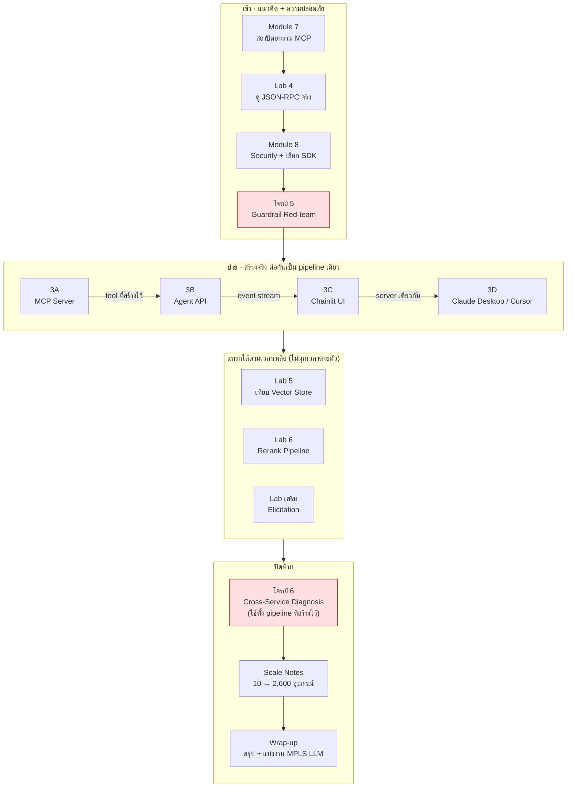

# Day 3 · ภาพรวมกิจกรรมทั้งวัน — จาก MCP Server ถึง Production

ก่อนเริ่ม ให้ดูภาพนี้ก่อนหนึ่งครั้ง — เช้าเรียน**แนวคิด + ทดสอบความปลอดภัย** บ่ายลงมือ**สร้างจริง 4 ชิ้นต่อกันเป็นเส้นเดียว** (MCP Server → Agent API → UI → เชื่อม client จริง) ปิดท้ายด้วยโจทย์ใหญ่ที่สุดของทั้งคอร์สและมองไปข้างหน้าสู่ production จริง

---

## ผังรวมทั้งวัน

---

## ตารางกิจกรรม

| # | เวลา | กิจกรรม | ประเภท | ลงมือเขียน/แก้โค้ดไหม |
|---|---|---|---|---|
| 1 | 09:00–10:15 | [Module 7 · สถาปัตยกรรม MCP](01-module7-mcp-architecture.md) | บรรยาย | ไม่ |
| 2 | 10:15–10:30 | [Lab 4 · ดู JSON-RPC ที่วิ่งจริง](02-lab4-jsonrpc-inspect.md) | Lab (สังเกตการณ์) | ไม่ — รันของเดิม + ใช้ MCP Inspector |
| 3 | 10:45–11:35 | [Module 8 · Security + เลือก SDK](03-module8-security-sdk.md) | บรรยาย | ไม่ |
| 4 | 11:35–12:00 | [โจทย์ 5 · Guardrail Red-team](04-challenge5-guardrail-redteam.md) | Challenge (ทำเป็นคู่) | ไม่ — โจมตีด้วย prompt ไม่ใช่แก้โค้ด |
| 5 | 13:00–14:00 | [Workshop 3A · สร้าง MCP Server](05-workshop3a-mcp-server.md) | Workshop | **ใช่ — 7 จุด** `[3A.2.1]`…`[3A.4]` |
| 6 | 14:00–14:30 | [Workshop 3B · ห่อ Agent เป็น API](06-workshop3b-agent-api.md) | Workshop | **ใช่ — 3 จุด** `[3B.1]`…`[3B.3]` |
| 7 | 14:30–14:45 | [Workshop 3C · ต่อ Chainlit](07-workshop3c-chainlit.md) | Workshop | **ใช่ — 4 จุด** `[3C.1]`…`[3C.5]` |
| 8 | 14:45–15:00 | [Workshop 3D · เชื่อม client จริง](08-workshop3d-connect-clients.md) | Workshop | ไม่ — แก้แค่ config JSON ของ client ไม่แตะ `.py` |
| 9 | แทรกช่วงบ่าย | [Lab 5 · เทียบ Vector Store](09-lab5-vector-store-comparison.md) | Lab | ไม่ — รันสคริปต์เปรียบเทียบ |
| 10 | แทรกช่วงบ่าย | [Lab 6 · Rerank Pipeline](10-lab6-rerank-pipeline.md) | Lab | ไม่ (เว้นแต่ทำใน `apps/mcp-server/` ที่เขียนใหม่เองจาก 3A) |
| 11 | เสริม | [Lab · Elicitation](11-lab-elicitation.md) | Lab | **ใช่ — 1 จุด** `[EL.1]` (โค้ดนี้ยังไม่มีอยู่จริงใน repo) |
| 12 | 15:00–15:30 | [โจทย์ 6 · Cross-Service Diagnosis](12-challenge6-cross-service-diagnosis.md) | Challenge (โจทย์ใหญ่สุด) | ไม่บังคับ — แก้เฉพาะถ้า trace พลาด (ดู Hint ในไฟล์) |
| 13 | ช่วงสรุป | [Scale Notes](13-scale-notes.md) | บรรยาย/อภิปราย | ไม่ |
| 14 | 15:30–16:30 | [Wrap-up · MPLS LLM](14-wrap-up-mpls-llm.md) | สรุป | ไม่ |

> 🏷️ ป้าย `[3A.x.x]` `[3B.x]` `[3C.x]` `[EL.1]` คือจุดที่ต้องเขียน/แก้โค้ดจริงในแต่ละไฟล์ — ดูรายละเอียดในเอกสารนั้นๆ

---

## ทำไมเรียงแบบนี้ ห้ามสลับ

- **โจทย์ 5 (red-team) ต้องอยู่หลัง Module 8 แต่ก่อนลงมือสร้าง (3A)** — ต้องเข้าใจ 5 ชั้น guardrail ก่อนถึงจะโจมตีได้อย่างมีเป้าหมาย และบทเรียนที่ได้จากการโจมตี (ชั้นไหนสำคัญที่สุด) ต้องติดตัวไปตอนสร้าง MCP Server เองใน 3A ไม่ใช่มาแก้เพิ่มทีหลัง
- **3A → 3B → 3C → 3D คือ dependency จริง ไม่ใช่แค่ลำดับบทเรียน** — 3B ต้องมี MCP Server ที่ใช้งานได้ก่อนถึงจะเรียก tool ผ่าน MCP ได้ 3C ต้องมี Agent API ที่ยิง event ถูกต้องก่อนถึงจะมีอะไรให้ UI แสดง และ 3D ทดสอบผ่าน UI ของตัวเองให้มั่นใจก่อนถึงจะเอา MCP Server ตัวเดียวกันไปต่อกับ client ภายนอกจริง (Claude Desktop/Cursor)
- **โจทย์ 6 ต้องมาหลังจบ Workshop 3 ทั้งหมด** — เป็นโจทย์ที่ต้องใช้ทั้ง pipeline ที่เพิ่งสร้าง (MCP Server + Agent API) ทำงานพร้อมกัน ทำก่อนหน้านั้นไม่ได้เพราะยังไม่มีระบบให้ทดสอบ
- **Lab 5 / Lab 6 / Elicitation ไม่ผูกเวลาตายตัว** — เป็นเนื้อหาเสริมที่ไม่ได้อยู่บน critical path ของ pipeline หลัก แทรกได้ตามเวลาที่แต่ละกลุ่มเหลือจริง

> ⚠️ **`apps/mcp-server/`, `apps/agent-api/`, `apps/chainlit-ui/` เป็นระบบที่ทำงานสมบูรณ์อยู่แล้วตั้งแต่ต้น** (ใช้เป็นทั้ง demo container และเป็น "เฉลย" ของวันนี้) ไม่มีไฟล์เฉลยแยกต่างหาก — อ่านเหตุผลและวิธีใช้ให้ได้ประโยชน์เต็มที่ที่ [solutions/day3/README.md](../../solutions/day3/README.md) ก่อนเริ่ม Workshop 3A

---

## ต่อไป

→ [Module 7: สถาปัตยกรรมเชิงลึกของ MCP](01-module7-mcp-architecture.md)
