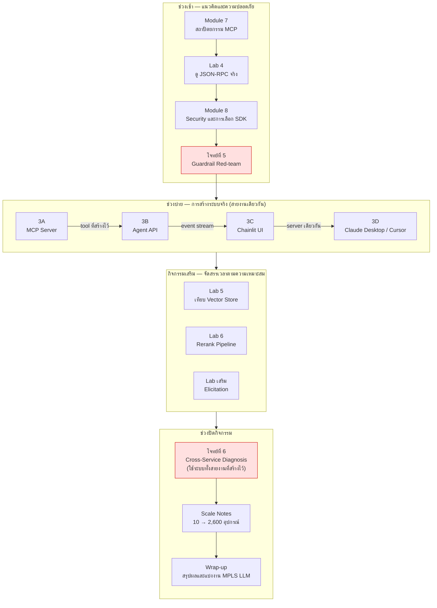

# Day 3 · ภาพรวมกิจกรรมทั้งวัน — จาก MCP Server ถึง Production

ก่อนเริ่มกิจกรรม ควรพิจารณาภาพรวมนี้หนึ่งครั้ง — ช่วงเช้าเป็นการเรียนรู้เชิงแนวคิดและการทดสอบความปลอดภัย ช่วงบ่ายเป็นการลงมือปฏิบัติสร้างระบบจริง 4 ส่วนที่เชื่อมต่อกันเป็นสายงานเดียว (MCP Server → Agent API → UI → เชื่อมต่อกับ client จริง) และปิดท้ายด้วยโจทย์ที่มีขนาดใหญ่ที่สุดของหลักสูตร พร้อมมุมมองต่อการนำระบบขึ้นใช้งานจริงในระดับ production

---

## ภาพรวมกิจกรรมทั้งวัน

---

## จุดที่ต้องลงมือเขียน/แก้ไขโค้ดจริง

กิจกรรมส่วนใหญ่ของวันนี้เป็นบรรยาย การทดลองกับระบบที่มีอยู่แล้ว หรือ Challenge เชิงทดสอบ (ดูรายชื่อเอกสารทั้งหมดพร้อมเวลาได้ที่ตารางในหน้าแรกของหลักสูตร) มีเพียง 4 เอกสารที่ต้องลงมือเขียนหรือแก้ไขโค้ดจริง:

| เอกสาร | ตำแหน่งที่ต้องแก้ | หมายเหตุ |
|---|---|---|
| [Workshop 3A · สร้าง MCP Server](05-workshop3a-mcp-server.md) | `[3A.2.1]`…`[3A.4]` (7 ตำแหน่ง) | มากที่สุด — resource ใหม่ 3 ตัว, tool ใหม่ 2-3 ตัว, ต่อ guardrail 5 ชั้น |
| [Workshop 3B · ห่อ Agent เป็น API](06-workshop3b-agent-api.md) | `[3B.1]`…`[3B.3]` (3 ตำแหน่ง) | ส่วนใหญ่คือเปลี่ยนวิธีเรียกจากฟังก์ชันตรงเป็นเรียกผ่าน MCP |
| [Workshop 3C · ต่อ Chainlit](07-workshop3c-chainlit.md) | `[3C.1]`…`[3C.5]` (4 ตำแหน่ง) | ต่อ SSE parsing และ render UI ตาม event ที่มีอยู่แล้ว |
| [Lab · Elicitation](11-lab-elicitation.md) | `[EL.1]` (1 ตำแหน่ง) | โค้ดส่วนนี้ยังไม่มีอยู่จริงใน repo ต้องเขียนขึ้นใหม่ทั้งหมด |

[Workshop 3D](08-workshop3d-connect-clients.md) แก้ไขเฉพาะไฟล์ config JSON ของ client ไม่มีการแก้ไขไฟล์ `.py` ส่วน[โจทย์ที่ 6](12-challenge6-cross-service-diagnosis.md) ไม่จำเป็นต้องแก้โค้ด ยกเว้นกรณีที่ trace ผิดพลาด (ดูคำแนะนำในเอกสาร)

> หมายเหตุ: ป้ายกำกับ `[3A.x.x]` `[3B.x]` `[3C.x]` `[EL.1]` ระบุตำแหน่งที่ต้องเขียนหรือแก้ไขโค้ดจริงในแต่ละเอกสาร โปรดดูรายละเอียดเพิ่มเติมในเอกสารที่เกี่ยวข้อง

---

## เหตุผลของการจัดลำดับกิจกรรม

- **โจทย์ที่ 5 (Red-team) ต้องอยู่หลัง Module 8 แต่ก่อนเริ่มลงมือสร้าง (3A)** เนื่องจากต้องเข้าใจ guardrail ทั้ง 5 ชั้นก่อนจึงจะโจมตีได้อย่างมีเป้าหมาย และบทเรียนที่ได้จากการโจมตี (ชั้นใดสำคัญที่สุด) ควรถูกนำไปใช้ตั้งแต่ขั้นตอนการสร้าง MCP Server ใน 3A มิใช่นำมาแก้ไขเพิ่มเติมภายหลัง
- **ลำดับ 3A → 3B → 3C → 3D สะท้อนความสัมพันธ์เชิงระบบจริง มิใช่เพียงลำดับการสอน** — 3B ต้องมี MCP Server ที่ใช้งานได้ก่อนจึงจะเรียก tool ผ่าน MCP ได้ 3C ต้องมี Agent API ที่ส่ง event ถูกต้องก่อนจึงจะมีข้อมูลให้ UI แสดงผล และ 3D ควรทดสอบผ่าน UI ของตนเองให้มั่นใจก่อนนำ MCP Server ตัวเดียวกันไปเชื่อมต่อกับ client ภายนอก (Claude Desktop / Cursor)
- **โจทย์ที่ 6 ต้องดำเนินการหลังจบ Workshop 3 ทั้งหมด** เนื่องจากเป็นโจทย์ที่ต้องใช้ระบบทั้งสายงาน (MCP Server และ Agent API) ทำงานร่วมกัน จึงไม่สามารถดำเนินการก่อนหน้านั้นได้
- **Lab 5 / Lab 6 / Elicitation ไม่ผูกกับช่วงเวลาที่แน่นอน** เนื่องจากเป็นเนื้อหาเสริมที่ไม่อยู่บน critical path ของสายงานหลัก จึงสามารถจัดสรรเวลาตามความเหมาะสมของแต่ละกลุ่มได้

> **ข้อควรทราบ**: `apps/mcp-server/`, `apps/agent-api/` และ `apps/chainlit-ui/` เป็นระบบที่ทำงานสมบูรณ์อยู่แล้วตั้งแต่ต้น (ใช้เป็นทั้ง demo container และเป็นเฉลยของกิจกรรมวันนี้) จึงไม่มีไฟล์เฉลยแยกต่างหาก — โปรดอ่านเหตุผลและวิธีใช้งานให้ได้ประโยชน์สูงสุดที่ [solutions/day3/README.md](../../solutions/day3/README.md) ก่อนเริ่ม Workshop 3A

---

## ต่อไป

→ [Module 7: สถาปัตยกรรมเชิงลึกของ MCP](01-module7-mcp-architecture.md)
