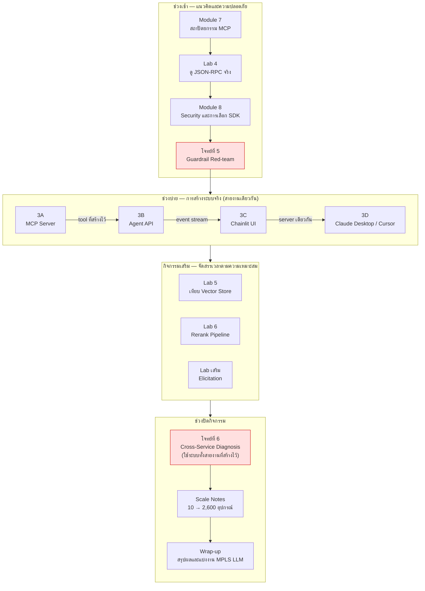

# Day 3 · ภาพรวมกิจกรรมทั้งวัน — จาก MCP Server ถึง Production

ก่อนเริ่มกิจกรรม ควรพิจารณาภาพรวมนี้หนึ่งครั้ง — ช่วงเช้าเป็นการเรียนรู้เชิงแนวคิดและการทดสอบความปลอดภัย ช่วงบ่ายเป็นการลงมือปฏิบัติสร้างระบบจริง 4 ส่วนที่เชื่อมต่อกันเป็นสายงานเดียว (MCP Server → Agent API → UI → เชื่อมต่อกับ client จริง) และปิดท้ายด้วยโจทย์ที่มีขนาดใหญ่ที่สุดของหลักสูตร พร้อมมุมมองต่อการนำระบบขึ้นใช้งานจริงในระดับ production

---

## ภาพรวมกิจกรรมทั้งวัน

---

## ตารางกิจกรรม

| # | เวลา | กิจกรรม | ประเภท | ต้องเขียน/แก้ไขโค้ดหรือไม่ |
|---|---|---|---|---|
| 1 | 09:00–10:15 | [Module 7 · สถาปัตยกรรม MCP](01-module7-mcp-architecture.md) | บรรยาย | ไม่ต้อง |
| 2 | 10:15–10:30 | [Lab 4 · ดู JSON-RPC ที่วิ่งจริง](02-lab4-jsonrpc-inspect.md) | Lab (สังเกตการณ์) | ไม่ต้อง — รันระบบที่มีอยู่และตรวจสอบด้วย MCP Inspector |
| 3 | 10:45–11:35 | [Module 8 · Security และการเลือก SDK](03-module8-security-sdk.md) | บรรยาย | ไม่ต้อง |
| 4 | 11:35–12:00 | [โจทย์ที่ 5 · Guardrail Red-team](04-challenge5-guardrail-redteam.md) | Challenge (ทำเป็นคู่) | ไม่ต้อง — เป็นการโจมตีด้วยข้อความ (prompt) ไม่ใช่การแก้ไขโค้ด |
| 5 | 13:00–14:00 | [Workshop 3A · สร้าง MCP Server](05-workshop3a-mcp-server.md) | Workshop | **ต้องแก้ไข — 7 ตำแหน่ง** `[3A.2.1]`…`[3A.4]` |
| 6 | 14:00–14:30 | [Workshop 3B · ห่อ Agent เป็น API](06-workshop3b-agent-api.md) | Workshop | **ต้องแก้ไข — 3 ตำแหน่ง** `[3B.1]`…`[3B.3]` |
| 7 | 14:30–14:45 | [Workshop 3C · ต่อ Chainlit](07-workshop3c-chainlit.md) | Workshop | **ต้องแก้ไข — 4 ตำแหน่ง** `[3C.1]`…`[3C.5]` |
| 8 | 14:45–15:00 | [Workshop 3D · เชื่อมต่อ client จริง](08-workshop3d-connect-clients.md) | Workshop | ไม่ต้อง — แก้ไขเฉพาะไฟล์ config JSON ของ client ไม่มีการแก้ไขไฟล์ `.py` |
| 9 | กิจกรรมเสริมช่วงบ่าย | [Lab 5 · เทียบ Vector Store](09-lab5-vector-store-comparison.md) | Lab | ไม่ต้อง — รันสคริปต์เปรียบเทียบ |
| 10 | กิจกรรมเสริมช่วงบ่าย | [Lab 6 · Rerank Pipeline](10-lab6-rerank-pipeline.md) | Lab | ไม่ต้อง (ยกเว้นกรณีทำในไฟล์ `apps/mcp-server/` ที่เขียนขึ้นใหม่เองตั้งแต่ 3A) |
| 11 | กิจกรรมเสริม | [Lab · Elicitation](11-lab-elicitation.md) | Lab | **ต้องแก้ไข — 1 ตำแหน่ง** `[EL.1]` (โค้ดส่วนนี้ยังไม่มีอยู่จริงใน repo) |
| 12 | 15:00–15:30 | [โจทย์ที่ 6 · Cross-Service Diagnosis](12-challenge6-cross-service-diagnosis.md) | Challenge (โจทย์ขนาดใหญ่ที่สุด) | ไม่จำเป็น — ดำเนินการเฉพาะกรณีที่ trace ผิดพลาด (ดูคำแนะนำในเอกสาร) |
| 13 | ช่วงสรุป | [Scale Notes](13-scale-notes.md) | บรรยาย/อภิปราย | ไม่ต้อง |
| 14 | 15:30–16:30 | [Wrap-up · MPLS LLM](14-wrap-up-mpls-llm.md) | สรุปผล | ไม่ต้อง |

> หมายเหตุ: ป้ายกำกับ `[3A.x.x]` `[3B.x]` `[3C.x]` `[EL.1]` ระบุตำแหน่งที่ต้องเขียนหรือแก้ไขโค้ดจริงในแต่ละเอกสาร โปรดดูรายละเอียดเพิ่มเติมในเอกสารที่เกี่ยวข้อง

---

## เหตุผลของการจัดลำดับกิจกรรม

- **โจทย์ที่ 5 (Red-team) ต้องอยู่หลัง Module 8 แต่ก่อนเริ่มลงมือสร้าง (3A)** เนื่องจากต้องเข้าใจ guardrail ทั้ง 5 ชั้นก่อนจึงจะโจมตีได้อย่างมีเป้าหมาย และบทเรียนที่ได้จากการโจมตี (ชั้นใดสำคัญที่สุด) ควรถูกนำไปใช้ตั้งแต่ขั้นตอนการสร้าง MCP Server ใน 3A มิใช่นำมาแก้ไขเพิ่มเติมภายหลัง
- **ลำดับ 3A → 3B → 3C → 3D สะท้อนความสัมพันธ์เชิงระบบจริง มิใช่เพียงลำดับการสอน** — 3B ต้องมี MCP Server ที่ใช้งานได้ก่อนจึงจะเรียก tool ผ่าน MCP ได้ 3C ต้องมี Agent API ที่ส่ง event ถูกต้องก่อนจึงจะมีข้อมูลให้ UI แสดงผล และ 3D ควรทดสอบผ่าน UI ของตนเองให้มั่นใจก่อนนำ MCP Server ตัวเดียวกันไปเชื่อมต่อกับ client ภายนอก (Claude Desktop / Cursor)
- **โจทย์ที่ 6 ต้องดำเนินการหลังจบ Workshop 3 ทั้งหมด** เนื่องจากเป็นโจทย์ที่ต้องใช้ระบบทั้งสายงาน (MCP Server และ Agent API) ทำงานร่วมกัน จึงไม่สามารถดำเนินการก่อนหน้านั้นได้
- **Lab 5 / Lab 6 / Elicitation ไม่ผูกกับช่วงเวลาที่แน่นอน** เนื่องจากเป็นเนื้อหาเสริมที่ไม่อยู่บน critical path ของสายงานหลัก จึงสามารถจัดสรรเวลาตามความเหมาะสมของแต่ละกลุ่มได้

> **ข้อควรทราบ**: `apps/mcp-server/`, `apps/agent-api/` และ `apps/chainlit-ui/` เป็นระบบที่ทำงานสมบูรณ์อยู่แล้วตั้งแต่ต้น (ใช้เป็นทั้ง demo container และเป็นเฉลยของกิจกรรมวันนี้) จึงไม่มีไฟล์เฉลยแยกต่างหาก — โปรดอ่านเหตุผลและวิธีใช้งานให้ได้ประโยชน์สูงสุดที่ [solutions/day3/README.md](../../solutions/day3/README.md) ก่อนเริ่ม Workshop 3A

---

## ต่อไป

→ [Module 7: สถาปัตยกรรมเชิงลึกของ MCP](01-module7-mcp-architecture.md)
