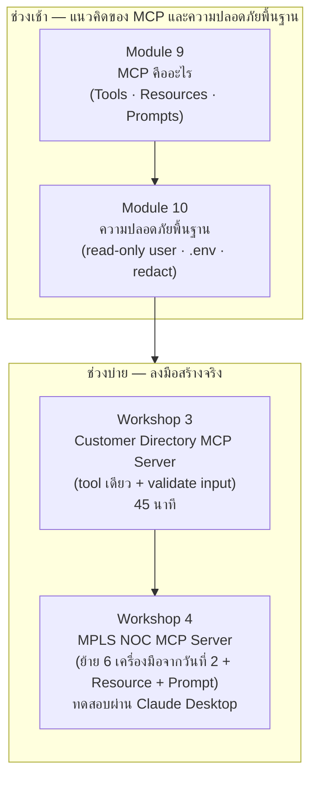

# Day 3 · ภาพรวมกิจกรรมทั้งวัน — จากฟังก์ชัน Python สู่ MCP Server

ก่อนเริ่มกิจกรรม ควรพิจารณาภาพรวมนี้หนึ่งครั้ง — วันนี้ไม่ได้เริ่มต้นใหม่ แต่นำเครื่องมือทั้ง 6 ตัวที่เขียนขึ้นเองในวันที่ 2 มาห่อเป็น MCP Server มาตรฐาน เพื่อให้ client ใดก็ตามที่พูดโปรโตคอลเดียวกัน (เช่น Claude Desktop) เชื่อมต่อใช้งานได้ทันทีโดยไม่ต้องเขียนสายเชื่อมต่อใหม่

---

## ภาพรวมกิจกรรมทั้งวัน

---

## จุดที่ต้องลงมือเขียนโค้ดจริง

| กิจกรรม | ไฟล์ที่ต้องสร้าง | ลักษณะงาน |
|---|---|---|
| [Module 9 · MCP คืออะไร](01-module9-mcp-intro.md) | — | บรรยาย + สาธิตโดยวิทยากร (ต่อ MCP Server ที่มีอยู่แล้วเข้ากับ Claude Desktop) ไม่มี Lab สำหรับผู้เรียน |
| [Module 10 · ความปลอดภัยพื้นฐาน](02-module10-security-basics.md) | — | บรรยาย + รันคำสั่งสั้นๆ เพื่อสังเกตพฤติกรรมจริง ไม่มี Lab แยก |
| [Workshop 3 · Customer Directory MCP Server](03-workshop3-customer-directory.md) | `workshop3_customer_directory.py` | กิจกรรมอุ่นเครื่องสั้นๆ (45 นาที) — สร้าง MCP server ที่มี tool เดียวและฝึก validate input ก่อนใช้งานจริง |
| [Workshop 4 · MPLS NOC MCP Server](04-workshop4-mpls-noc-mcp-server.md) | `workshop4_mcp_server.py` | งานหลักของทั้ง 3 วัน — ย้ายเครื่องมือ 6 ตัวจากวันที่ 2 มาเป็น `@mcp.tool`, เพิ่ม `@mcp.resource` สำหรับ schema, เพิ่ม `@mcp.prompt` แม่แบบ แล้วทดสอบผ่าน Claude Desktop จริง |

> **ข้อควรทราบ**: `apps/mcp-server/` คือระบบ MCP Server ที่ทำงานสมบูรณ์อยู่แล้ว ใช้เป็นทั้งตัวอย่างสาธิตใน Module 9 และเฉลยอ้างอิงของ Workshop 3 และ Workshop 4 — ผู้เรียนสร้างไฟล์ `workshop3_customer_directory.py` และ `workshop4_mcp_server.py` ของตนเองแยกต่างหาก ไม่แก้ไข `apps/mcp-server/` โดยตรง

---

## เหตุผลของการจัดลำดับกิจกรรม

- **Module 9 ต้องมาก่อน Module 10** — ต้องเข้าใจว่า Tool/Resource/Prompt คืออะไรก่อน จึงจะเข้าใจได้ว่าชั้นความปลอดภัยแต่ละชั้นใน Module 10 ปกป้องอะไรอยู่
- **Module 10 ต้องมาก่อน Workshop 3 และ Workshop 4** — ต้องรู้หลักการ read-only user, การแยกความลับไว้ใน `.env`, และการ redact ข้อมูลลับก่อนส่งให้โมเดล ก่อนจะลงมือสร้าง MCP Server ของตนเองที่ต้องนำหลักการเหล่านี้ไปใช้จริง
- **Workshop 3 ทำก่อน Workshop 4** — Workshop 3 ฝึกทักษะพื้นฐานที่สุดของการสร้าง MCP server (ประกาศ tool หนึ่งตัวให้ถูกต้อง + validate input ก่อนใช้งานจริง) แบบเดี่ยวๆ ไม่ปนกับงานอื่น ก่อนจะไปเจองานที่ซับซ้อนกว่าใน Workshop 4 ที่ต้องทำหลายอย่างพร้อมกัน (tool 6 ตัว + resource + prompt)
- **Workshop 4 ต้องอยู่หลังวันที่ 2 ทั้งหมด** — เป็นการนำเครื่องมือที่เขียนเสร็จแล้วในวันที่ 2 มาห่อเป็น MCP Server เท่านั้น ไม่ได้เขียนตรรกะของเครื่องมือใหม่ ทำก่อนหน้านั้นไม่ได้เพราะยังไม่มีเครื่องมือให้ย้าย
- **ตัว ReAct loop จากวันที่ 2 ไม่ถูกแก้ไขเลยในวันนี้** — สิ่งที่เปลี่ยนมีเพียงชั้นการเรียกเครื่องมือ จากฟังก์ชัน Python ที่เรียกตรง กลายเป็นการเรียกผ่านโปรโตคอล MCP แทน นี่คือประเด็นสำคัญที่สุดของทั้งหลักสูตร: MCP ไม่ได้เปลี่ยนวิธีคิดของ agent แต่เปลี่ยนแค่วิธีที่ agent เข้าถึงเครื่องมือ

---

## ต่อไป

→ [Module 9: MCP คืออะไร](01-module9-mcp-intro.md)
