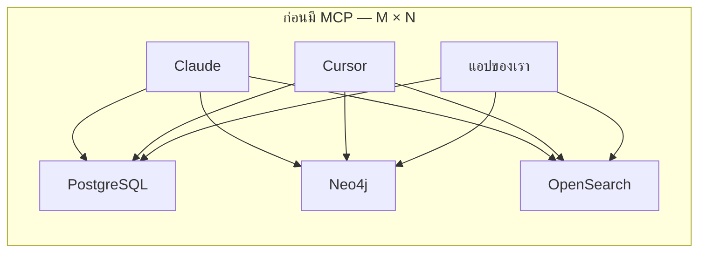
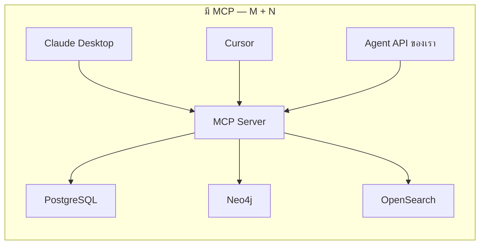
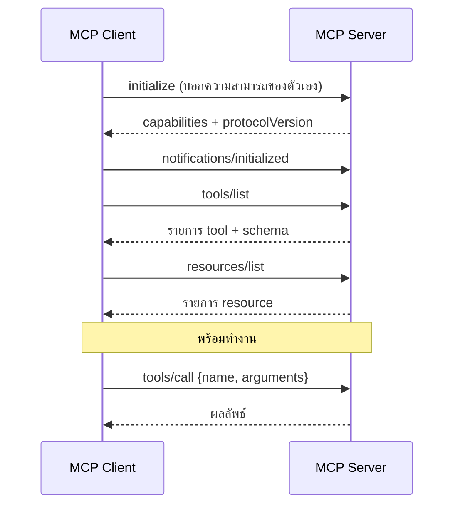
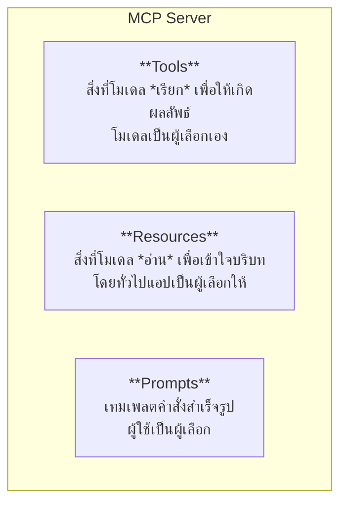
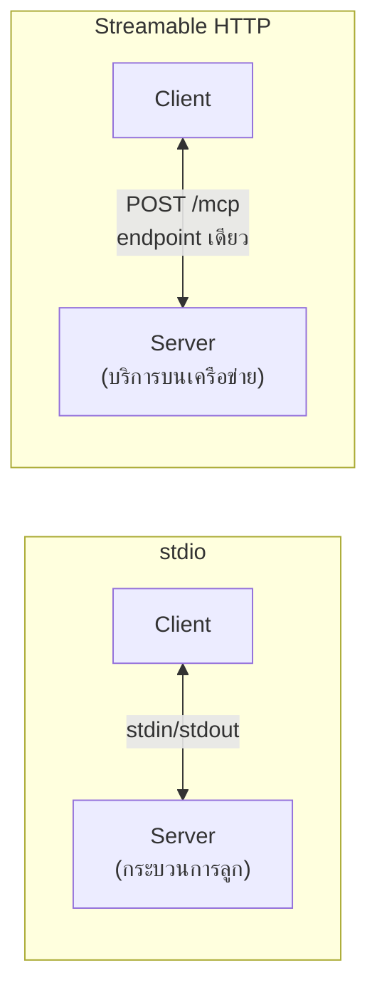
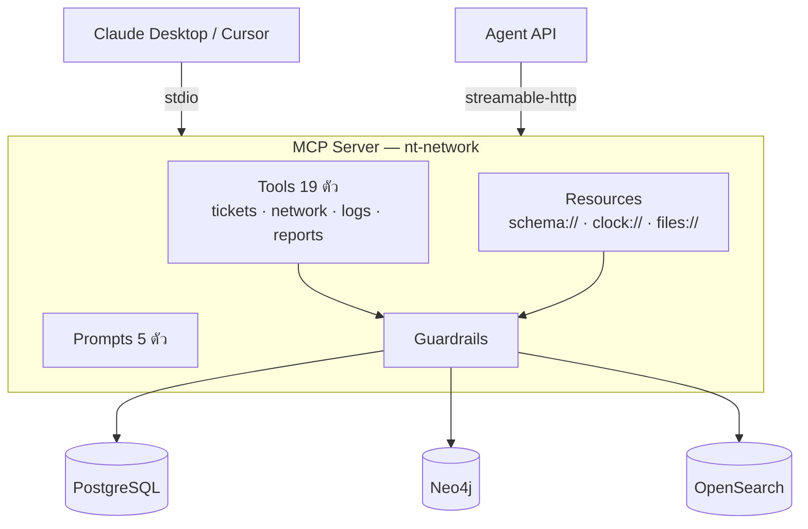

# Module 7 · สถาปัตยกรรมเชิงลึกของ Model Context Protocol

**09:00 – 10:15** · เป้าหมาย: เข้าใจว่า MCP แก้ปัญหาอะไร และประกอบด้วยอะไรบ้าง

---

## 1. ปัญหาที่ MCP แก้ — M × N

ก่อนมี MCP: AI client ทุกตัวต้องเขียน integration กับระบบทุกตัวเอง



หลังมี MCP: เขียน server เพียงครั้งเดียว client ทุกตัวสามารถใช้งานได้



> **นี่คือเหตุผลที่ทั้ง 3 วันมุ่งมาที่นี่**: MCP Server ที่สร้างในช่วงบ่ายนี้สามารถใช้งานได้ทั้งกับ agent ที่พัฒนาไว้เมื่อวันก่อน และกับ Claude Desktop บนเครื่องของผู้เรียนเอง โดยไม่ต้องเขียนโค้ดเพิ่มเติม

---

## 2. JSON-RPC 2.0 — ภาษากลาง

MCP ใช้ JSON-RPC 2.0 เป็นรูปแบบข้อความ



**หน้าตาข้อความจริง**

```json
{"jsonrpc":"2.0","id":3,"method":"tools/call",
 "params":{"name":"search_tickets","arguments":{"site_code":"NBI","range":"last_7d"}}}
```

```json
{"jsonrpc":"2.0","id":3,
 "result":{"content":[{"type":"text","text":"{...}"}],"isError":false}}
```

| องค์ประกอบ | ความหมาย |
|---|---|
| `jsonrpc` | ต้องเป็น `"2.0"` เสมอ |
| `id` | จับคู่ request กับ response — ใช้ทำ concurrent ได้ |
| `method` | สิ่งที่ต้องการ |
| ไม่มี `id` | = notification ไม่ต้องการคำตอบ |

---

## 3. สามองค์ประกอบหลัก



| | Tools | Resources | Prompts |
|---|---|---|---|
| ผู้ควบคุม | โมเดล | แอปพลิเคชัน | ผู้ใช้ |
| มีผลข้างเคียง | อาจมี | ไม่มี | ไม่มี |
| ตัวอย่างในโปรเจกต์นี้ | `search_tickets` | `schema://overview`, `clock://now` | `diagnose_repeated_complaints` |

### ทำไมต้องแยก Resource ออกจาก Tool

`schema://overview` เป็น Resource ไม่ใช่ Tool เพราะโมเดลควร **อ่านก่อนเริ่มคิด** ไม่ใช่ต้องตัดสินใจว่าจะเรียกหรือไม่

ผลที่พบจริง: เมื่อโมเดลอ่าน schema แล้ว จะไม่สุ่มเดาชื่อคอลัมน์และไม่สร้างตารางที่ไม่มีอยู่จริงขึ้นมาเอง

`clock://now` เป็นตัวอย่างที่ชัดเจนที่สุด — โมเดลไม่ทราบว่าวันนี้คือวันที่เท่าใด หากไม่ระบุให้ โมเดลจะกรองช่วงเวลาผิดพลาดโดยไม่รู้ตัว

---

## 4. Transport



| | stdio | Streamable HTTP |
|---|---|---|
| ใช้กับ | Claude Desktop, Cursor | บริการบนเครือข่าย |
| ตัวตน | client เปิดกระบวนการเอง | ต้องมี auth |
| ในโปรเจกต์นี้ | `--transport stdio` | `--transport streamable-http` |

> ⚠️ **stdout เป็นของโปรโตคอล** เมื่อรันแบบ stdio ห้ามใช้ `print()` ลง stdout โดยเด็ดขาด ให้ log ลง stderr แทน
> เป็นข้อผิดพลาดที่พบบ่อยที่สุดสำหรับผู้ที่เพิ่งเริ่มพัฒนา MCP server

---

## 5. spec เปลี่ยนอะไรมาบ้าง (สำคัญ)

MCP ใช้ **วันที่เป็นเลขเวอร์ชัน** ไม่ใช่ 1.0/2.0 make protocol-version 

```bash
uv run python scripts/print_protocol_version.py
```

| เวอร์ชัน | เปลี่ยนอะไร | กระทบเราไหม |
|---|---|---|
| 2024-11-05 | รุ่นแรก · stdio + HTTP+SSE (สอง endpoint) | — |
| **2025-03-26** | **Streamable HTTP** แทน HTTP+SSE · **Tool annotations** · OAuth 2.1 | ✅ ใช้ตัวใหม่ |
| **2025-06-18** | **Structured tool output** · **Elicitation** · ยกเลิก JSON-RPC batching | ✅ ใช้ทั้งสองฟีเจอร์ |

### ข้อควรระวังเมื่อค้นหาตัวอย่างจากอินเทอร์เน็ต

ตัวอย่างเก่าจำนวนมากยังใช้ **HTTP+SSE แบบสอง endpoint** ซึ่งเป็นรูปแบบที่เลิกใช้แล้ว
หากพบโค้ดที่มีทั้ง `/sse` และ `/messages` แสดงว่าเป็นสเปกรุ่นก่อน 2025-03-26

### ฟีเจอร์ใหม่ที่โปรเจกต์นี้ใช้จริง

| ฟีเจอร์ | ใช้ทำอะไร |
|---|---|
| Tool annotations | ประกาศ `readOnlyHint` ให้ client รู้ว่าตัวไหนปลอดภัย |
| Structured output | tool คืน JSON ตาม schema ไม่ใช่ text ก้อนเดียว |
| **Elicitation** | server ถามผู้ใช้กลับกลางคัน → ตรงกับคำถามหมวด L5 |

---

## 6. ภาพรวมของ MCP Server ที่จะสร้างในช่วงบ่าย



---

## 7. ต่อไป

→ [Lab 4: ดู JSON-RPC ที่วิ่งจริง](02-lab4-jsonrpc-inspect.md)
