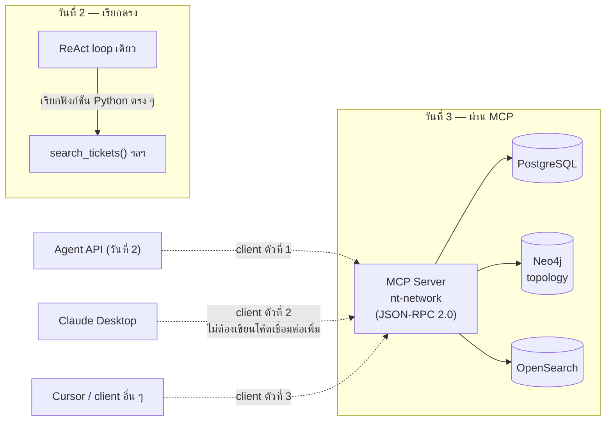

# Module 9 · MCP คืออะไร

**09:00 – 10:30** (90 นาที) · เป้าหมาย: เข้าใจว่า MCP แก้ปัญหาอะไรที่การเรียกฟังก์ชัน Python ตรง ๆ ในวันที่ 2 แก้ไม่ได้ รู้จักสามองค์ประกอบหลัก (Tools / Resources / Prompts) ผ่านโค้ดจริงที่ใช้งานได้อยู่แล้วในโปรเจกต์นี้ และลงมือต่อ MCP Server ตัวนั้นเข้ากับ Claude Desktop ด้วยตนเอง

---

## 1. ปัญหาที่ MCP แก้

ในวันที่ 2 เครื่องมือที่ agent เรียกใช้เป็นฟังก์ชัน Python ธรรมดาที่ผูกอยู่กับโค้ด agent โดยตรง (`solutions/day2/workshop2_agent.py`) วิธีนี้ใช้งานได้ดีภายในโปรแกรมเดียว แต่มีข้อจำกัดชัดเจน: ถ้า Claude Desktop, Cursor หรือระบบอื่นต้องการเรียกเครื่องมือชุดเดียวกัน ต้องเขียนสายเชื่อมต่อ (integration) ขึ้นใหม่ทุกครั้ง เพราะไม่มีมาตรฐานกลางที่ทุกฝ่ายพูดตรงกัน

MCP (Model Context Protocol) คือมาตรฐานที่แก้ปัญหานี้: server ฝั่งเดียวเปิดให้บริการผ่าน JSON-RPC 2.0 ตัวเดียว แล้ว client ใดก็ตามที่พูดโปรโตคอลนี้เป็น — Claude Desktop, Claude Code, Cursor หรือ Agent API ของเราเอง — เชื่อมต่อได้ทันทีโดยไม่ต้องเขียนโค้ดสายเชื่อมต่อใหม่ นี่คือเหตุผลที่ผังสถาปัตยกรรมใน [day0/01-architecture.md](../day0/01-architecture.md) วาด MCP Server เป็นกล่องเดียวที่ทั้ง Agent API และ Claude Desktop ชี้เข้าไปหา ไม่ใช่คนละกล่อง

โปรเจกต์นี้มี MCP Server ที่ทำงานได้จริงอยู่แล้วที่ `apps/mcp-server/` ให้บริการสามฐานข้อมูล (PostgreSQL, Neo4j, OpenSearch) ผ่าน server ตัวเดียว ดังที่ระบุไว้ในคอมเมนต์ของ `apps/mcp-server/server.py:4-8`:

```
    Tools      actions the model can invoke  (tools/)
    Resources  context the model can read    (resources/)
    Prompts    reusable investigation recipes (prompts/)
```



---

## 2. สามองค์ประกอบหลักของ MCP

| องค์ประกอบ | โมเดลใช้ทำอะไร | ใครเป็นผู้ตัดสินใจเรียก | ตัวอย่างจริงในโปรเจกต์ |
|---|---|---|---|
| **Tool** | เรียกเพื่อให้เกิดผลบางอย่าง (ค้นหา, คำนวณ, ส่งอีเมล) | โมเดลตัดสินใจเอง ระหว่างการวางแผนตอบคำถาม | `search_tickets` — `apps/mcp-server/tools/tickets.py:31` |
| **Resource** | อ่านเพื่อเข้าใจโลกก่อนลงมือทำ | client เสนอให้ หรือโมเดลอ่านตามคำแนะนำใน instructions ของ server | `postgres_schema` — `apps/mcp-server/resources/schemas.py:23` |
| **Prompt** | Template ข้อความสำเร็จรูปที่ client เสนอในเมนูให้ผู้ใช้เลือก | **มนุษย์** เป็นผู้เลือกผ่าน UI ของ client ไม่ใช่โมเดลเรียกเอง | `diagnose_repeated_complaints` — `apps/mcp-server/prompts/templates.py:18` |

ความแตกต่างระหว่าง Tool กับ Resource สรุปเป็นประโยคเดียวไว้ในคอมเมนต์ของ `apps/mcp-server/resources/schemas.py:3-5`:

> *"a Tool is something the model calls to make something happen; a Resource is something the model reads to understand the world before it acts."*

ส่วน Prompt คือสิ่งที่มักถูกเข้าใจผิดมากที่สุดในสามอย่างนี้ ตามคอมเมนต์ของ `apps/mcp-server/prompts/templates.py:3-5`:

> *"They are not system prompts and not tools - they are named, parameterised message templates that a client can offer to a user as a starting point."*

### 2.1 Tool — โค้ดจริง

```python
@mcp.tool(
    annotations={
        "title": "Search trouble tickets",
        "readOnlyHint": True,
        "idempotentHint": True,
        "openWorldHint": False,
    }
)
def search_tickets(
    status: str | None = None,
    severity: str | None = None,
    ...
) -> dict:
    """Search customer trouble tickets and engineer-raised incidents.

    Use this to answer questions about what has been REPORTED: ...
    Do NOT use this to find out what a device is actually doing right now - ...
    """
```
*(`apps/mcp-server/tools/tickets.py:23-63`)*

สามฟิลด์ใน `annotations` มีความหมายเฉพาะที่ client ใช้ตัดสินใจว่าควรถามผู้ใช้ก่อนเรียกหรือไม่:

- `readOnlyHint: True` — tool นี้ไม่แก้ไขข้อมูลใด ๆ เรียกซ้ำได้อย่างปลอดภัย
- `idempotentHint: True` — เรียกด้วย argument เดิมกี่ครั้งก็ได้ผลเหมือนเดิม
- `openWorldHint: False` — ขอบเขตข้อมูลปิด (ไม่ได้ไปเรียกอินเทอร์เน็ตหรือระบบภายนอกที่คาดเดาไม่ได้)

เทียบกับ tool ที่**เขียน**ข้อมูลจริง เช่น `generate_report` ที่ตั้ง `readOnlyHint` เป็น `False` เพราะสร้างไฟล์ใหม่ทุกครั้งที่เรียก (`apps/mcp-server/tools/reports.py:131-133`) — client ที่ดีจะแจ้งเตือนผู้ใช้ก่อนอนุญาตให้โมเดลเรียก tool ประเภทนี้ ต่างจาก tool แบบอ่านอย่างเดียวที่มักอนุญาตให้เรียกได้เลย

โมดูล docstring ของ `apps/mcp-server/tools/tickets.py:1-12` ยังทิ้งหลักการเขียน description ของ tool ไว้สองข้อที่สำคัญมากสำหรับแบบฝึกหัดเขียน tool description ในวันที่ 2 (Module 6) และจะใช้ซ้ำในการเขียน tool เองใน Workshop 3 บ่ายนี้: บอกว่า *ห้าม*ใช้เมื่อไหร่ ไม่ใช่แค่บอกว่าใช้เมื่อไหร่ และอธิบายว่า tool **คืนอะไร** ไม่ใช่มันทำงานภายในอย่างไร

### 2.2 Resource — โค้ดจริง

```python
@mcp.resource("schema://postgres")
def postgres_schema() -> str:
    """Tables, columns and comments in the ticket and configuration database."""
    ...
```
*(`apps/mcp-server/resources/schemas.py:22-23`)*

Resource มี URI ของตัวเอง (`schema://postgres`, `schema://neo4j`, `schema://overview` ที่ `resources/schemas.py:64,98,126` และ `clock://now` ที่ `apps/mcp-server/resources/clock_resource.py:17`) — client แสดงรายการนี้แยกจากรายการ tool โดยสิ้นเชิง และคำแนะนำใน `INSTRUCTIONS` ของ server เอง (`apps/mcp-server/server.py:58-63`) สั่งให้โมเดลอ่าน `schema://overview` และ `clock://now` **ก่อน**เริ่มเรียก tool ใด ๆ เสมอ

### 2.3 Prompt — โค้ดจริง

```python
@mcp.prompt(title="Diagnose repeated customer complaints")
def diagnose_repeated_complaints(range: str = "last_14d") -> str:
    """Find the shared root cause behind several similar complaints."""
    return f"""ช่วยหาสาเหตุร่วมของ ticket ที่ลูกค้าแจ้งอาการคล้ายกันในช่วง {range}
...
```
*(`apps/mcp-server/prompts/templates.py:17-19`)*

เมื่อผู้ใช้เลือก prompt นี้จากเมนูของ Claude Desktop ข้อความทั้งก้อนที่ฟังก์ชันคืนกลับมาจะกลายเป็นข้อความแรกของบทสนทนา — ค่าที่แท้จริงของ Prompt ในกรณีนี้คือการบังคับ**ลำดับการสืบสวน** (ดู `search_tickets` ก่อน แล้วค่อยตรวจ `get_upstream_devices` ก่อนสรุปสาเหตุ) ซึ่งเป็นสิ่งที่ทั้งวิศวกรมือใหม่และโมเดลภาษามักพลาดเหมือนกัน: มองสัญญาณที่ดังที่สุดก่อนเสมอ

---

## 3. สาธิต: ต่อ MCP Server ที่มีอยู่แล้วเข้ากับ Claude Desktop

การสาธิตนี้ตั้งใจเน้นข้อมูล **Neo4j/topology** เป็นพิเศษ เพราะเป็นคำถามประเภทที่ keyword search ธรรมดาตอบไม่ได้ตรง ๆ — ต้องเดินตามกราฟความสัมพันธ์จริง

### 3.1 ตัวเลือก transport ของ server

`apps/mcp-server/server.py:10-12` ระบุไว้ชัดเจนว่า stdio คือ transport ที่ใช้กับ Claude Desktop / Cursor:

```
python apps/mcp-server/server.py                     # stdio, for Claude Desktop / Cursor
python apps/mcp-server/server.py --transport streamable-http --port 9000
```

**สองบรรทัดนี้ต่างกันตรงไหน**: ไม่ใช่แค่ flag ต่างกัน แต่เป็นวิธีคุยกันคนละแบบเลย

| | `stdio` (บรรทัดแรก) | `streamable-http` (บรรทัดสอง) |
|---|---|---|
| วิธีเชื่อมต่อ | ไม่มี network เลย — Claude Desktop **เป็นคนเปิด process นี้เอง** แล้วคุยกันผ่าน stdin/stdout (ท่อข้อมูลของ process โดยตรง) | เปิดเป็น HTTP server จริงที่ port ที่ระบุ (9000) รอ client จากที่ไหนก็ได้เชื่อมผ่าน network เข้ามา |
| จำนวน client | 1 client ต่อ 1 process เท่านั้น ปิด Claude Desktop = process นี้ตายไปด้วย | หลาย client เชื่อมพร้อมกันได้ผ่าน URL เดียว (เช่น `http://localhost:9000`) โดย process ไม่ตายตามใคร |
| ใช้เมื่อไหร่ | client กับ server อยู่เครื่องเดียวกันเสมอ (Claude Desktop, Cursor) | อยากให้ทีมอื่น/เครื่องอื่น/บริการอื่นเรียกผ่านเครือข่ายได้ |
| ความซับซ้อนของโค้ด | เรียก `mcp.run(transport="stdio")` บรรทัดเดียวจบ (`server.py:120-122`) | ต้องห่อด้วย `uvicorn` + ตั้งค่า `CORSMiddleware` เพิ่ม (`server.py:132-161`) เพราะเป็น HTTP server จริงที่ browser-based client (เช่น MCP Inspector) อาจต้องส่ง CORS preflight มาก่อน |

พูดง่ายๆ: `stdio` คือ "เสียบสายตรง" ระหว่างสอง process บนเครื่องเดียวกัน ส่วน `streamable-http` คือ "เปิดเป็นเว็บเซิร์ฟเวอร์" ให้ใครก็ได้มาต่อผ่าน URL — สำหรับ server บนเครื่องตัวเองแบบในบทเรียนนี้ ต้องใช้ `stdio` เท่านั้น จึงต้องระบุ `--transport stdio` เสมอเมื่อจะต่อกับมัน (ดูข้อควรระวังถัดไป)

**ทำไมไม่ตั้งเป็น `streamable-http` แล้วให้ Claude Desktop ต่อผ่าน URL แทน เพื่อจะได้ไม่ต้องแก้ JSON เลย?** — ทำไม่ได้กับ server ที่รันบนเครื่องตัวเองแบบนี้ Claude Desktop มีสองทางเข้าเท่านั้น: (1) หน้า Settings → Connectors → Add custom connector ซึ่งรับเฉพาะ URL แบบ **HTTPS สาธารณะ** เท่านั้น ปฏิเสธ `http://localhost:...` โดยตรง (2) ใส่ field `"url"` ใน `claude_desktop_config.json` แทน `"command"/"args"` ได้ตามสเปก MCP เหมือนกัน แต่นั่นก็ยังต้องแก้ JSON อยู่ดี (แค่ field ต่างไปจากที่ใช้ตอน stdio) ไม่ได้ช่วยให้ตัดขั้นตอนนี้ออกไปได้ ถ้าต้องการต่อผ่าน URL จริงๆ โดยไม่แตะ JSON เลย ต้องเปิด server ให้มี domain + HTTPS จริง (เช่น เจาะอุโมงค์ผ่าน ngrok) ซึ่งซับซ้อนกว่าการแก้ JSON ตามข้อ 3.2 มาก — สำหรับ workshop นี้ `stdio` + JSON ตามที่สอนจึงเป็นทางที่ตรงและง่ายที่สุด

ข้อควรระวัง: `--transport` มีค่า default มาจาก `settings().transport` (`apps/mcp-server/server.py:111`, อ่านจาก `MCP_TRANSPORT` ใน `apps/mcp-server/config.py:26`) และ `.env.example:62` ตั้งค่า `MCP_TRANSPORT=streamable-http` ไว้เป็นค่าเริ่มต้นสำหรับ container สาธิต ดังนั้นเมื่อต่อกับ Claude Desktop **ต้องระบุ `--transport stdio` เองอย่างชัดเจน** มิฉะนั้น server จะพยายามเปิดเป็น HTTP แทน และ Claude Desktop จะต่อไม่ติด

```bash
uv run python apps/mcp-server/server.py --transport stdio
```

### 3.2 ตั้งค่า Claude Desktop

แก้ไฟล์ config ของ Claude Desktop (macOS: `~/Library/Application Support/Claude/claude_desktop_config.json`, Windows: `%APPDATA%\Claude\claude_desktop_config.json`) เพิ่ม entry ต่อไปนี้ — ใช้ path แบบ absolute แทน relative เสมอ เพราะ Claude Desktop เป็นผู้เปิดโปรเซสนี้เอง cwd จึงไม่แน่นอน:

```json
{
  "mcpServers": {
    "nt-network": {
      "command": "uv",
      "args": [
        "--directory", "/absolute/path/to/MCP2",
        "run", "python", "apps/mcp-server/server.py",
        "--transport", "stdio"
      ]
    }
  }
}
```

ไม่จำเป็นต้องระบุ `env` เพิ่มเติมในไฟล์นี้ — `apps/mcp-server/config.py:20` อ่านไฟล์ `.env` จาก path ที่คำนวณจากตำแหน่งไฟล์ `config.py` เอง (`parents[2]`, คือรากของโปรเจกต์) ไม่ใช่จาก cwd ของโปรเซสที่ Claude Desktop เปิดขึ้นมา ดังนั้นตราบใดที่ `.env` มีอยู่จริงที่รากโปรเจกต์ ค่าที่ตั้งไว้ (`PG_DSN`, `NEO4J_URI`, ฯลฯ) จะถูกอ่านเข้ามาเองโดยอัตโนมัติ

หลังบันทึกไฟล์ ต้องปิดแล้วเปิด Claude Desktop ใหม่เพื่อให้อ่าน config ใหม่

### 3.3 ทดลองถามคำถามที่ต้องใช้ Neo4j topology

ลองถามคำถามที่ควรทำให้โมเดลเรียก `get_upstream_devices` (`apps/mcp-server/tools/network.py:68-129`):

> "ลูกค้าที่ต่อกับ LPE-NBI-11 และ LPE-NBI-12 แจ้งปัญหาคล้ายกันช่วงนี้ อุปกรณ์ทั้งสองนี้มี upstream ร่วมกันหรือไม่"

สิ่งที่ควรสังเกตในผลลัพธ์: tool นี้ไม่ได้คืนแค่รายชื่ออุปกรณ์ แต่คำนวณ intersection ให้เสร็จแล้วในฟิลด์ `interpretation` (`apps/mcp-server/tools/network.py:119-129`) เป็นประโยคภาษาที่มนุษย์อ่านรู้เรื่องทันที — หลักการคือ **งานที่เขียนเป็นโค้ดได้แน่นอน ไม่ควรปล่อยให้โมเดลคิดเอง** (โมเดลอาจนับ intersection ผิดเมื่ออุปกรณ์มีจำนวนมาก)

จากนั้นลองเปิดเมนู Prompt ของ Claude Desktop แล้วเลือก "Diagnose repeated customer complaints" (`prompts/templates.py:17`) สังเกตว่าข้อความที่ปรากฏคือลำดับการสืบสวน 5 ขั้นตอนที่ฟังก์ชันเขียนไว้ล่วงหน้า ไม่ใช่คำตอบสำเร็จรูป

### สิ่งที่ควรสังเกตระหว่างเดโม

- Tool ทั้งหมดของ `nt-network` ปรากฏเป็นรายการเดียวในหน้าต่าง "Search and tools" ของ Claude Desktop แม้จะดึงข้อมูลจากสามฐานข้อมูลคนละตัวกัน — นี่คือประโยชน์ของ "server เดียว หนึ่งรายการ tool" ตามคอมเมนต์ที่ `apps/mcp-server/server.py:87-89`
- คำถามเดียวกันนี้ถ้าถามกับ Agent API ของวันที่ 2 (ต่อเมื่อทำ Workshop 3 บ่ายนี้เสร็จ) จะเรียก MCP server ตัวเดียวกันนี้ ไม่ใช่คนละชุดโค้ด
- ถ้า Claude Desktop รายงานว่าเชื่อมต่อ server ไม่สำเร็จ ให้ตรวจอันดับแรกว่าใส่ `--transport stdio` แล้วหรือยัง (ดูข้อ 3.1)

---

## ต่อไป

→ [Module 10: ความปลอดภัยพื้นฐาน](02-module10-security-basics.md)
