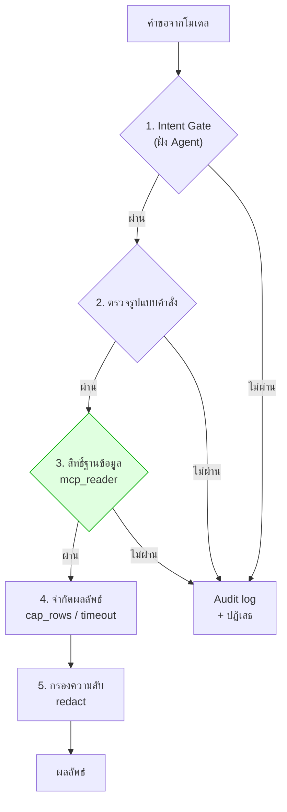
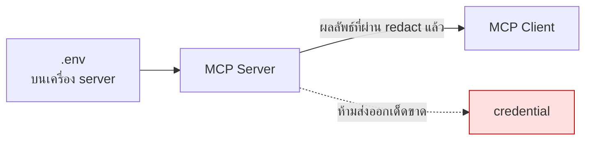

# Module 8 · ความปลอดภัยและการเลือก SDK

**10:45 – 11:35** · เป้าหมาย: ออกแบบ MCP Server ที่ปลอดภัยพอจะต่อกับฐานข้อมูลจริงขององค์กร

---

## 1. หลักการเดียวที่ต้องจำจากโมดูลนี้

> **Guardrail ที่เขียนไว้ใน prompt คือ "คำขอ"**
> **Guardrail ที่เขียนไว้ในโค้ดและสิทธิ์ คือ "กฎ"**

Prompt injection เอาชนะคำขอได้เสมอ แต่เอาชนะสิทธิ์ระดับฐานข้อมูลไม่ได้

---

## 2. ชั้นป้องกัน 5 ชั้น



**ชั้นที่ 3 คือชั้นเดียวที่ prompt injection ชนะไม่ได้ไม่ว่าจะเก่งแค่ไหน**

### Permission Layer — ทำที่ฐานข้อมูล

`docker/postgres/init/99_readonly_role.sql`:

```sql
-- CREATE ROLE mcp_reader LOGIN PASSWORD '...';
GRANT SELECT ON ALL TABLES IN SCHEMA public TO mcp_reader;
REVOKE CREATE ON SCHEMA public FROM mcp_reader;
ALTER ROLE mcp_reader SET statement_timeout = '15s';
```

**สามารถทดสอบได้ด้วยตนเองที่ pgAdmin** — เข้าสู่ระบบด้วยบัญชี `mcp_reader` แล้วรันคำสั่งต่อไปนี้:

```sql
UPDATE tickets SET severity = 'low';
```

จะถูกปฏิเสธที่ระดับฐานข้อมูล ไม่ว่าโมเดลจะถูกหลอกด้วยวิธีไหนก็ตาม

### Sandboxing — Tool ที่อันตราย

| ความเสี่ยง | วิธีคุม |
|---|---|
| รันสคริปต์ตามใจ | **Allowlist เท่านั้น** — `ALLOWED_SCRIPTS` ใน `apps/agent-api/tools/reports.py` |
| ประกอบ command line | ใช้ `subprocess.run(argv, shell=False)` ห้าม `shell=True` |
| สคริปต์ค้าง | `timeout=30` |
| output ท่วม | `MAX_OUTPUT_CHARS` |
| อ่านไฟล์นอกขอบเขต | `safe_path()` resolve แล้วเทียบว่าอยู่ใต้ root จริง |

> **"ชื่อสคริปต์" ต้องเป็นชุดปิดที่นักพัฒนากำหนด ไม่ใช่ string ที่โมเดลส่งมา**

### Secrets



`redact()` ทำงานกับ **ทุกข้อความที่ออกจาก tool** รวมถึงข้อมูลที่ดึงจากฐานข้อมูล เพราะ config snippet อาจมี SNMP community string ปนอยู่

สามารถทดสอบได้ด้วยตนเอง ([security/guardrails.py:141](../../apps/mcp-server/security/guardrails.py:141)):

```bash
uv run python -c "
import sys; sys.path.insert(0, 'apps/mcp-server')
from security.guardrails import redact

print(redact('snmp-server community public_snmp_read RO'))
"
```

ผลที่ควรเห็น: `snmp-server community: [REDACTED] RO` — ชื่อ community string หายไป เหลือแค่รูปแบบของบรรทัดไว้ให้เห็นบริบท

---

## 3. Audit Log

ทุกครั้งที่ระบบปฏิเสธคำขอ (`refuse()`) หรือตัดผลลัพธ์ทิ้งบางส่วน (`cap_rows()` เกินโควต้า) ต้องมีบันทึกแยกไว้ต่างหาก — เพราะข้อความปฏิเสธที่ส่งกลับให้โมเดล/ผู้ใช้ต้อง **สั้นและไม่เผยโครงสร้างภายใน** (ห้ามบอกชื่อตาราง ชื่อ role หรือ path จริง) ในขณะที่ทีมความปลอดภัยต้องเห็นรายละเอียดเต็มว่าใครพยายามทำอะไร ถูกบล็อกด้วยเหตุผลไหน สองอย่างนี้แยกช่องทางกันโดยตั้งใจ

โค้ดจริงอยู่ที่ [security/guardrails.py:55-76](../../apps/mcp-server/security/guardrails.py:55):

```python
@dataclass
class AuditEvent:
    tool: str
    decision: str
    reason: str
    detail: str = ""
    at: datetime = field(default_factory=datetime.now)

    def emit(self) -> None:
        audit_log.warning(
            "%s tool=%s reason=%s detail=%s",
            self.decision.upper(), self.tool, self.reason, self.detail[:200],
        )


def refuse(tool: str, reason: str, detail: str = "") -> None:
    """Record a refusal and raise. Never include internals in the message."""
    AuditEvent(tool=tool, decision="blocked", reason=reason, detail=detail).emit()
    raise GuardrailViolation(
        f"คำขอนี้ถูกปฏิเสธโดยระบบความปลอดภัย: {reason}. "
        f"เครื่องมือชุดนี้อ่านข้อมูลได้อย่างเดียว"
    )
```

สังเกต 2 จุด:
- `emit()` ใช้ `logging` มาตรฐานของ Python (`audit_log = logging.getLogger("mcp.audit")`) แทนการเขียนไฟล์เอง — จึงสามารถต่อเข้ากับระบบ log รวมศูนย์ในอนาคตได้โดยไม่ต้องแก้ไขบรรทัดนี้เลย (ปัจจุบันยังไม่ได้ตั้งค่า handler แยกต่างหาก จึงปรากฏรวมอยู่กับ log ปกติของ server ที่ stderr)
- `refuse()` **เรียก `.emit()` ก่อน raise เสมอ** — ไม่ว่าฝั่งที่เรียกจะดัก exception ต่อยังไง audit event ก็ถูกบันทึกไปแล้ว

> ⚠️ **ข้อผิดพลาดที่พบบ่อยที่สุด** — เขียน audit log ไว้ที่**จุดเรียกใช้** (เช่น ใน `except` ของแต่ละ tool) แทนที่จะเขียนไว้ *ข้างใน* ฟังก์ชันที่ตัดสินใจปฏิเสธเอง หากทำเช่นนั้น ทุก tool ใหม่ที่เพิ่มเข้ามาต้องเขียน audit log ซ้ำเองทุกครั้ง ซึ่งมีความเสี่ยงสูงที่จะถูกมองข้าม — โครงสร้างในที่นี้ (ให้ `refuse()` บันทึกเองก่อน raise) ช่วยขจัดความเสี่ยงดังกล่าว เนื่องจากทุกจุดที่ปฏิเสธคำขอต้องเรียกผ่านฟังก์ชันนี้อยู่แล้ว

สามารถทดสอบได้ด้วยตนเอง (จะเห็นบรรทัด `WARNING` ปรากฏขึ้นที่ terminal ทันที):

```bash
uv run python -c "
import sys; sys.path.insert(0, 'apps/mcp-server')
from security.guardrails import assert_read_only, GuardrailViolation

try:
    assert_read_only(\"UPDATE tickets SET severity = 'low'\", 'search_tickets')
except GuardrailViolation as e:
    print('ผู้ใช้เห็นแค่:', e)
"
```

ผลที่ควรเห็น:
```
BLOCKED tool=search_tickets reason=พบคำสั่งที่แก้ไขข้อมูล detail=keyword=UPDATE
ผู้ใช้เห็นแค่: คำขอนี้ถูกปฏิเสธโดยระบบความปลอดภัย: พบคำสั่งที่แก้ไขข้อมูล. เครื่องมือชุดนี้อ่านข้อมูลได้อย่างเดียว
```

บรรทัดแรก (`BLOCKED tool=...`) คือ audit log แบบเต็ม ส่วนบรรทัดที่สองคือสิ่งเดียวที่ผู้ใช้/โมเดลเห็น — เมื่อเทียบสองบรรทัดนี้จะเห็นได้อย่างชัดเจนว่า "บันทึกโดยละเอียด" และ "ข้อความปฏิเสธที่ปลอดภัย" เป็นคนละส่วนกันโดยเจตนา

`cap_rows()` ใช้ `AuditEvent` ตัวเดียวกันแต่ `decision="truncated"` แทน `"blocked"` — ดูที่ [security/guardrails.py:93-106](../../apps/mcp-server/security/guardrails.py:93)

---

## 4. เลือก SDK: Python หรือ TypeScript

| | Python SDK | TypeScript SDK |
|---|---|---|
| เหมาะกับ | ทีม data/backend, งาน ML | ทีม frontend, deploy บน edge |
| ระบบนิเวศฐานข้อมูล | ครบมาก | ครบพอใช้ |
| deploy แบบ serverless | ทำได้ | **ทำได้ดีกว่า** |
| ในโครงการนี้ | **เลือกตัวนี้** | — |

**เหตุผลที่เลือก Python**: ฐานข้อมูลทั้ง 3 ตัวมี driver ที่สมบูรณ์และมีเสถียรภาพ · ทีมที่ดูแล MPLS LLM ใช้ Python เป็นหลักอยู่แล้ว · โค้ดของวันที่ 1-2 เป็น Python ทั้งหมด จึงสามารถเชื่อมต่อกันได้ทันที

รายละเอียดเปรียบเทียบพร้อมโค้ดตัวอย่างสองภาษา: [reference/sdk-comparison.md](../reference/sdk-comparison.md)

### FastMCP หรือ SDK ดิบ

โปรเจกต์นี้ใช้ `FastMCP` (อยู่ใน official SDK) เนื่องจากสามารถประกาศ tool ด้วย decorator ได้โดยตรง ทำให้เห็น **สิ่งที่สอน** ไม่ใช่ boilerplate — ตัวอย่างจริงจากระบบนี้เอง ([tools/tickets.py:23-53](../../apps/mcp-server/tools/tickets.py:23)):

```python
@mcp.tool(
    annotations={
        "title": "Search trouble tickets",
        "readOnlyHint": True,
        "idempotentHint": True,
        "openWorldHint": False,
    }
)
def search_tickets(
    status: str | None = None,
    severity: str | None = None,
    site_code: str | None = None,
    device_id: str | None = None,
    category: str | None = None,
    range: str = "last_30d",
    limit: int = 20,
) -> dict:
    """Search customer trouble tickets and engineer-raised incidents.

    Use this to answer questions about what has been REPORTED: open
    complaints, incident history, who raised what and when, and whether a
    device already has a case against it.

    Do NOT use this to find out what a device is actually doing right now -
    many faults never produce a ticket at all. For observed device behaviour
    use search_logs. For how a device is configured use get_device_config.
    ...
    """
```

type hint กลายเป็น `inputSchema` และ docstring กลายเป็น `description` โดยอัตโนมัติ — ไม่ต้องเขียน schema แยกอีกไฟล์ นี่คือ tool ตัวเดียวกับที่ [โจทย์ที่ 3 (day2)](../day2/03-challenge3-tool-description-battle.md) ให้ฝึกแก้ description มาแล้ว สามารถเปิดไฟล์แบบเต็มเพื่อพิจารณาว่า `annotations` มีผลต่อ MCP Inspector อย่างไร (ดู [Lab 4](02-lab4-jsonrpc-inspect.md))

---

## 5. OAuth 2.1 — รู้ไว้ แต่ยังไม่ใช้

spec รุ่นใหม่กำหนดให้ MCP server ที่เปิดบนเครือข่ายทำตัวเป็น OAuth Resource Server

โปรเจกต์นี้**ยังไม่ดำเนินการในส่วนนี้** เนื่องจากอยู่ในเครือข่ายภายในองค์กร (internal network) และเป้าหมายของหลักสูตรคือการสอน MCP มิใช่การสอน OAuth

**อย่างไรก็ตาม ต้องทราบว่าเมื่อนำระบบขึ้นใช้งานจริงในระดับ production จำเป็นต้องมีการตรวจสอบสิทธิ์ดังกล่าว** โดยเฉพาะเมื่อ NEX จะเรียกใช้งานผ่านเครือข่ายขององค์กร

---

## 6. เช็คลิสต์ก่อนเปิด MCP Server ให้ระบบจริง

- [ ] บัญชีฐานข้อมูลเป็น read-only จริง (ทดสอบด้วยการลอง UPDATE)
- [ ] มี statement timeout
- [ ] จำกัดจำนวนแถวและขนาด output
- [ ] tool ที่รันสคริปต์ใช้ allowlist ไม่ใช่ string จากโมเดล
- [ ] path ทุกเส้นถูก resolve และตรวจว่าอยู่ในขอบเขต
- [ ] มี redact ครอบทุก output
- [ ] มี audit log ทุกการปฏิเสธ
- [ ] secrets อยู่ในตัวแปรสภาพแวดล้อม ไม่อยู่ในโค้ด
- [ ] ประกาศ `readOnlyHint` / `destructiveHint` ให้ครบ
- [ ] มี auth เมื่อเปิดบนเครือข่าย

---

## 7. ต่อไป

→ [โจทย์ที่ 5: Guardrail Red-team](04-challenge5-guardrail-redteam.md)
