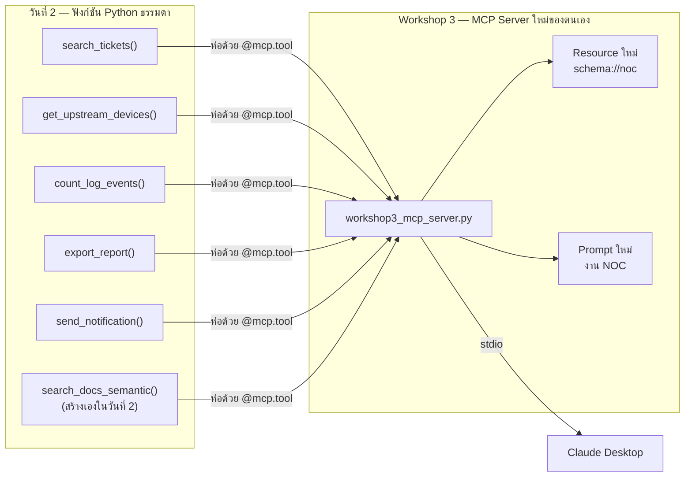

# Workshop 3 · MPLS NOC MCP Server

**13:00 – 16:30** (210 นาที: 13:00–15:30 ลงมือสร้างและทดสอบ · 15:30–16:30 สรุปและถาม-ตอบ) · เป้าหมาย: ย้าย 6 เครื่องมือที่เขียนเป็นฟังก์ชัน Python ธรรมดาในวันที่ 2 มาเป็น MCP Server ที่มี Tool ครบ 6 ตัว, Resource สำหรับ schema, Prompt แม่แบบสำหรับงาน NOC และเชื่อมต่อทดสอบผ่าน Claude Desktop ได้จริงด้วยตนเอง

---

## 1. ภาพรวมงาน



งานวันนี้**ไม่ใช่**การแก้ไข `apps/mcp-server/` — โฟลเดอร์นั้นเป็นระบบที่ทำงานสมบูรณ์อยู่แล้วและใช้เป็นตัวอย่างอ้างอิงเท่านั้น (แนวทางเดียวกับที่ [`solutions/day3/README.md`](../../solutions/day3/README.md) อธิบายไว้) งานจริงของ Workshop นี้คือสร้างไฟล์ใหม่ของตนเองที่ root ของโปรเจกต์ ชื่อ `workshop3_mcp_server.py` — แนวทางเดียวกับ `solutions/day1/workshop1_extractor.py` และ `solutions/day2/workshop2_agent.py` ที่เป็นไฟล์เดียวจบ ไม่ต้องแยกเป็นแพ็กเกจ (ดูเฉลยที่ [`solutions/day3/workshop3_mcp_server.py`](../../solutions/day3/workshop3_mcp_server.py) หลังจากลองเขียนเองก่อน)

---

## 2. จุดอ้างอิงที่ต้องเปิดควบคู่กัน

| ต้องการอะไร | เปิดไฟล์ไหน |
|---|---|
| ฟังก์ชันเดิม 5 ตัวจากวันที่ 2 (plain function) | `solutions/day2/workshop2_agent.py:64-216` |
| ต้นแบบการประกาศ Tool ด้วย FastMCP | `apps/mcp-server/tools/tickets.py:23-63` (`search_tickets`) |
| ต้นแบบ Tool ที่**เขียน**ข้อมูล (annotations ต่างจาก tool อ่านอย่างเดียว) | `apps/mcp-server/tools/reports.py:130-141` (`generate_report`), `apps/mcp-server/tools/notifications.py:9-18` (`send_notification`) |
| ต้นแบบการประกาศ Resource | `apps/mcp-server/resources/schemas.py:126-161` (`overview`) |
| ต้นแบบการประกาศ Prompt | `apps/mcp-server/prompts/templates.py:17-34` (`diagnose_repeated_complaints`) |
| ต้นแบบการประกอบ server ทั้งหมดเข้าด้วยกัน | `apps/mcp-server/server.py:84-104` (`build_server()`) |

---

## 3. งานที่ 1 — สร้างโครง MCP Server ใหม่

สร้างไฟล์ `workshop3_mcp_server.py` ที่ root ของโปรเจกต์:

```python
#!/usr/bin/env python3
"""Workshop 3: MPLS NOC MCP Server — 6 tool จากวันที่ 2 ห่อด้วย FastMCP"""

from __future__ import annotations

from mcp.server.fastmcp import FastMCP

mcp = FastMCP(name="mpls-noc-workshop3")

# --- Tools ประกาศต่อจากนี้ (งานที่ 2) ---
# --- Resource ประกาศต่อจากนี้ (งานที่ 3) ---
# --- Prompt ประกาศต่อจากนี้ (งานที่ 4) ---

if __name__ == "__main__":
    mcp.run(transport="stdio")
```

โครงนี้เลียนแบบ `apps/mcp-server/server.py:33,85,120-122` โดยตรง แต่ตัดความซับซ้อนของ `argparse` และโหมด `streamable-http` ออก (`server.py:107-175`) เพราะ client เดียวที่ทดสอบวันนี้คือ Claude Desktop ผ่าน stdio เท่านั้น (`server.py:11`) — ไม่ต้องสร้าง REST API หรือหน้าเว็บแยกต่างหาก

รันทดสอบว่าไฟล์ไม่มี error ก่อนเริ่มเติมเนื้อหา:

```bash
uv run python workshop3_mcp_server.py
```

(หากไม่มี error จะค้างรออยู่เฉย ๆ เพราะ stdio รอ client มาเชื่อมต่อ — กด Ctrl+C เพื่อออก)

---

## 4. งานที่ 2 — ย้าย 6 tool จากวันที่ 2 เข้ามาเป็น MCP Tool

| Tool | ฟังก์ชันเดิม | เขียนข้อมูลหรืออ่านอย่างเดียว | `readOnlyHint` ที่ควรตั้ง |
|---|---|---|---|
| `search_tickets` | `solutions/day2/workshop2_agent.py:64-93` | อ่านอย่างเดียว | `True` |
| `get_upstream_devices` | `solutions/day2/workshop2_agent.py:96-125` | อ่านอย่างเดียว | `True` |
| `count_log_events` | `solutions/day2/workshop2_agent.py:128-150` | อ่านอย่างเดียว | `True` |
| `export_report` | `solutions/day2/workshop2_agent.py:153-183` | **เขียนไฟล์ใหม่** | `False` |
| `send_notification` | `solutions/day2/workshop2_agent.py:186-207` | **ส่งอีเมลจริง (ไปที่ MailHog)** | `False` |
| `search_docs_semantic` | เขียนเองในวันที่ 2 (semantic search) | อ่านอย่างเดียว | `True` |

### ตัวอย่างเต็ม: `search_tickets`

ฟังก์ชันเดิมจากวันที่ 2:

```python
def search_tickets(status: str | None = None, days: int = 7,
                   limit: int = 20) -> dict:
    """ค้นหา ticket ที่ถูกแจ้งเข้ามา ..."""
    ...
```
*(`solutions/day2/workshop2_agent.py:64-93`)*

ห่อด้วย `@mcp.tool` ตามแบบที่ `apps/mcp-server/tools/tickets.py:23-39` ทำไว้ — **นำ logic ข้างในของฟังก์ชันเดิมมาใช้ต่อได้เลย ไม่ต้องเขียนใหม่** สิ่งที่เปลี่ยนมีแค่การเติม decorator, annotations และ docstring ที่ปรับให้เป็นคำแนะนำสำหรับโมเดล (ไม่ใช่คอมเมนต์สำหรับนักพัฒนา ตามหลักการที่อธิบายไว้ใน Module 7 ข้อ 2.1):

```python
@mcp.tool(
    annotations={
        "title": "Search trouble tickets",
        "readOnlyHint": True,
        "idempotentHint": True,
        "openWorldHint": False,
    }
)
def search_tickets(status: str | None = None, days: int = 7,
                   limit: int = 20) -> dict:
    """ค้นหา ticket ที่ลูกค้าหรือวิศวกรแจ้งเข้ามา

    ใช้เมื่อต้องการรู้ว่ามีอะไรถูก "แจ้ง" เข้ามาบ้าง
    ห้ามใช้เพื่อดูพฤติกรรมของอุปกรณ์จริง - ให้ใช้ count_log_events แทน

    Args:
        status: open | in_progress | closed
        days: จำนวนวันย้อนหลัง
        limit: จำนวนผลลัพธ์สูงสุด
    """
    # โค้ดข้างในเหมือนฟังก์ชันเดิมจาก workshop2_agent.py:64-93 ทุกประการ
    ...
```

ทำซ้ำแบบเดียวกันกับอีก 4 tool ที่เหลือ โดยมีจุดที่ต้องระวังเพิ่มเติม:

- **`export_report` และ `send_notification`**: ต้องตั้ง `readOnlyHint: False` เพราะ tool ทั้งสองนี้สร้างผลข้างเคียงจริง (ไฟล์ใหม่ / อีเมลจริง) เทียบรูปแบบ annotations ได้จาก `apps/mcp-server/tools/reports.py:131-133` และ `apps/mcp-server/tools/notifications.py:9-16` ตามลำดับ — client ที่ดี (รวมถึง Claude Desktop) จะแจ้งเตือนผู้ใช้ก่อนอนุญาตให้เรียก tool ประเภทนี้ ต่างจาก tool อ่านอย่างเดียวที่มักอนุญาตให้เรียกได้ทันที
- **`send_notification`**: อีเมลที่ส่งออกไปจริง ๆ ไปที่ MailHog (`SMTP_HOST=localhost`, `SMTP_PORT=1025` — `.env.example:79-80`) ไม่ใช่กล่องจดหมายจริง ตรวจผลลัพธ์ได้ที่ `http://localhost:8025` ตามที่ฟังก์ชันเดิมคืนค่าไว้ที่ `solutions/day2/workshop2_agent.py:207`
- **`get_upstream_devices`**: ฟังก์ชันเดิมรับเฉพาะ `list[str]` (`workshop2_agent.py:96`) ให้คงไว้แบบเดิมได้ ไม่จำเป็นต้องรองรับทั้ง `list[str] | str` แบบที่ `apps/mcp-server/tools/network.py:68` ทำ (นั่นคือรายละเอียดที่ระบบ production เพิ่มเข้ามาเพื่อทนต่อกรณีที่โมเดลส่งค่ามาเป็น string เดี่ยว) — ทำให้ใช้งานได้ก่อน แล้วค่อยพิจารณาเพิ่มเป็นโบนัสถ้าเวลาเหลือ
- **`search_docs_semantic`**: นำฟังก์ชันที่เขียนเองไว้แล้วในวันที่ 2 มาห่อด้วยแพทเทิร์นเดียวกัน เทียบกับเวอร์ชันที่ทำงานได้จริงของระบบที่ `apps/mcp-server/tools/logs.py:194-210` เพื่อตรวจว่า docstring ของตนเองบอกครบหรือไม่ว่า "ห้ามใช้เมื่อไหร่" (`logs.py:202-203` เป็นตัวอย่าง)

---

## 5. งานที่ 3 — เพิ่ม Resource สำหรับ schema

เพิ่ม Resource ใหม่ 1 ตัว ชื่อ URI `schema://noc` อธิบายว่าคำถามประเภทไหนควรไปหาฐานข้อมูลไหน — ใช้แพทเทิร์นเดียวกับ `overview()` ซึ่งเป็น resource ที่**ไม่ต้อง query โครงสร้างจริงจากฐานข้อมูล** เขียนเป็น dict คงที่ตรง ๆ (เหมาะกับเวลาที่จำกัดของบ่ายนี้ ต่างจาก `postgres_schema()` ที่ query `information_schema` สด ๆ ทุกครั้ง):

```python
@mcp.resource("schema://overview")
def overview() -> str:
    """Which database answers which kind of question. Read this first."""
    return json.dumps({
        "system": "NT IP-MPLS network operations assistant",
        "routing_questions_to_stores": {
            "what was reported": "PostgreSQL via search_tickets",
            "what do these have in common": "Neo4j via get_upstream_devices",
            "how many / which is worst": "OpenSearch via count_log_events",
        },
        ...
    }, ensure_ascii=False, indent=2)
```
*(ต้นแบบเต็มที่ `apps/mcp-server/resources/schemas.py:126-161`)*

ปรับเนื้อหาให้ตรงกับ 6 tool ของตนเองเท่านั้น (ไม่ต้องครบทุก tool ของระบบ production) — สิ่งสำคัญคือ resource ต้องคืนข้อความที่อ่านแล้วเข้าใจได้ว่า tool ไหนตอบคำถามแบบไหน ไม่ใช่แค่ list ชื่อ tool เฉย ๆ

---

## 6. งานที่ 4 — เพิ่ม Prompt แม่แบบสำหรับงาน NOC

เพิ่ม Prompt ใหม่ 1 ตัว เป็นเวอร์ชันย่อของ `diagnose_repeated_complaints` (`apps/mcp-server/prompts/templates.py:17-34`) ที่ใช้เฉพาะ tool ที่มีในเซิร์ฟเวอร์ของตนเองบ่ายนี้ (ตัดขั้นตอนที่พึ่ง tool ที่ไม่ได้สร้างวันนี้ออก เช่นการค้นหา runbook):

```python
@mcp.prompt(title="ตรวจหาสาเหตุร่วมของ ticket")
def diagnose_shared_upstream(range: str = "last_14d") -> str:
    """หาสาเหตุร่วมของ ticket ที่มีอาการคล้ายกัน"""
    return f"""ช่วยหาสาเหตุร่วมของ ticket ที่แจ้งอาการคล้ายกันในช่วง {range}

ลำดับที่ต้องทำ:
1. เรียก search_tickets เพื่อดู ticket ในช่วงเวลานี้
2. รวบรวมอุปกรณ์ที่แต่ละ ticket เกี่ยวข้อง
3. เรียก get_upstream_devices กับอุปกรณ์เหล่านั้นทั้งหมดพร้อมกัน
4. สรุปว่ามีอุปกรณ์ต้นทางร่วมหรือไม่ พร้อมระบุว่าข้อสรุปมาจากขั้นตอนใด"""
```

การออกแบบ Prompt ที่ดีคือการบังคับ**ลำดับ**การสืบสวน (ดู Module 7 ข้อ 2.3) ไม่ใช่การเขียนคำถามซ้ำสิ่งที่ผู้ใช้พิมพ์มาแล้ว

---

## 7. 13:00–15:30 ทดสอบผ่าน Claude Desktop

เพิ่ม entry ใหม่ใน `claude_desktop_config.json` ชี้ไปที่ไฟล์ของตนเอง (โครงสร้างเดียวกับ Module 7 ข้อ 3.2 แต่เปลี่ยนปลายทาง):

```json
{
  "mcpServers": {
    "mpls-noc-workshop3": {
      "command": "uv",
      "args": [
        "--directory", "/absolute/path/to/MCP2",
        "run", "python", "workshop3_mcp_server.py"
      ]
    }
  }
}
```

(ไม่ต้องระบุ `--transport` เพราะไฟล์ของตนเองเรียก `mcp.run(transport="stdio")` ตรง ๆ อยู่แล้วในงานที่ 1 ไม่ได้อ่านค่าจาก `.env` เหมือน `apps/mcp-server/server.py`)

ปิดแล้วเปิด Claude Desktop ใหม่ จากนั้นทดสอบตามลำดับนี้:

1. **Tool อ่านอย่างเดียว**: *"มี ticket ที่ยังไม่ปิดกี่ใบในช่วง 7 วันที่ผ่านมา"* → ควรเรียก `search_tickets`
2. **Tool ที่ใช้ Neo4j/topology**: *"อุปกรณ์ LPE-NBI-11 กับ LPE-NBI-12 มี upstream ร่วมกันไหม"* → ควรเรียก `get_upstream_devices`
3. **Prompt จากเมนู**: เปิดเมนู Prompt ของ Claude Desktop เลือก "ตรวจหาสาเหตุร่วมของ ticket" แล้วสังเกตว่าข้อความที่ขึ้นมาคือลำดับ 4 ขั้นตอนที่เขียนไว้ในงานที่ 4
4. **Tool ที่เขียนข้อมูลจริง**: *"สร้างรายงานสรุป ticket ที่เปิดอยู่ แล้วส่งให้ NOC"* → ควรเรียก `export_report` ตามด้วย `send_notification` เรียงกัน — ตรวจว่าไฟล์ถูกสร้างจริงและอีเมลไปถึง MailHog ที่ `http://localhost:8025`

---

## เกณฑ์ผ่าน (Definition of Done)

- [ ] `uv run python workshop3_mcp_server.py` รันได้โดยไม่มี error และค้างรอ client บน stdio
- [ ] Claude Desktop เชื่อมต่อสำเร็จ และเห็น tool ครบ 6 ตัว: `search_tickets`, `get_upstream_devices`, `count_log_events`, `export_report`, `send_notification`, `search_docs_semantic`
- [ ] เห็น Resource `schema://noc` (หรือชื่อที่ตั้งเอง) ในรายการ resource ของ client และอ่านค่าออกมาได้เป็น JSON/ข้อความที่อธิบาย schema จริง ไม่ใช่ค่าว่าง
- [ ] เห็น Prompt แม่แบบที่สร้างเองปรากฏในเมนู Prompt ของ Claude Desktop
- [ ] ทดสอบสำเร็จข้อ 2 ในหัวข้อ 7 (เรียก `get_upstream_devices` ผ่าน Claude Desktop จริง ได้ผลลัพธ์ที่สมเหตุสมผล)
- [ ] ทดสอบสำเร็จข้อ 4 ในหัวข้อ 7 (`export_report` สร้างไฟล์จริง และ `send_notification` ส่งถึง MailHog จริง)

## สิ่งที่ต้องส่ง

- ไฟล์ `workshop3_mcp_server.py`
- ส่วนของ `claude_desktop_config.json` ที่เพิ่มเข้าไป (ตรวจว่าไม่มีรหัสผ่านหรือค่าลับใดหลุดอยู่ในนั้นก่อนส่ง)
- ภาพหน้าจอหรือบันทึกข้อความของ Claude Desktop ขณะเรียก tool สำเร็จอย่างน้อย 2 รายการ (ข้อ 2 และข้อ 4 ในหัวข้อ 7)

---

## 15:30–16:30 ปิดกิจกรรม: สรุปและถาม-ตอบ

บ่ายนี้เปลี่ยนเครื่องมือ 6 ตัวจาก loop ที่เขียนเองในวันที่ 2 ให้กลายเป็น MCP Server ที่ client มาตรฐานตัวไหนก็เชื่อมต่อได้ — เทียบไฟล์ `workshop3_mcp_server.py` ของตนเองกับ `apps/mcp-server/` ที่ผ่าน Module 10 มาแล้ว จะเห็นว่าโครง (`@mcp.tool` / `@mcp.resource` / `@mcp.prompt`) เหมือนกันทุกประการ สิ่งที่ระบบ production เพิ่มเข้ามาคือชั้นความปลอดภัยทั้ง 5 ชั้นที่เรียนในโมดูลที่แล้ว (`security/guardrails.py`) ไม่ใช่โครงสร้าง MCP ที่ต่างออกไป

หัวข้อเปิดสำหรับถาม-ตอบ:

- ถ้าต้องเปิด MCP server นี้ให้ทีมอื่นในบริษัทเรียกผ่านเครือข่ายแทนที่จะรันบนเครื่องตนเอง ต้องเปลี่ยนอะไรบ้าง (ดู `apps/mcp-server/server.py:123-165` เรื่อง `streamable-http` และ CORS)
- เมื่อจำนวน tool มากขึ้นเรื่อย ๆ ใน server เดียว ควรแบ่งเป็นหลาย server ตอนไหน
- MCP ยังมีความสามารถอื่นที่ไม่ได้ใช้ในวันนี้ (เช่น elicitation, sampling) ต่างจาก tool/resource/prompt อย่างไร

---

## จบหลักสูตร 3 วัน

หลักสูตรนี้เดินทางมาครบสามวัน: **วันที่ 1** สร้างรากฐานข้อมูลที่มีโครงสร้างและค้นหาได้ตามความหมาย (token, embedding, JSON schema ที่บังคับผลลัพธ์ให้ parse ได้เสมอ) **วันที่ 2** ใช้รากฐานนั้นสร้าง agent แบบ ReAct ด้วยมือทั้ง loop (Thought → Action → Observation, การเรียก tool จาก 3 ฐานข้อมูล) โดยยังเรียกเครื่องมือเป็นฟังก์ชัน Python ตรง ๆ และ **วันที่ 3** นี้เอง ที่นำเครื่องมือชุดเดียวกันนั้นมาห่อเป็น MCP Server มาตรฐาน พร้อมชั้นความปลอดภัยที่บังคับใช้จริงในโค้ดและในสิทธิ์ฐานข้อมูล ทำให้ client ใดก็ตามที่พูดโปรโตคอลเดียวกันเชื่อมต่อใช้งานได้ทันที โดยไม่ต้องเขียนสายเชื่อมต่อใหม่อีกเลย
