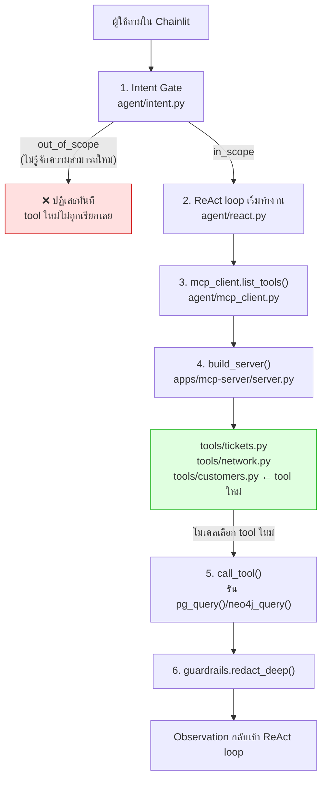

# สรุป Day 3 · เพิ่ม MCP Tool ใหม่ให้ Agent จริง — ต้องแก้ไฟล์ไหนบ้าง

เสริม (ไม่บังคับ) · อ่านเมื่อใดก็ได้หลังจากทำ [Workshop 3: Customer Directory MCP Server](03-workshop3-customer-directory.md) แล้ว

---

## เหตุผลที่ควรทราบเรื่องนี้

Workshop 3 เพิ่ม tool ใหม่หนึ่งตัวเข้าไปในระบบจริง แล้วพบว่า**เขียน tool ให้ถูกต้องอย่างเดียวไม่พอ** — ต้องแก้ไฟล์มากกว่าหนึ่งจุดกว่าจะเรียกได้จริงแบบ end-to-end ผ่าน chat เอกสารนี้สรุปเป็น checklist ทั่วไป สำหรับเวลาต้องเพิ่ม tool ใหม่อีกในอนาคต (ไม่ใช่แค่ตัวอย่าง `list_customers_by_segment` ที่ทำใน Workshop 3)

---

## ไฟล์หลักที่ต้องทราบ

| ไฟล์ | ทำหน้าที่ | จำเป็นแค่ไหน |
|---|---|---|
| `apps/mcp-server/tools/<ชื่อไฟล์ใหม่>.py` | ตัว tool เอง — ฟังก์ชัน `register(mcp)` ที่มี `@mcp.tool` ข้างใน | ✅ จำเป็นเสมอ |
| `apps/mcp-server/server.py` | ลงทะเบียน tool เข้า server จริง (`import` + เรียก `<module>.register(mcp)` ใน `build_server()`) | ✅ จำเป็นเสมอ — ลืมขั้นนี้แล้ว tool จะไม่ปรากฏใน `list_tools()` เลยแม้ไฟล์ใน `tools/` จะถูกต้อง |
| `apps/agent-api/agent/intent.py` | Intent Gate ที่คั่นอยู่หน้า ReAct loop ทุก request | ⚠️ จำเป็น **เฉพาะเมื่อ**ความสามารถใหม่ไม่อยู่ในขอบเขตที่ `SYSTEM_PROMPT`/`DOMAIN_TERMS` เดิมรู้จัก — ถ้าไม่แก้ คำถามจะถูกปฏิเสธเป็น `out_of_scope` ก่อนถึง tool เสมอ ไม่ว่า tool จะเขียนถูกแค่ไหน |
| `apps/mcp-server/resources/schemas.py` | `schema://overview` — คำใบ้ "คำถามแบบไหนควรไปเครื่องมือไหน" ที่โมเดลอ่านก่อนเริ่มคิด | 🟡 แนะนำถ้า tool ใหม่แทนคำถามรูปแบบใหม่จริงๆ (ไม่ใช่ตัวแปรของคำถามเดิม) — ไม่ใช่ hard gate เหมือน Intent Gate โมเดลยังหา tool เจอได้จากชื่อ/docstring แม้ resource นี้ไม่อัปเดต แต่ช้ากว่า |
| `apps/mcp-server/security/guardrails.py` | `redact_deep()`, `clamp_limit()` ฯลฯ | ❌ ไม่ต้องแก้ไฟล์นี้ — **เรียกใช้**ฟังก์ชันที่มีอยู่แล้วจาก tool ใหม่เท่านั้น (ดู Module 10) |
| `tests/test_mcp_tools.py` | `test_every_tool_has_a_description` และ `test_read_tools_declare_read_only` วนตรวจ **ทุก tool ที่ลงทะเบียนแล้วโดยอัตโนมัติ** | 🟡 ครอบคลุม tool ใหม่ให้เองอัตโนมัติ ไม่ต้องแก้ไฟล์นี้ก็ได้ — แก้เพิ่มเฉพาะถ้าต้องการ regression test เจาะจงชื่อ tool ใหม่ใน `test_tools_are_registered` |

---

## Quick reference: ลำดับขั้นที่ต้องทำ

1. เขียน `apps/mcp-server/tools/<ชื่อใหม่>.py` — ใช้ `db.pg_query()`/`db.neo4j_query()`/`db.opensearch()` ที่มีอยู่แล้วสำหรับต่อฐานข้อมูล อย่าเปิด connection เอง (ดูแพทเทิร์นใน `apps/mcp-server/tools/tickets.py`)
2. เพิ่ม `import` และเรียก `<module>.register(mcp)` ใน `apps/mcp-server/server.py` → `build_server()`
3. ห่อผลลัพธ์ทุก return ด้วย `guardrails.redact_deep(...)` ก่อนส่งกลับเสมอ (Module 10 หัวข้อ 4)
4. ทดสอบระดับ MCP ก่อน (เรียก `server.list_tools()`/`server.call_tool()` ตรงๆ) — ยืนยันว่า tool เองทำงานถูกต้องก่อนจะไปเจอตัวแปรอื่น
5. **ทดสอบผ่าน chat จริง** (Chainlit UI) — ถ้าถูกปฏิเสธเป็น `out_of_scope` ทันทีโดย tool ไม่เคยถูกเรียกเลย ให้กลับไปขั้นที่ 6
6. ขยายขอบเขตของ `SYSTEM_PROMPT` ใน `apps/agent-api/agent/intent.py` ให้ครอบคลุมความสามารถใหม่ (ดูตัวอย่างจริงด้านล่าง)
7. (แนะนำ) อัปเดต `routing_questions_to_stores` ใน `schema://overview` (`apps/mcp-server/resources/schemas.py`) ให้โมเดลรู้จักเส้นทางใหม่เร็วขึ้น

---

## Flow: จุดที่ tool ใหม่เข้าไปอยู่ และจุดที่ Intent Gate อาจปิดกั้นไว้ก่อนถึง



**สังเกต**: tool ใหม่ (กล่องสีเขียว) ต่อเข้ากับระบบสมบูรณ์แบบตั้งแต่ขั้นที่ 2-1 แต่ถ้า **ขั้นที่ 1 (Intent Gate)** ยังไม่รู้จักความสามารถนี้ คำถามจะถูกตัดจบที่กล่องสีแดงเสมอ ไม่มีทางไปถึงกล่องสีเขียวได้เลยไม่ว่า tool จะเขียนถูกต้องแค่ไหน — นี่คือสาเหตุที่ขั้นที่ 6 ใน Quick reference ข้างบนสำคัญพอๆ กับขั้นที่ 1-3

---

## ตัวอย่างการแก้ไขจริง: เพิ่ม `list_customers_by_segment` (จาก Workshop 3)

**ปัญหาที่พบจริง**: เขียน `apps/mcp-server/tools/customers.py` และลงทะเบียนใน `server.py` ถูกต้องครบทุกจุดแล้ว แต่ถามผ่าน Chainlit UI ว่า *"ขอรายชื่อลูกค้า sme"* กลับถูกปฏิเสธด้วย "คำถามนี้อยู่นอกขอบเขตของระบบ" — ทดสอบแล้วพบว่า `label: OUT_OF_SCOPE` มาจาก Intent Gate โดยตรง ไม่ใช่จาก tool

**ก่อนแก้** (`apps/agent-api/agent/intent.py:141-144`):

```python
device configuration, physical topology, routing adjacencies, device logs,
equipment health, customer circuits and operational runbooks. It covers exactly
```

**หลังแก้** (เพิ่มความสามารถใหม่เข้าไปในประโยคเดิม):

```python
device configuration, physical topology, routing adjacencies, device logs,
equipment health, customer circuits, the customer directory (listing
customers by segment: Enterprise, SME, Government) and operational runbooks.
It covers exactly
```

**ผลลัพธ์จริง** (ทดสอบเปรียบเทียบก่อน/หลังแก้ด้วยคำถามเดียวกัน):

```
ก่อนแก้: label=OUT_OF_SCOPE  reason="...falls under business data or sales information, not network operations"
หลังแก้: label=IN_SCOPE      reason="...covered under the customer directory in the network operations data"
```

รายละเอียดเต็มของ tool นี้ (โค้ดทั้งไฟล์ + การลงทะเบียน) อยู่ที่ [Workshop 3 หัวข้อ 2](03-workshop3-customer-directory.md)

---

## ขั้นตอนหยุดและรันระบบใหม่เพื่อให้เห็นผลการแก้ไข

| service | คำสั่งรัน | รองรับ reload อัตโนมัติหรือไม่ |
|---|---|---|
| `apps/agent-api` (ไฟล์ที่มี `intent.py`) | `uv run uvicorn main:app --app-dir apps/agent-api --reload --port 8080` | ✅ มี `--reload` — บันทึกไฟล์แล้วเห็นผลทันที |
| `apps/chainlit-ui` | `uv run chainlit run apps/chainlit-ui/app.py --port 8000 -w` | ✅ มี `-w` (watch mode) เช่นกัน |

ไม่ต้องรัน `apps/mcp-server/server.py` แยกต่างหาก — `apps/agent-api/agent/mcp_client.py` เรียก `build_server()` ในโหมด `in_process` (ค่าเริ่มต้น) ซึ่ง import ไฟล์ `apps/mcp-server/server.py` สดทุกครั้งที่ `agent-api` เริ่มหรือ reload ตัวเอง — แก้ไฟล์ใน `apps/mcp-server/` แล้ว **ต้องรอให้ `agent-api` reload ตัวเองก่อน** (สังเกตข้อความ `Reloading...` ใน terminal) การเปลี่ยนแปลงถึงจะมีผล

---

## ความเชื่อมโยงกับเนื้อหาก่อนหน้า

- โครงสร้าง `@mcp.tool` + `register(mcp)` = [Module 9: MCP คืออะไร](01-module9-mcp-intro.md)
- `guardrails.redact_deep()` และหลักการ "validate ก่อนใช้งานจริง" = [Module 10: ความปลอดภัยพื้นฐาน](02-module10-security-basics.md)
- Intent Gate สองชั้น (`fast_path()` แล้วค่อย `classify()`) และวิธีแก้ `DOMAIN_TERMS`/`SYSTEM_PROMPT` แบบละเอียด = [Module 7: Intent Gate (วันที่ 2)](../day2/02-module7-intent-gate.md) และ [สรุป Day 2: แก้ Intent กับ Memory ของ Agent จริงใน App](../day2/07-summary-intent-memory-in-app.md) — เอกสารนี้ใช้หลักการเดียวกัน เพียงมองจากมุม "เพิ่ม tool ใหม่" แทน "ปรับพฤติกรรมเดิม"

---

## ต่อไป

→ [Workshop 4: MPLS NOC MCP Server](04-workshop4-mpls-noc-mcp-server.md)
