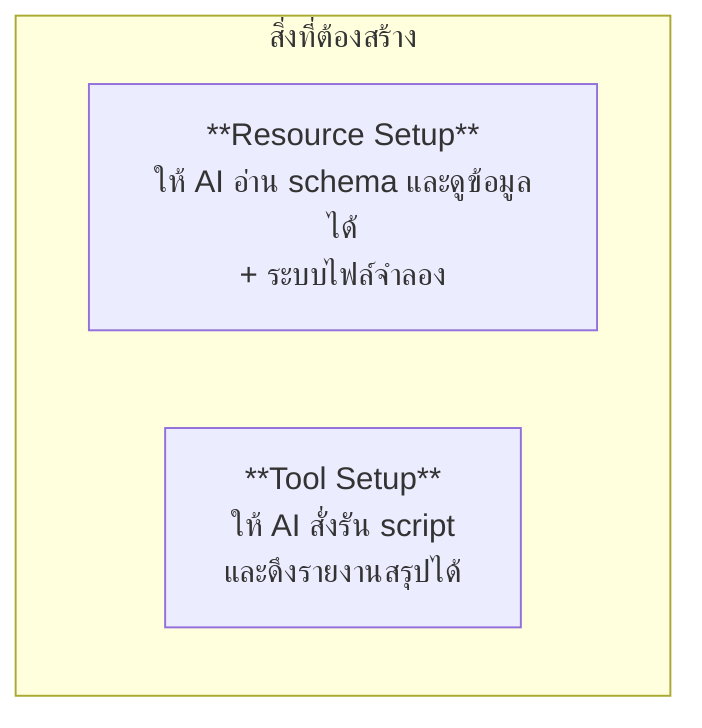

# Workshop 3A · สร้าง MCP Server ของตัวเอง

**13:00 – 14:00** (60 นาที)

---

## โจทย์

สร้าง MCP Server ที่เปิดให้ AI เข้าถึงฐานข้อมูลภายในองค์กรได้อย่างปลอดภัย แบ่งเป็น 2 ส่วนตามหลักสูตร



> **ไม่จำเป็นต้องเขียนขึ้นใหม่ทั้งหมด** — ปัจจุบัน `apps/mcp-server/` เป็นระบบที่สมบูรณ์และมีเฉลยอยู่แล้วทั้งระบบ (ไม่มี `# TODO` หลงเหลือให้เติม)
> แนวทางที่ใช้คือ **สำรองไฟล์เดิมไว้ก่อน แล้วเขียนทับลงในตำแหน่งเดิม** — ดูคำสั่งสำรองไว้ที่ขั้นที่ 1 ด้านล่าง
> ใช้ `tools/tickets.py` → `search_tickets` เป็นแม่แบบ (pattern) สำหรับ tool ตัวอื่นที่เหลือ แล้วเปรียบเทียบกับสำเนาที่สำรองไว้เมื่อทำเสร็จ
> (การเขียนขึ้นใหม่ทั้งหมดไม่สามารถทำได้ทันเวลาภายใน 2 ชั่วโมง และไม่ก่อให้เกิดการเรียนรู้เพิ่มเติม)

> 🏷️ ป้าย `[3A.x.x]` หน้าหัวข้อด้านล่าง = จุดที่ต้องเขียน/แก้โค้ดจริงตามสเปก ใช้เลขเดียวกันนี้อ้างอิงตอนถามคำถามหรือขอ hint ได้

---

## ขั้นที่ 1 · รัน server ที่มีอยู่ก่อน (5 นาที)

```bash
uv run python apps/mcp-server/server.py --transport streamable-http --port 9000
```

```bash
npx @modelcontextprotocol/inspector uv run python apps/mcp-server/server.py
```
หากเปิดไม่สำเร็จ ให้ตรวจสอบว่ามีพอร์ตซ้ำกันหรือไม่
`netstat -ano | findstr :9000`
`taskkill /PID ***เลขที่ได้มา*** /F`

ทำความเข้าใจโครงสร้างของระบบก่อนเริ่มแก้ไข:

```
apps/mcp-server/
├── server.py              ประกอบทุกอย่างเข้าด้วยกัน
├── config.py              ตั้งค่าจาก environment
├── clock.py               นิยาม "ตอนนี้" จากข้อมูล
├── db.py                  การเชื่อมต่อฐานข้อมูล
├── tools/                 ← เขียนทับงานส่วนใหญ่ที่นี่
├── resources/             ← และที่นี่
├── prompts/
└── security/guardrails.py
```

**ก่อนแก้ไขไฟล์ใด ๆ ให้สำรองไว้สำหรับเปรียบเทียบเมื่อเสร็จงาน**:

```bash
cp -r apps/mcp-server /tmp/mcp-server-reference
```

จากขั้นตอนนี้เป็นต้นไป `apps/mcp-server/` คือพื้นที่ที่สามารถเขียนทับได้อย่างเต็มที่ — หากติดขัดจุดใด สามารถเปิด `/tmp/mcp-server-reference` เพื่อดูอ้างอิงได้ แต่ควรพยายามเขียนด้วยตนเองก่อนเปิดดู

---

## ขั้นที่ 2 · Resource Setup (20 นาที)

### [3A.2.1] เปิด schema ให้ AI อ่าน apps/mcp-server/resources/schemas.py

```python
@mcp.resource("schema://postgres")
def postgres_schema() -> str:
    """Tables, columns and comments in the ticket database."""
```

**ต้องมี**: ชื่อตาราง, column, ชนิดข้อมูล, comment, จำนวนแถว

**ทำไมต้องมี comment** — comment ในฐานข้อมูลคือคำอธิบายที่โมเดลใช้ประกอบการตัดสินใจ หากคอลัมน์ชื่อ `mtu` ไม่มี comment โมเดลอาจไม่ทราบว่าคอลัมน์นี้มีความสำคัญต่อ adjacency

### [3A.2.2] `clock://now`apps/mcp-server/resources/clock_resource.py

```python
@mcp.resource("clock://now")
def now() -> str:
    """Current time as this system defines it, plus the data coverage window."""
```

**ทดสอบ**: ทดลองถามระบบว่า *"log ปีที่แล้วเป็นยังไง"* — ระบบต้องตอบว่ามีข้อมูลย้อนหลังเพียง 30 วัน มิใช่สร้างคำตอบขึ้นมาเอง

### [3A.2.3] ระบบไฟล์จำลอง apps/mcp-server/resources/files.py

```python
@mcp.resource("files://index")
@mcp.resource("files://read/{path}")
```

**3 กติกาที่ต้องมี**

| กติกา | ทำอย่างไร |
|---|---|
| root เดียว | `Path(root).resolve()` แล้วเทียบด้วย `is_relative_to()` |
| allowlist นามสกุล | เฉพาะ `.md .txt .cfg .conf .json .yaml` |
| จำกัดขนาด | ตัดที่ 40,000 ตัวอักษรพร้อมบอกว่าตัด |

**ทดสอบเพื่อยืนยันว่าป้องกันได้จริง**:
```
files://read/../../.env
files://read/../../../etc/passwd
```

---

## ขั้นที่ 3 · Tool Setup (25 นาที)

### [3A.3.1] Tool ดึงข้อมูล (มีตัวอย่างให้แล้ว)

พิจารณา `tools/tickets.py` → `search_tickets` เป็นแม่แบบ แล้วเขียน tool ที่เหลือในกลุ่มนี้ด้วยตนเองในรูปแบบเดียวกัน (ชื่อ, guardrail, annotations)

### [3A.3.2] Tool รันสคริปต์ — จุดที่มีความเสี่ยงสูงที่สุด apps/mcp-server/tools/reports.py

```python
ALLOWED_SCRIPTS = {
    "open_tickets_summary": {...},
    "device_inventory": {...},
    "weekly_incident_report": {...},
}

@mcp.tool()
def run_report_script(name: str, params: dict | None = None) -> dict:
    guardrails.assert_allowlisted_script(name, set(ALLOWED_SCRIPTS), "run_report_script")
    ...
    subprocess.run(argv, shell=False, timeout=30, capture_output=True)
```

**ข้อกำหนด 4 ประการที่ต้องปฏิบัติตามอย่างเคร่งครัด**

| กฎ | เหตุผล |
|---|---|
| allowlist เท่านั้น | "ชื่อสคริปต์" ต้องเป็นชุดปิดที่เรากำหนด |
| `shell=False` เสมอ | `shell=True` = เปิดช่องให้ประกอบคำสั่งใหม่ |
| มี timeout | สคริปต์ค้างจะกินทรัพยากรตลอดไป |
| จำกัด output | output ยาวจะท่วม context |

### [3A.3.3] Tool สร้างรายงาน

```python
@mcp.tool(annotations={"readOnlyHint": False, "destructiveHint": False})
def generate_report(title: str, format: str = "markdown", range: str = "last_7d") -> dict:
```

**ข้อสังเกต**: `readOnlyHint: False` — เนื่องจาก tool นี้เขียนไฟล์ จึงต้องประกาศค่านี้ตามความเป็นจริง client อย่าง Claude Desktop จะใช้ค่านี้ในการตัดสินใจว่าต้องขออนุญาตจากผู้ใช้ก่อนหรือไม่

---

## [3A.4] ขั้นที่ 4 · เพิ่ม Guardrail (10 นาที)

ต้องมีครบทั้ง 5 ชั้นตาม Module 8:

- [ ] ใช้บัญชี `mcp_reader` เท่านั้นในการต่อ PostgreSQL
- [ ] `assert_read_only()` ก่อนส่ง query ทุกครั้ง
- [ ] `cap_rows()` และ `clamp_limit()` กับทุก tool ที่คืน list
- [ ] `redact()` ครอบทุก output
- [ ] `AuditEvent` ทุกครั้งที่ปฏิเสธ

---

## เกณฑ์ผ่าน

- [ ] `tools/list` คืน tool อย่างน้อย 12 ตัว ทุกตัวมี description ที่มีประโยค "ห้ามใช้เมื่อ..."
- [ ] `resources/list` คืน `schema://`, `clock://`, `files://` ครบ
- [ ] ทุก tool มี `annotations` ครบ 4 ฟิลด์
- [ ] `files://read/../../.env` ถูกปฏิเสธและมี audit log
- [ ] `run_report_script` ปฏิเสธชื่อที่ไม่อยู่ใน allowlist
- [ ] ทดสอบผ่าน MCP Inspector ได้ทุก tool
- [ ] `uv run pytest tests/test_mcp_tools.py` ผ่าน

---

## ต่อไป

→ [Workshop 3B: ต่อ Agent API](06-workshop3b-agent-api.md)
