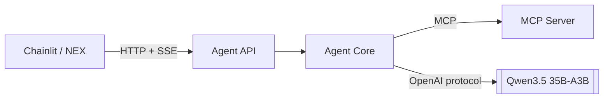
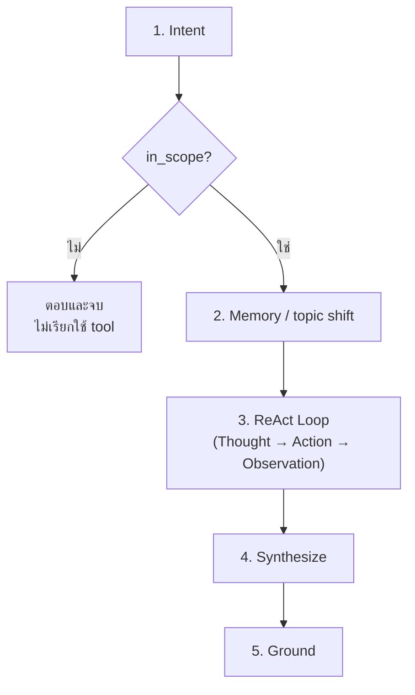

# Workshop 3B · ห่อ Agent เป็น API

**14:00 – 14:30** (30 นาที)

---

## โจทย์

ทำให้ agent จากวันที่ 2 เรียกใช้งาน MCP Server จากขั้นตอนก่อนหน้า และเปิดให้บริการเป็น REST API ที่ frontend ใดก็สามารถเรียกใช้ได้

> 🏷️ ป้าย `[3B.x]` หน้าหัวข้อด้านล่าง = จุดที่ต้องเขียน/แก้โค้ดจริงตามสเปก ใช้เลขเดียวกันนี้อ้างอิงตอนถามคำถามหรือขอ hint ได้



---

## [3B.1] เปลี่ยนจากเรียกฟังก์ชันโดยตรง เป็นเรียกผ่าน MCP

เมื่อวันก่อน agent เรียกใช้ฟังก์ชัน Python โดยตรง แต่วันนี้ต้องเปลี่ยนมาเรียกผ่าน MCP apps/agent-api/agent/react.py

```python
result = await asyncio.wait_for(
    client.call_tool(tool, arguments),
    timeout=STEP_TIMEOUT_SECONDS,
```

**ประโยชน์ที่ได้รับเพิ่มจากการเปลี่ยนแปลงนี้**: tool ชุดเดียวกันนี้สามารถใช้งานกับ Claude Desktop ได้ทันที โดยไม่ต้องเขียนโค้ดเพิ่มเติม

### [3B.1.2] รายการ tool ต้องมาจาก MCP ไม่ใช่ hardcode apps/agent-api/agent/react.py

```python
async def run(
    question: str,
    context: list[dict] | None = None,
    stats: "llm.LLMStats | None" = None,
    model: str | None = None,
) -> AsyncIterator[tuple[EventType, dict]]:
    client = mcp_client.get()
    tools = await client.list_tools()
```

เมื่อเพิ่ม tool ใหม่ใน MCP Server ทุกรอบการตัดสินใจของ ReAct loop จะรู้จัก tool นั้นได้ทันที โดยไม่ต้องแก้ไข agent

---

## 2. Endpoint ที่ต้องมี

| Endpoint | ทำอะไร |
|---|---|
| `POST /chat` | รับคำถาม คืน **stream ของ event** |
| `GET /health` | ตรวจว่า MCP และฐานข้อมูลพร้อม |
| `GET /sessions/{id}/memory` | ดูความจำปัจจุบัน |
| `DELETE /sessions/{id}` | ล้างเซสชัน |
| `GET /tools` | รายการ tool ที่มี |

---

## [3B.3] Stream เป็น Event ไม่ใช่แค่ข้อความ

**จุดนี้เป็นตัวกำหนดคุณภาพของ UI** ให้รันคำสั่งต่อไปนี้เพื่อทดสอบ

`uv run apps/agent-api/main.py `

`uv run uvicorn main:app --app-dir apps/agent-api --reload --port 8080`

`uv run pytest tests/test_agent_flow.py -v`

```
intent_checked → memory_updated
→ thought → [step_started → step_result] (วนซ้ำทีละรอบ ReAct)
→ token ... → grounding_checked → usage → done
```

หาก API คืนเพียงข้อความสุดท้าย UI จะทำได้เพียงแสดง spinner
แต่หากคืน event ครบถ้วน UI จะสามารถแสดงกระบวนการคิดทั้งหมดได้ apps/agent-api/agent/events.py

```python
def sse(event_type: EventType, data: Any) -> str:
    """Format one Server-Sent Event.

    The blank line at the end is required by the SSE spec; leaving it out
    produces a stream that appears to hang.
    """
    payload = json.dumps({"type": event_type.value, "data": data},
                         ensure_ascii=False, default=str)
    return f"event: {event_type.value}\ndata: {payload}\n\n"
```

> การละเลยบรรทัดว่างสองบรรทัดสุดท้ายจะทำให้ stream ค้าง ซึ่งเป็นข้อผิดพลาดที่พบบ่อยที่สุด

---

## 4. ลำดับที่ห้ามสลับ



**ขั้นตอน Intent ต้องดำเนินการก่อน Memory เสมอ** — หากไม่เป็นเช่นนั้น คำถามที่อยู่นอกขอบเขตจะกระตุ้นให้เกิดการเปลี่ยนหัวข้อ ส่งผลให้ context ที่ผู้ใช้กำลังใช้งานอยู่ถูกล้างทิ้งไปโดยไม่ตั้งใจ (ดูโจทย์ที่ 4 turn 5)

---

## เกณฑ์ผ่าน

- [ ] `GET /health` บอกจำนวน tool ที่เชื่อมได้
- [ ] `POST /chat` คืน event ครบทุกประเภท
- [ ] คำถามนอกขอบเขต: `tool_calls == 0`
- [ ] `GET /sessions/{id}/memory` แสดง `context_tokens` ที่เปลี่ยนตามจริง
- [ ] เพิ่ม tool ใน MCP Server แล้ว ReAct loop ใช้ได้โดยไม่แก้ agent
- [ ] `uv run pytest tests/test_agent_flow.py` ผ่าน

---

## ต่อไป

→ [Workshop 3C: ต่อ Chainlit](07-workshop3c-chainlit.md)
