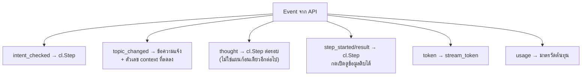

# Workshop 3C · ต่อ Chainlit เข้ากับ Agent API

**14:30 – 14:45** (15 นาที)

---

## โจทย์

ทำให้ UI แสดง **กระบวนการคิดของ agent** ไม่ใช่เพียงคำตอบสุดท้าย

> 🏷️ ป้าย `[3C.x]` หน้าหัวข้อด้านล่าง = จุดที่ต้องเขียน/แก้โค้ดจริงตามสเปก ใช้เลขเดียวกันนี้อ้างอิงตอนถามคำถามหรือขอ hint ได้

---

## สิ่งที่ต้องแสดง



> **แตกต่างจากรูปแบบ plan-then-execute**: ไม่มี event เดียวที่ส่ง "แผนทั้งชุด" มาให้แสดงตั้งแต่ต้นอีกต่อไป
> UI ต้องเปิด `cl.Step` ใหม่ทุกครั้งที่มี event `thought` เข้ามา — ผู้ใช้จะเห็นกระบวนการคิดทีละขั้นตามจังหวะที่โมเดลประมวลผลจริง มิใช่เห็นแผนทั้งหมดล่วงหน้า

---

## [3C.1] รับ SSE และแยก event apps/chainlit-ui/app.py 

```python
async with client.stream("POST", f"{API}/chat", json={...}) as response:
    buffer = ""
    async for chunk in response.aiter_text():
        buffer += chunk
        while "\n\n" in buffer:
            raw, buffer = buffer.split("\n\n", 1)
            ...
```

> **ต้องทำการ buffer ข้อมูลเอง** — `aiter_text()` ไม่รับประกันว่าจะได้รับครบหนึ่ง event ในแต่ละครั้ง
> โค้ดที่ parse ข้อมูลทีละ chunk จะเกิดข้อผิดพลาดเมื่อ event ถูกแบ่งขาดกลางทาง

---

## [3C.2] แสดง Step

```python
step = cl.Step(name=f"[{n}] {tool}", type="tool")
await step.__aenter__()
step.input = json.dumps(arguments, ensure_ascii=False, indent=2)
# ...
step.output = f"สำเร็จใน {ms} ms\n\n```json\n{result}\n```"
await step.__aexit__(None, None, None)
```

---

## [3C.3] แสดง Thought แต่ละรอบ

ไม่มีแผนเดียวทั้งชุดให้วาดเป็นแผนภาพ dependency อีกต่อไป — แต่ละรอบของ ReAct จะแสดงเป็น `cl.Step` แยกกัน `apps/chainlit-ui/elements.py`

```python
def thought_view(data: dict) -> str:
    if data.get("tool"):
        return f"{data['thought']}\n\n**ขั้นต่อไป**: เรียก `{data['tool']}`"
    return f"{data['thought']}\n\n**พร้อมตอบแล้ว** ไม่เรียกเครื่องมือเพิ่ม"
```

**ต้องเปิด step ใหม่ทุกครั้งที่มี event `thought` เข้ามา** — จำนวน step ที่ปรากฏบนหน้าจอจะเท่ากับจำนวนรอบตัดสินใจจริง มิใช่ค่าคงที่ที่กำหนดไว้ล่วงหน้า

---

## 4. มาตรวัดต้นทุน

| รายการ | ทำไมต้องแสดง |
|---|---|
| prompt / completion tokens | เห็นว่าอะไรกิน token |
| **ขนาด context ปัจจุบัน** | เห็นผลของ memory management |
| tokens/sec | เห็นว่า GPU แน่นแค่ไหน |
| จำนวน tool ที่เรียก | เห็นว่าแผนซับซ้อนแค่ไหน |

> Local LLM ไม่มีค่า API ต่อ token ต้นทุนจริงคือ **เวลา GPU** จึงต้องแสดงตัวเลขเหล่านี้แทนมูลค่าเงิน

---

## [3C.5] ปุ่มคำถามตัวอย่าง apps/chainlit-ui/app.py 

```python
@cl.set_starters
async def starters():
    return [cl.Starter(label="หาสาเหตุร่วม",
                       message="ทำไมช่วงสองสัปดาห์นี้ถึงมีลูกค้าแจ้งเน็ตหลุดซ้ำๆ หลายราย")]
```

---

## เกณฑ์ผ่าน

- [ ] เห็น step ของ intent, ทุกรอบ thought และทุก tool call
- [ ] จำนวน thought step ที่เห็นตรงกับจำนวนรอบตัดสินใจจริงใน event stream
- [ ] คำตอบ stream ทีละตัวอักษร
- [ ] มาตรวัดต้นทุนแสดงครบ รวม context tokens
- [ ] ตอนเปลี่ยนเรื่อง มีข้อความแจ้งพร้อมตัวเลข context ที่ลดลง
- [ ] กดเปิด step แล้วเห็นข้อมูลดิบจากฐานข้อมูลจริง

---

## ต่อไป

→ [Workshop 3D: ต่อกับ Claude Desktop / Cursor](08-workshop3d-connect-clients.md)
