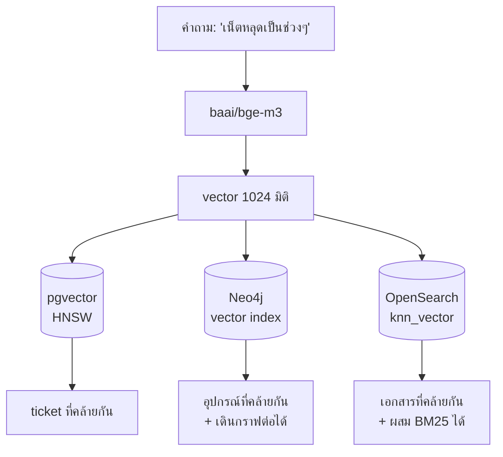

# Lab 5 · เทียบ Vector Store ทั้ง 3 ตัว

**15 นาที** · แทรกในช่วง Workshop 3 หรือช่วงสรุป

---

## เป้าหมาย

เข้าใจเหตุผลที่ระบบ production เลือกใช้ OpenSearch สำหรับเก็บ vector ทั้งที่ pgvector ก็สามารถทำได้เช่นกัน

---

## ทดสอบคำถามเดียวกันกับ 3 ระบบ

```bash
uv run scripts/compare_vector_stores.py     
```

สคริปต์นี้จะส่งคำถามเดียวกันไปยังทั้ง 3 ระบบ แล้วเปรียบเทียบผลลัพธ์ที่ได้



---

## ตารางเปรียบเทียบ

| | pgvector | Neo4j vector | OpenSearch knn |
|---|---|---|---|
| **จุดแข็งที่ระบบอื่นไม่มี** | กรอง relational + vector ใน query เดียว | **ค้นพบด้วยความหมายแล้วเดินกราฟต่อได้ทันที** | ผสม BM25 กับ vector · รองรับการขยายขนาดได้ดี |
| ประเภท index | HNSW | HNSW | HNSW (Lucene/FAISS/nmslib) |
| กรองก่อน/หลัง | pre-filter ได้ดี | ทำผ่าน Cypher | post-filter เป็นหลัก |
| ขนาดที่เหมาะ | ล้านแถวต้นๆ | หลักแสน | **สิบล้านขึ้นไป** |
| แยก scale จากฐานหลัก | ไม่ได้ | ไม่ได้ | **ได้** |
| ใน production ของ NT | config + ticket | topology | **vector หลัก** |

---

## ตัวอย่างที่ Neo4j ทำได้เพียงระบบเดียว
```cypher
:param vec => [i in range(1, 1025) | 0.1]
```
```cypher
CALL db.index.vector.queryNodes('device_embedding', 3, $vec)
YIELD node, score
OPTIONAL MATCH (node)<-[:UPLINK_TO]-(down:Device)
RETURN node.device_id AS id, score, collect(down.device_id) AS downstream
```

*"หาอุปกรณ์ที่ทำหน้าที่รวบรวม traffic แล้วบอกว่ามีอะไรอยู่ใต้มัน"* — จบได้ในคำสั่ง query เดียว
ระบบอื่นต้องเรียกข้อมูล 2 รอบแล้วเชื่อมผลลัพธ์เอง

---

## เหตุผลที่ production เลือกใช้ OpenSearch

| เหตุผล | รายละเอียด |
|---|---|
| ปริมาณ | 29 GB ต่อวัน และมี OpenSearch ใช้งานอยู่แล้วสำหรับจัดเก็บ log |
| Hybrid search | สามารถผสม BM25 กับ vector ได้ — มีความสำคัญมาก เนื่องจากรหัสอุปกรณ์ต้องการการค้นหาแบบ exact match ในขณะที่คำบรรยายอาการต้องการการค้นหาเชิงความหมาย (semantic) |
| แยก scale | สามารถเพิ่ม node ได้โดยไม่กระทบฐานข้อมูลหลัก |
| ILM | มีกลไกจัดการวงจรชีวิตข้อมูลในตัว |

> **อย่างไรก็ตาม pgvector ยังคงมีบทบาทของตนเอง** — long-term memory ของ agent ถูกจัดเก็บใน pgvector เนื่องจากมีข้อมูลปริมาณน้อยและต้อง join กับตารางอื่น

---

## สิ่งที่ต้องรายงาน

- [ ] ผลลัพธ์อันดับต้นของทั้ง 3 ระบบตรงกันหรือไม่
- [ ] เวลาที่ใช้ของแต่ละระบบ
- [ ] สามารถอธิบายได้ว่าหากเลือกใช้ได้เพียงระบบเดียว จะเลือกระบบใด และด้วยเหตุผลใด
