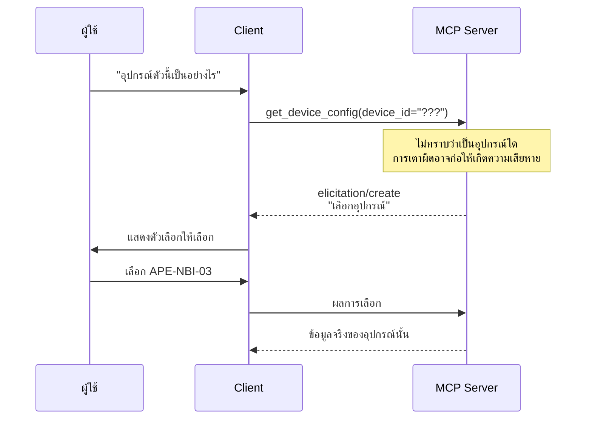

# Lab · Elicitation — เมื่อ Server ถามผู้ใช้กลับ

**20 นาที** · ฟีเจอร์ใหม่ของ MCP spec 2025-06-18

---

## เป้าหมาย

แสดงให้เห็นว่า MCP ไม่ใช่เพียงช่องทางดึงข้อมูลทิศทางเดียว แต่เป็นโปรโตคอลสองทาง

---

## ปัญหาที่แก้



**ก่อนมี elicitation**: server ต้องคืนค่า error แล้วคาดหวังว่า client จะถามผู้ใช้แทน
**เมื่อมี elicitation**: server สามารถขอข้อมูลได้โดยตรงในระหว่างที่ tool กำลังทำงาน

---

## ความเชื่อมโยงกับคำถามหมวด L5

คำถามทั้ง 4 ข้อใน `data/questions/L5-ambiguous.yaml` เป็นกรณีที่ต้องถามกลับผู้ใช้

ที่ผ่านมาการจัดการเรื่องนี้ทำที่ฝั่ง agent (`intent.py` label `needs_clarification`) ซึ่ง**ใช้งานได้ แต่จำกัดอยู่เฉพาะภายในแอปพลิเคชันของเราเท่านั้น**

Elicitation ทำให้พฤติกรรมเดียวกันนี้สามารถทำงานได้ใน Claude Desktop และ Cursor ด้วยเช่นกัน โดยไม่ต้องเขียนโค้ดเพิ่มเติม

---

## [EL.1] สิ่งที่ต้องทำ

> 🏷️ ป้าย `[EL.1]` = จุดที่ต้องเขียน/แก้โค้ดจริงตามสเปก ใช้เลขนี้อ้างอิงตอนถามคำถามหรือขอ hint ได้

เพิ่ม tool ที่ถามกลับผู้ใช้เมื่อข้อมูลไม่เพียงพอ โดยเพิ่มที่ apps/mcp-server/tools/network.py แล้วทดสอบที่ apps/mcp-server/server.py

```python
def register(mcp) -> None:

    # ... (เครื่องมือตัวอื่นๆ ที่มีอยู่เดิม) ...

    @mcp.tool()
    async def inspect_device(ctx: Context, device_id: str | None = None) -> dict:
        """ตรวจสอบอุปกรณ์ ถ้าไม่ระบุจะถามผู้ใช้ให้เลือก"""
        if not device_id:
            # ดึงรายชื่ออุปกรณ์จาก Neo4j แทน
            rows = neo4j_query("MATCH (d:Device) RETURN d.device_id AS device_id ORDER BY device_id")
            devices = [r["device_id"] for r in rows]
            
            result = await ctx.elicit(
                message="ต้องการตรวจสอบอุปกรณ์ตัวไหน",
                schema={
                    "type": "object",
                    "properties": {"device_id": {"type": "string", "enum": devices}},
                    "required": ["device_id"]
                },
            )
            if result.action != "accept":
                return {"cancelled": True}
            device_id = result.content["device_id"]
            
        # ค้นหารายละเอียดอุปกรณ์
        detail = neo4j_query(
            "MATCH (d:Device {device_id: $id}) RETURN d.device_id AS device_id, d.role AS role",
            id=device_id
        )
        return detail[0] if detail else {"found": False, "device_id": device_id}
```

---

## ทดสอบ

1. ทดสอบผ่าน MCP Inspector — จะปรากฏ request `elicitation/create`
2. ทดสอบผ่าน Claude Desktop — จะปรากฏ UI ให้เลือกจริง

---

## ข้อควรระวัง

| ประเด็น | เหตุผล |
|---|---|
| **ไม่ใช่ทุก client รองรับ** | ต้องมี fallback เมื่อ client ไม่รองรับ |
| หลีกเลี่ยงการถามบ่อยเกินไป | การถามทุกครั้งอาจสร้างความรำคาญมากกว่าการเดาผิดพลาดเป็นบางครั้ง |
| **ห้ามขอข้อมูลอ่อนไหว** | spec ระบุไว้อย่างชัดเจนว่าห้ามใช้ elicitation เพื่อขอรหัสผ่านหรือข้อมูลลับ |
| ต้องรองรับการปฏิเสธ | ผู้ใช้สามารถกด cancel ได้ตลอดเวลา |

---

## เกณฑ์ผ่าน

- [ ] tool สามารถถามกลับผู้ใช้ได้เมื่อข้อมูลไม่เพียงพอ
- [ ] มี enum ให้เลือก มิใช่ช่องข้อความเปล่า
- [ ] รองรับกรณีผู้ใช้ยกเลิก
- [ ] มี fallback เมื่อ client ไม่รองรับ elicitation
