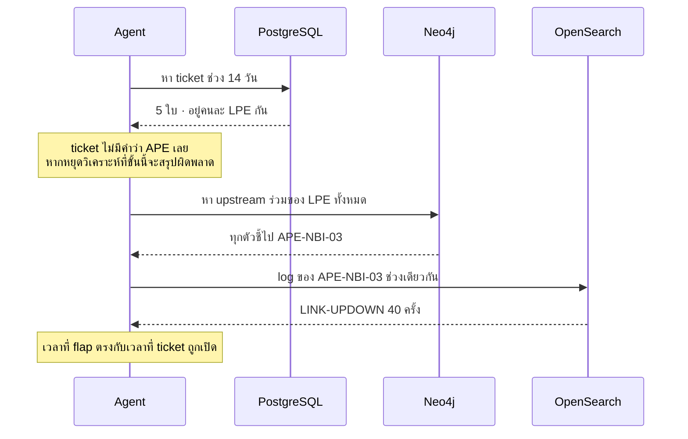

# โจทย์ที่ 6 · Cross-Service Diagnosis

**15:00 – 15:30** (30 นาที) · **โจทย์ใหญ่ที่สุดของทั้งหลักสูตร**

---

## เป้าหมายการเรียนรู้

นำสิ่งที่เรียนรู้จากทั้ง 3 วันมาประยุกต์ใช้ร่วมกัน แล้วพิสูจน์ว่าระบบสามารถตอบคำถามที่ **ต้องใช้ข้อมูลจากทั้ง 3 ฐานข้อมูลร่วมกันจึงจะตอบได้** ได้จริง

---

## โจทย์หลัก

> *"ทำไมช่วงสองสัปดาห์นี้ถึงมีลูกค้าแจ้งเน็ตหลุดซ้ำๆ หลายราย"*

**ข้อสังเกตคือคำถามนี้ไม่ได้ให้ข้อมูลใด ๆ ไว้ล่วงหน้า** — ไม่ระบุพื้นที่ ไม่ระบุอุปกรณ์ และไม่ระบุว่าต้องตรวจสอบที่ใด
ระบบจึงต้องค้นพบข้อมูลเหล่านี้ด้วยตนเองทั้งหมด

---

## สิ่งที่ระบบต้องทำได้



---

## สิ่งที่ต้องส่ง (5 อย่าง)

### 1. Trace การตัดสินใจของ ReAct (ทุก Thought/Action/Observation)

ต้องแสดงให้เห็นว่าขั้นตอนที่เรียก Neo4j เกิดขึ้น**หลัง**จากเห็นผลจาก PostgreSQL แล้วเท่านั้น — ระบบไม่มี `depends_on` ให้ประกาศไว้ล่วงหน้าอีกต่อไป แต่ลำดับเวลาที่เกิดขึ้นจริงยังต้องถูกต้องเช่นเดิม (ดู `thought.step` ของแต่ละรอบเทียบกับ `step_started.step`)

### 2. ผลจากแต่ละระบบแยกกัน

| ระบบ | ได้อะไรมา |
|---|---|
| PostgreSQL | จำนวน ticket และอุปกรณ์ที่เกี่ยวข้อง |
| Neo4j | อุปกรณ์ที่เป็นจุดร่วม |
| OpenSearch | ประเภท log จำนวนครั้ง และช่วงเวลาที่เกิดขึ้น |

### 3. คำตอบสุดท้ายพร้อม citation

ทุกข้อสรุปต้องระบุว่าได้มาจากระบบใด

### 4. ตัวเลขต้นทุน

token รวม · จำนวนครั้งที่เรียก LLM · จำนวน tool ที่เรียก · เวลารวม

### 5. ทดสอบคำถามอีก 3 ข้อ

| คำถาม | สิ่งที่ต้องได้ |
|---|---|
| *"ถ้าจะปิด APE-NBI-03 ซ่อม กระทบลูกค้ากี่ราย ใครบ้าง"* | จำนวนแยกตาม segment |
| *"log ที่ APE-BKK-05 เมื่อ 3 วันก่อนเป็นเหตุเสียจริงไหม"* | ต้องตอบว่าเป็น **maintenance** พร้อมเลข ticket |
| *"สถานะของ PE-CNX-99 เป็นยังไง"* | ต้องตอบว่า **ไม่พบ** และระบุว่ามีอุปกรณ์ใดอยู่บ้าง |

---

## เกณฑ์ผ่าน

- [ ] Trace ใช้ครบทั้ง 3 ระบบ ตามลำดับที่สมเหตุสมผล (PostgreSQL ก่อน Neo4j ก่อน OpenSearch)
- [ ] คำตอบมีคำว่า `APE-NBI-03` และคำว่า `flapping` หรือคำที่มีความหมายเดียวกัน
- [ ] ทุกข้อสรุปมี citation
- [ ] คำถามที่ 2: ตอบว่าเป็น maintenance **มิใช่เหตุเสีย**
- [ ] คำถามที่ 3: ตอบว่าไม่พบ **โดยไม่แต่งข้อมูลขึ้นมาเอง**
- [ ] รายงานตัวเลขต้นทุนครบถ้วน
- [ ] ไม่มี exception ตลอดการทดสอบ

---

## โบนัส

1. **ทดลองให้ ReactDecision เลือกเรียกใช้ tool ได้หลายตัวต่อรอบ** (แทนที่จะเรียกทีละตัว) แล้ววัดว่าเวลาลดลงกี่เปอร์เซ็นต์ และต้องแลกกับอะไร (คำใบ้: การตัดสินใจแบบ batch ทำให้ปรับตัวตามผลลัพธ์ของแต่ละ tool ได้ยากขึ้น)
2. **เปรียบเทียบกับ Claude Desktop** — ถามคำถามเดียวกันผ่าน Claude Desktop แล้วเปรียบเทียบแผนและคำตอบว่าแตกต่างกันอย่างไร และเพราะเหตุใด
3. **ทดสอบความคงเส้นคงวา** — รันคำถามเดิม 5 ครั้ง เพื่อดูว่าได้คำตอบเหมือนกันหรือไม่ หากไม่เหมือนกัน ควรปรับค่า temperature เท่าใดจึงจะได้ผลลัพธ์ที่คงที่
4. **หาคำถามที่ระบบยังไม่สามารถตอบได้** — แล้ววิเคราะห์ว่าขาด tool ใด หรือขาดข้อมูลใด

---

<details>
<summary>Hint</summary>

- หากระบบหยุดวิเคราะห์ที่ ticket แล้วสรุปว่าเป็นปัญหาฝั่งลูกค้า แสดงว่าโมเดลยังไม่ทราบว่าต้องค้นหา upstream ต่อ ควรเพิ่มความรู้นี้ลงใน system prompt ของ ReAct loop (ดู `SYSTEM_PROMPT` ใน `apps/agent-api/agent/react.py`) เนื่องจากไม่มีขั้นตอนที่สองที่ถูกวางไว้ล่วงหน้ารออยู่แล้วเหมือนกรณีที่ใช้ plan-then-execute
- หากคำถามที่ 2 ตอบว่าเป็นเหตุเสีย แสดงว่า description ของ `search_logs` ยังไม่ได้ระบุเตือนเรื่อง maintenance
- หากคำถามที่ 3 มีการแต่งข้อมูลขึ้นมาเอง ให้เพิ่ม `list_devices` เข้าไปในแผนก่อน แล้วกำหนดใน system prompt ว่าอุปกรณ์ที่ไม่อยู่ในรายการถือว่าไม่มีอยู่จริง
</details>

---

## สิ่งที่ต้องส่ง

Trace ของ ReAct loop (ทุก thought/action/observation) + ผลแต่ละระบบ + คำตอบพร้อม citation + ตัวเลขต้นทุน + ผลคำถามอีก 3 ข้อ

---

## ตรวจคำตอบด้วยเฉลย

**ควรทดลองทำด้วยตนเองก่อน** — โจทย์นี้วัดผลด้วยชุดคำถามจริงที่รันผ่าน pipeline แบบเต็มรูปแบบ มิใช่ไฟล์เฉลยแยกต่างหาก ให้เริ่มจากรัน `make api` เพื่อให้ agent-api ทำงานอยู่ก่อน จากนั้นจึงรัน:

```bash
make eval
```

คำสั่งนี้จะรันคำถามระดับ `L3` ทั้งหมด (ซึ่งต้องใช้ข้อมูลจาก 3 ฐานข้อมูลร่วมกัน สอดคล้องกับโจทย์นี้) จาก `data/questions/L3-three-source.yaml` ผ่าน agent-api จริง แล้วบันทึกผลไว้ที่ `eval/results/latest.json` (ใช้เวลาประมาณไม่กี่นาที เนื่องจากแต่ละคำถามต้องเรียก LLM หลายรอบ)

เปิดไฟล์ `eval/results/latest.json` เพื่อเทียบกับ "เกณฑ์ผ่าน" ข้างต้น — หากคำตอบมี `APE-NBI-03` และมี citation ครบถ้วนตามที่ระบุไว้ ถือว่าผ่าน

ดูเหตุผลโดยละเอียดว่าเพราะเหตุใดโจทย์นี้จึงไม่มีไฟล์เฉลยแยกต่างหากได้ที่ [solutions/challenges/README.md](../../solutions/challenges/README.md)
