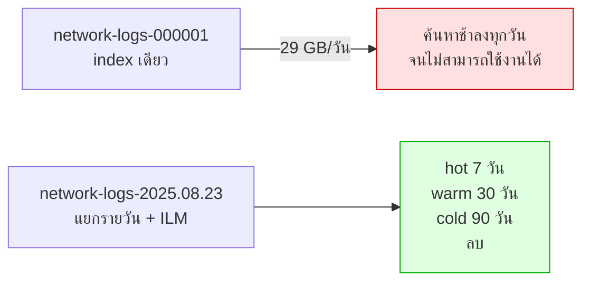

# บันทึกเรื่อง Scale · 10 อุปกรณ์ vs 2,600 อุปกรณ์

**หัวข้อ 15 นาทีในช่วงสรุป** · เป้าหมาย: เพื่อไม่ให้ผู้เรียนเข้าใจผิดว่าโค้ดที่ใช้ในห้องเรียนสามารถนำไปใช้ใน production ได้โดยตรง

---

## 1. ระยะห่างที่ควรทราบ

| | Workshop | Production (NT) | ต่างกัน |
|---|---|---|---|
| อุปกรณ์ | 10 | 2,600+ | 260× |
| Log | 2,000 บรรทัด / 30 วัน | **29 GB / วัน** | ~10,000× |
| พื้นที่ | 2 | ทั่วประเทศ | |
| ผู้ใช้พร้อมกัน | 1-20 | ทั้งศูนย์ NOC | |

---

## 2. สิ่งที่ใช้ไม่ได้เมื่อขยายขนาดระบบ (scale)

### 2.1 การวนคำนวณ health score ทีละอุปกรณ์

```python
# ใช้ได้กับ 10 ตัว · ใช้ไม่ได้กับ 2,600 ตัว
for device in all_devices:
    score = calculate_health_score(device)
```

**ควรเปลี่ยนเป็น**: pre-compute เป็น batch ทุก 15 นาที แล้วจัดเก็บผลไว้ให้ tool เพียงเรียกอ่านเท่านั้น

### 2.2 Log index เดียว



### 2.3 Python script โหลด log

`docker/loader/load_logs.py` อ่านเข้าใจง่ายและเหมาะสำหรับการสอน แต่ไม่สามารถรองรับปริมาณ 29 GB ต่อวันได้

| | สคริปต์ในห้อง | Production |
|---|---|---|
| เครื่องมือ | Python + bulk API | **Filebeat / Fluent Bit** |
| back-pressure | ไม่มี | มี |
| ทน restart | ไม่ | จำตำแหน่งได้ |
| rotation | ไม่รองรับ | รองรับ |

### 2.4 Embed ทุกอย่าง

29 GB ต่อวัน คิดเป็นประมาณ 30-60 ล้านบรรทัด ซึ่งไม่สามารถ embed ได้ทั้งหมดและไม่คุ้มค่าที่จะทำ

**หลักการแบ่ง**

| ประเภทข้อมูล | ทำอย่างไร |
|---|---|
| Log | **ไม่ embed** — ใช้การ filter ด้วยเวลา อุปกรณ์ หรือระดับความรุนแรง ซึ่งเร็วกว่าและแม่นยำกว่า |
| Runbook, คู่มือ, config | **embed** — มีปริมาณน้อย เปลี่ยนแปลงไม่บ่อย และต้องการการค้นหาเชิงความหมาย |
| Ticket | **embed เฉพาะ title และสรุป** มิใช่ทุกข้อความในบทสนทนา |

### 2.5 Memory เก็บใน RAM

`SessionMemory` ถูกจัดเก็บใน dict ของกระบวนการ (process) — เมื่อ restart ข้อมูลจะสูญหาย และไม่สามารถขยายเป็นหลาย instance ได้

**ควรเปลี่ยนเป็น**: Redis สำหรับ short-term memory และ pgvector สำหรับ long-term memory

---

## 3. สิ่งที่สามารถนำไปใช้ได้โดยตรง

| สิ่งที่สร้างในห้อง | เหตุผลที่ใช้ได้จริง |
|---|---|
| โครงสร้าง MCP Server | ไม่ขึ้นกับปริมาณข้อมูล |
| Guardrail ทั้ง 5 ชั้น | มีความสำคัญมากขึ้นเมื่อระบบขยายขนาด |
| Intent Gate | ช่วยประหยัดต้นทุนได้มากขึ้นเมื่อมีผู้ใช้จำนวนมาก |
| Memory management | มีความจำเป็นมากขึ้นเมื่อบทสนทนายาวขึ้น |
| Loop Guard | ยิ่งมีจำนวนคำถามพร้อมกันมาก ยิ่งจำเป็นต้องป้องกัน loop ที่สิ้นเปลืองทรัพยากร GPU โดยไม่จำเป็น |
| ชุดคำถามมาตรฐาน | ใช้เป็น regression test ได้ตลอดโครงการ |

---

## 4. ประเด็นด้าน GPU ที่ต้องวางแผนล่วงหน้า

| ประเด็น | ผลกระทบ |
|---|---|
| 27B ต้องการ VRAM มาก | จำเป็นต้องใช้เซิร์ฟเวอร์กลาง มิใช่เครื่องโน้ตบุ๊ก |
| ผู้ใช้พร้อมกันหลายคน | **vLLM ทำ continuous batching ได้ดีกว่า Ollama มาก** |
| context ยาว = VRAM มาก | KV cache โตตาม → รองรับคนพร้อมกันได้น้อยลง |
| GPT-OSS 120B | ต้องการทรัพยากรมากกว่า 27B หลายเท่า จึงต้องวางแผนด้าน GPU ไว้ล่วงหน้า |

> เชื่อมโยงกับแผนติดตามผลครั้งที่ 1: การจัดสรร Cloud GPU ควรเริ่มดำเนินการควบคู่ไปกับการอบรม มิใช่รอจนถึงวันที่ 30

---

## 5. เช็คลิสต์ก่อนขึ้น production

- [ ] ILM policy ของ log index
- [ ] pre-compute health score เป็น batch
- [ ] เปลี่ยนตัวโหลด log เป็น Filebeat / Fluent Bit
- [ ] Redis สำหรับ session memory
- [ ] vLLM แทน Ollama เมื่อมีผู้ใช้พร้อมกันหลายคน
- [ ] OAuth บน MCP Server ที่เปิดบนเครือข่าย
- [ ] Monitoring: latency, tokens/sec, GPU utilisation, อัตราการปฏิเสธของ intent gate
- [ ] เก็บ metric ตั้งแต่วันแรกเพื่อรายงานผลวันที่ 90
