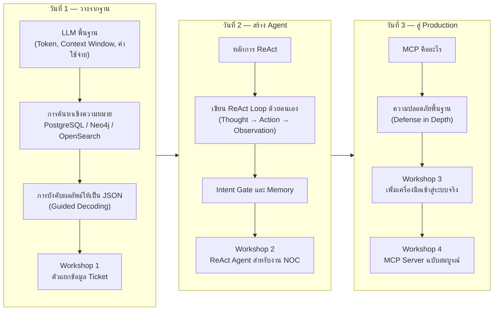

# สรุปภาพรวมหลักสูตร 3 วัน

เอกสารสรุปภาพรวมของหลักสูตรทั้งหมด เหมาะสำหรับอ่านทบทวนหลังจบกิจกรรมทุกส่วน หรือใช้เป็นข้อมูลอ้างอิงก่อนนำแนวทางที่ได้เรียนรู้ไปประยุกต์ใช้ในงานจริง

---

## เส้นทางของหลักสูตร

หลักสูตรนี้ไม่ได้ออกแบบให้แต่ละวันเป็นหัวข้ออิสระจากกัน แต่เป็นการต่อยอดอย่างต่อเนื่อง: วันที่ 1 สร้างข้อมูลที่ค้นหาได้และผลลัพธ์ที่ตรวจสอบได้ วันที่ 2 นำสิ่งเหล่านั้นมาประกอบเป็นกลไกการตัดสินใจของ agent วันที่ 3 นำเครื่องมือชุดเดียวกันมาห่อให้เป็นมาตรฐานที่ระบบอื่นเชื่อมต่อใช้งานได้ทันที

---

## ภาพรวมแต่ละวัน

### วันที่ 1 — วางรากฐานข้อมูลที่มีโครงสร้างและค้นหาได้ตามความหมาย

เริ่มจากความเข้าใจพื้นฐานของ LLM (token, context window, ค่าใช้จ่าย) ก่อนเข้าสู่การจัดเก็บและค้นคืนข้อมูลด้วยเวกเตอร์ในสามฐานข้อมูลที่มีบทบาทต่างกัน ได้แก่ PostgreSQL สำหรับข้อมูลเชิงสัมพันธ์ Neo4j สำหรับความสัมพันธ์เชิงกราฟ และ OpenSearch สำหรับการค้นหาเอกสารจำนวนมาก ปิดท้ายด้วยหลักการบังคับให้ผลลัพธ์ของโมเดลเป็น JSON ที่ตรวจสอบโครงสร้างได้เสมอผ่าน guided decoding และนำหลักการทั้งหมดมาประกอบเป็น Workshop 1 คือการเขียนตัวแยกข้อมูลจาก ticket

### วันที่ 2 — สร้าง ReAct Agent ด้วยตนเองทั้งกลไก

เริ่มจากหลักการของ ReAct pattern (เหตุผลที่การตอบทีเดียวจบหรือวางแผนล่วงหน้าไม่เพียงพอสำหรับงานวินิจฉัยเครือข่าย) แล้วลงมือเขียน ReAct loop ครบทั้งสี่ส่วนด้วยตนเอง ได้แก่ Prompt, การแปลงผลลัพธ์เป็นการกระทำ (parse_action), เงื่อนไขหยุด และตัวป้องกันการวนซ้ำไม่รู้จบ (LoopGuard) จากนั้นเพิ่ม Intent Gate เพื่อคัดกรองคำถามก่อนเข้า loop และ Memory เพื่อจดจำบทสนทนาข้าม turn โดยไม่ปล่อยให้ context ขยายไม่มีที่สิ้นสุด ปิดท้ายด้วย Workshop 2 คือการประกอบทุกส่วนเป็น ReAct Agent สำหรับงาน NOC ที่ใช้งานได้จริง

### วันที่ 3 — ห่อเครื่องมือเป็น MCP Server มาตรฐานพร้อมชั้นความปลอดภัย

เริ่มจากหลักการของ MCP (Tools, Resources, Prompts) และเหตุผลที่โปรโตคอลมาตรฐานทำให้ client หลายตัวเชื่อมต่อเครื่องมือชุดเดียวกันได้โดยไม่ต้องเขียนสายเชื่อมต่อใหม่ทุกครั้ง ตามด้วยหลักการความปลอดภัยพื้นฐานที่บังคับใช้จริงในระดับโค้ดและสิทธิ์ฐานข้อมูล ไม่ใช่เพียงคำสั่งในพรอมป์ที่ตรวจสอบไม่ได้ จากนั้น Workshop 3 ฝึกการเพิ่มเครื่องมือใหม่เข้าสู่ระบบจริงโดยตรง พร้อมค้นพบว่าการเพิ่มเครื่องมือเพียงอย่างเดียวไม่เพียงพอ ต้องขยายขอบเขตของ Intent Gate ด้วยจึงจะเรียกใช้งานได้ครบวงจร ปิดท้ายด้วย Workshop 4 คือการนำเครื่องมือทั้งหมดจากวันที่ 2 มาห่อเป็น MCP Server ฉบับสมบูรณ์ พร้อม Resource และ Prompt ของตนเอง

---

## หลักการที่ปรากฏซ้ำตลอดหลักสูตร

| หลักการ | ปรากฏครั้งแรกที่ | นำไปใช้ซ้ำที่ |
|---|---|---|
| guardrail ที่เขียนในโค้ดคือกฎที่บังคับใช้จริง ส่วนที่เขียนในพรอมป์เป็นเพียงคำขอ | Module 10 (วันที่ 3) | Workshop 3, Workshop 4 |
| ตรวจสอบความถูกต้องของข้อมูลนำเข้าก่อนใช้งานจริงเสมอ ไม่ปล่อยให้ไปล้มเหลวตอนเรียกใช้จริง | Module 5 หัวข้อ 1.2 (วันที่ 2) | Workshop 3 (validate segment), Module 10 |
| บังคับให้ผลลัพธ์ของโมเดลเป็นโครงสร้างที่ตรวจสอบได้เสมอ (JSON schema / guided decoding) | Module 3 (วันที่ 1) | Module 7 (Intent Gate), ReAct loop ทั้งหมดในวันที่ 2 |
| ป้องกันหลายชั้นพร้อมกัน (defense in depth) การถอดชั้นใดชั้นหนึ่งออกไม่ทำให้ระบบพังทั้งหมด | LoopGuard สามชั้น (วันที่ 2) | ความปลอดภัยห้าชั้นของ MCP Server (วันที่ 3) |
| ทุกข้อสรุปต้องอ้างอิงแหล่งที่มาที่ตรวจสอบย้อนกลับได้ | Workshop 2 (SYNTH_PROMPT) | Workshop 4, สถานการณ์ทดสอบทั้งหมดในวันที่ 2-3 |
| เพิ่มความสามารถใหม่เข้าสู่ระบบหนึ่งจุดไม่เพียงพอ ต้องตรวจสอบทุกจุดที่ความสามารถนั้นต้องผ่าน | Workshop 3 (Intent Gate ปิดกั้น tool ใหม่) | — |

---

## เอกสารอ้างอิงเพิ่มเติมของแต่ละวัน

| วัน | เอกสารสรุปเสริม |
|---|---|
| วันที่ 1 | [สรุป: แก้ JSON Template ของ Agent จริงใน App](../day1/08-summary-json-template-in-app.md) |
| วันที่ 2 | [สรุป: แก้ Intent กับ Memory ของ Agent จริงใน App](../day2/07-summary-intent-memory-in-app.md) |
| วันที่ 3 | [สรุป: เพิ่ม MCP Tool ใหม่ให้ Agent จริง ต้องแก้ไฟล์ไหนบ้าง](05-summary-add-mcp-tool.md) |

หากต้องการนำแนวทางของหลักสูตรนี้ไปเทียบกับการใช้งานจริงในองค์กร (การติดตามผลที่ 30/60/90 วัน) ดูเพิ่มเติมที่ [reference/production-mapping.md](../reference/production-mapping.md)

---

## บทสรุปส่งท้าย

ตลอดสามวันของหลักสูตรนี้ ระบบ agent สำหรับวินิจฉัยเครือข่าย IP-MPLS ถูกสร้างขึ้นทีละชั้นด้วยมือของผู้เข้าร่วมเอง ตั้งแต่การจัดเก็บข้อมูลที่ค้นหาได้ตามความหมาย การตัดสินใจแบบ ReAct ที่ปรับตัวตามหลักฐานที่พบจริง ไปจนถึงการห่อเครื่องมือทั้งหมดให้เป็นมาตรฐานที่เชื่อมต่อกับ client ใดก็ได้ ตัว agent เองไม่เคยถูกเขียนใหม่ทั้งระบบ แต่ถูกขยายความสามารถทีละส่วนอย่างมีหลักการรองรับในทุกขั้นตอน — นี่คือแนวทางที่ตั้งใจให้เป็นแบบอย่างสำหรับการนำไปพัฒนาต่อในงานจริงต่อไป
