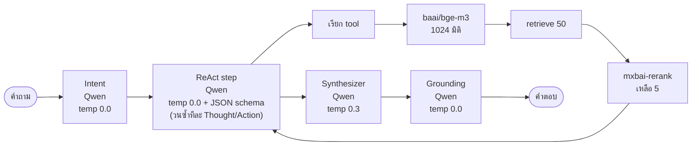

# Model Stack — หน้าที่ของโมเดลแต่ละตัว


```mermaid
flowchart LR
    Q(["คำถาม"]) --> I["Intent<br/>Qwen<br/>temp 0.0"]
    I --> R["ReAct step<br/>Qwen<br/>temp 0.0 + JSON schema<br/>(วนซ้ำทีละ Thought/Action)"]
    R --> T["เรียก tool"]
    T --> EMB["baai/bge-m3<br/>1024 มิติ"]
    EMB --> RET["retrieve 50"]
    RET --> RR["mxbai-rerank<br/>เหลือ 5"]
    RR --> R
    R --> S["Synthesizer<br/>Qwen<br/>temp 0.3"]
    S --> G["Grounding<br/>Qwen<br/>temp 0.0"]
    G --> A(["คำตอบ"])
```

---

## ตารางบทบาท

| บทบาท | โมเดล | temperature | เหตุผลที่เลือก |
|---|---|---|---|
| Intent | `qwen/qwen3-30b-a3b` | 0.0 | การจำแนกต้องคงเส้นคงวา คำถามเดิมต้องได้ผลเดิม |
| ReAct step | `qwen/qwen3-30b-a3b` | 0.0 | การตัดสินใจ Thought/Action ที่เปลี่ยนไปมาทำให้ทดสอบไม่ได้ แม้จะไม่มีแผนล่วงหน้าให้ตรึงไว้แล้วก็ตาม |
| Synthesizer | `qwen/qwen3-30b-a3b` | 0.3 | ต้องการภาษาที่อ่านรื่น แต่ไม่ให้สร้างข้อมูลเท็จ |
| Grounding | `qwen/qwen3-30b-a3b` | 0.0 | การตรวจสอบต้องเข้มงวด |
| Embedding | `baai/bge-m3` | — | 1024 มิติ · **ตรงกับ production** |
| Rerank | `mxbai-rerank` | — | cross-encoder · ตรงกับ production |
| ระหว่างทำ lab | `qwen/qwen3-30b-a3b` | ตามงาน | ช่วยให้ปรับแก้โค้ดได้รวดเร็วขึ้นมาก |

---

## เหตุผลที่เลือกใช้ Qwen

| เหตุผล | รายละเอียด |
|---|---|
| ขนาดเหมาะกับงาน | 30B พารามิเตอร์ (MoE, active ~3B ต่อ token) — สมดุลคุณภาพ/ความเร็ว/ต้นทุนต่อ token |
| รองรับภาษาไทยดี | ตระกูล Qwen เทรนด้วย corpus หลายภาษารวมไทย (ดู Module 1) |
| OpenAI-compatible | endpoint เดียวใช้ได้ทั้ง **OpenRouter** (ในระหว่างการอบรม — ไม่ต้องมี GPU เอง) และ **vLLM self-host** (ในช่วงใช้งานจริงในองค์กร) เพียงเปลี่ยน `LLM_BASE_URL` ใน `.env` |
| รันในองค์กรได้ (เป้าหมาย production) | มีแผนจะ host vLLM เองในองค์กร ข้อมูลไม่ต้องออกนอกเครือข่าย — รายละเอียดที่ `reference/local-llm-ollama-vllm.md` |

### ข้อจำกัดที่ควรทราบ

| ข้อจำกัด | ทางออกในโปรเจกต์นี้ |
|---|---|
| **มี native function calling จริง แต่เราเลือกไม่ใช้** | ใช้ structured output + parse เอง แทน เพื่อ vendor-neutral และควบคุม retry เอง (Module 3, 5) |
| tokenizer เป็น SentencePiece | `agent/tokenizer.py` ห้ามใช้ tiktoken |
| ต้องการ VRAM มาก (ตอน self-host production) | ต้องเป็นเซิร์ฟเวอร์กลาง ไม่ใช่โน้ตบุ๊ก — รายละเอียด sizing ที่ `reference/local-llm-ollama-vllm.md` |

---

## สลับโมเดลระหว่างทำงาน

```bash
# ระหว่าง lab - ใช้ LLM_MODEL_FAST
LLM_MODEL=$LLM_MODEL_FAST make api
```

```bash
# ตอนส่งงานและเดโม - ใช้ LLM_MODEL ปกติ (ค่า default ของ make api)
make api
```

ใน `.env.example` ทั้งสองตัวแปรตั้งเป็น `qwen/qwen3-30b-a3b` เหมือนกัน (ยังไม่มีรุ่นเล็กกว่าให้ใช้) — หากต้องการความเร็วที่สูงขึ้นระหว่าง lab ให้ตั้งค่า `LLM_MODEL_FAST` เป็นโมเดลที่เล็กกว่าเอง และ**ควรทดสอบด้วยทั้งสองตัว** เพราะโมเดลเล็กมักพลาดในจุดที่โมเดลใหญ่ไม่พลาด ซึ่งทำให้ทราบว่า prompt ส่วนใดยังเปราะบาง

---

## เส้นทางไป GPT-OSS 120B

| ประเด็น | สิ่งที่ต้องดำเนินการ |
|---|---|
| Tokenizer เปลี่ยน | `agent/tokenizer.py` ต้องเปลี่ยนตาม — ตัวเลข token ทั้งหมดจะเปลี่ยน |
| Embedding **ไม่ต้องเปลี่ยน** | ยังใช้ baai/bge-m3 ได้ ไม่ต้อง re-embed |
| VRAM | ต้องการมากกว่า Qwen3-30B-A3B หลายเท่า วางแผน GPU ล่วงหน้า |
| Guided decoding | ตรวจว่า runtime ใหม่ยังรองรับ |
| Prompt | ต้องรันชุดคำถามมาตรฐานซ้ำเพื่อดูว่าคุณภาพเปลี่ยนไหม |

> **โมเดลเปลี่ยนได้ แต่ตัวชี้วัดต้องเป็นชุดเดิม** มิฉะนั้นจะไม่สามารถเปรียบเทียบได้ว่าดีขึ้นหรือแย่ลง
