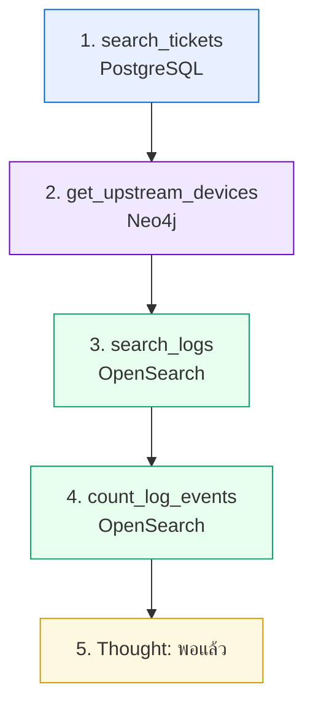

# ตัวอย่าง Prompt → ReAct → การเรียกข้อมูล → คำตอบ

เอกสารนี้แสดง **การทำงานเต็มวงจร** ของระบบ ตั้งแต่คำถามจนถึงคำตอบ พร้อมข้อมูลจริงที่ดึงออกมาจากแต่ละระบบ

> ค่าตัวเลขและ timestamp จะต่างจากเครื่องของคุณ เพราะข้อมูลถูกสร้างใหม่ทุกครั้งที่ seed
> แต่ **ลำดับที่ระบบเลือกเรียกเครื่องมือและเหตุผลแต่ละขั้นต้องคล้ายกัน**
>
> ระบบนี้เป็น **ReAct loop** มิใช่ plan-then-execute กล่าวคือไม่มี "แผน" เดียวที่กำหนดไว้ล่วงหน้าทั้งหมด
> ทุกขั้นตอนด้านล่างคือรอบ **Thought → Action → Observation** หนึ่งรอบ ตัดสินใจใหม่ทุกครั้งจากสิ่งที่เพิ่งเห็น

---

## ตัวอย่างที่ 1 · แหล่งเดียว

### Prompt
```
ticket ที่ยังไม่ปิดตอนนี้มีอะไรบ้าง เรียงตามความรุนแรง
```

### Intent
```json
{
  "label": "in_scope",
  "confidence": 0.9,
  "reason": "พบคำเฉพาะทางในโดเมน: ticket, ปิด",
  "decided_by": "fast_path"
}
```
> ตัดสินใจโดย fast path โดยไม่ต้องเรียก LLM

### รอบที่ 1 — Thought → Action
```json
{
  "thought": "คำถามนี้ตอบได้จากฐานข้อมูล ticket โดยตรง ไม่ต้องใช้แหล่งอื่น",
  "tool": "search_tickets",
  "arguments": {"status": "open", "range": "last_30d", "limit": 20}
}
```

### การเรียกข้อมูล
```
[1] search_tickets  →  PostgreSQL  →  142 ms
```
```json
{
  "total_matches": 14, "returned": 14, "truncated": false,
  "tickets": [
    {"ticket_id": "TK-25-00003", "severity": "high", "status": "open",
     "site_code": "NBI", "device_id": "LPE-NBI-13",
     "customer_name": "บริษัท ไทยโลจิสติกส์ เอ็กซ์เพรส",
     "title": "circuit drop ซ้ำๆ กระทบระบบ POS"},
    {"ticket_id": "TK-25-00001", "severity": "high", "status": "open",
     "site_code": "NBI", "device_id": "LPE-NBI-11",
     "title": "อินเทอร์เน็ตหลุดเป็นช่วงๆ ตั้งแต่เมื่อวาน"}
  ]
}
```

### รอบที่ 2 — Thought → เพียงพอแล้ว
```json
{
  "thought": "ผลลัพธ์มี ticket ที่ยังไม่ปิดครบแล้ว พอจะสรุปคำตอบได้",
  "tool": null
}
```

### ต้นทุน
| | |
|---|---|
| เรียก LLM (ตัดสินใจ) | 2 ครั้ง (เรียก tool 1 ครั้ง + เพียงพอแล้ว 1 ครั้ง) |
| เรียก LLM (สรุป) | 1 ครั้ง |
| เรียก tool | 1 |
| token รวม | ~2,100 |
| เวลา | 5.1 วินาที |

---

## ตัวอย่างที่ 2 · ข้ามสามระบบ ← ตัวอย่างหลัก

### Prompt
```
ทำไมช่วงสองสัปดาห์นี้ถึงมีลูกค้าแจ้งเน็ตหลุดซ้ำๆ หลายราย
```

> **สังเกตว่าคำถามไม่ได้ระบุพื้นที่หรืออุปกรณ์** ระบบต้องค้นพบข้อมูลดังกล่าวเอง

### รอบต่อรอบที่ระบบตัดสินใจเอง


> **ข้อแตกต่างจาก plan-then-execute ในขั้นตอนนี้**: ขั้น 3 และ 4 เคยไม่ขึ้นต่อกันและรันขนานได้ในสถาปัตยกรรมเดิม
> แต่ ReAct ตัดสินใจทีละขั้นเสมอ จึงเรียงตามลำดับเวลาแทน — ไม่มีการรันคู่ขนานอีกต่อไป

**รอบที่ 1 — Thought → Action**
```json
{"thought": "ลูกค้าหลายรายที่อยู่คนละอุปกรณ์แจ้งอาการเดียวกัน มักเกิดจากอุปกรณ์ upstream ที่เป็นจุดร่วม เริ่มจากหา ticket ที่มีอาการหลุดเป็นช่วงในรอบ 2 สัปดาห์ก่อน",
 "tool": "search_tickets", "arguments": {"category": "intermittent", "range": "last_14d"}}
```
```json
{"total_matches": 5,
 "tickets": [
   {"ticket_id":"TK-25-00001","device_id":"LPE-NBI-11","severity":"high","status":"open"},
   {"ticket_id":"TK-25-00002","device_id":"LPE-NBI-12","severity":"medium","status":"closed",
    "resolution":"ทดสอบแล้ว ping ปกติ throughput เต็ม ปิดเคสชั่วคราว"},
   {"ticket_id":"TK-25-00003","device_id":"LPE-NBI-13","severity":"high","status":"open"},
   {"ticket_id":"TK-25-00004","device_id":"LPE-NBI-11","severity":"medium","status":"closed"},
   {"ticket_id":"TK-25-00005","device_id":"LPE-NBI-12","severity":"high","status":"open"}
 ]}
```
> **จุดสำคัญ**: ticket ทั้ง 5 ใบไม่มีคำว่า APE ปรากฏอยู่ หากหยุดวิเคราะห์ ณ จุดนี้ จะสรุปผิดว่าเป็นปัญหาของลูกค้าแต่ละรายแยกกัน

**รอบที่ 2 — Thought → Action**
```json
{"thought": "อุปกรณ์ทั้ง 3 ตัวจาก ticket อยู่คนละตัวกัน ต้องหาว่ามี upstream ร่วมกันไหม",
 "tool": "get_upstream_devices",
 "arguments": {"device_ids": ["LPE-NBI-11", "LPE-NBI-12", "LPE-NBI-13"]}}
```
> ค่า `device_ids` มาจากการที่โมเดล **อ่านผลลัพธ์ของรอบที่ 1 เอง** จากบทสนทนา ไม่มี `argument_from`/`depends_on` ให้ต้องประกาศล่วงหน้าอีกต่อไป
```json
{"queried_devices": ["LPE-NBI-11","LPE-NBI-12","LPE-NBI-13"],
 "shared_by_all": [
   {"device_id":"APE-NBI-03","role":"APE","hops":1,
    "depends_on_it":["LPE-NBI-11","LPE-NBI-12","LPE-NBI-13"],"dependent_count":3}
 ],
 "interpretation":"อุปกรณ์ APE-NBI-03 เป็นจุดร่วมที่ใกล้ที่สุดของอุปกรณ์ทั้ง 3 ตัวที่ถามมา"}
```
> **นี่คือขั้นตอนที่พลิกคำตอบ** — ข้อมูลนี้ไม่สามารถได้มาจาก ticket แต่อย่างใด

**รอบที่ 3 — Thought → Action**
```json
{"thought": "APE-NBI-03 คือจุดร่วม ต้องตรวจ log ของมันในช่วงเวลาเดียวกับ ticket",
 "tool": "search_logs", "arguments": {"device_id": "APE-NBI-03", "range": "last_14d", "severity": "error"}}
```
```json
{"total_matches": 320, "returned": 30,
 "logs": [
  {"@timestamp":"...T03:41:18+07:00","device_id":"APE-NBI-03","severity":"error",
   "event_type":"LINK-UPDOWN","interface":"Te0/1/2",
   "message":"Interface Te0/1/2, changed state to down"},
  {"@timestamp":"...T03:41:52+07:00","device_id":"APE-NBI-03","severity":"notice",
   "event_type":"LINK-UPDOWN","message":"Interface Te0/1/2, changed state to up"}
 ]}
```

**รอบที่ 4 — Thought → Action**
```json
{"thought": "log ดูเหมือน flap ซ้ำ ต้องนับว่าเกิดถี่แค่ไหนถึงจะฟันธงได้",
 "tool": "count_log_events", "arguments": {"device_id": "APE-NBI-03", "group_by": "event_type", "range": "last_14d"}}
```
```json
{"results":[
  {"key":"LINK-UPDOWN","count":80},
  {"key":"LINEPROTO-UPDOWN","count":80},
  {"key":"ISIS-ADJCHANGE","count":80},
  {"key":"LDP-NBRCHG","count":80}
]}
```
> 80 ครั้ง = down 40 + up 40 → **interface flap 40 รอบใน 14 วัน**

**รอบที่ 5 — Thought → เพียงพอแล้ว**
```json
{"thought": "มีทั้ง topology ที่ชี้จุดร่วมและ log ที่ยืนยันความถี่แล้ว พอสรุปได้", "tool": null}
```

### คำตอบสุดท้าย

> **สาเหตุคือ interface `Te0/1/2` ของ `APE-NBI-03` เกิด flapping ซ้ำ 40 ครั้งในรอบสองสัปดาห์**
>
> ลูกค้า 5 รายที่แจ้งเข้ามาอยู่บนอุปกรณ์ LPE คนละตัวกัน (LPE-NBI-11, -12, -13) จึงดูเหมือนเป็นปัญหาแยกกัน (PostgreSQL: TK-25-00001 ถึง TK-25-00005) แต่ทั้งสามตัว uplink ไปที่ `APE-NBI-03` ตัวเดียวกัน (Neo4j: topology)
>
> log ของ `APE-NBI-03` แสดง `LINK-UPDOWN` 80 รายการ คือ down 40 ครั้งและ up 40 ครั้ง แต่ละครั้งกินเวลาประมาณ 30 วินาที ตามด้วย ISIS adjacency down/up ทุกครั้ง (OpenSearch: network-logs)
>
> ระยะเวลาที่ลิงก์ล่มสั้นเกินกว่าที่การทดสอบหลังรับแจ้งจะจับได้ ซึ่งอธิบายว่าทำไม TK-25-00002 และ TK-25-00004 ถึงถูกปิดด้วยเหตุผลว่า "ทดสอบแล้วปกติ"
>
> **สิ่งที่ควรทำต่อ**: ตรวจสอบ optical power และ SFP ของ `Te0/1/2` บน `APE-NBI-03` และเปิด ticket ที่ผูกกับอุปกรณ์ตัวนี้โดยตรงแทนการปิดเคสรายลูกค้า

### ต้นทุน
| | |
|---|---|
| เรียก LLM (ตัดสินใจ) | 5 ครั้ง (เรียก tool 4 ครั้ง + เพียงพอแล้ว 1 ครั้ง) |
| เรียก LLM (สรุป + grounding) | 2 ครั้ง |
| เรียก tool | 4 |
| token รวม | ~9,600 |
| เวลา | 24.3 วินาที (**เพิ่มขึ้นจากเดิม** เพราะขั้น 3-4 เคยรันขนานได้ ตอนนี้เรียงคิว) |
| แหล่งข้อมูล | PostgreSQL + Neo4j + OpenSearch |

---

## ตัวอย่างที่ 3 · นอกขอบเขต

### Prompt
```
ช่วยเขียนอีเมลลาพักร้อนให้หน่อย
```

### Intent
```json
{"label": "out_of_scope", "confidence": 0.95,
 "reason": "คำถามเกี่ยวกับ 'ลาพักร้อน' ซึ่งอยู่นอกขอบเขตงานโครงข่าย",
 "decided_by": "fast_path"}
```

### คำตอบ
> ขออภัยครับ คำถามนี้อยู่นอกขอบเขตของระบบ
>
> ระบบนี้ตอบได้เฉพาะเรื่องโครงข่าย IP-MPLS ได้แก่ ประวัติ ticket และเหตุเสีย, การตั้งค่าอุปกรณ์, โครงสร้างการเชื่อมต่อ, log ของอุปกรณ์, คะแนนสุขภาพอุปกรณ์ และวงจรของลูกค้า โดยครอบคลุมพื้นที่ BKK และ NBI
>
> ลองถามใหม่ เช่น *"ตอนนี้มี ticket อะไรค้างอยู่บ้าง"*

### ต้นทุน
| | |
|---|---|
| เรียก LLM | **0 ครั้ง** |
| เรียก tool | **0** |
| token | ~120 |
| เวลา | 0.03 วินาที |

> **นี่คือคุณค่าที่วัดได้ของ Intent Gate** — คำถามแบบนี้ไม่กิน GPU และไม่แตะฐานข้อมูลเลย ไม่ว่าสถาปัตยกรรมข้างในจะเป็น plan-then-execute หรือ ReAct ก็ไม่ต่างกัน เพราะยังไปไม่ถึงขั้นนั้น

---

## ตัวอย่างที่ 4 · กับดัก Maintenance

### Prompt
```
log ที่ APE-BKK-05 เมื่อ 3 วันก่อนเป็นเหตุเสียจริง หรือเป็นงานที่แจ้งไว้ล่วงหน้า
```

**รอบที่ 1 — Thought → Action**
```json
{"thought": "ต้องดูก่อนว่ามี log อะไรเกิดขึ้นที่อุปกรณ์นี้ในช่วง 3 วันที่ผ่านมา",
 "tool": "search_logs", "arguments": {"device_id": "APE-BKK-05", "range": "last_3d"}}
```
```json
{"total_matches": 150, "logs":[
  {"severity":"critical","event_type":"SYS-RELOAD",
   "message":"System reload requested by admin - reason: firmware upgrade"}]}
```
> log ปรากฏความรุนแรงสูงมาก แต่จุดนี้**ไม่ใช่**จุดที่ควรหยุดการวิเคราะห์

**รอบที่ 2 — Thought → Action**
```json
{"thought": "log ระดับ critical อาจเป็นงานบำรุงรักษาที่แจ้งไว้ล่วงหน้าก็ได้ ต้องตรวจ ticket ประเภท maintenance ก่อนสรุปว่าเป็นเหตุเสีย",
 "tool": "search_tickets",
 "arguments": {"device_id": "APE-BKK-05", "category": "maintenance", "range": "last_7d"}}
```
```json
{"tickets":[{"ticket_id":"TK-25-00006","category":"maintenance","status":"closed",
  "title":"แผนงานอัปเกรด firmware APE-BKK-05"}]}
```
> **นี่คือขั้นตอนที่ป้องกันการรายงานผิดพลาด** — โมเดลเลือกเรียกเองเพราะ tool description ของ `search_logs` เตือนไว้อย่างชัดเจนว่า *"log ที่ดูรุนแรงไม่ได้แปลว่าเป็นเหตุเสีย ... ตรวจ ticket ประเภท maintenance ก่อน"* (Module 5)
> ใน ReAct ไม่มีอะไรบังคับให้เรียกขั้นนี้ล่วงหน้าเหมือน plan ที่ประกาศ 2 ขั้นตั้งแต่ต้น — หาก tool description เขียนไม่ดี โมเดลอาจหยุดตอบตั้งแต่รอบที่ 1 และรายงานผลที่คลาดเคลื่อนได้

**รอบที่ 3 — Thought → เพียงพอแล้ว**
```json
{"thought": "มี ticket maintenance ครอบคลุมช่วงเวลาเดียวกัน สรุปได้ว่าไม่ใช่เหตุเสีย", "tool": null}
```

### คำตอบ
> **ไม่ใช่เหตุเสีย เป็นงานบำรุงรักษาตามแผน**
>
> log ระดับ critical จำนวน 150 รายการที่ `APE-BKK-05` เกิดจากการ reload เพื่ออัปเกรด firmware (OpenSearch: `SYS-RELOAD`) ซึ่งอยู่ในหน้าต่างงานที่แจ้งไว้ล่วงหน้าตาม ticket **TK-25-00006** (PostgreSQL) หัวข้อ "แผนงานอัปเกรด firmware APE-BKK-05" สถานะปิดงานเรียบร้อยแล้ว
>
> ISIS adjacency ทุกเส้นกลับมาสถานะ Up หลังจบงาน ไม่ต้องดำเนินการใดเพิ่ม

> **หากรอบที่ 2 ไม่เกิดขึ้น ระบบจะรายงานว่าเป็นเหตุเสียร้ายแรง** ซึ่งเป็น hallucination ที่อันตรายที่สุด เพราะมีหลักฐานจริงรองรับแต่ตีความผิด — นี่คือเหตุผลที่ Module 5 ย้ำเรื่องการเขียน tool description ให้ดี **มากกว่าที่เคยเป็นตอนใช้ plan-then-execute** เพราะไม่มีขั้นตอนที่สองรออยู่แน่นอนอีกต่อไป

### ต้นทุน
| | |
|---|---|
| เรียก LLM (ตัดสินใจ) | 3 ครั้ง (เรียก tool 2 ครั้ง + เพียงพอแล้ว 1 ครั้ง) |
| เรียก LLM (สรุป + grounding) | 2 ครั้ง |
| เรียก tool | 2 |
| token รวม | ~4,700 |
| เวลา | 11.4 วินาที |

---

## ตัวอย่างที่ 5 · ข้อมูลที่ไม่มีอยู่จริง

### Prompt
```
สถานะของ PE-CNX-99 ตอนนี้เป็นยังไง
```

### รอบที่ 1 — Thought → Action
```json
{"thought": "ชื่ออุปกรณ์นี้ไม่คุ้นเลย ต้องตรวจก่อนว่ามีอยู่ในระบบจริงไหม",
 "tool": "list_devices", "arguments": {}}
```

### รอบที่ 2 — Thought → เพียงพอแล้ว
```json
{"thought": "ไม่พบ PE-CNX-99 ในรายการอุปกรณ์ทั้ง 10 ตัว พอจะตอบว่าไม่มีอยู่จริงได้แล้ว", "tool": null}
```

### คำตอบ
> **ไม่พบอุปกรณ์ `PE-CNX-99` ในระบบครับ**
>
> ระบบครอบคลุมอุปกรณ์ 10 ตัวใน 2 พื้นที่:
> - **BKK**: CR-BKK-01, CR-BKK-02, PE-BKK-02, APE-BKK-05
> - **NBI**: PE-NBI-01, PE-NBI-04, APE-NBI-03, LPE-NBI-11, LPE-NBI-12, LPE-NBI-13
>
> หากต้องการตรวจสอบอุปกรณ์ตัวอื่น กรุณาระบุจากรายการข้างต้น

> การตอบว่า "ไม่พบข้อมูล" พร้อมระบุรายการที่มีอยู่จริง มีประโยชน์มากกว่าการปฏิเสธโดยไม่ให้ข้อมูลเพิ่มเติม

---

## สรุปเปรียบเทียบต้นทุน

| คำถาม | เรียก LLM (ตัดสินใจ) | เรียก LLM (สรุป+grounding) | เรียก tool | token | เวลา |
|---|---|---|---|---|---|
| นอกขอบเขต | 0 | 0 | 0 | ~120 | 0.03 วิ |
| แหล่งเดียว | 2 | 1 | 1 | ~2,100 | 5.1 วิ |
| กับดัก maintenance | 3 | 2 | 2 | ~4,700 | 11.4 วิ |
| ข้ามสามระบบ | 5 | 2 | 4 | ~9,600 | 24.3 วิ |

> ระยะห่างระหว่างคำถามนอกขอบเขตกับคำถามซับซ้อนยังคุ้มค่าเหมือนเดิม อย่างไรก็ตาม สังเกตว่าคอลัมน์ "เรียก LLM (ตัดสินใจ)" **ผูกโยงกับจำนวน tool call โดยตรง** (N tool calls ต้องใช้ N+1 รอบตัดสินใจเสมอ) ต่างจาก plan-then-execute ที่ตัวเลขนี้เคยคงที่ที่ 1 ครั้งไม่ว่าคำถามจะซับซ้อนเพียงใด
